# 基于linux操作系统

tcpdump

strace

man

nc

curl

nginx

# 开篇-基础知识准备

tcp、ip协议层 。

TCP： 面向连接的可靠的传输协议， 需要进行3次握手建立连接。

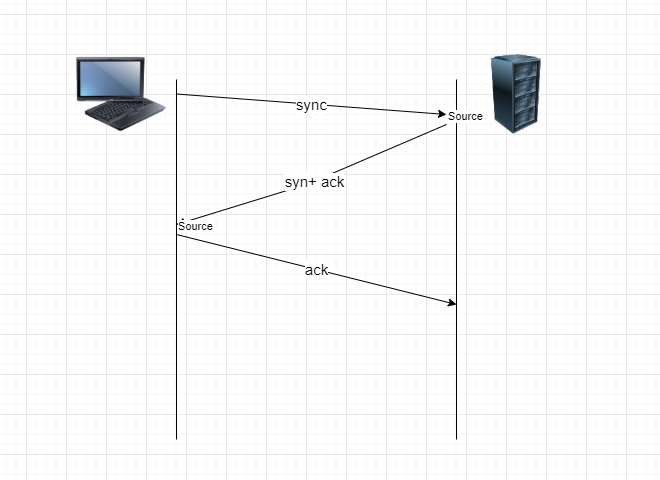

四次挥手断开连接

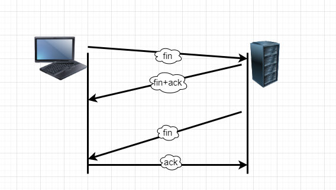

软件分层结构，每个层有做自己的事情，解耦合。

在linux上执行命令访问www.baidu.com

```bash
 exec 6<> /dev/tcp/www.baidu.com/80
```

> `exec`:  将一个程序覆盖当前进程，即将此程序压栈，如果程序执行完是退出，则会让内核触发，将整个进程销毁，断开连接 
>
> 6: 文件描述符，可以自己定义
>
> <>: 重定向操作符， 表示输入输出
>
>  /dev/tcp/www.baidu.com/80  ： 虚拟文件系统 
>
>  0  输入流 1  正确输出流 2  报错输出 

 当前bash里面多了一个6号文件描述符，指向了一个socket， /dev/tcp/www.baidu.com/80为特殊目录，触发一个内核机制，让bash发起了对百度socket的连接 。

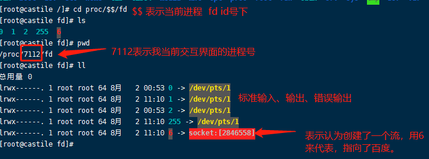

与百度建立了socket连接后怎么获取百度的主页呢？socket建立表示TCP连接已经建立了，然后应该使用协议来进行交互。是应用层的操作，所以我们需要发送HTTP协议请求头

 http协议请求头 

```bash
echo -e "GET / HTTP/1.0\n"      -e使得bash能识别换行符
# 将请求头发送到百度服务器
echo -e "GET/HTTP/1.0\n" 1>&8 # 1 是输出，表示将输出重定向到 6中， 如果重定向后面是一个文件描述符的话，需要加一个 & 
# 读取响应信息
cat 0<&8
```


# 使用工具抓包

使用tcpdump工具

安装：yum install tcpdump

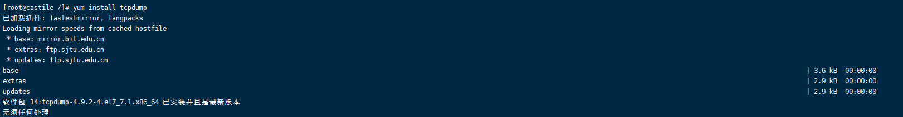

查看网卡 ifconfig

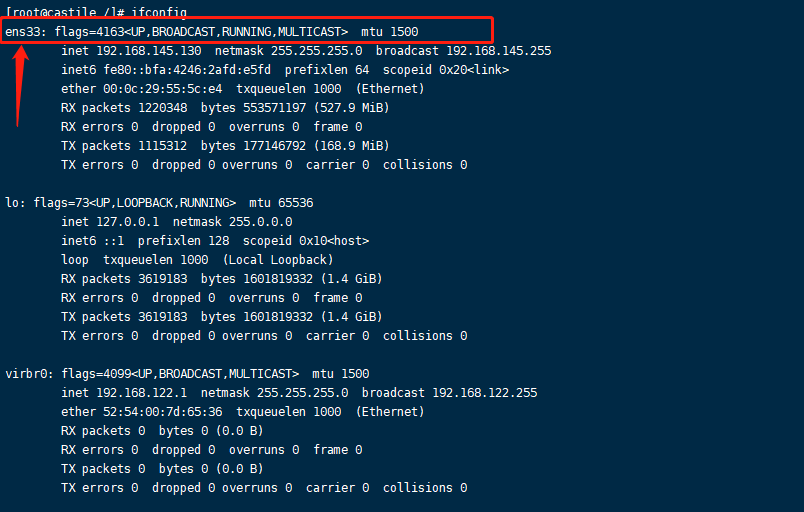

看一下tcpdump如何使用： tcpdump --help

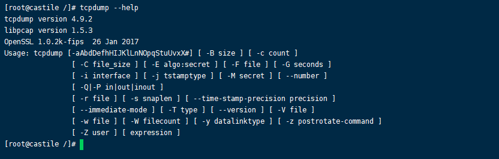

```bash
tcpdump -nn -i ens33 port 80  # 监听80端口的时间 在网卡 ens33 上
```


目前还没有，是一个阻塞状态

然后我们去访问一下百度 curl ， 重开一个ssh

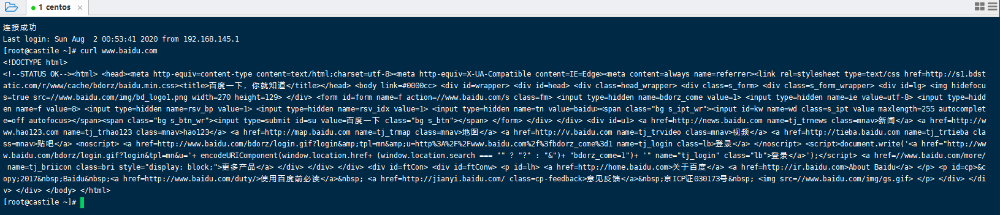

在刚刚的侦听界面上：
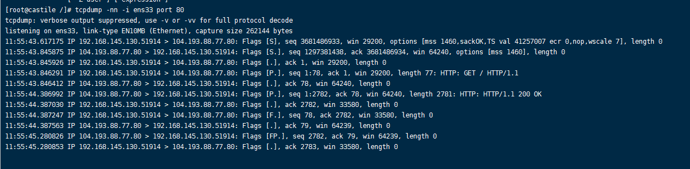

分析一下, 先看建立连接，也就是前三行

```bash

11:55:43.617175 IP 192.168.145.130.51914 > 104.193.88.77.80: Flags [S], seq 3681486933, win 29200, options [mss 1460,sackOK,TS val 41257007 ecr 0,nop,wscale 7], length 0

表示本机给百度发送了一个 seq ，后面的数字表示序列号。 S 表示 sync

11:55:43.845875 IP 104.193.88.77.80 > 192.168.145.130.51914: Flags [S.], seq 1297381438, ack 3681486934, win 64240, options [mss 1460], length 0

接着百度给本机发送 了一个 sync+ ack的包。

11:55:43.845926 IP 192.168.145.130.51914 > 104.193.88.77.80: Flags [.], ack 1, win 29200, length 0

然后本地给百度回复了一个 ack 确认

```

以上就是TCP建立连接的三次握手过程，完成建立后，双方开辟资源。

接着看中间几行表示本机与百度进行数据传输的过程

```bash
11:55:43.846291 IP 192.168.145.130.51914 > 104.193.88.77.80: Flags [P.], seq 1:78, ack 1, win 29200, length 77: HTTP: GET / HTTP/1.1

本机给百度发送了一个数据包 长度为77  协议HTTP/1.1  以GET的方式请求

11:55:43.846412 IP 104.193.88.77.80 > 192.168.145.130.51914: Flags [.], ack 78, win 64240, length 0

百度给本就回复一个确认 ack， 因为是可靠传输


11:55:44.386992 IP 104.193.88.77.80 > 192.168.145.130.51914: Flags [P.], seq 1:2782, ack 78, win 64240, length 2781: HTTP: HTTP/1.1 200 OK

接着是百度个本机返回单的响应数据  长度为2781  状态码 200 表示成功
上面两个都是百度发出的，最后有一个P表示，数据发送完了，不要存储在缓存中了，请马上告知应用程序去处理。


11:55:44.387030 IP 192.168.145.130.51914 > 104.193.88.77.80: Flags [.], ack 2782, win 33580, length 0

本机给百发送ack确认，表示已经收到


```

发送完数据之后，接着是断开连接，也就是四次挥手的过程

```bash
11:55:44.387247 IP 192.168.145.130.51914 > 104.193.88.77.80: Flags [F.], seq 78, ack 2782, win 33580, length 0

本机需要断开连接  fin

11:55:44.387563 IP 104.193.88.77.80 > 192.168.145.130.51914: Flags [.], ack 79, win 64239, length 0

百度返回给客户端一个ack，表示知道了你要断开连接。但是这时还没有完全断开，是一个半关闭的转态。


11:55:45.280826 IP 104.193.88.77.80 > 192.168.145.130.51914: Flags [FP.], seq 2782, ack 79, win 64239, length 0

百度的服务器也要断开连接了，给本机发送了一个fin


11:55:45.280853 IP 192.168.145.130.51914 > 104.193.88.77.80: Flags [.], ack 2783, win 33580, length 0
本机知道了，然后断开

```


通过以上分析，我们以及知道从客户端发起请求建立连接到传输数据再到四次挥手断开连接的全过程。这一整个过程应该是一个完整的粒度，不应该被拆散。

比如，我们做负载均衡的时候，客户端给一个服务器发送了一个建立连接的请求数据包sync， 然后这个服务器返回一个sync+ack给客户端，客户端还需要发送一个ack给服务器，但是由于有多台服务器，负载均衡会选择一个最佳的服务器，可能会出现这样的一种情况，就是客户端的ack发送给了另外一台服务器，而原来的这个服务器一直没有收到客户端的ack，所以这个连接就建立不起来。这就是粒度被拆散了。

这个粒度不能被我们以后所学的技术所拆散的！！！这是一个大前提。


# NetCat 

 nc是netcat工具的命令，是一个很好用的网络工具。比如，可以用来端口扫描，文件传输等网络功能。 在 网络工具中有“瑞士军刀”美誉的NetCat， 在我们用了N年了至今仍是爱不释手。 

## 安装

```bash
yum install nc
```

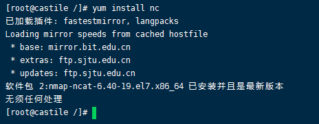

## 参数


## 监听端口

```bash
nc -l 8080  # 开启服务端
nc localhost 8080 # 开启客户端
```

他们之间就建立了连接，可以相互发送数据

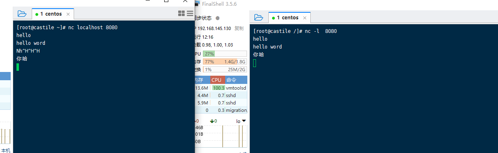

查看他们的进程

```bash
ps -ef | grep nc
```

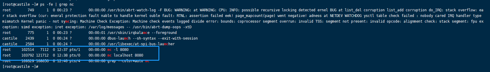

然后我们用上面的提到的，在 /proc/进程id/fd 目录下面下有进程描述符：

```bash
cd proc/102514/fd
ll
```

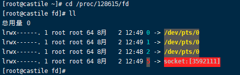

# strace

> yum install strace

用来跟踪程序的运行以及系统调用

```bash
mkdir xxoo  # 创建一个新文件夹，用来存放程序运行的跟踪文件
cd xxoo
trace -ff -o out nc -l 8080 # 跟踪这个程序
```

然后在xxoo目录下有一个文件 out-4781 , 后面的id表示nc的进程id

打开这个文件：

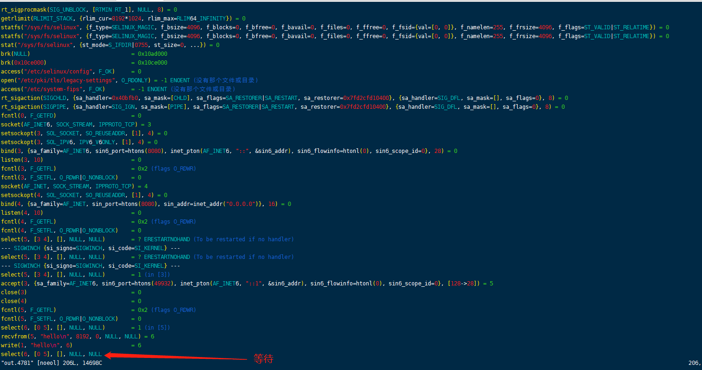

查看select的作用： man 2  select

select是一个多路复用器，会阻塞

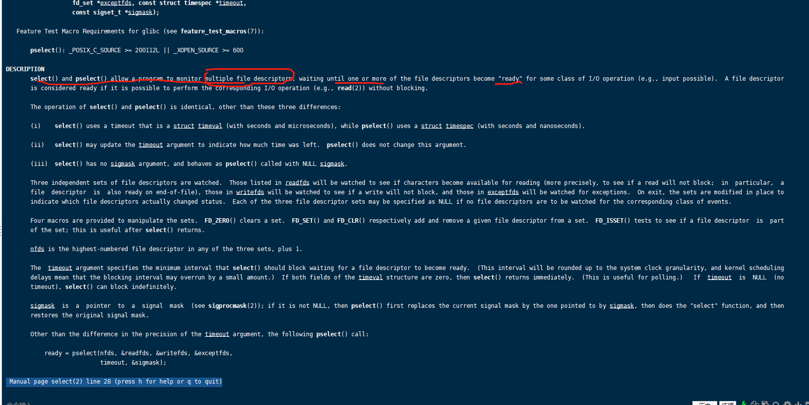

使用 tail命令去动态查看文件的变化

```bash
tail -f out.4781
```

打开一个客户端 nv localhost 8080

发送一些信息

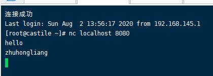

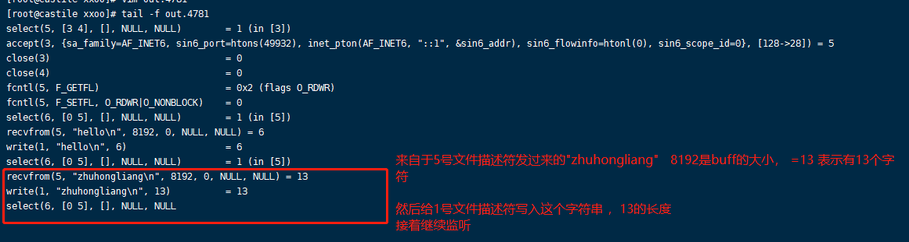

write(1, "zhuhongliang\n", 13)          = 13 表示在 文件描述符1 写入 。1代表标准写

看一下recvfrom 的功能：从一个socket接受数据data，返回数据的字节数

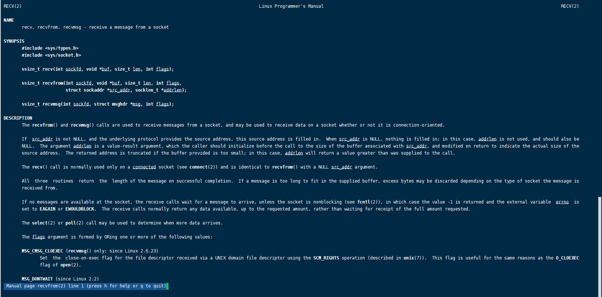


# 系统调用system call

read、write、 socket、 bind、listen、accept

上述系统方法的实现是在linux kernel里面的实现的。kernel只会对应用程序暴露上述方法的调用，所以程序会对系统内核发起系统调用。

## BIO

如果程想使用内核完成网络通信的话，这时候会发生哪些事情呢？

看看下面的过程

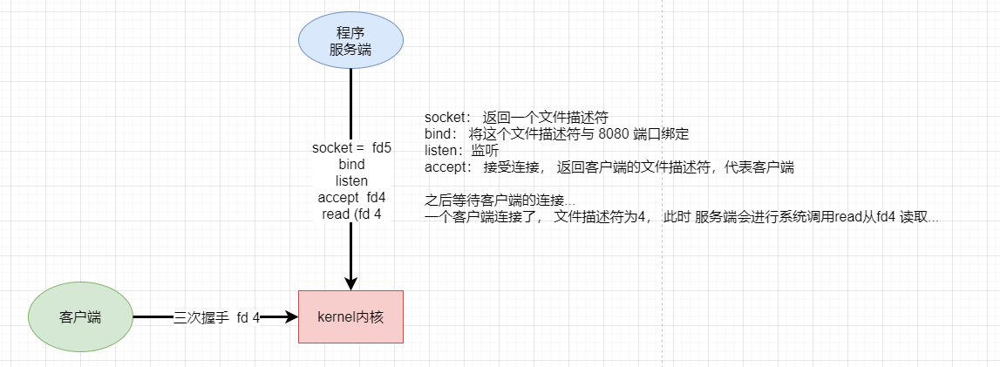

首先服务端系统调用kernel，socket获取服务端的文件描述符 5，然后使用bind将文件描述符与端口8080进行绑定，之后监听看有没有连接。

这时候，一个客户端也进行系统调用，经过三次握手之后连接了服务端，服务端系统调用accept， 建立连接 。客户端的文件描述符加入是fd 4 。 然后调用read 读操作，传入客户端的文件描述符4 。但是这个客户端没有发送数据，所以这个read现在被阻塞住了。

此时又有一个客户端来连接

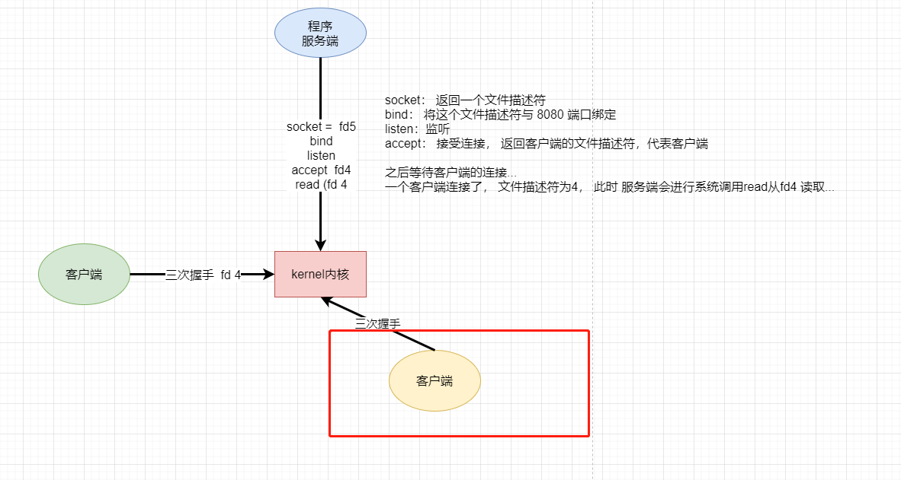

建立完连接后，这时候不会给他分配文件描述符，因为程序已经被阻塞住了，只能运行到accept这个阶段，如果客户端有超时响应的话，会报超时连接错误。

这是整个IO  发展历程中的第一个时期：BIO，即阻塞IO。

那么，我们怎么解决这个问题呢？ 可以开辟一个线程。

一旦出现了一个连接，就分配一个文件描述符，然后开辟一个线程。

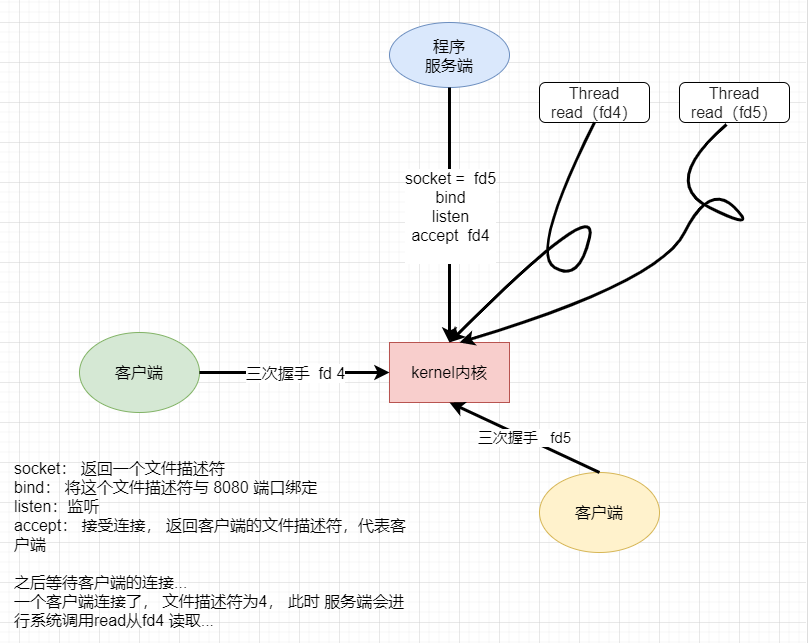

如果有线程来`read`了，就启动线程，否则阻塞。上述就是多线程模型。

这样已经解决服务端无法处理多个客户端连接请求的问题了，但这种多线程模型有什么缺点或者说弊端呢？

思考一下如果有100000个客户端，那么是不是要与100000个线程的开辟？？？

这就开销太大了吧。

我们首先看一下java程序在linux 系统中是如何调用的

写一个简单的java程序


使用是strace 追踪系统调用

```bash
strace -ff -o xxoo java Hello
```

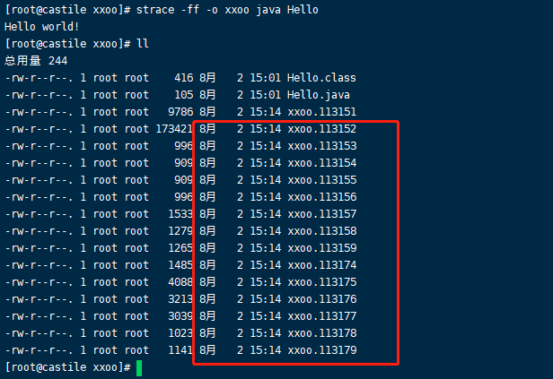

可以看到，这样一个简单的java程序并不是只开辟了一个线程。打开113151


发现调用了113152线程， 并且使用的系统调用`clone`

那 我们的主线程是哪个，主线程应该是打印Hello world的那个线程吧

```bash
grep "Hello world" ./*
```

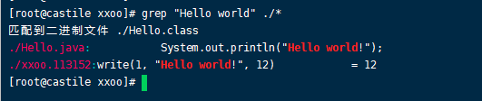

看到了write系统调用了吗。这是在113152线程中。

我们可以得出一个结论，线程的创建是通过调用内核的clone系统调用来实现的，主线程都需要clone，然后如果有成千上万个线程的话，就要进行成千上万次系统调用，这个开销很非常大的。因为调用内核不是直接就调用的，需要发生软中断，而且CPU也要切换状态。

## NIO

在BIO时期这一切万恶之源都是由于系统调用会有阻塞的情况发生，如果一个客户端没有发送数据，就会阻塞。虽然多线程模型可以处理多个客户端的情况，但是由于开销大，系统调用此时多，比较慢。

那么能不能只创建一个线程就可以处理多个客户端呢？

我们看看socket： `man 2 socket`

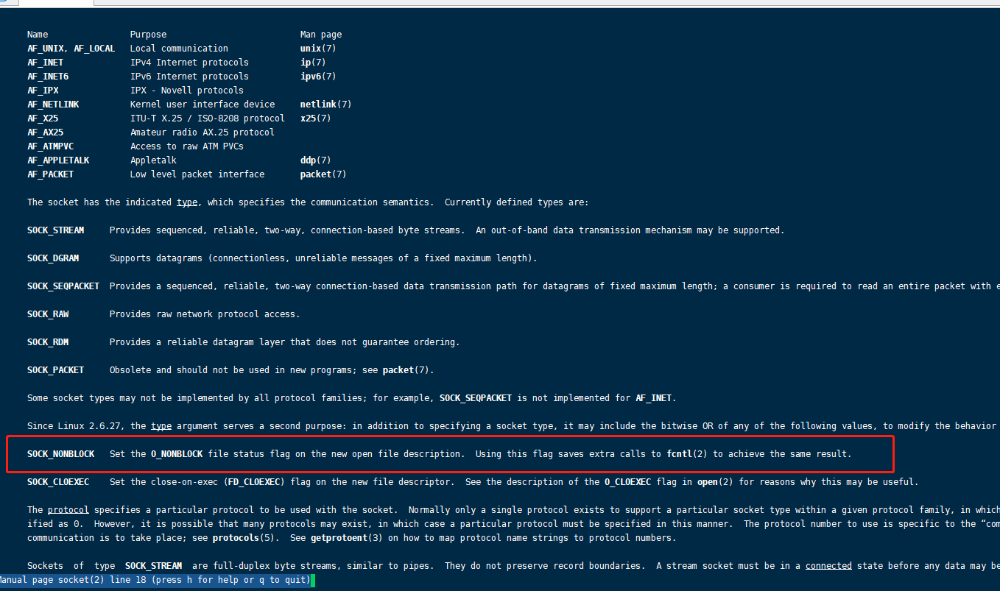

> SOCK_NONBLOCK :   Set the O_NONBLOCK file status flag on the new open file description.  Using this flag saves extra calls to fcntl(2) to achieve the same result

可以使用非阻塞，fcntl来指定非阻塞的文件描述符

==所以，内核需要发生变化==

下面的模型非阻塞的NIO （NON- Block IO）

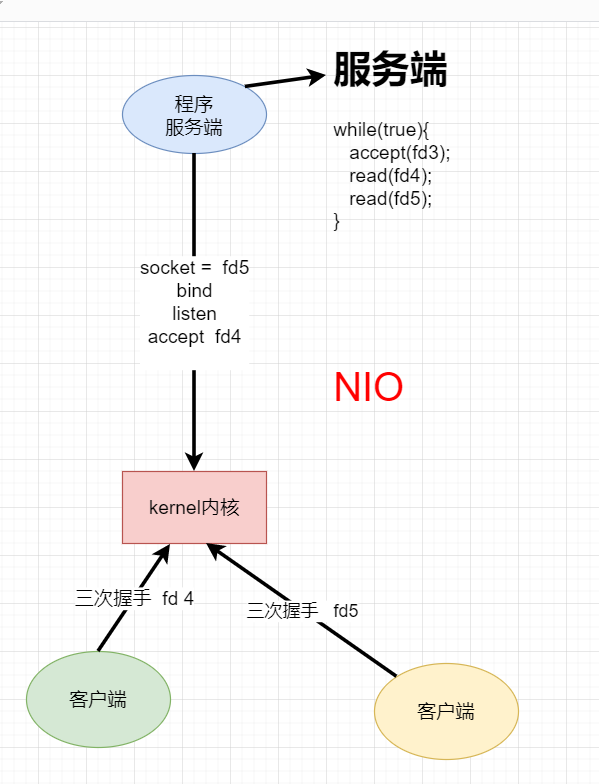

在客户端只需要写一个死循环，然后有一个客户端的文件描述符解accept，如果没有数据传输，就报错，然后程序可以继续执行。这样的模型也有弊端。

试想一下，如果有10000个客户端，一次循环就进行10000次系统调用，那么如果只有第10000个客户端有数据传输，那这样的开销会很大。

有没有什么解决方法呢？ 如果能把多次系统调用变成一次系统调用那就好啦！！！

怎么做？==内核又需要变化了==

## select

上面我们提到了select。看看`select` ： man 2 select 

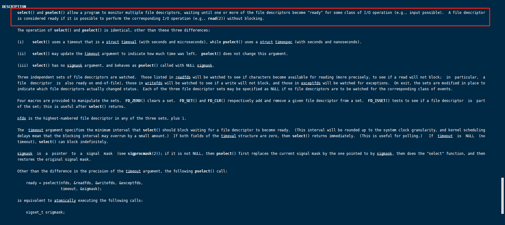

> select() and pselect() allow a program to monitor multiple file descriptors, waiting until one or more of the file descriptors become "ready" for some class of I/O operation (e.g., input possible).  A file descriptor  is considered ready if it is possible to perform the corresponding I/O operation (e.g., read(2)) without blocking.
>
> select()和pselect()允许程序监视多个文件描述符，直到其中一个或多个文件描述符为某些类型的I/O操作(例如，输入)“准备好”。如果文件描述符可以不阻塞地执行相应的I/O操作(如read(2))，则认为它已经准备好了。

下面是使用了select或者poll的模型

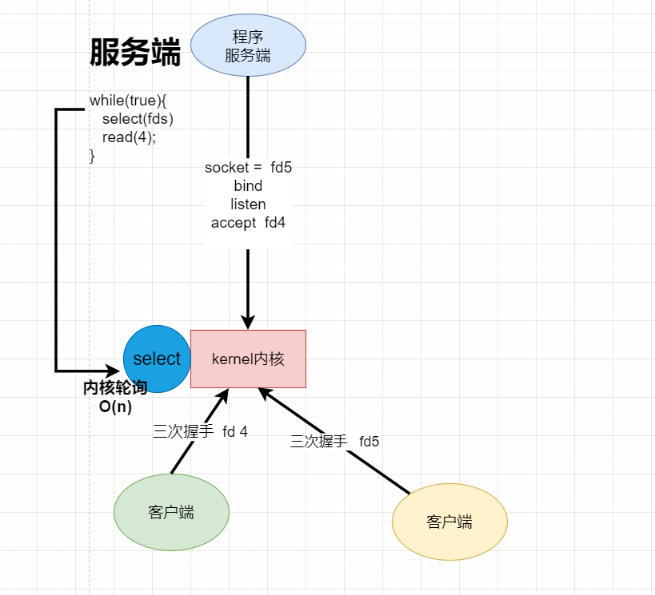

将各个客户端的文件描述符给select，然后select会去主动遍历每一个文件描述符，哪个有数据输出就返回哪个文件描述符，然后通过系统调用read去读取。这样的话就只用以一次系统调用就把需要read的文件描述符选择出来了，比上面的需要非常多的系统调用模型更加优秀。另外，select是系统调用，会主动遍历每一个文件操作符，时间复杂度为O(N)。

这还没有完，这种模型还没有很优美，虽然减少了系统调用，但是select里面的轮询还是O(N)的，这该怎么改进呢？

epoll终于来了！！！

## epoll

讲epoll之前先来看看`nginx`，看看nginx怎么工作的。

首先需要安装nginx： https://blog.csdn.net/qq_37345604/article/details/90034424 

```bash
wget http://nginx.org/download/nginx-1.9.9.tar.gz  
tar -zxvf  nginx-1.9.9.tar.gz
cd nginx目录
./configure
 
make
 
make install
```

运行nginx在 usr/local/nginx/sbin 目录下

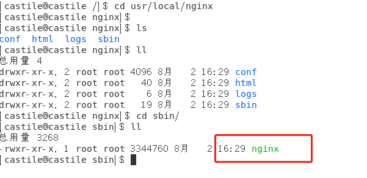

我们来看看nginx有多少个线程，不出意外的话，应该是两个，一个是master，一个是worker。

```bash
strace -ff -o out ./nginx
```

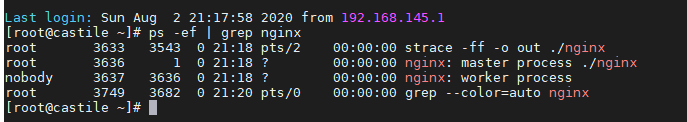

我们看看对应的out下有多少文件

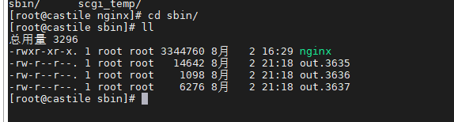

可以看到有3635、3636、3637三个进程，不应该是两个吗？？？

我们来看看3635这个进程：

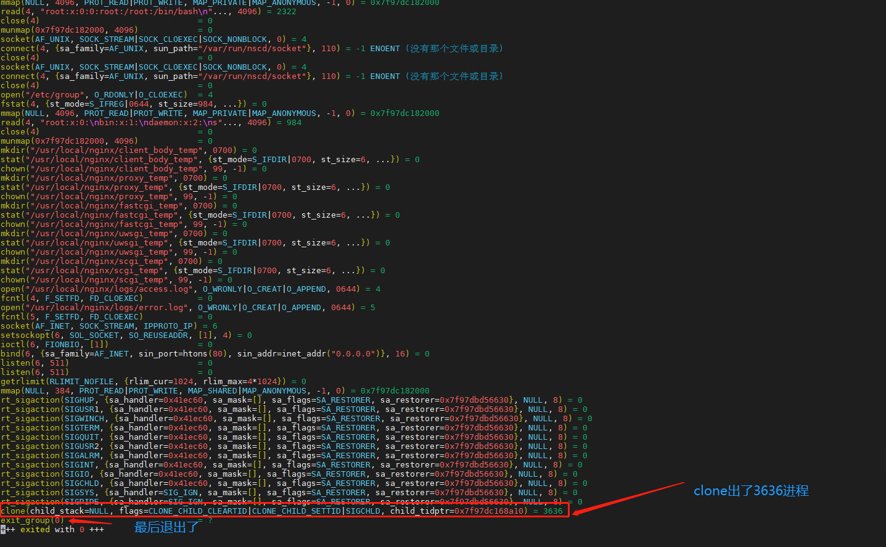

这个进程只是启动进程，最后是退出了的，它clone了3636进程， 然后3636进程clone了3637进程，如下图。

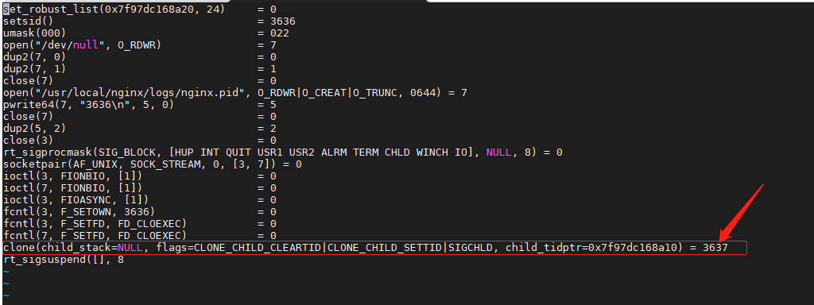

所以他们是父子关系。  3635--> 3636 --> 3637。 因为3636是master进程，可以看到他其实没有做什么事情， 就是将3637 worker进程clone出来了。

其实一开始文件描述符是在3635进程，也就是启动线程就去确定了，通过clone将文件描述符带给3636进程， 3636又带去3637进程

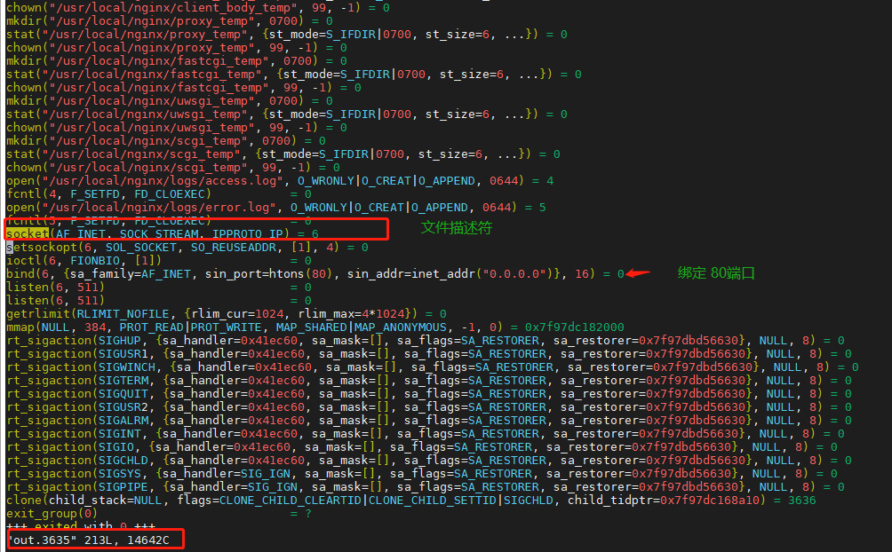

再看看3637进程

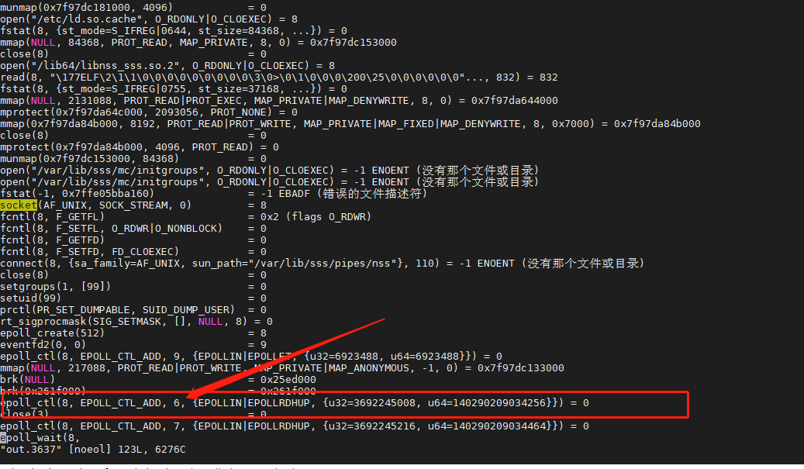

文件描述符6 放进了8 里面，8 是上面的`epoll_create`创建出来的。

那么epoll_create 是干嘛的，运行命令 man 2 epoll_create 查看系统调用

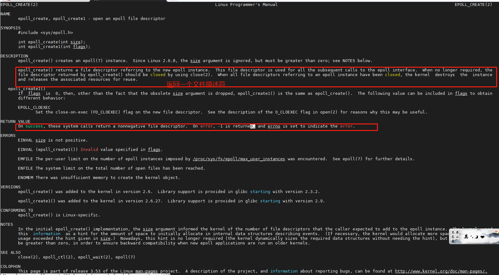

>   epoll_create() returns a file descriptor referring to the new epoll instance.  This file descriptor is used for all the subsequent calls to the epoll interface.  When no longer required, the file descriptor returned by epoll_create() should be closed by using close(2).  When all file descriptors referring to an epoll instance have been closed, the kernel  destroys  the  instance  and releases the associated resources for reuse.
>
> epoll_create()返回引用新epoll实例的文件描述符。**此文件描述符用于随后对epoll接口的所有调用。**当不再需要时，应该使用close(2)关闭epoll_create()返回的文件描述符。当引用epoll实例的所有文件描述符都被关闭时，内核会销毁该实例并释放相关的资源以供重用。

其实系统调用`epoll_create()` 在内核中开辟一个空间， 使用文件描述符指向这个空间。然后通过epoll_ctl(8, 6) 将文件描述符6放进 8里面。然后epoll_wait(8,  等待， 开始阻塞。

`epoll_wait`会返回有数据输出的文件描述符数量。

> The  epoll_wait()  system  call  waits for events on the epoll(7) instance referred to by the file descriptor epfd.  The memory area pointed to by events will contain the events that will be available for the caller.  Up to maxevents are returned by epoll_wait().  The maxevents argument must be greater than zero.
>
>  The timeout argument specifies the minimum number of milliseconds that epoll_wait() will block.  (This interval will be rounded up to the system  clock  granularity,  and  kernel  scheduling delays  mean  that the blocking interval may overrun by a small amount.)  Specifying a timeout of -1 causes epoll_wait() to block indefinitely, while specifying a timeout equal to zero cause  epoll_wait() to return immediately, even if no events are available.
>
> RETURN VALUE( 返回值 )
>        When successful, epoll_wait() returns the number of file descriptors ready for the requested I/O, or zero if no file descriptor became ready during the requested timeout milliseconds.   When  an error occurs, epoll_wait() returns -1 and errno is set appropriately.


> epoll_wait()系统调用等待文件描述符epfd引用的epoll(7)实例上的事件。事件指向的内存区域将包含调用者可用的事件。epoll_wait()返回最多maxevents。maxevents参数必须大于零。
>
> 超时参数指定epoll_wait()将阻塞的最小毫秒数。(这个时间间隔将被舍入到系统时钟粒度，内核调度延迟意味着阻塞时间间隔可能会超出一小部分。)将超时指定为-1将导致epoll_wait()无限期阻塞，而将超时指定为0将导致epoll_wait()立即返回，即使没有可用的事件。
>
> 成功时，epoll_wait()返回为请求的I/O准备好的文件描述符的数量，如果在请求的超时毫秒期间没有文件描述符准备好，则返回0。当发生错误时，epoll_wait()返回-1,errno被适当地设置。

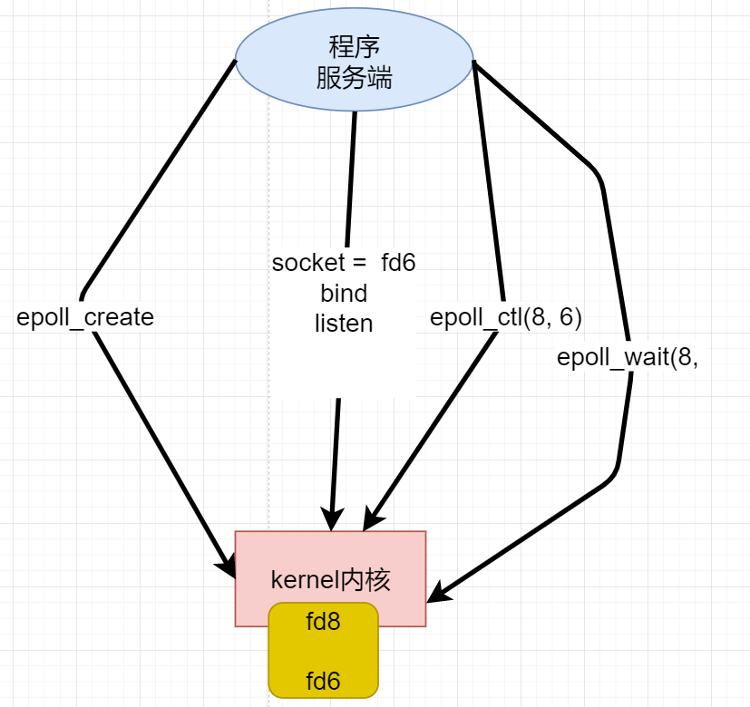

我们来模拟一下访问，目前3637进程是阻塞的，因为没有客户端来连接。

使用tail命令去查看动态的文件变化

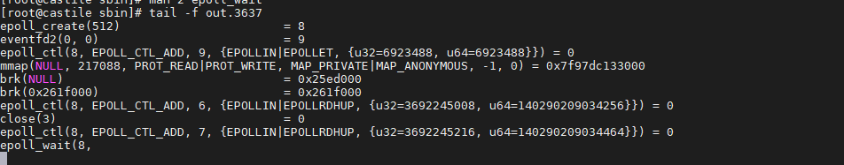

使用curl来模拟访问

```bash
curl localhost 80
```

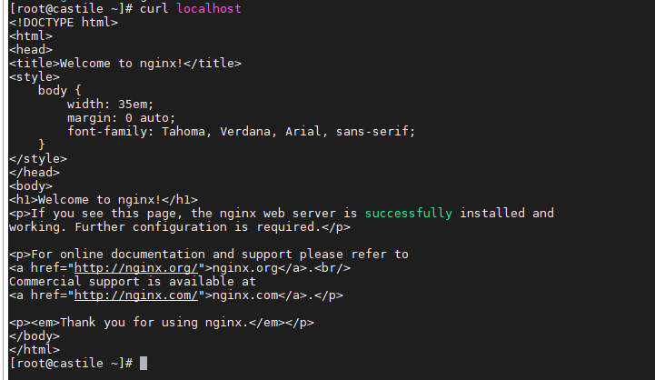

out文件的变化


主要看看这几句

```bash
accept4(6, {sa_family=AF_INET, sin_port=htons(34306), sin_addr=inet_addr("127.0.0.1")}, [110->16], SOCK_NONBLOCK) = 3

一个客户端请求后，首先系统调用accept(6, ...)，6是服务端的文件描述符，客户端的文件描述符是3

epoll_ctl(8, EPOLL_CTL_ADD, 3, {EPOLLIN|EPOLLRDHUP|EPOLLET, {u32=4200120752, u64=139994364166576}}) = 0
 紧接着 将3放进8 里面去，这时候还没有客户端的数据流出

epoll_wait(8, [{EPOLLIN, {u32=4200120752, u64=139994364166576}}], 512, 60000) = 1
epoll_wait 去监听8 里面的文件描述符的 数据到达事件

recvfrom(3, "GET / HTTP/1.1\r\nUser-Agent: curl"..., 1024, 0, NULL, NULL) = 73

有事件到达了， 收到的数据是从文件描述3发来的

stat("/usr/local/nginx/html/index.html", {st_mode=S_IFREG|0644, st_size=612, ...}) = 0

判断是请求主页的

open("/usr/local/nginx/html/index.html", O_RDONLY|O_NONBLOCK) = 10
打开主页的文件， 文件描述符是10

fstat(10, {st_mode=S_IFREG|0644, st_size=612, ...}) = 0
查看文件描述符10 的状态

writev(3, [{iov_base="HTTP/1.1 200 OK\r\nServer: nginx/1"..., iov_len=237}], 1) = 237
返回给文件描述符3 的数据，给3写入

sendfile(3, 10, [0] => [612], 612)      = 612
发送数据 将10 发送给3 
write(4, "127.0.0.1 - - [02/Aug/2020:22:01"..., 86) = 86
写的时间
close(10)     = 0
关闭文件描述符10
setsockopt(3, SOL_TCP, TCP_NODELAY, [1], 4) = 0
recvfrom(3, "", 1024, 0, NULL, NULL)    = 0
close(3)  #  连接断开就会关闭文件描述符3                
```

我们也可以使用nc 来模拟多个客户端：

```bash
nc localhost 80  # 客户端1
nc localhost 80 # 客户端2
```

这是out文件的变化，可以看到有两个文件描述符加入8 中

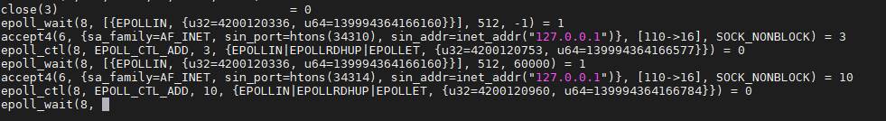

所以，所有的连接只需要通过epoll_ctl（8， ）放入8一次，未来就连续调用epoll_wait来监听那个文件描述符有数据到达， 对于文件描述符6来说，等待的是accept事件，对于3、10 等其他的客户端的文件描述符是等待read，一旦监听到了，就将这个文件描述符放入一个集合中。

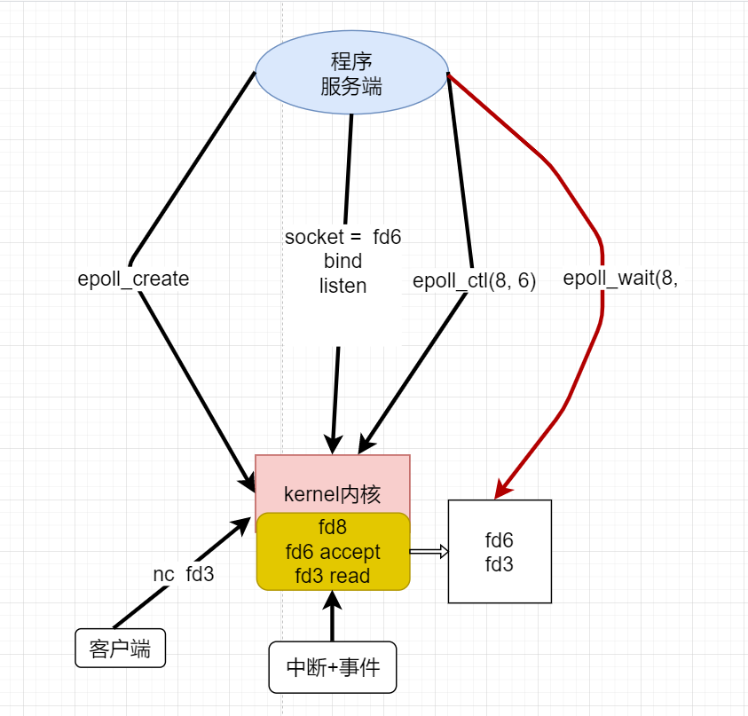

这样的模型不像select会一次将10000个文件描述符拷贝给内核，内核开辟了一个空间，来了一个客户端就通过epoll_ctl将文件描述符放入到指定的区域里面，只要连接不断开，那么可以通过epoll_wait获取到客户端的所有事件。

内核是被动的，中断的事件会让8 里面的文件描述符进入到右边的返回区，然后主程序就是一个epol_wait死循环，一直判断返回区里面有没有事件。

零拷贝： sendFile系统调用

直接内存

# 附：发展历程图示

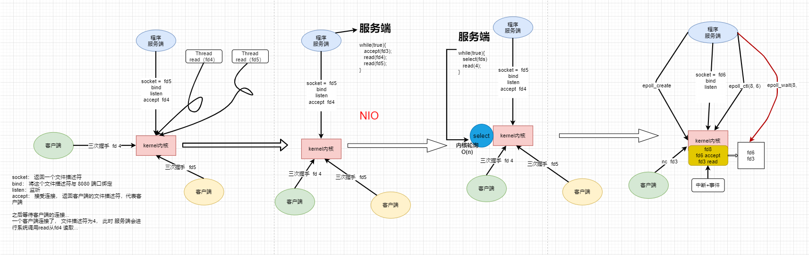


# 参考资料

1. https://cyc2018.github.io/CS-Notes/#/notes/Socket