# Java中的各种锁机制

图片来自于美团技术团队[java主流锁](https://awps-assets.meituan.net/mit-x/blog-images-bundle-2018b/7f749fc8.png)


# 一、公平锁和非公平锁

## 公平锁
​    是指多个线程按照申请**锁的顺序**来获取锁，类似排队打饭，先来后到
## 非公平锁
​    是指在多线程获取锁的顺序并不是按照申请锁的顺序, 有可能后申请的线程比先申请的线程优先获取到锁, 在高并发的情况下, 有可能造成优先级反转或者饥饿现象。

## 公平锁/非公平锁区别
  并发包ReentrantLock的创建可以指定构造函数的boolean类型来得到公平锁或者非公平锁 （默认是非公平锁）

```java
 public ReentrantLock() {
        sync = new NonfairSync();
    }
public ReentrantLock(boolean fair) {
        sync = fair ? new FairSync() : new NonfairSync();
    }

```


**公平锁：** Thread acquire a fair lock in the order in which they requested it

公平锁就是很公平，在并发环境下，每个线程获取锁时会先查看此锁维护的等待队列，如果为空，或者当前线程时等待队列的第一个，就占有锁，否则就会被加入到等待队列中，以后会按照FIFO的规则从队列中取到自己。

**非公平锁：** 非公平锁比较粗鲁， 上来就直接尝试占有锁，如果尝试失败，就在采用类似公平锁那种方式。

ReentrantLock而言，通过构造函数指定该锁是否是公平锁。默认是非公平锁，非公平锁的优点在于吞吐量比公平锁大。

对于synchronized而言 也是一种非公平锁。

下面是ReentrantLock的公平锁和非公平锁源码

公平锁加锁：

```java
 protected final boolean tryAcquire(int acquires) {
            final Thread current = Thread.currentThread();
            int c = getState();
            if (c == 0) {
                if (!hasQueuedPredecessors() &&  // 判断线程是不是同步队列中的第一个
                    compareAndSetState(0, acquires)) {
                    setExclusiveOwnerThread(current);
                    return true;
                }
            }
            else if (current == getExclusiveOwnerThread()) {
                int nextc = c + acquires;
                if (nextc < 0)
                    throw new Error("Maximum lock count exceeded");
                setState(nextc);
                return true;
            }
            return false;
        }


```

非公平锁：

```java
final boolean nonfairTryAcquire(int acquires) {
            final Thread current = Thread.currentThread();
            int c = getState();
            if (c == 0) {
                if (compareAndSetState(0, acquires)) {
                    setExclusiveOwnerThread(current);
                    return true;
                }
            }
            else if (current == getExclusiveOwnerThread()) {
                int nextc = c + acquires;
                if (nextc < 0) // overflow
                    throw new Error("Maximum lock count exceeded");
                setState(nextc);
                return true;
            }
            return false;
        }

```

源代码对比，我们可以明显的看出公平锁与非公平锁的lock()方法唯一的区别就在于公平锁在获取同步状态时多了一个限制条件：hasQueuedPredecessors()。

```java
public final boolean hasQueuedPredecessors() {
        // The correctness of this depends on head being initialized
        // before tail and on head.next being accurate if the current
        // thread is first in queue.
        Node t = tail; // Read fields in reverse initialization order
        Node h = head;
        Node s;
        return h != t &&
            ((s = h.next) == null || s.thread != Thread.currentThread());
    }
```

再进入hasQueuedPredecessors()，可以看到该方法主要做一件事情：主要是判断当前线程是否位于同步队列中的第一个。如果是则返回true，否则返回false。

综上，公平锁就是通过同步队列来实现多个线程按照申请锁的顺序来获取锁，从而实现公平的特性。非公平锁加锁时不考虑排队等待问题，直接尝试获取锁，所以存在后申请却先获得锁的情况。


# 二、可重入锁

也称为递归锁。指的是同一线程外层函数获得锁之后，内层的方法仍然可以获得该锁的代码。在同一个线程的外层方法获取锁的时候，在进入内层方法会自动获取锁。也就是说，线程可以进入任何一个它已经拥有锁的同步代码。

其最大的作用就是可以避免死锁。

## synchronized

接下来证明`synchronized`是可重入锁

```java
package cn.hongliang.lock;
import java.util.concurrent.locks.ReentrantLock;

class Phone{

    public synchronized  void sendMsg(){
        System.out.println(Thread.currentThread().getId()+"\t invoke sendMsg");
        sendEmail();
    }
    public synchronized  void sendEmail(){
        System.out.println(Thread.currentThread().getId()+"\t $$$$$$$$$$$$$$$  invoke sendEmail");
    }
}

public class LockDemo1 {

    public static void main(String[] args) {
        Phone phone = new Phone();
        new Thread(()->{
            phone.sendMsg();
        }, "t1").start();
        new Thread(()->{
            phone.sendMsg();
        }, "t2").start();
    }
}

```

> 11	 invoke sendMsg
> 11	 $$$$$$$$$$$$$$$  invoke sendEmail
> 12	 invoke sendMsg
> 12	 $$$$$$$$$$$$$$$  invoke sendEmail

可以看到getID()返回的是同一个线程。

## ReentrantLock

下面再看看ReentrantLock是不是也是可重入的

```java
package cn.hongliang.lock;
import java.util.concurrent.TimeUnit;
import java.util.concurrent.locks.Lock;
import java.util.concurrent.locks.ReentrantLock;
class Phone implements Runnable{

   private Lock lock = new ReentrantLock();
    @Override
    public void run() {
        get();
    }
    private void get(){
        lock.lock();
        try {
            System.out.println(Thread.currentThread().getName() +"\t invoke get()");
            set();
        }finally {
            lock.unlock();
        }
    }

    private void set() {
        lock.lock();
        try {
            System.out.println(Thread.currentThread().getName() +"\t invoke set()");
        }finally {
            lock.unlock();
        }
    }
}

public class LockDemo1 {

    public static void main(String[] args) throws InterruptedException {
        Phone phone = new Phone();
       
        Thread t3 = new Thread(phone, "t3");
        Thread t4 = new Thread(phone, "t4");
        t3.start();
        t4.start();

    }
}

```

> t3	 invoke get()
> t3	 invoke set()
> t4	 invoke get()
> t4	 invoke set()


## Synchronized与ReentrantLock的区别

1. 原始构成： Synchronized是关键字，属于JVM层面的。monitorenter和monitorexit指令完成。

   monitorenter 底层是通过monitor对象来完成的，其实wait/notify等方法也是依赖monitor对象  只有在同步块或者方法中才能调用wait/notify等方法。

   而ReentrantLock是具体类，是api层面的锁。

2. 使用方法：

   Synchronized 不需要手动释放锁，当Synchronized代码执行完后系统会自动让线程释放对锁的占用。

   ReentrantLock则需要用户手动释放，如果没有手动释放，就有可能导致死锁现象。lock和unlock方法配合try/finally语句块来完成。

3. 等待是否可以中断

   Synchronized 不可中断，除非抛出异常或正常运行完成。

   ReentrantLock是可以中断的。1. 通过设置超时方法  trylock(long timeout, TimeUint unit)   2. lockInterruptibly()  放入代码块中，调用interrupt可中断。

4. 加锁是否公平

   Synchronized是非公平锁

   ReentrantLock两者都可以，默认是非公平锁，构造方法可以传入boolean值，true为公平锁，false为非公平锁

5. 锁绑定多个条件

   Synchronized没有，只能随机唤醒一个或者全部唤醒

   ReentrantLock可以实现精确唤醒

   

# 三、自旋锁spinlock

是指尝试获取锁的线程不会立即阻塞，而是采用循环的方式去尝试获取锁，这样的好处是减少线程上下文切换的消耗，缺点是循环会消耗CPU

自旋锁的好处： 循环比较直到获取成功为止，没有类似的wait的阻塞

## 实现一个自旋锁

通过CAS操作完成自旋锁，A线程先进来调用mylock方法自己持有锁5秒钟，B随后进来后发现当有线程持有锁，不是null， 所以只能自旋等待，直到A释放锁后B随后抢到。

```java
package cn.hongliang.lock;

import java.util.concurrent.TimeUnit;
import java.util.concurrent.atomic.AtomicReference;

/**
 * @author Hongliang Zhu
 * @Date 2020-08-23-17:32
 *
 * 实现一个自旋锁
 */
public class SpinLock {

    // 原子引用线程
    AtomicReference<Thread> atomicReference = new AtomicReference<>();

    public void mylock(){
        Thread thread = Thread.currentThread(); //当前进来的线程
        System.out.println(Thread.currentThread().getName() +" 进来了...");
        while(!atomicReference.compareAndSet(null, thread)){
            // spin
        }
    }

    public void unlock(){
        Thread thread = Thread.currentThread(); //当前进来的线程
        atomicReference.compareAndSet(thread, null);
        System.out.println(Thread.currentThread().getName() +" 释放锁");
    }


    public static void main(String[] args) {
        SpinLock lock = new SpinLock();
        new Thread(()->{
            // 获取锁
            lock.mylock();
            // 休眠
            try {
                TimeUnit.SECONDS.sleep(5);
            } catch (InterruptedException e) {
                e.printStackTrace();
            }
            // 释放锁
            lock.unlock();

        }, "AAA").start();

        new Thread(() -> {
            lock.mylock();
            try {
                TimeUnit.SECONDS.sleep(1);
            } catch (InterruptedException e) {
                e.printStackTrace();
            }
            lock.unlock();
        }, "BBB").start();


    }

}

```

mylock（)方法利用的CAS，当第一个线程A获取锁的时候，能够成功获取到，不会进入while循环，如果此时线程A没有释放锁，另一个线程B又来获取锁，此时由于不满足CAS，所以就会进入while循环，不断判断是否满足CAS，直到A线程调用unlock方法释放了该锁。

## 自旋锁存在的问题

1. 如果某个线程持有锁的时间过长，就会导致其它等待获取锁的线程进入循环等待，消耗CPU。使用不当会造成CPU使用率极高。
2. 上面Java实现的自旋锁不是公平的，即**无法满足等待时间最长的线程优先获取锁**。不公平的锁就会存在“**线程饥饿**”问题。

## 自旋锁的优点

1. 自旋锁不会使线程状态发生切换，一直处于用户态，即线程一直都是active的；不会使线程进入阻塞状态，减少了不必要的上下文切换，执行速度快
2. 非自旋锁在获取不到锁的时候会进入阻塞状态，从而进入内核态，当获取到锁的时候需要从内核态恢复，需要线程上下文切换。 （线程被阻塞后便进入内核（Linux）调度状态，这个会导致系统在用户态与内核态之间来回切换，严重影响锁的性能）

## 可重入的自旋锁和不可重入的自旋锁

我们再来看一下我们实现的自旋锁

```java
public class SpinLock {

    // 原子引用线程
    AtomicReference<Thread> atomicReference = new AtomicReference<>();

    public void mylock(){
        Thread thread = Thread.currentThread(); //当前进来的线程
        System.out.println(Thread.currentThread().getName() +" 进来了...");
        while(!atomicReference.compareAndSet(null, thread)){
            // spin
        }
    }

    public void unlock(){
        Thread thread = Thread.currentThread(); //当前进来的线程
        atomicReference.compareAndSet(thread, null);
        System.out.println(Thread.currentThread().getName() +" 释放锁");
    }
}
```

可以发现我们上面的自旋锁不支持可重入，即当一个线程第一次已经获取到了该锁，在锁释放之前又一次重新希望获取该锁，第二次就不能成功获取到。由于不满足CAS，所以第二次获取会进入`while`循环等待，而如果是可重入锁，第二次也是应该能够成功获取到的。

而且，即使第二次能够成功获取，那么当第一次释放锁的时候，第二次获取到的锁也会被释放，而这是不合理的。为了实现可重入锁，我们需要引入一个计数器，用来记录获取锁的线程数。

```java
package cn.hongliang.lock;

import java.util.concurrent.TimeUnit;
import java.util.concurrent.atomic.AtomicInteger;
import java.util.concurrent.atomic.AtomicMarkableReference;
import java.util.concurrent.atomic.AtomicReference;

/**
 * @author Hongliang Zhu
 * @Date 2020-08-25-15:55
 *
 * 可重入的自旋锁
 */
public class ReentrantSpinLock {

    AtomicReference<Thread> threadAtomicReference = new AtomicReference<>();
//    private int count; // 计数器

    private AtomicInteger count = new AtomicInteger();

    public void lock(){
        Thread thread = Thread.currentThread();
        if(threadAtomicReference.get() == thread){
            // 如果当前线程已经获取到了该锁，计数器加1 ，然后直接返回
//            count.incrementAndGet();
            System.out.println(Thread.currentThread().getName() +" 已经获取了该锁,目前count值为"+ count.getAndIncrement()+"，计数器为"+ count.get());
            return;
        }
        // 如果没有获取，则通过CAS自旋
        System.out.println(Thread.currentThread().getName() +" 开始获取锁，进来了..."+count.get());
        while (!threadAtomicReference.compareAndSet(null, thread)){
            // Do nothing
        }
    }

    public void unlock(){
        Thread thread = Thread.currentThread();
        if(threadAtomicReference.get() == thread){
            if(count.get() > 0){
//                count.decrementAndGet(); // 如果当前线程获取了锁，则通过count--来模拟释放一次锁
                System.out.println(Thread.currentThread().getName() +" count为"+ count.getAndDecrement()+"，继续释放..."+ count.get());
            }else{
                System.out.println(Thread.currentThread().getName() +" 释放了全部锁..." + count.get());
                // count == 0 ， 可以将锁释放， 保证获取锁的次数与释放锁的次数一致
                threadAtomicReference.compareAndSet(thread, null);

            }
        }


    }

    public static void main(String[] args) {
        ReentrantSpinLock spinLock = new ReentrantSpinLock();

        new Thread(()->{
            spinLock.lock();
            try{
                spinLock.lock();
                try {
                    TimeUnit.SECONDS.sleep(3);
                } catch (InterruptedException e) {
                    e.printStackTrace();
                }finally {
                    spinLock.unlock();
                }

            }catch (Exception e){
                System.out.println("异常");
            }finally {
                spinLock.unlock();
            }
        },"AAA").start();


        new Thread(() -> {
            spinLock.lock();
            try {
                TimeUnit.SECONDS.sleep(1);
            } catch (InterruptedException e) {
                e.printStackTrace();
            }
            spinLock.unlock();
        }, "BBB").start();


    }

}

```

> AAA 开始获取锁，进来了...0
> AAA 已经获取了该锁,目前count值为0，计数器为1
> BBB 开始获取锁，进来了...1
> AAA count为1，继续释放...0
> AAA 释放了全部锁...0
> BBB 释放了全部锁...0

这样可以重入

## 自旋锁的变种：TicketLock

**TicketLock主要解决的是公平性的问题。**

思路：每当有线程获取锁的时候，就给该线程分配一个递增的id，我们称之为排队号，同时，锁对应一个服务号，每当有线程释放锁，服务号就会递增，此时如果服务号与某个线程排队号一致，那么该线程就获得锁，由于排队号是递增的，所以就保证了最先请求获取锁的线程可以最先获取到锁，就实现了公平性。

可以想象成银行办理业务排队，排队的每一个顾客都代表一个需要请求锁的线程，而银行服务窗口表示锁，每当有窗口服务完成就把自己的服务号加一，此时在排队的所有顾客中，只有自己的排队号与服务号一致的才可以得到服务。

```java
public class TicketLockV2 {
    /**
     * 服务号
     */
    private AtomicInteger serviceNum = new AtomicInteger();
    /**
     * 排队号
     */
    private AtomicInteger ticketNum = new AtomicInteger();
    /**
     * 新增一个ThreadLocal，用于存储每个线程的排队号
     */
    private ThreadLocal<Integer> ticketNumHolder = new ThreadLocal<Integer>();
    public void lock() {
        int currentTicketNum = ticketNum.incrementAndGet();
        // 获取锁的时候，将当前线程的排队号保存起来
        ticketNumHolder.set(currentTicketNum);
        while (currentTicketNum != serviceNum.get()) {
            // Do nothing
        }
    }
    public void unlock() {
        // 释放锁，从ThreadLocal中获取当前线程的排队号
        Integer currentTickNum = ticketNumHolder.get();
        serviceNum.compareAndSet(currentTickNum, currentTickNum + 1);
    }
}
```

上面的实现方式是将每个线程的排队号放到了ThreadLocal中。

**TicketLock存在的问题:**

多处理器系统上，每个进程/线程占用的处理器都在读写同一个变量serviceNum ，每次读写操作都必须在多个处理器缓存之间进行缓存同步，这会导致繁重的系统总线和内存的流量，大大降低系统整体的性能。

下面介绍的CLHLock就是解决这个问题的。

## 自旋锁的变种CLHLock

CLH锁是一种基于链表的可扩展、高性能、公平的自旋锁，申请线程只在本地变量上自旋，它不断轮询前驱的状态，如果发现前驱释放了锁就结束自旋，获得锁。

```java
import java.util.concurrent.atomic.AtomicReferenceFieldUpdater;
/**
 * CLH的发明人是：Craig，Landin and Hagersten。
 * 代码来源：http://ifeve.com/java_lock_see2/
 */
public class CLHLock {
    /**
     * 定义一个节点，默认的lock状态为true
     */
    public static class CLHNode {
        private volatile boolean isLocked = true;
    }
    /**
     * 尾部节点,只用一个节点即可
     */
    private volatile CLHNode tail;
    private static final ThreadLocal<CLHNode> LOCAL = new ThreadLocal<CLHNode>();
    private static final AtomicReferenceFieldUpdater<CLHLock, CLHNode> UPDATER = AtomicReferenceFieldUpdater.newUpdater(CLHLock.class, CLHNode.class,
            "tail");
    public void lock() {
        // 新建节点并将节点与当前线程保存起来
        CLHNode node = new CLHNode();
        LOCAL.set(node);
        // 将新建的节点设置为尾部节点，并返回旧的节点（原子操作），这里旧的节点实际上就是当前节点的前驱节点
        CLHNode preNode = UPDATER.getAndSet(this, node);
        if (preNode != null) {
            // 前驱节点不为null表示当锁被其他线程占用，通过不断轮询判断前驱节点的锁标志位等待前驱节点释放锁
            while (preNode.isLocked) {
            }
            preNode = null;
            LOCAL.set(node);
        }
        // 如果不存在前驱节点，表示该锁没有被其他线程占用，则当前线程获得锁
    }
    public void unlock() {
        // 获取当前线程对应的节点
        CLHNode node = LOCAL.get();
        // 如果tail节点等于node，则将tail节点更新为null，同时将node的lock状态职位false，表示当前线程释放了锁
        if (!UPDATER.compareAndSet(this, node, null)) {
            node.isLocked = false;
        }
        node = null;
    }
}
```


# 四、独占锁（写锁）/共享锁(读锁) /互斥锁

独占锁： 指该锁一次只能被一个线程锁持有。ReentrantLock和Synchronized都是独占锁

共享锁： 该锁可以被多个线程锁共享

对ReentrantReadWriteLock其读锁是共享的，写锁是独占的。

读锁的共享锁可以保证并发读是高效的，读写、写写、写读的过程是互斥的。

独享锁与共享锁是通过AQS来实现的，通过实现不同的方法，来实现独享或者共享。

## 分布式缓存

我们使用读写锁实现一个分布式缓存，要求写时独占，原子的，读操作可以共享。

先来看没有加锁的时候，会发生什么状况。

```java
package cn.hongliang.lock;
import java.util.HashMap;
import java.util.concurrent.TimeUnit;

/**
 * @author Hongliang Zhu
 * @Date 2020-08-23-23:05
 *
 * 读写锁实践： 手写一个 缓存
 *
 */

class MyCache{

    HashMap<String, Object> cache = new HashMap<>();

    public void put(String key, Object value){
        System.out.println(Thread.currentThread().getName() + "\t 开始写入" + key);
        // 模拟网络延迟
        try {
            TimeUnit.MILLISECONDS.sleep(300);
        } catch (InterruptedException e) {
            e.printStackTrace();
        }
        cache.put(key, value);
        System.out.println(Thread.currentThread().getName() + "\t 写入完成");

    }
    public Object get(String key){
        System.out.println(Thread.currentThread().getName() + "\t 开始读取");
        // 模拟网络延迟
        try {
            TimeUnit.MILLISECONDS.sleep(300);
        } catch (InterruptedException e) {
            e.printStackTrace();
        }
        Object value = cache.get(key);
        System.out.println(Thread.currentThread().getName() + "\t 读取完成："+ value);
        return value;
    }


}

public class readwriteLockDemo {
    public static void main(String[] args) {
        // 线程操作资源类
        MyCache cache = new MyCache();

        // 模拟5个线程写，5个线程读
        for (int i = 1; i <= 5; i++) {
            final int tmp = i;
            new Thread(()->{
                cache.put(tmp+"", tmp+"");
            }, String.valueOf(i)).start();
        }

        for (int i = 1; i <= 5; i++) {
            final int tmp = i;
            new Thread(()->{
                cache.get(tmp+"");
            }, String.valueOf(i)).start();
        }
    }


}

```

> 1	 开始写入1
> 2	 开始写入2
> 3	 开始写入3
> 4	 开始写入4
> 5	 开始写入5
> 1	 开始读取
> 2	 开始读取
> 3	 开始读取
> 4	 开始读取
> 5	 开始读取
> 5	 写入完成
> 1	 读取完成：null
> 4	 写入完成
> 3	 写入完成
> 2	 写入完成
> 1	 写入完成
> 2	 读取完成：2
> 3	 读取完成：3
> 4	 读取完成：4
> 5	 读取完成：5

可以发现，写操作被读操作中断了，而且还读到了一个null值。这是并发问题。

我们要实现写操作是原子的，应该为独占锁，读取操作是各个线程所共享的。可以使用JUC下面的`ReentrantReadWriteLock`， 称为读写锁。

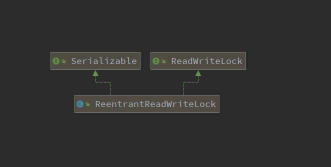

```java
package cn.hongliang.lock;

import java.util.HashMap;
import java.util.concurrent.TimeUnit;
import java.util.concurrent.locks.ReentrantReadWriteLock;

/**
 * @author Hongliang Zhu
 * @Date 2020-08-23-23:05
 *
 * 读写锁实践： 手写一个 缓存
 *
 */

class MyCache{

    HashMap<String, Object> cache = new HashMap<>();
    ReentrantReadWriteLock lock = new ReentrantReadWriteLock();

    public void put(String key, Object value){
        // 使用写锁
        lock.writeLock().lock();

        try {
            System.out.println(Thread.currentThread().getName() + "\t 开始写入" + key);
            // 模拟网络延迟
            try {
                TimeUnit.MILLISECONDS.sleep(300);
            } catch (InterruptedException e) {
                e.printStackTrace();
            }
            cache.put(key, value);
            System.out.println(Thread.currentThread().getName() + "\t 写入完成");
        } catch (Exception e) {
            e.printStackTrace();
        } finally {
            // 释放锁
            lock.writeLock().unlock();
        }

    }
    public Object get(String key){
        // 加读锁
        lock.readLock().lock();
        try {
            System.out.println(Thread.currentThread().getName() + "\t 开始读取");
            // 模拟网络延迟
            try {
                TimeUnit.MILLISECONDS.sleep(300);
            } catch (InterruptedException e) {
                e.printStackTrace();
            }
            Object value = cache.get(key);
            System.out.println(Thread.currentThread().getName() + "\t 读取完成："+ value);
            return value;
        } catch (Exception e) {
            e.printStackTrace();
        } finally {
            lock.readLock().unlock();
        }
        return null;
    }


}

public class readwriteLockDemo {
    public static void main(String[] args) {
        // 线程操作资源类
        MyCache cache = new MyCache();

        // 模拟5个线程写，5个线程读
        for (int i = 1; i <= 5; i++) {
            final int tmp = i;
            new Thread(()->{
                cache.put(tmp+"", tmp+"");
            }, String.valueOf(i)).start();
        }

        for (int i = 1; i <= 5; i++) {
            final int tmp = i;
            new Thread(()->{
                cache.get(tmp+"");
            }, String.valueOf(i)).start();
        }
    }

}

```

> 1	 开始写入1
> 1	 写入完成
> 2	 开始写入2
> 2	 写入完成
> 3	 开始写入3
> 3	 写入完成
> 4	 开始写入4
> 4	 写入完成
> 5	 开始写入5
> 5	 写入完成
> 1	 开始读取
> 2	 开始读取
> 4	 开始读取
> 5	 开始读取
> 3	 开始读取
> 5	 读取完成：5
> 2	 读取完成：2
> 4	 读取完成：4
> 3	 读取完成：3
> 1	 读取完成：1

可以清楚看到，写操作是配对完成的，中间没有打断。读操作是并发的，可以无序。

## 深入理解ReentrantReadWriteLock

读写锁

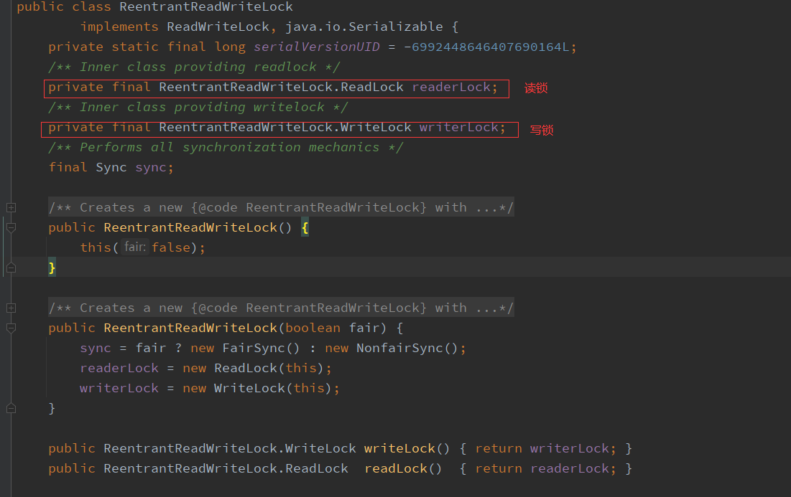

读锁

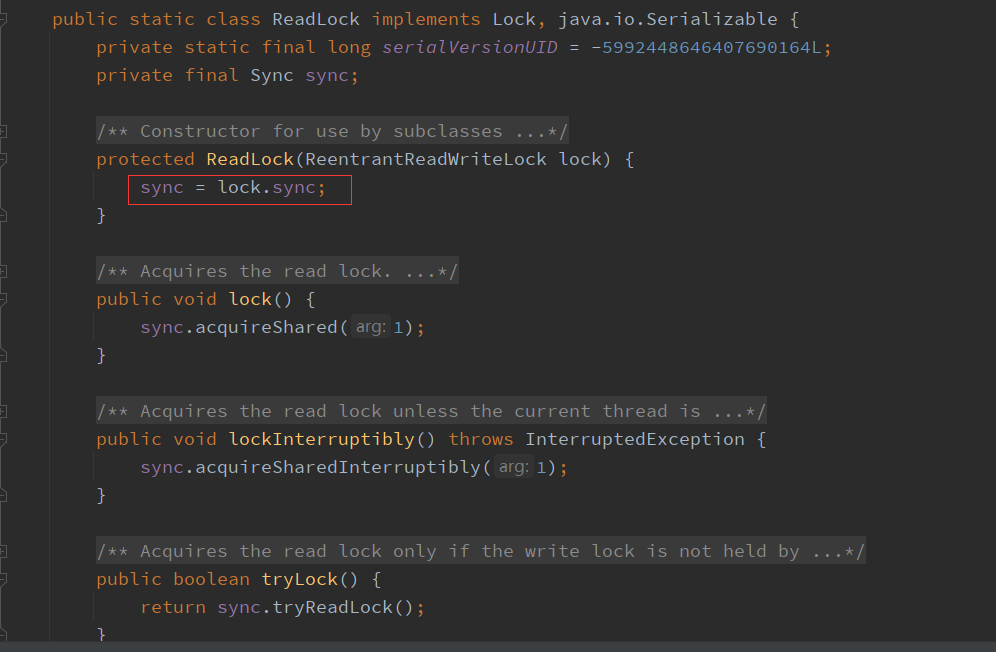

写锁

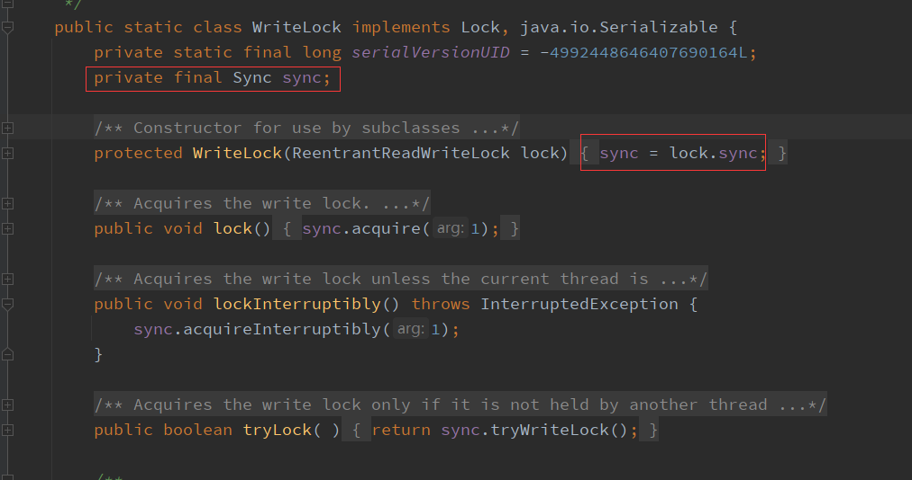

我们看到ReentrantReadWriteLock有两把锁：ReadLock和WriteLock，由词知意，一个读锁一个写锁，合称“读写锁”。再进一步观察可以发现ReadLock和WriteLock是靠内部类Sync实现的锁。Sync是AQS的一个子类，这种结构在CountDownLatch、ReentrantLock、Semaphore里面也都存在。

```java
abstract static class Sync extends AbstractQueuedSynchronizer {
    ...
}
```

在ReentrantReadWriteLock里面，读锁和写锁的锁主体都是Sync，但读锁和写锁的加锁方式不一样。读锁是共享锁，写锁是独享锁。读锁的共享锁可保证并发读非常高效，而读写、写读、写写的过程互斥，因为读锁和写锁是分离的。所以ReentrantReadWriteLock的并发性相比一般的互斥锁有了很大提升。

那读锁和写锁的具体加锁方式有什么区别呢？在了解源码之前我们需要回顾一下其他知识。 在最开始提及AQS的时候我们也提到了state字段（int类型，32位），该字段用来描述有多少线程获持有锁。

在独享锁中这个值通常是0或者1（如果是重入锁的话state值就是重入的次数），在共享锁中state就是持有锁的数量。但是在ReentrantReadWriteLock中有读、写两把锁，所以需要在一个整型变量state上分别描述读锁和写锁的数量（或者也可以叫状态）。于是将state变量“按位切割”切分成了两个部分，高16位表示读锁状态（读锁个数），低16位表示写锁状态（写锁个数）。如下图所示：


来看看写锁的加锁源码

```java
protected final boolean tryAcquire(int acquires) {
	Thread current = Thread.currentThread();
	int c = getState(); // 取到当前锁的个数
	int w = exclusiveCount(c); // 取写锁的个数w
	if (c != 0) { // 如果已经有线程持有了锁(c!=0)
    // (Note: if c != 0 and w == 0 then shared count != 0)
		if (w == 0 || current != getExclusiveOwnerThread()) // 如果写线程数（w）为0（换言之存在读锁） 或者持有锁的线程不是当前线程就返回失败
			return false;
		if (w + exclusiveCount(acquires) > MAX_COUNT)    // 如果写入锁的数量大于最大数（65535，2的16次方-1）就抛出一个Error。
      throw new Error("Maximum lock count exceeded");
		// Reentrant acquire
    setState(c + acquires);
    return true;
  }
  if (writerShouldBlock() || !compareAndSetState(c, c + acquires)) // 如果当且写线程数为0，并且当前线程需要阻塞那么就返回失败；或者如果通过CAS增加写线程数失败也返回失败。
		return false;
	setExclusiveOwnerThread(current); // 如果c=0，w=0或者c>0，w>0（重入），则设置当前线程或锁的拥有者
	return true;
}
```

> - 这段代码首先取到当前锁的个数c，然后再通过c来获取写锁的个数w。因为写锁是低16位，所以取低16位的最大值与当前的c做与运算（ int w = exclusiveCount©; ），高16位和0与运算后是0，剩下的就是低位运算的值，同时也是持有写锁的线程数目。
> - 在取到写锁线程的数目后，首先判断是否已经有线程持有了锁。如果已经有线程持有了锁(c!=0)，则查看当前写锁线程的数目，如果写线程数为0（即此时存在读锁）或者持有锁的线程不是当前线程就返回失败（涉及到公平锁和非公平锁的实现）。
> - 如果写入锁的数量大于最大数（65535，2的16次方-1）就抛出一个Error。
> - 如果当且写线程数为0（那么读线程也应该为0，因为上面已经处理c!=0的情况），并且当前线程需要阻塞那么就返回失败；如果通过CAS增加写线程数失败也返回失败。
> - 如果c=0,w=0或者c>0,w>0（重入），则设置当前线程或锁的拥有者，返回成功！

tryAcquire()除了重入条件（当前线程为获取了写锁的线程）之外，增加了一个读锁是否存在的判断。如果存在读锁，则写锁不能被获取，原因在于：必须确保写锁的操作对读锁可见，如果允许读锁在已被获取的情况下对写锁的获取，那么正在运行的其他读线程就无法感知到当前写线程的操作。

因此，只有等待其他读线程都释放了读锁，写锁才能被当前线程获取，而写锁一旦被获取，则其他读写线程的后续访问均被阻塞。写锁的释放与ReentrantLock的释放过程基本类似，每次释放均减少写状态，当写状态为0时表示写锁已被释放，然后等待的读写线程才能够继续访问读写锁，同时前次写线程的修改对后续的读写线程可见。

接着是读锁的代码：

```java
protected final int tryAcquireShared(int unused) {
    Thread current = Thread.currentThread();
    int c = getState();
    if (exclusiveCount(c) != 0 &&
        getExclusiveOwnerThread() != current)
        return -1;                                   // 如果其他线程已经获取了写锁，则当前线程获取读锁失败，进入等待状态
    int r = sharedCount(c);
    if (!readerShouldBlock() &&
        r < MAX_COUNT &&
        compareAndSetState(c, c + SHARED_UNIT)) {
        if (r == 0) {
            firstReader = current;
            firstReaderHoldCount = 1;
        } else if (firstReader == current) {
            firstReaderHoldCount++;
        } else {
            HoldCounter rh = cachedHoldCounter;
            if (rh == null || rh.tid != getThreadId(current))
                cachedHoldCounter = rh = readHolds.get();
            else if (rh.count == 0)
                readHolds.set(rh);
            rh.count++;
        }
        return 1;
    }
    return fullTryAcquireShared(current);
}
```

> 可以看到在tryAcquireShared(int unused)方法中，如果其他线程已经获取了写锁，则当前线程获取读锁失败，进入等待状态。如果当前线程获取了写锁或者写锁未被获取，则当前线程（线程安全，依靠CAS保证）增加读状态，成功获取读锁。读锁的每次释放（线程安全的，可能有多个读线程同时释放读锁）均减少读状态，减少的值是“1<<16”。所以读写锁才能实现读读的过程共享，而读写、写读、写写的过程互斥。


# 五、乐观锁和悲观锁

## 悲观锁

顾名思义，很悲观，每次去拿数据的时候都担心别人回来修改数据，所以会加锁，其他线程需要这个资源的话只能被阻塞。直到释放锁。传统的关系型数据库里边就用到了很多这种锁机制，比如行锁，表锁等，读锁，写锁等，都是在做操作之前先上锁。Java中`synchronized`和`ReentrantLock`等独占锁就是悲观锁思想的实现。

## 乐观锁

很乐观，总是假设最好的情况，每次去拿数据的时候都认为别人不会修改，所以不会上锁，但是在更新的时候会判断一下在此期间别人有没有去更新这个数据，可以使用**版本号机制**和**CAS**算法实现。乐观锁适用于多读的应用类型，这样可以提高吞吐量，像数据库提供的类似于write_condition机制，其实都是提供的乐观锁。在Java中`java.util.concurrent.atomic`包下面的原子变量类就是使用了乐观锁的一种实现方式CAS实现的。

## 两种锁的适用场景

乐观锁适用于**多读**的场景，可以提高吞吐量。但是**多写**的情况，一般会经常产生冲突，这就会导致上层应用会不断的进行retry，这样反倒是降低了性能，所以一般多写的场景下用悲观锁就比较合适。

## 乐观锁的实现方法

乐观锁一般会使用版本号机制或CAS（Compare-and-Swap，即比较并替换）算法实现。

### 版本号机制

般是在数据表中加上一个数据版本号`version`字段，表示数据被修改的次数，当数据被修改时，`version`值会加一。当线程A要更新数据值时，在读取数据的同时也会读取version值，在提交更新时，若刚才读取到的`version`值为当前数据库中的version值相等时才更新，否则重试更新操作，直到更新成功。

举一个简单的例子： 假设数据库中帐户信息表中有一个 version 字段，当前值为 1 ；而当前帐户余额字段（ balance ）为 $100 。

1. 操作员 A 此时将其读出（ version=1 ），并从其帐户余额中扣除 50（50（100-$50 ）。
2. 在操作员 A 操作的过程中，操作员B 也读入此用户信息（ version=1 ），并从其帐户余额中扣除 20（20（100-$20 ）。
3. 操作员 A 完成了修改工作，将数据版本号加一（ version=2 ），连同帐户扣除后余额（ balance=$50 ），提交至数据库更新，此时由于提交数据版本大于数据库记录当前版本，数据被更新，数据库记录 version 更新为 2 。
4. 操作员 B 完成了操作，也将版本号加一（ version=2 ）试图向数据库提交数据（ balance=$80 ），但此时比对数据库记录版本时发现，操作员 B 提交的数据版本号为 2 ，数据库记录当前版本也为 2 ，不满足 “ 提交版本必须大于记录当前版本才能执行更新 “ 的乐观锁策略，因此，操作员 B 的提交被驳回。

这样，就避免了操作员 B 用基于 version=1 的旧数据修改的结果覆盖操作员A 的操作结果的可能。

### CAS

即 compare and swap（比较与交换），是一种有名的无锁算法。无锁编程，即不使用锁的情况下实现多线程之间的变量同步，也就是在没有线程被阻塞的情况下实现变量的同步，所以也叫非阻塞同步（Non-blocking Synchronization）。CAS算法涉及到三个操作数

- 需要读写的内存值 V
- 进行比较的值 A
- 拟写入的新值 B

当且仅当 V 的值等于 A时，CAS通过**原子方式**用新值B来更新V的值，否则不会执行任何操作（比较和替换是一个原子操作）。一般情况下是一个自旋操作，即不断的重试。

## CAS 底层实现原理？

通过自旋锁+UNSafe类

```java
 // setup to use Unsafe.compareAndSwapInt for updates
private static final Unsafe unsafe = Unsafe.getUnsafe();
public final boolean compareAndSet(int expect, int update) {
        return unsafe.compareAndSwapInt(this, valueOffset, expect, update);
    }
```


1. `UnSafe`是CAS的核心类。由于Java 方法无法直接访问底层 ，需要通过本地(native)方法来访问， `UnSafe`可以直接操作特的内存数据。UnSafe类在于sun.misc包中，其内部方法操作可以像C的指针一样直接操作内存，因为Java中CAS操作的助兴依赖于UNSafe类的方法。Unsafe它提供了硬件级别的**原子操作**。**注意UnSafe类中所有的方法都是native修饰的,也就是说UnSafe类中的方法都是直接调用操作底层资源执行响应的任务。**

2. 变量`ValueOffset`，便是该变量在内存中的偏移地址，因为`UnSafe`就是根据内存偏移地址获取数据的。

   

## AtomicReference原子引用

`AtomicReference`是作用是对”**对象”**进行原子操作。 
提供了一种读和写都是原子性的对象引用变量。原子意味着多个线程试图改变同一个`AtomicReference`(例如比较和交换操作)将不会使得`AtomicReference`处于不一致的状态。

`AtomicReference`和`AtomicInteger`非常类似，不同之处就在于`AtomicInteger`是对整数的封装，底层采用的是`compareAndSwapInt`实现CAS，比较的是数值是否相等，而`AtomicReference`则对应普通的对象引用，底层使用的是`compareAndSwapObject`实现CAS，比较的是两个对象的地址是否相等。也就是它可以保证你在修改对象引用时的线程安全性。

##  乐观锁的缺点

### 1. ABA 问题

如果一个变量V初次读取的时候是A值，并且在准备赋值的时候检查到它仍然是A值，那我们就能说明它的值没有被其他线程修改过了吗？

很明显是不能的，因为在这段时间它的值可能被改为其他值，然后又改回A，那CAS操作就会误认为它从来没有被修改过。这个问题被称为CAS操作的 "ABA"问题。

JDK 1.5 以后的 `AtomicStampedReference 类`就提供了此种能力，其中的 `compareAndSet 方法`就是首先检查当前引用是否等于预期引用，并且当前标志是否等于预期标志，如果全部相等，则以原子方式将该引用和该标志的值设置为给定的更新值。

```java
package cn.hongliang.lock;

import java.util.concurrent.TimeUnit;
import java.util.concurrent.atomic.AtomicReference;
import java.util.concurrent.atomic.AtomicStampedReference;

/**
 * @author Hongliang Zhu
 * @Date 2020-08-25-16:33
 *
 * CAS 的 ABA问题
 */
public class ABADemo {
    private static AtomicReference<Integer> atomicReference = new AtomicReference<>(100);
    private static AtomicStampedReference<Integer> stampedReference = new AtomicStampedReference<>(100, 1);

    public static void main(String[] args) {
        System.out.println("===以下是ABA问题的产生===");
        new Thread(() -> {
            atomicReference.compareAndSet(100, 101);
            atomicReference.compareAndSet(101, 100);
        }, "t1").start();

        new Thread(() -> {
            //先暂停1秒 保证完成ABA
            try {
                TimeUnit.SECONDS.sleep(1);
            } catch (InterruptedException e) {
                e.printStackTrace();
            }
            System.out.println(atomicReference.compareAndSet(100, 2019) + "\t" + atomicReference.get());
        }, "t2").start();


        try {
            TimeUnit.SECONDS.sleep(2);
        } catch (InterruptedException e) {
            e.printStackTrace();
        }
        System.out.println("===以下是ABA问题的解决===");

        new Thread(() -> {
            int stamp = stampedReference.getStamp();
            System.out.println(Thread.currentThread().getName() + "\t 第1次版本号" + stamp + "\t值是" + stampedReference.getReference());
            //暂停1秒钟t3线程
            try {
                TimeUnit.SECONDS.sleep(1);
            } catch (InterruptedException e) {
                e.printStackTrace();
            }

            stampedReference.compareAndSet(100, 101, stampedReference.getStamp(), stampedReference.getStamp() + 1);
            System.out.println(Thread.currentThread().getName() + "\t 第2次版本号" + stampedReference.getStamp() + "\t值是" + stampedReference.getReference());
            stampedReference.compareAndSet(101, 100, stampedReference.getStamp(), stampedReference.getStamp() + 1);
            System.out.println(Thread.currentThread().getName() + "\t 第3次版本号" + stampedReference.getStamp() + "\t值是" + stampedReference.getReference());
        }, "t3").start();

        new Thread(() -> {
            int stamp = stampedReference.getStamp();
            System.out.println(Thread.currentThread().getName() + "\t 第1次版本号" + stamp + "\t值是" + stampedReference.getReference());
            //保证线程3完成1次ABA
            try {
                TimeUnit.SECONDS.sleep(3);
            } catch (InterruptedException e) {
                e.printStackTrace();
            }
            boolean result = stampedReference.compareAndSet(100, 2019, stamp, stamp + 1);
            System.out.println(Thread.currentThread().getName() + "\t 修改成功否" + result + "\t最新版本号" + stampedReference.getStamp());
            System.out.println("最新的值\t" + stampedReference.getReference());
        }, "t4").start();
    }
}

```

> ===以下是ABA问题的产生===
> true	2019
> ===以下是ABA问题的解决===
> t3	 第1次版本号1	值是100
> t4	 第1次版本号1	值是100
> t3	 第2次版本号2	值是101
> t3	 第3次版本号3	值是100
> t4	 修改成功否false	最新版本号3
> 最新的值	100


### 2. 循环时间长开销大

**自旋CAS（也就是不成功就一直循环执行直到成功）如果长时间不成功，会给CPU带来非常大的执行开销**。 

如果JVM能支持处理器提供的`pause`指令，那么效率会有一定的提升，`pause`指令有两个作用，第一它可以**延迟流水线执行指令**（`de-pipeline`），使CPU不会消耗过多的执行资源，延迟的时间取决于具体实现的版本，在一些处理器上延迟时间是零。第二它可以避免在退出循环的时候因**内存顺序冲突**（`memory order violation`）而引起CPU流水线被清空（`CPU pipeline flush`），从而提高CPU的执行效率。

### 3. 只能保证一个共享变量的原子操作

**CAS 只对单个共享变量有效，当操作涉及跨多个共享变量时 CAS 无效。**但是从 JDK 1.5开始，提供了`AtomicReference类`来保证引用对象之间的原子性，你可以把多个变量放在一个对象里来进行 CAS 操作。所以我们可以使用锁或者利用`AtomicReference类`把多个共享变量合并成一个共享变量来操作。

## CAS与synchronized的使用情景

简单的来说CAS适用于写比较少的情况下（多读场景，冲突一般较少），`synchronized`适用于写比较多的情况下（多写场景，冲突一般较多）

- 对于资源竞争较少（线程冲突较轻）的情况，使用synchronized同步锁进行线程阻塞和唤醒切换以及用户态内核态间的切换操作额外浪费消耗cpu资源；而CAS基于硬件实现，不需要进入内核，不需要切换线程，操作自旋几率较少，因此可以获得更高的性能。
- 对于资源竞争严重（线程冲突严重）的情况，CAS自旋的概率会比较大，从而浪费更多的CPU资源，效率低于synchronized。

> 补充： Java并发编程这个领域中`synchronized`关键字一直都是元老级的角色，很久之前很多人都会称它为 “**重量级锁**” 。但是，在JavaSE 1.6之后进行了主要包括为了减少获得锁和释放锁带来的性能消耗而引入的 **偏向锁** 和 **轻量级锁** 以及其它各种优化之后变得在某些情况下并不是那么重了。`synchronized`的底层实现主要依靠 `Lock-Free` 的队列，基本思路是 **自旋后阻塞**，竞争切换后继续竞争锁，稍微牺牲了公平性，但获得了高吞吐量。在线程冲突较少的情况下，可以获得和CAS类似的性能；而线程冲突严重的情况下，性能远高于CAS。


# 六、无锁VS偏向锁VS轻量级锁VS重量级锁

先了解几个概念，对象、对象头、Monitor

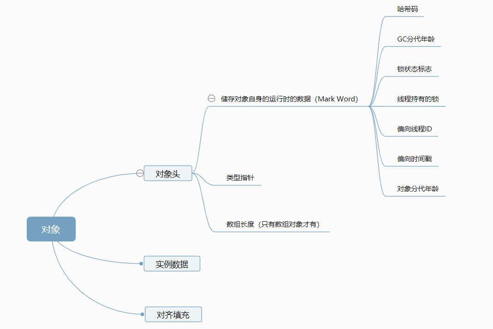

**Mark Word**默认存储对象的HashCode，分代年龄和锁标志位信息。这些信息都是与对象自身定义无关的数据，所以Mark Word被设计成一个非固定的数据结构以便在极小的空间内存存储尽量多的数据。它会根据对象的状态复用自己的存储空间，也就是说在运行期间Mark Word里存储的数据会随着锁标志位的变化而变化。

**Klass Point**：对象指向它的类元数据的指针，虚拟机通过这个指针来确定这个对象是哪个类的实例。

**Monitor：** Monitor可以理解为一个同步工具或一种同步机制，通常被描述为一个对象。每一个Java对象就有一把看不见的锁，称为内部锁或者Monitor锁。

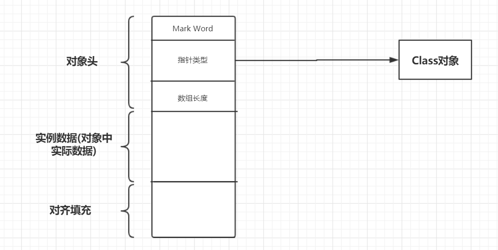


Monitor是线程私有的数据结构，每一个线程都有一个可用monitor record列表，同时还有一个全局的可用列表。每一个被锁住的对象都会和一个monitor关联，同时monitor中有一个Owner字段存放拥有该锁的线程的唯一标识，表示该锁被这个线程占用。

**synchronized通过Monitor来实现线程同步，Monitor是依赖于底层的操作系统的Mutex Lock（互斥锁）来实现的线程同步。**

阻塞或唤醒一个Java线程需要操作系统切换CPU状态来完成，这种状态转换需要耗费处理器时间。如果同步代码块中的内容过于简单，状态转换消耗的时间有可能比用户代码执行的时间还要长。

这种方式就是synchronized最初实现同步的方式，这就是JDK 6之前synchronized效率低的原因。这种依赖于操作系统Mutex Lock所实现的锁我们称之为“重量级锁”，JDK 6中为了减少获得锁和释放锁带来的性能消耗，引入了“**偏向锁”**和“**轻量级锁**”。

所以目前锁一共有4种状态，级别从低到高依次是：**无锁、偏向锁、轻量级锁和重量级锁**。**锁状态只能升级不能降级。**

通过上面的介绍，我们对synchronized的加锁机制以及相关知识有了一个了解，那么下面我们给出四种锁状态对应的的Mark Word内容，然后再分别讲解四种锁状态的思路以及特点：

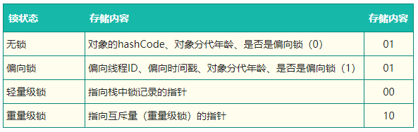

## 无锁

无锁没有对资源进行锁定，所有的线程都能访问并修改同一个资源，但同时只有一个线程能修改成功。

无锁的特点就是修改操作在循环内进行，线程会不断的尝试修改共享资源。如果没有冲突就修改成功并退出，否则就会继续循环尝试。如果有多个线程修改同一个值，必定会有一个线程能修改成功，而其他修改失败的线程会不断重试直到修改成功。上面我们介绍的CAS原理及应用即是无锁的实现。无锁无法全面代替有锁，但无锁在某些场合下的性能是非常高的。

## 偏向锁

**偏向锁是指一段同步代码一直被一个线程所访问，那么该线程会自动获取锁，降低获取锁的代价**。

在大多数情况下，锁总是由同一线程多次获得，不存在多线程竞争，所以出现了偏向锁。**其目标就是在只有一个线程执行同步代码块时能够提高性能。**

当一个线程访问同步代码块并获取锁时，会在Mark Word里存储锁偏向的线程ID。在线程进入和退出同步块时不再通过CAS操作来加锁和解锁，而是检测Mark Word里是否存储着指向当前线程的偏向锁。引入偏向锁是为了在无多线程竞争的情况下尽量减少不必要的轻量级锁执行路径，因为轻量级锁的获取及释放依赖多次CAS原子指令，而偏向锁只需要在置换ThreadID的时候依赖一次CAS原子指令即可。

偏向锁只有遇到其他线程尝试竞争偏向锁时，持有偏向锁的线程才会释放锁，线程不会主动释放偏向锁。偏向锁的撤销，需要等待全局安全点（在这个时间点上没有字节码正在执行），它会首先暂停拥有偏向锁的线程，判断锁对象是否处于被锁定状态。撤销偏向锁后恢复到无锁（标志位为“01”）或轻量级锁（标志位为“00”）的状态。

偏向锁在JDK 6及以后的JVM里是默认启用的。可以通过JVM参数关闭偏向锁：-XX:-UseBiasedLocking=false，关闭之后程序默认会进入轻量级锁状态。

## **轻量级锁**

是指当锁是偏向锁的时候，被另外的线程所访问，偏向锁就会升级为轻量级锁，其他线程会通过自旋的形式尝试获取锁，不会阻塞，从而提高性能。

在代码进入同步块的时候，如果同步对象锁状态为无锁状态（锁标志位为“01”状态，是否为偏向锁为“0”），虚拟机首先将在当前线程的栈帧中建立一个名为锁记录（Lock Record）的空间，用于存储锁对象目前的Mark Word的拷贝，然后拷贝对象头中的Mark Word复制到锁记录中。

拷贝成功后，虚拟机将使用CAS操作尝试将对象的Mark Word更新为指向Lock Record的指针，并将Lock Record里的owner指针指向对象的Mark Word。

如果这个更新动作成功了，那么这个线程就拥有了该对象的锁，并且对象Mark Word的锁标志位设置为“00”，表示此对象处于轻量级锁定状态。

如果轻量级锁的更新操作失败了，虚拟机首先会检查对象的Mark Word是否指向当前线程的栈帧，如果是就说明当前线程已经拥有了这个对象的锁，那就可以直接进入同步块继续执行，否则说明多个线程竞争锁。

若当前只有一个等待线程，则该线程通过自旋进行等待。但是当自旋超过一定的次数，或者一个线程在持有锁，一个在自旋，又有第三个来访时，轻量级锁升级为重量级锁。

## **重量级锁**

升级为重量级锁时，锁标志的状态值变为“10”，此时Mark Word中存储的是指向重量级锁的指针，此时等待锁的线程都会进入阻塞状态。

# 七、锁膨胀

锁膨胀的过程：


## **轻量级锁获取锁过程**

1. 在线程进入同步方法、同步块的时候，如果**同步对象锁状态为无锁状态(锁标志位为"01"状态，是否为偏向锁为"0")**，虚拟机首先将在当前线程的栈帧中**建立一个名为锁记录(Lock Recored)的空间**，用于储存锁对象目前的Mark Word的拷贝(官方把这份拷贝加了个Displaced前缀，即Displaced Mark Word)。


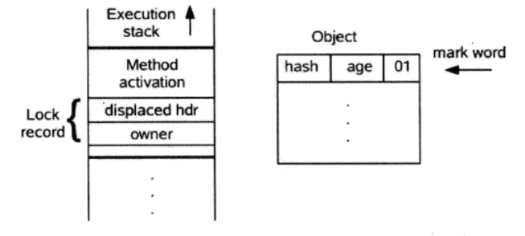


1. 将对象头的`Mark Word`拷贝到线程的锁记录(Lock Recored)中。
2. 拷贝成功后，虚拟机将使用`CAS`操作**尝试将对象的`Mark Word`更新为指向`Lock Record`的指针**。如果这个更新成功了，则执行步骤`4`，否则执行步骤`5`。
3. 更新成功，这个**线程就拥有了该对象的锁，并且对象Mark Word的锁标志位将转变为"00"，即表示此对象处于轻量级锁的状态。**。


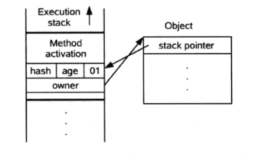


4. 更新失败，虚拟机首先会检查对象的`Mark Word`是否指向当前线程的栈帧，如果是就说明当前线程已经拥有了这个对象的锁，可以直接进入同步块继续执行，否则说明这个锁对象已经被其其它线程抢占了。**进行自旋执行步骤`3`，如果自旋结束仍然没有获得锁，轻量级锁就需要膨胀为重量级锁，锁标志位状态值变为"10"，Mark Word中储存就是指向`monitor`对象的指针，当前线程以及后面等待锁的线程也要进入阻塞状态。**


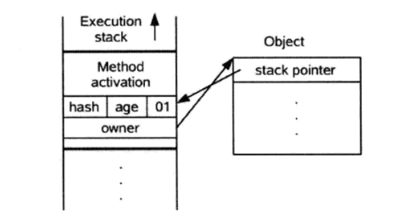


## **轻量级释放锁的过程**

1. 使用`CAS`操作将对象当前的`Mark Word`和线程中复制的`Displaced Mark Word`替换回来(依据`Mark Word`中锁记录指针是否还指向本线程的锁记录)，如果替换成功，则执行步骤`2`，否则执行步骤`3`。
2. 如果替换成功，整个同步过程就完成了，恢复到无锁的状态(01)。
3. 如果替换失败，说明有其他线程尝试获取该锁(此时锁已膨胀)，那就要在释放锁的同时，唤醒被挂起的线程。

## 偏向锁获取锁的过程

**获取锁的过程**：

1. 检查`Mark Word`是否为**可偏向锁的状态**，即是否偏向锁即为1即表示支持可偏向锁，否则为0表示不支持可偏向锁。
2. 如果是可偏向锁，则**检查`Mark Word`储存的线程`ID`是否为当前线程`ID`**，如果是则执行同步块，否则执行步骤`3`。
3. 如果检查到`Mark Word`的`ID`不是本线程的`ID`，则通过`CAS`操作去修改线程`ID`修改成本线程的`ID`，如果修改成功则执行同步代码块，否则执行步骤`4`。
4. 当拥有该锁的线程到达安全点之后，挂起这个线程，升级为轻量级锁。

## 偏向锁释放锁的过程

**锁释放的过程**：

1. 有其他线程来获取这个锁，偏向锁的释放采用了一种只有竞争才会释放锁的机制，线程是不会主动去释放偏向锁，需要等待其他线程来竞争。
2. 等待全局安全点(在这个是时间点上没有字节码正在执行)。
3. 暂停拥有偏向锁的线程，检查持有偏向锁的线程是否活着，如果不处于活动状态，则将对象头设置为无锁状态，否则设置为被锁定状态。如果锁对象处于**无锁状态，则恢复到无锁状态(01)**，以允许其他线程竞争，如果**锁对象处于锁定状态**，则挂起持有偏向锁的线程，并将对象头`Mark Word`的锁记录指针改成当前线程的锁记录，锁**升级为轻量级锁状态(00)**。


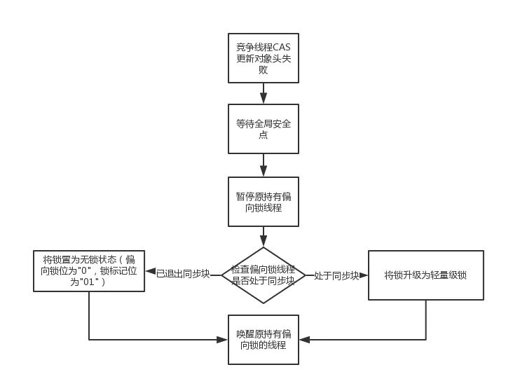

## 锁升级过程

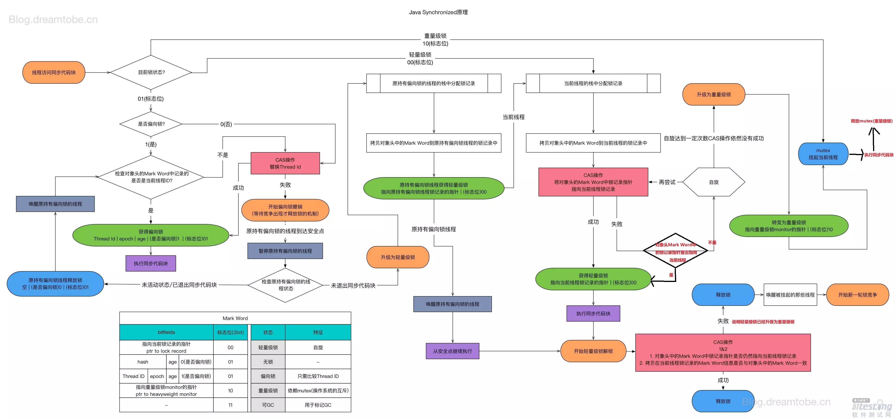


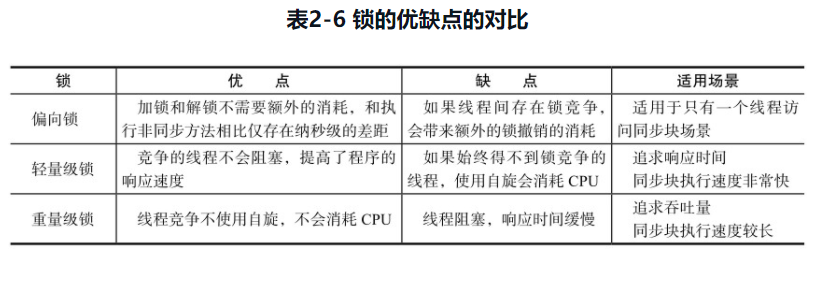


# 八、 AQS

## AQS 介绍

AQS：`AbstractQueneSynchronizer`抽象的队列式同步器。是除了java自带的synchronized关键字之外的锁机制。
AQS的全称为（AbstractQueuedSynchronizer），这个类在java.util.concurrent.locks包

> **AQS的核心思想**是，如果被请求的共享资源空闲，则将当前请求资源的线程设置为有效的工作线程，并将共享资源设置为锁定状态，如果被请求的共享资源被占用，那么就需要一套线程阻塞等待以及被唤醒时锁分配的机制，这个机制AQS是用CLH队列锁实现的，即将暂时获取不到锁的线程加入到队列中。
> CLH（Craig，Landin，and Hagersten）队列是一个虚拟的双向队列，虚拟的双向队列即不存在队列实例，仅存在节点之间的关联关系。
> **AQS是将每一条请求共享资源的线程封装成一个CLH锁队列的一个结点（Node），来实现锁的分配。**

**用大白话来说，AQS就是基于CLH队列，用volatile修饰共享变量state，线程通过CAS去改变状态符，成功则获取锁成功，失败则进入等待队列，等待被唤醒。**

**注意：AQS是自旋锁：在等待唤醒的时候，经常会使用自旋（while(!cas())）的方式，不停地尝试获取锁，直到被其他线程获取成功**

**实现了AQS的锁有：自旋锁、互斥锁、读锁写锁、条件产量、信号量、栅栏都是AQS的衍生物**

## AQS原理

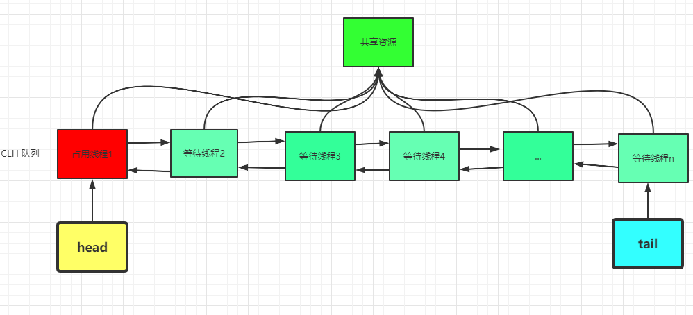

AQS维护了一个volatile int state和一个FIFO线程等待队列，多线程争用资源被阻塞的时候就会进入这个队列。state就是共享资源，其访问方式有如下三种：

> 1. getState();
> 2. setState();
> 3. compareAndSetState();

AQS 定义了两种资源共享方式：

> 1.**Exclusive**：独占，只有一个线程能执行，如ReentrantLock
> 2.**Share**：共享，多个线程可以同时执行，如Semaphore、CountDownLatch、ReadWriteLock，CyclicBarrier
>
> 不同的自定义的同步器争用共享资源的方式也不同。

**AQS底层使用了模板方法模式**： 

同步器的设计是基**于模板方法模式**的，如果需要自定义同步器一般的方式是这样（模板方法模式很经典的一个应用）：

1. 使用者继承AbstractQueuedSynchronizer并重写指定的方法。（这些重写方法很简单，无非是对于共享资源state的获取和释放）
2. 将AQS组合在自定义同步组件的实现中，并调用其模板方法，而这些模板方法会调用使用者重写的方法。
   这和我们以往通过实现接口的方式有很大区别，这是模板方法模式很经典的一个运用。

自定义同步器在实现的时候只需要实现共享资源state的获取和释放方式即可，至于具体线程等待队列的维护，AQS已经在顶层实现好了。自定义同步器实现的时候主要实现下面几种方法：

> 1. isHeldExclusively()：该线程是否正在独占资源。只有用到condition才需要去实现它。
> 2. tryAcquire(int)：独占方式。尝试获取资源，成功则返回true，失败则返回false。
> 3. tryRelease(int)：独占方式。尝试释放资源，成功则返回true，失败则返回false。
> 4. tryAcquireShared(int)：共享方式。尝试获取资源。负数表示失败；0表示成功，但没有剩余可用资源；正数表示成功，且有剩余资源
> 5. tryReleaseShared(int)：共享方式。尝试释放资源，如果释放后允许唤醒后续等待结点返回true，否则返回false。

以ReentrantLock为例（可重入独占式锁）：state初始化为0，表示未锁定状态，A线程lock()时，会调用tryAcquire()独占锁并将state+1。之后其他线程再想tryAcquire的时候就会失败，直到A线程unlock（）到state=0为止，其他线程才有机会获取该锁。A释放锁之前，自己也是可以重复获取此锁（state累加），这就是可重入的概念。
**注意：获取多少次锁就要释放多少次锁，保证state是能回到零态的。**

以CountDownLatch为例，任务分N个子线程去执行，state就初始化 为N，N个线程并行执行，每个线程执行完之后countDown() 一次，state就会CAS减一。当N子线程全部执行完毕，state=0，会unpark()主调用线程，主调用线程就会从await()函数返回，继续之后的动作。

一般来说，自定义同步器要么是独占方式，要么是共享方式，他们也只需实现tryAcquire、tryRelease、tryAcquireShared、tryReleaseShared中的一种即可。但AQS也支持自定义同步器同时**实现独占和共享两种方式，如ReentrantReadWriteLock。**
在acquire() 、acquireShared()两种方式下，线程在等待队列中都是忽略中断的，**acquireInterruptibly()/acquireSharedInterruptibly()是支持响应中断**的。

## **AQS的简单应用**

Mutex：不可重入互斥锁，锁资源（state）只有两种状态：0：未被锁定；1：锁定。

```java
class Mutex implements Lock, java.io.Serializable {
    // 自定义同步器
    private static class Sync extends AbstractQueuedSynchronizer {
        // 判断是否锁定状态
        protected boolean isHeldExclusively() {
            return getState() == 1;
        }

        // 尝试获取资源，立即返回。成功则返回true，否则false。
        public boolean tryAcquire(int acquires) {
            assert acquires == 1; // 这里限定只能为1个量
            if (compareAndSetState(0, 1)) {//state为0才设置为1，不可重入！
                setExclusiveOwnerThread(Thread.currentThread());//设置为当前线程独占资源
                return true;
            }
            return false;
        }

        // 尝试释放资源，立即返回。成功则为true，否则false。
        protected boolean tryRelease(int releases) {
            assert releases == 1; // 限定为1个量
            if (getState() == 0)//既然来释放，那肯定就是已占有状态了。只是为了保险，多层判断！
                throw new IllegalMonitorStateException();
            setExclusiveOwnerThread(null);
            setState(0);//释放资源，放弃占有状态
            return true;
        }
    }

    // 真正同步类的实现都依赖继承于AQS的自定义同步器！
    private final Sync sync = new Sync();

    //lock<-->acquire。两者语义一样：获取资源，即便等待，直到成功才返回。
    public void lock() {
        sync.acquire(1);
    }

    //tryLock<-->tryAcquire。两者语义一样：尝试获取资源，要求立即返回。成功则为true，失败则为false。
    public boolean tryLock() {
        return sync.tryAcquire(1);
    }

    //unlock<-->release。两者语文一样：释放资源。
    public void unlock() {
        sync.release(1);
    }

    //锁是否占有状态
    public boolean isLocked() {
        return sync.isHeldExclusively();
    }
}

```

同步类在实现时一般都将自定义同步器（sync）定义为内部类，供自己使用；而同步类自己（Mutex）则实现某个接口，对外服务。

# 九、 参考

1. [不可不说的Java“锁”事](https://tech.meituan.com/2018/11/15/java-lock.html)

2. 《深入理解Java虚拟机》

3. 《Java并发编程之美》

4. [深入分析synchronized原理和锁膨胀过程(二)](https://juejin.im/post/6844903805121740814)

5. https://blog.csdn.net/mulinsen77/article/details/84583716

   