# JVM 学习

今天终于决定要学学JVM了，一方面对于面试来说，这个是必考的，另一方面，深入了解jvm对于一个标准的java程序员来说，是很有必要的，知其然还要知其所以然。

# JVM的位置

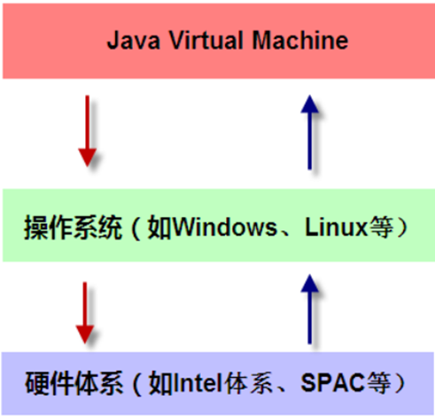

可以看到JVM是在操作系统之上的， 它与硬件没有直接的交互。

# JVM体系结构

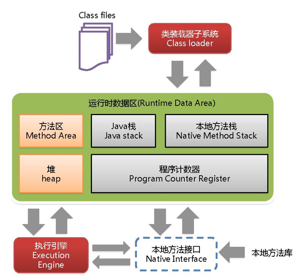

它分为上、中、下三层，类加载系统、运行时数据区，执行引擎。


# 类装载器ClassLoader

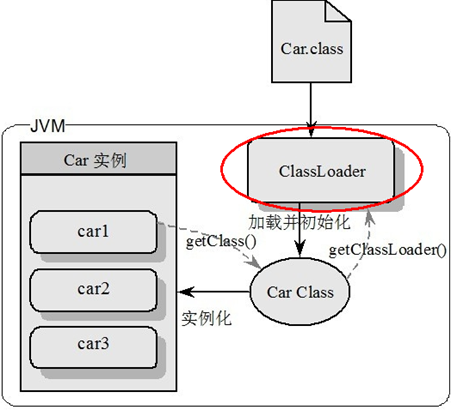

负责加载`class`文件，`class`文件在文件开头有**特定的文件标示**，将class文件字节码内容加载到内存中，并将这些内容转换**成方法区中的运行时数据结构**。并且`ClassLoader`只负责class文件的加载，至于它是否可以运行，则由`Execution Engine`决定 。

对于上面这段话，我们详细来理解一下。首先明确以下，类加载器只负责加载class文件，也就是java程序编译之后的字节码文件。这个字节码文件在文件开头有特定的文件标识，看下图：（cafe babe）。

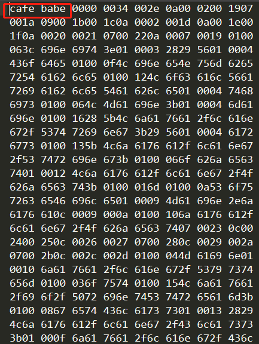

java的图标不就是一杯咖啡吗哈哈哈哈、、、

### 类的生命周期

当`java`源代码文件被`javac`编译成`class`文件后，并不能直接运行， 而是需要经过加载，连接和初始化这几个阶段后才能使用。 在使用完类或JVM被销毁后，JVM会将类卸载掉。 

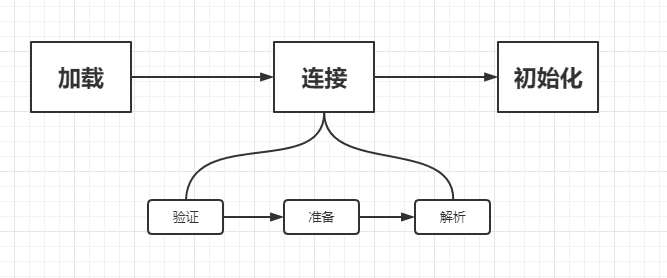

#### 类加载过程

类加载过程需要经过3个阶段:

1. 加载
2. 连接
3. 初始化

其中连接又可分为3个阶段: 验证 ， 准备 ， 解析。

##### 加载

**在加载阶段，类加载器将类的class文件的二进制数据读取到内存， 并保存到方法区，并在堆区生成该类的Class对象。**

通常有多种方式可以获取类的二进制数据:

- 通过javac编译器编译java源文件，读取在本地磁盘上生成的class文件。
- 从Jar，ZIP等归档文件中读取class文件。
- 通过网络读取类的字节流。
- 通过动态生成字节码的技术(如使用动态代理，cglib)来生成class。

##### 连接

1.验证 **验证阶段是为了确保类的字节流符合虚拟机规范，并且不会对虚拟机造成恶意损害。** JVM会对字节流进行如下验证:

- 文件格式验证:会验证class文件是否符合虚拟机规范，如是否以`0×CAFEBABE`开头， 主次版本号是否在虚拟机规定范围类，常量池中的类型是否有JVM不支持的类型。
- 元数据验证: 会对类的元信息进行语义分析，确保符合Java语法规范。
- 字节码验证: 通过分析数据流和控制流，确保类的方法体的程序语义是合法的， 符合逻辑的。
- 符号引用验证: 确保常量池中的符号引用能在解析阶段正常解析。

2.准备: 准备阶段会为类的静态变量初始化零值，如(0,0L,null,false).

3.解析: 解析阶段会将常量池中的符号引用转为直接引用。 符号引用包括类的全限定名，方法名和描述符，字段名和描述符。
直接引用是指向目标的指针，可以简单理解为目标的内存地址。

##### 初始化

> 初始化阶段是类加载过程的最后一个阶段。

在这个阶段,**只有主动使用类才会初始化类，总共有8种情况会涉及到主动使用类。**

1. 当jvm执行`new`指令时会初始化类，即当程序创建一个类的实例对象。
2. 当jvm执行`getstatic`指令时会初始化类，即程序访问类的静态变量(不是静态常量，常量归属于运行时常量池)。
3. 当jvm执行`putstatic`指令时会初始化类，即程序给类的静态变量赋值。
4. 当jvm执行`invokestatic`指令时会初始化类，即程序调用类的静态方法。
5. 当使用**反射**主动访问这个类时,也会初始化类,如Class.forname("..."),newInstance()等等。
6. 当初始化一个子类的时候，会先初始化这个子类的所有父类，然后才会初始化这个子类。
7. 当一个类是启动类时，即这个类拥有`main`方法，那么`jvm`会首先初始化这个类。
8. `MethodHandle`和`VarHandle`可以看作是轻量级的反射调用机制，而要想使用这2个调用， 就必须先使用`findStatic`/`findStaticVarHandle`来初始化要调用的类。

##### 使用

在类被初始化完成后，就可以使用类了。

##### 类的卸载

类被卸载(`Class`对象被`GC`掉)需要满足3个条件:

1. 该类的实例对象都已被`GC`，也就是说堆中不存在该类的实例对象。
2. 该类没有在其它任何地方被使用。
3. 加载该类的类加载器实例已被`GC`。

**在JVM的生命周期中，被JVM自带的类加载器所加载的类是不会被卸载的。 而被我们自定义的类加载器所加载的类是可能会被卸载的。**

```java

public class Main {

    public static void main(String[] args) {
        Object object = new Object();
        System.out.println(object.getClass().getClassLoader());
        Main m = new Main();
        System.out.println(m.getClass().getClassLoader());
        System.out.println(m.getClass().getClassLoader().getParent());
        System.out.println(m.getClass().getClassLoader().getParent().getParent());

    }
}

```

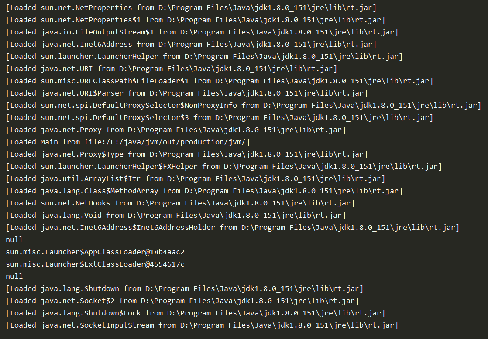

通过参数-XX:+TraceClassLoading 来打印类加载的信息。


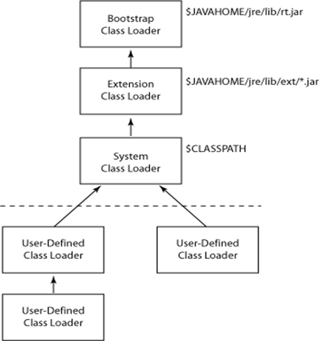

类加载有如下几类：

### 虚拟机自带的加载器

1. 启动类加载器（Bootstrap）C++， 用来加载jdk自带的类。

打开jdk， 里面有一个`jre`（`java runtime environment`）中 `rt.jar`文件，来看看里面是啥玩意：

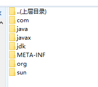

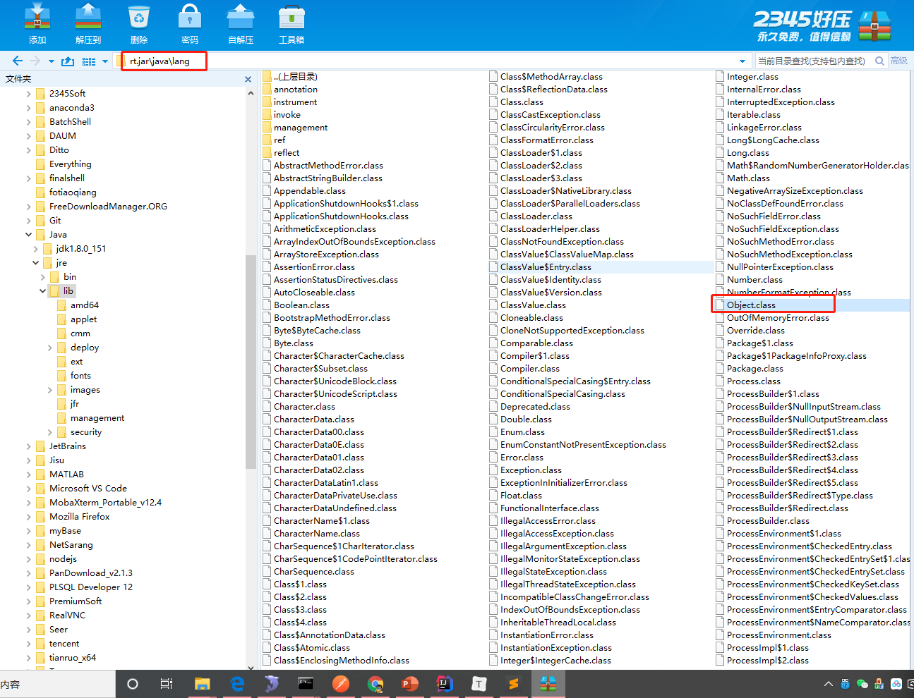

这里面其实就是我们平时使用的JDK自带的类库，包括`Object`类等。所以`Bootstrap`类加载器就是加载这些的，正是因为jvm已经帮我们加载好了这些类，我们才可以直接使用。

2. 扩展类加载器（Extension）Java： 首先要知道为啥有这个扩展类加载器，顾名思义就是加载扩展类的加载器，由于java是一门不断发展的语言，jdk也在快速的迭代，由java1.5， 1.6 然后1.8， 现在好像出了jdk14.。。。，还有就是java jdk中有很多以`javax`开头的包，在jre/lib/ext/*下的包就时使用扩展类加载器加载的。

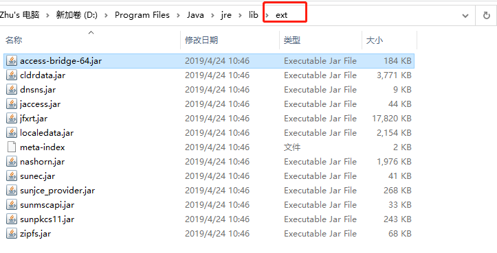


3. 应用程序类加载器（`AppClassLoader`）Java也叫系统类加载器，加载当前应用的classpath的所有类。也就是自己写的类。

```java
public class Main {

    public static void main(String[] args) {
        Object object = new Object();
        System.out.println(object.getClass().getClassLoader());
        Main m = new Main();
        System.out.println(m.getClass().getClassLoader());
        System.out.println(m.getClass().getClassLoader().getParent());
        System.out.println(m.getClass().getClassLoader().getParent().getParent());


    }
}
```

```java
null
sun.misc.Launcher$AppClassLoader@18b4aac2
sun.misc.Launcher$ExtClassLoader@4554617c
null
```

上面输出表示，`Object`的加载器是`null`表示是启动类加载器（`BootStrap`）。`sun.misc.Launcher`是`java`虚拟机的一个入口应用。

### 用户自定义加载器 

`Java.lang.ClassLoader`的子类，用户可以定制类的加载方式。

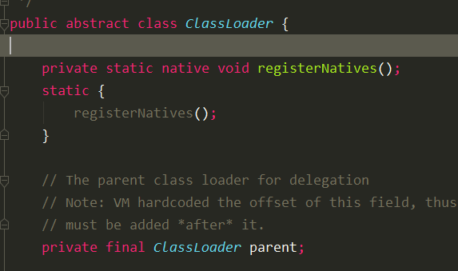


### 双亲委派机制

当一个类收到了类加载请求，他首先不会尝试自己去加载这个类，而是把这个请求委派给父类去完成，每一个层次类加载器都是如此，因此所有的加载请求都应该传送到启动类加载其中，只有当父类加载器反馈自己无法完成这个请求的时候（在它的加载路径下没有找到所需加载的Class），子类加载器才会尝试自己去加载。 

 双亲委派机制是指在加载一个类的时候，JVM会判断这个类是否已经被其类加载器加载过了。 如果已经加载过了，那么直接返回这个类。 **如果没有加载，就使用这个类对应的加载器的父类加载器判断， 一层一层的往上判断，最终会由BootstrapClassLoader判断。** 如果BootstrapClassLoader判断都没有加载这个类, **那么就由BootstrapClassLoader尝试加载。 如果BootstrapClassLoader加载失败了， 就由BootstrapClassLoader的子类加载器们加载。** 

```java
package java.lang;

/**
 * @author Hongliang Zhu
 * @create 2020-06-13 15:40
 */
public class String {
    public static void main(String[] args) {
        System.out.println("Hello");
    }
}
```

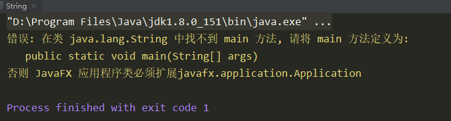

上面的自己写的`String`类，会一层一层向上去找父类加载器去加载，而`jdk`自带的就有`java.lang.String` 类，所以`jvm`会调用启动类加载器加载`java.lang.String`类，而这个类中没有main函数，随意会报错。所以双亲委派机制的作用是保证安全性，保证沙箱安全。防止原生类被覆盖。

总结： 采用双亲委派的一个好处是比如加载位于 `rt.jar` 包中的类 `java.lang.Object`，不管是哪个加载器加载这个类，最终都是委托给顶层的启动类加载器进行加载，这样就保证了使用不同的类加载器最终得到的都是同样一个 `Object`对象。 


# 参考

1.  https://guang19.github.io/framework-learning/gitbook_doc/jdk-jvm-juc 