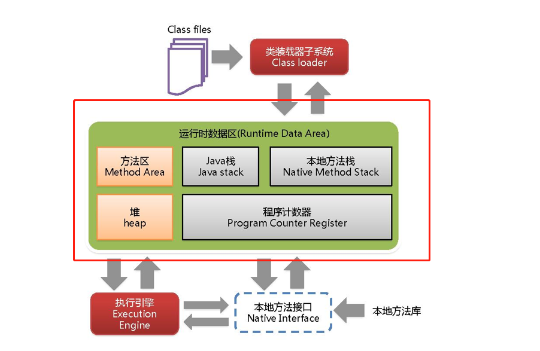

# 本地接口



我们所说的栈，指的是上面的java栈，而不是本地方法栈。。。

本地接口的作用是融合不同的编程语言为 Java 所用，它的初衷是融合 C/C++程序，Java 诞生的时候是 C/C++横行的时候，要想立足，必须有调用 C/C++程序，于是就在内存中专门开辟了一块区域处理标记为native的代码，它的具体做法是 Native Method Stack中登记 native方法，在Execution Engine 执行时加载native libraies。

 目前该方法使用的越来越少了，除非是与硬件有关的应用，比如通过Java程序驱动打印机或者Java系统管理生产设备，在企业级应用中已经比较少见。因为现在的异构领域间的通信很发达，比如可以使用 Socket通信，也可以使用Web Service等等，不多做介绍。

来看个例子。Thread类中的start()方法：

```java
    public synchronized void start() {
        /**
         * This method is not invoked for the main method thread or "system"
         * group threads created/set up by the VM. Any new functionality added
         * to this method in the future may have to also be added to the VM.
         *
         * A zero status value corresponds to state "NEW".
         */
        if (threadStatus != 0)  // 这个表示线程的状态
            throw new IllegalThreadStateException();

        group.add(this);

        boolean started = false;
        try {
            start0();
            started = true;
        } finally {
            try {
                if (!started) {
                    group.threadStartFailed(this);
                }
            } catch (Throwable ignore) {
                /* do nothing. If start0 threw a Throwable then
                  it will be passed up the call stack */
            }
        }
    }

    private native void start0();  // 本地方法
```

在一个Thread中，不能调用两次start方法，否则会报错：`Exception in thread "main" java.lang.IllegalThreadStateException`。 在调用start方法，实际上调用的是start0() 方法，看上面的源代码，`start0（）`是一个native方法，native方法表示这哥不归java语言本身管了，需要调用外部的方法，比如是C语言写的方法，native方法存放在本地方法栈里面，普通方法的调用存放在java栈里面。

它的具体做法是Native Method Stack中登记native方法，在Execution Engine 执行时加载本地方法库。

`native`是一个关键字，有声明，无实现。一个方法标记成native表示这个函数是去调用C语言的函数库，第三方的函数库。native方法的运行和装载是在本地方法栈中装载和运行的。


# 程序计数器

每个线程都有一个程序计数器，是线程私有的, 就是一个指针，指向方法区中的方法字节码（用来存储指向下一条指令的地址,也即将要执行的指令代码），由执行引擎读取下一条指令，是一个非常小的内存空间，几乎可以忽略不计。

这块内存区域很小，它是当前线程所执行的字节码的行号指示器，字节码解释器通过改变这个计数器的值来选取下一条需要执行的字节码指令。

如果执行的是一个`Native`方法**，那这个计数器是空的**。

用以完成分支、循环、跳转、异常处理、线程恢复等基础功能。不会发生内存溢出(OutOfMemory=OOM)错误。

