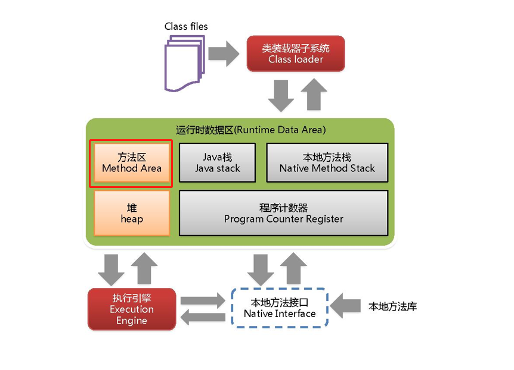
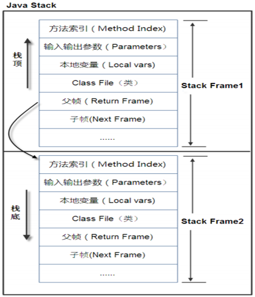
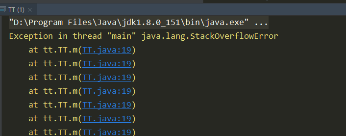
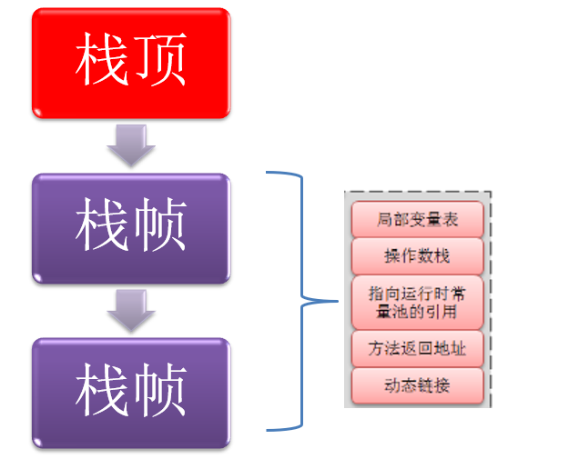
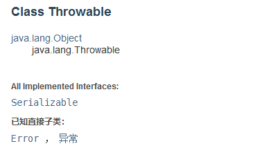
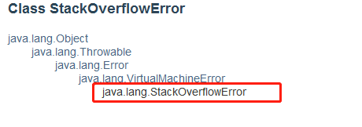

# **Method Area** **方法区**

在`jvm01`中，谈到了类加载， 类加载器 负责加载`class`文件，`class`文件在文件开头有特定的文件标示，将`class`文件字节码内容加载到内存中，并将这些内容**转换成方法区中**的运行时**数据结构**  。

注意上面说的方法区和数据结构。所谓方法区，里面供各线程共享的运行时内存区域。它存储了每一个类的**结构信息**，这个结构信息也就是class模板。例如运行时常量池（Runtime Constant Pool）、字段和方法数据、构造函数和普通方法的**字节码内容**。上面讲的是**规范**，在不同虚拟机里头实现是不一样的，最典型的就是永久代(`PermGen space`)和元空间(`Metaspace`)。

这里理解一下，啥是永久代，啥又是元空间，懵逼。。。这个考科一这样理解，上面说到这个方法区是个规范，在不同虚拟机里头实现是不一样的，相当于多态的思想。

如：

```java
方法区 f = new 永久代() // java7
方法区 f = new 元空间() // java8
```



上图中，运行时数据区中亮色的是有GC的，灰色的不存在GC且线程私有。**实例变量存在堆内存中,和方法区无关**。

**总结： 方法区：1. 存储了每一个类的结构信息。 2. 方法区是规范，不同的虚拟机有不同的实现。**

-------------


# 栈Stack

> 记住一句话： 栈管运行，堆管存储。

栈也叫栈内存，主管`Java`程序的**运行**，是在线程创建时创建，它的生命期是跟随线程的生命期，线程结束栈内存也就释放，**对于栈来说不存在垃圾回收问题**，只要线程一结束该栈就Over，生命周期和线程一致，是线程私有的。**8种基本类型的变量+对象的引用变量+实例方法**都是在函数的栈内存中分配。  

## 栈存储什么

栈帧中主要保存3 类数据：

1. 本地变量（`Local Variables`）:输入参数和输出参数以及方法内的变量；

2. 栈操作（`Operand Stack`）:记录出栈、入栈的操作；

3. 栈帧数据（`Frame Data`）:包括类文件、方法等等。

```java
  public int getsss(int x, int y){
        int result = x+y;
        return result;
    }
```

x, y ,result 就是输入参数， 方法内的变量。


## 栈运行原理

栈中的数据都是以栈帧（`Stack Frame`）的格式存在，栈帧是一个**内存区块**，是一个数据集，是一个有关方法(Method)和运行期数据的数据集，当一个方法A被调用时就产生了一个栈帧 F1，并被压入到栈中，

A方法又调用了 B方法，于是产生栈帧 F2 也被压入栈，

B方法又调用了 C方法，于是产生栈帧 F3 也被压入栈，

……

执行完毕后，先弹出F3栈帧，再弹出F2栈帧，再弹出F1栈帧……

遵循“先进后出”/“后进先出”原则。

每个方法执行的同时都会创建一个栈帧，用于存储局部变量表、操作数栈、动态链接、方法出口等信息，每一个方法从调用直至执行完毕的过程，就对应着一个栈帧在虚拟机中入栈到出栈的过程。栈的大小和具体`JVM`的实现有关，通常在256K~756K之间,与等于1Mb左右。



图示在一个栈中有两个栈帧：栈帧 2是最先被调用的方法，先入栈，然后方法 2 又调用了方法1，栈帧 1处于栈顶的位置，栈帧 2 处于栈底，执行完毕后，依次弹出栈帧 1和栈帧 2，线程结束，栈释放。 

每执行一个方法都会产生一个栈帧，保存到栈(后进先出)的**顶部，顶部栈就是当前的方法，该方法执行完毕 后会自动将此栈帧出栈。**


##      StackOverflowError  

```
public class TT {
    public static void main(String[] args) {
        m();

    } 
    public static void m(){
        m();
    }
}
```









所以，StackOverflowerror是一个Error。

## 堆、栈、方法区的关系


引用在栈中，`new`出来的实例对象在堆中。模板在方法区。

`HotSpot`是使用指针的方式来访问对象：

`Java`堆中会存放访问**类元数据**的地址，（元数据： 描述数据的数据，也就是类的模板，模板在方法区中，堆中会访问方法区模板的地址，根据模板来生成不同的实例对象）

`reference`存储的就直接是对象的地址。


