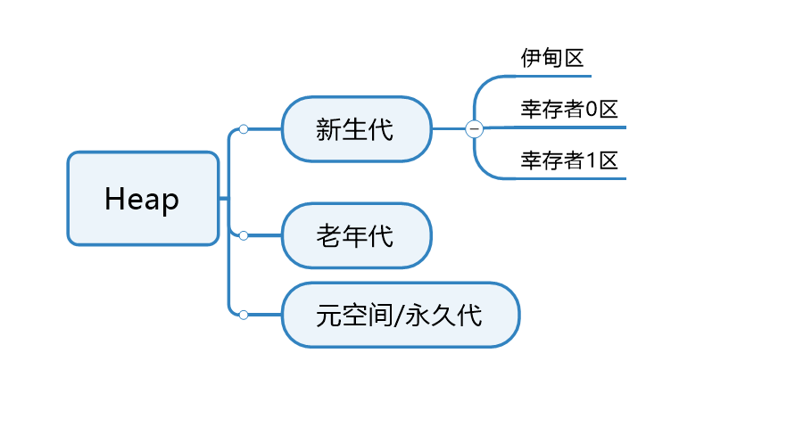
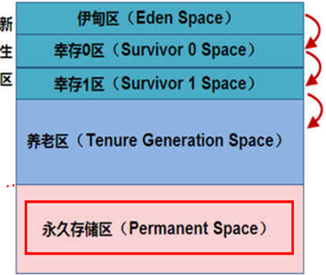
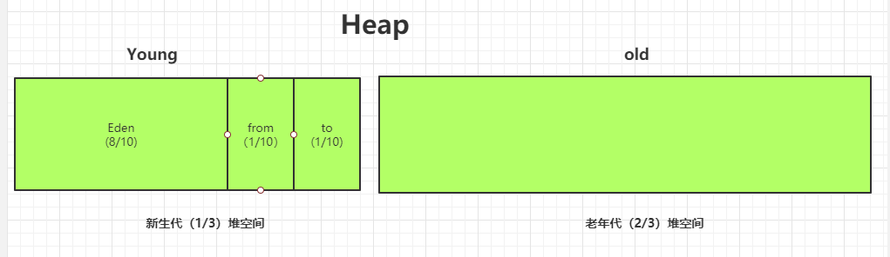
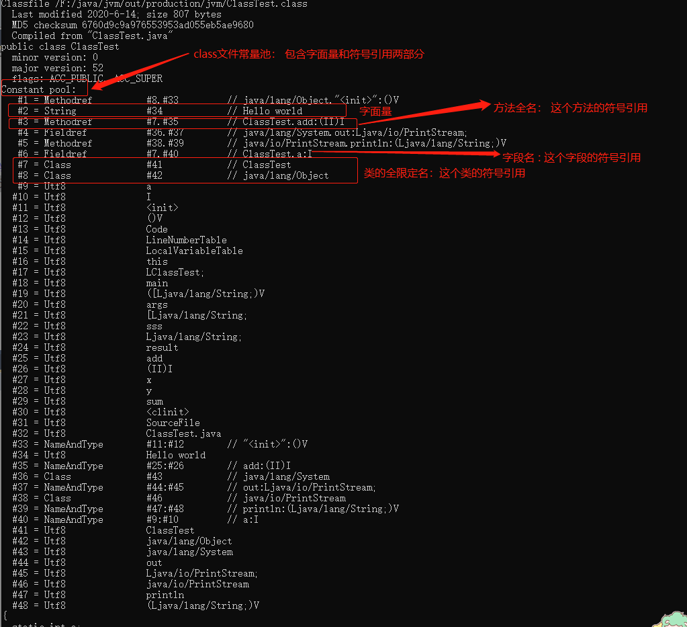

#      Heap 堆  

 **堆是JVM中内存占用最大的一块区域，它是所有线程共享的一块区域。 堆的作用是为对象分配内存并存储和回收它们。 堆是垃圾回收的主要区域，所以堆区也被成为GC堆。** 

一个`JVM`实例只存在一个堆内存，堆内存的大小是可以调节的。类加载器读取了类文件后，需要把类、方法、常变量放到堆内存中，保存所有引用类型的真实信息，以方便执行器执行，堆内存分为三部分 ：



堆区可以划分为新生代、老年代、永久代(java7)/元空间(java8)。元空间保存的是类的元数据信息，所谓元数据口哈斯描述数据的数据，这里指的是类元数据，而就是说保存的是类的描述信息，即类的结构信息。

新生代可以继续划分为伊甸园区(Eden区)，幸存者0区（Survivor 0【from】），幸存者1区(survivor 1 【to】)。

在默认情况下，新生代栈堆区的1/3, 老年代占堆区的2/3。 Eden区栈新生代的80%，Survivor区占20%， 其中`from`和to`比例`为1:1

> (通过`-XX:NewRatio`参数可以调整新生代和老年代的空间占比) 
>
> (通过`-XX:SurvivorRatio`参数可以调整`eden`和`survivor`的空间占比) 


# Java7之前

堆内存**逻辑**上分为三部分：新生+养老+永久，物理上由新生+养老区



新生区是类的诞生、成长、消亡的区域，一个类在这里产生，应用，最后被垃圾回收器收集，结束生命。新生区又分为两部分： 伊甸区（`Eden space`）和幸存者区（`Survivor pace`） ，所有的类都是在伊甸区被`new`出来的。幸存区有两个： 0区（`Survivor 0 space`）和1区（`Survivor 1 space`）。当伊甸园的空间用完时，程序又需要创建对象，JVM的垃圾回收器将对伊甸园区进行垃圾回收(`Minor GC`)，将伊甸园区中的不再被其他对象所引用的对象进行销毁。然后将伊甸园中的剩余对象移动到幸存 0区。若幸存 0区也满了，再对该区进行垃圾回收，然后移动到 1 区。那如果1 区也满了呢？再移动到养老区。若养老区也满了，那么这个时候将产生`MajorGC`（`FullGC`），进行养老区的内存清理。若养老区执行了`Full GC`之后发现依然无法进行对象的保存，就会产生`OOM`异常“`OutOfMemoryError`”。

> 如果出现`java.lang.OutOfMemoryError: Java heap space`异常，说明`Java`虚拟机的堆内存不够。原因有二：
>
> （1）Java虚拟机的堆内存设置不够，可以通过参数-Xms、-Xmx来调整。
>
> （2）代码中创建了大量大对象，并且长时间不能被垃圾收集器收集（存在被引用）。


 **发生在新生代的GC叫做Young GC或Minor GC, 发生在老年代的GC叫做Old GC或Major GC** 

在java8之后，**永久区换成了元空间**。其他不变、

永久区(`java7`之前有)

 永久存储区是一个常驻内存区域，用于存放`JDK`自身所携带的 Class,Interface 的元数据，也就是说它存储的是运行环境必须的类信息，被装载进此区域的数据是不会被垃圾回收器回收掉的，关闭 JVM 才会释放此区域所占用的内存。

实际而言，方法区（Method Area）和堆一样，是各个线程共享的内存区域，它用于存储虚拟机加载的：类信息+普通常量+静态常量+编译器编译后的代码等等，**虽然JVM规范将方法区描述为堆的一个逻辑部分，但它却还有一个别名叫做Non-Heap(非堆)，目的就是要和堆分开。**

 对于`HotSpot`虚拟机，很多开发者习惯将方法区称之为“永久代(Parmanent Gen)” ，但严格本质上说两者不同，或者说使用永久代来实现方法区而已，永久代是方法区(相当于是一个接口interface)的一个实现，jdk1.7的版本中，已经将原本放在永久代的字符串常量池移走。



------------


# JVM常量池

Jvm常量池分为:

1. Class常量池(静态常量池)
2. 运行时常量池
3. 字符串常量池(全局常量池)
4. 包装类型缓存池


## Class常量池(静态常量池)

当Java源文件被编译后，就会生成Class字节码文件。

**Class常量池就存在于Class文件中(Class文件的Constant Pool中)。**

**Class文件常量池主要存放两大常量:字面量和符号引用。**

1. 字面量: 字面量分为文本字符串(如: "abc",1等)和用final修饰的成员变量(实例变量和静态变量)
2. 符号引用: 符号引用包括三种：类的全限定名，方法名和描述符，字段名和描述符。

```java
/**
 * @author Hongliang Zhu
 * @create 2020-06-14 16:35
 */
public class ClassTest {
    static int a = 10;
    public static void main(String[] args) {
        String sss = "Hello world";

        int result = add(2,3);
        System.out.println(sss);
      
    }

    public static int add(int x, int y){
        int sum = x + y;
        return sum;
    }

}

```

使用命令：javap  -v ClassTest.class 反编译



## 运行时常量池

运行是常量池是在**类加载阶段**，将`class`二进制数据加载到内存， 并将数据保存到方法区,其中`class`文件中的常量池将保存到 运行时常量池(**数据都在方法区，常量池肯定也在方法区**)。 也就是说一个Class文件常量池对应一个运行时常量池。

## 字符串常量池(全局常量池)

字符串常量池在`jdk7`之前都是存于永久代(永久代)之中, jdk7以后存于 **堆区**之中。

## 包装类型缓存池

包装类缓存池并不是所有的包装类都有，并且缓存池缓存的是一定范围内的数据。 拥有包装类型缓存池的类有:`Integer`,`Byte`,`Character`,`Long`,`Short`， 而`Float`，`Double`，`Boolean`都不具有缓存池。

**包装类的缓存池缓存的范围基本都为: -128 - 127之间， Character的缓存范围为 0 - 127(也就是全部字符都缓存了-对应的ASCII码表）。**

```properties
boolean values true and false        //布尔类型中的两个取值  true和false
all byte values                    //byte类型所有数据，即-128～127
short values between -128 and 127    //short类型大小范围-128~127
char in the range \u0000 to \u007F   //char类型所有数据，即所有字符
```


# 参考

1.  https://guang19.github.io/framework-learning/gitbook_doc/jdk-jvm-juc 