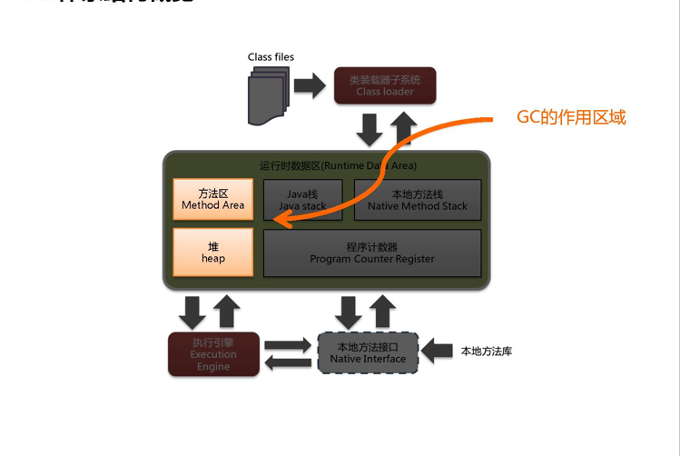
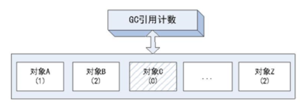
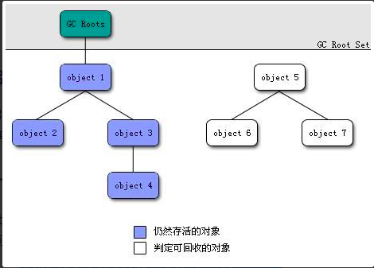

 垃圾收集主要是针对**堆和方法区**进行。程序计数器、虚拟机栈和本地方法栈这三个区域属于线程私有的，只存在于线程的生命周期内，线程结束之后就会消失，因此不需要对这三个区域进行垃圾回收。

# 概述


在次数上频繁收集发生在`young`区，在次数上较少收集发生在`old`区。在元空间/永久代基本不动。

`JVM`在进行`GC`时，并非每次都对上面三个内存区域一起回收的，大部分时候回收的都是指新生代。因此`GC`按照回收的区域又分了两种类型，一种是普通GC（`minor GC`），一种是全局GC（`major GC or Full GC`）

> `Minor GC`和`Full GC`的区别：
> 　　普通GC（`minor GC`）：只针对新生代区域的`GC`，指发生在新生代的垃圾收集动作，因为大多数`Java`对象存活率都不高，所以`Minor GC`非常频繁，一般回收速度也比较快。 
> 　　全局GC（`major GC or Full GC`）：指发生在老年代的垃圾收集动作，出现了`Major GC`，经常会伴随至少一次的`Minor GC`（但并不是绝对的）。`Major GC`的速度一般要比`Minor GC`慢上10倍以上 ，因为收集的区域较大。

# 判断对象是否存活

在垃圾回收器对堆内存回收前，需要判断对象是否存活。

- 引用计数算法: 给每个对象添加一个引用计数器,每当对象被引用,，对象的引用计数器就加1,当引用失效时，引用计数器就减1。 直到引用计数器为0,就代表对象不再被引用。
- 可达性算法: 通过`GC ROO`T的对象节点往下搜索，节点走过的路径被称为**引用链**。 如果一个对象不处于任何引用链，那么就可以判断此对象是不可达的。

## 引用计数法

为对象添加一个引用计数器，当对象增加一个引用时计数器加 1，引用失效时计数器减 1。引用计数为 0 的对象可被回收。

在两个对象出现**循环引用**的情况下，此时引用计数器永远不为 0，导致无法对它们进行回收。正是因为**循环引用**的存在，因此 `Java` 虚拟机不使用引用计数算法。而且每次对对象赋值时都需要维护一个引用计数器，且计数器本身也有一定的消耗。



下面的代码来自《深入理解Java虚拟机》 第三版中：

```jva
package com.atguigu.jvm;
 
 
/**@Description:-verbose:gc*/
public class RefCountGC
{
  private byte[] bigSize = new byte[2 * 1024 * 1024];//这个成员属性唯一的作用就是占用一点内存
  Object instance = null;
 
  public static void main(String[] args)
  {
    RefCountGC objectA = new RefCountGC();
    RefCountGC objectB = new RefCountGC();
    objectA.instance = objectB;
    objectB.instance = objectA;
    objectA = null;
    objectB = null;
 
    System.gc();
  }
}
 

```

上面代码中，`objectA`和`objectB`引用的对象实例互相持有了对象的引用，因此把`objectA`和`objectB`的引用去除后，由于两个对象之间还存在相互的引用，所以就无法回收这两个`RefCountGC`对象。

## 可达性分析算法

 

通过`GC ROOT`的对象节点往下搜索，节点走过的路径被称为**引用链**。 如果一个对象不处于任何引用链，那么就可以判断此对象是不可达的。

以 `GC Roots` 为起始点进行搜索，可达的对象都是存活的，不可达的对象可被回收。

`Java` 虚拟机使用该算法来判断对象是否可被回收，`GC Roots` 一般包含以下内容：

- 虚拟机栈中**局部变量表中引用的对象**（stack）
- 本地方法栈中 `JNI` （ `Java Native Interface` ）中引用的对象
- 方法区中类静态属性引用的对象（static）
- 方法区中的常量引用的对象 （finnal）
- Java虚拟机内部的引用，如基本数据类型对应的Class对象，一些常驻的异常对象（比如NullPointExcepiton、OutOfMemoryError）等，还有系统类加载器。
- 所有被同步锁（`synchronized`关键字）持有的对象。

# 方法区的回收【见jvm01】

因为方法区主要存放永久代对象，而永久代对象的回收率比新生代低很多，所以在方法区上进行回收性价比不高。

**主要是对常量池的回收和对类的卸载**。

为了避免内存溢出，在大量使用反射和动态代理的场景都需要虚拟机具备类卸载功能。

类的卸载条件很多，需要满足以下三个条件，并且满足了条件也不一定会被卸载：

- 该类所有的实例都已经被回收，此时堆中不存在该类的任何实例。
- 加载该类的 ClassLoader 已经被回收。
- 该类对应的 Class 对象没有在任何地方被引用，也就无法在任何地方通过反射访问该类方法。

# 四大引用类型

无论是通过引用计数算法判断对象的引用数量，还是通过可达性分析算法判断对象是否可达，判定对象是否可被回收都与引用有关。

Java 提供了四种强度不同的引用类型。

## 强引用

被强引用关联的对象不会被回收。使用 new 一个新对象的方式来创建强引用。

```java
Object obj = new Object();
```

## 软引用

被软引用关联的对象只有在内存不够的情况下才会被回收。使用 `SoftReference` 类来创建软引用。

```java
Object obj = new Object();
SoftReference<Object> sf = new SoftReference<Object>(obj);
obj = null;  // 使对象只被软引用关联
```

## 弱引用

**被弱引用关联的对象一定会被回收**，也就是说它只能存活到下一次垃圾回收发生之前。使用 `WeakReference` 类来创建弱引用。

```java
Object obj = new Object();
WeakReference<Object> wf = new WeakReference<Object>(obj);
obj = null;
```

## 虚引用

又称为幽灵引用或者幻影引用，一个对象是否有虚引用的存在，不会对其生存时间造成影响，也无法通过虚引用得到一个对象。

为一个对象设置虚引用的唯一目的是能在这个对象被回收时收到一个系统通知。

使用 `PhantomReference` 来创建虚引用。

```java
Object obj = new Object();
PhantomReference<Object> pf = new PhantomReference<Object>(obj, null);
obj = null;
```


# 垃圾收集算法

常见的垃圾回收算法主要有以下4种:

1. 复制算法（copying）
2. 标记-清除算法
3. 标记-整理算法
4. 分代收集算法

## 复制算法

新生代使用的`GC`是`Minor GC`，这一个阶段主要使用的是复制算法来进行垃圾回收。

`Minor GC`会把`Eden`中的所有活的对象都移到`Survivor`区域中，如果`Survivor`区中放不下，那么剩下的活的对象就被移到`Old  generation`中，也即一旦收集后，`Eden`是就变成空的了。

当对象在 `Eden` ( 包括一个 `Survivor` 区域，这里假设是 `from` 区域 ) 出生后，在经过一次 `Minor GC` 后，如果对象还存活，并且能够被另外一块 `Survivor` 区域所容纳( 上面已经假设为 `from` 区域，这里应为 `to` 区域，即 `to` 区域有足够的内存空间来存储 `Eden` 和 `from` 区域中存活的对象 )，则使用**复制算法**将这些仍然还存活的对象复制到另外一块 `Survivor` 区域 ( 即 `to` 区域 ) 中，然后清理所使用过的 `Eden` 以及 `Survivor` 区域 ( 即 `from` 区域 )，并且将这些对象的年龄设置为1，以后对象在 `Survivor` 区每熬过一次 `Minor GC`，就将对象的年龄 + 1，当对象的年龄达到某个值时 ( 默认是 15 岁，通过-XX:MaxTenuringThreshold 来设定参数)，这些对象就会成为**老年代**。

> -XX:MaxTenuringThreshold — 设置对象在新生代中存活的次数

`HotSpot JVM`把年轻代分为了三部分：1个`Eden`区和2个`Survivor`区（分别叫from和to）。默认比例为8:1:1,一般情况下，新创建的对象都会被分配到Eden区(一些大对象特殊处理)，这些对象经过第一次Minor GC后，如果仍然存活，将会被移到Survivor区。对象在Survivor区中每熬过一次Minor GC，年龄就会增加1岁，当它的年龄增加到一定程度时，就会被移动到年老代中。因为年轻代中的对象基本都是朝生夕死的(90%以上)，**所以在年轻代的垃圾回收算法使用的是复制算法，**复制算法的基本思想就是将内存分为两块（from 、 to。 伊甸+from的copy到to中），每次只用其中一块，当这一块内存用完，就将还活着的对象复制到另外一块上面。**复制算法不会产生内存碎片**。

**所以复制算法总结起来就是： 将堆内存分为2块大小相等的内存空间， 每次只使用其中的一块内存，另一块则空闲。 当其中一块内存使用完后， 就将仍然存活的对象复制到另一块空闲内存空间，再清理已使用的内存。** 


 `HotSpot` 虚拟机的 `Eden` 和 `Survivor` 大小比例默认为 8:1，保证了内存的利用率达到 90%。如果每次回收有多于 10% 的对象存活，那么一块 `Survivor` 就不够用了，此时需要依赖于老年代进行空间分配担保，也就是借用老年代的空间存储放不下的对象。 

### 缺点

复制算法它的缺点也是相当明显的。 
　　1、它浪费了一半的内存，这太要命了。  只使用了内存的一半。 
　　2、如果对象的存活率很高，我们可以极端一点，假设是100%存活，那么我们需要将所有对象都复制一遍，并将所有引用地址重置一遍。复制这一工作所花费的时间，在对象存活率达到一定程度时，将会变的不可忽视。 所以从以上描述不难看出，复制算法要想使用，最起码对象的存活率要非常低才行，而且最重要的是，我们必须要克服50%内存的浪费。

## 标记-清除算法(Mark-Sweep)

标记-清除算法分为2个步骤：标记和清除。

首先标记出所有可达(存活)的对象，在标记完成后， 统一回收所有未被标记(不可达)的对象。

在标记阶段，程序会检查每个对象是否为活动对象，如果是活动对象，则程序会在对象头部打上标记。

在清除阶段，会进行对象回收并取消标志位，另外，还会判断回收后的分块与前一个空闲分块是否连续，若连续，会合并这两个分块。回收对象就是把对象作为分块，连接到被称为 “空闲链表” 的单向链表，之后进行分配时只需要遍历这个空闲链表，就可以找到分块。

在分配时，程序会搜索空闲链表寻找空间大于等于新对象大小 size 的块 block。如果它找到的块等于 size，会直接返回这个分块；如果找到的块大于 size，会将块分割成大小为 size 与 (block - size) 的两部分，返回大小为 size 的分块，并把大小为 (block - size) 的块返回给空闲链表。


用通俗的话解释一下标记清除算法，就是当程序运行期间，若可以使用的内存被耗尽的时候，GC线程就会被触发并将程序暂停，随后将要回收的对象标记一遍，最终统一回收这些对象，完成标记清理工作接下来便让应用程序恢复运行。

标记：从引用根节点开始标记遍历所有的`GC Roots`， 先标记出要回收的对象。

清除：遍历整个堆，把标记的对象清除。 

**标记-清除算法一般用于老年代。** 因为老年代中的对象存活率较高，几乎很少被回收， 所以标记-清除和标记-整理算法`GC`的时间不会太长， `GC`的对象相比新生代更少。 

### 缺点

  缺点：此算法需要暂停整个应用，会产生内存碎片 。

- 标记和清除过程效率都不高；
- 会产生大量不连续的内存碎片，导致无法给大对象分配内存。 **对象在内存中的分布可能是不连续的，分散的，标记-清除后可能造成不连续的内存碎片。** 当内存碎片过多后，后续想要分配较大的对象时，无法找到足够大的内存碎片， 可能又需要触发`GC`。 


## 标记-整理算法(Mark-Compact)


 标记-整理算法是对标记-清除算法的一种改进。 

标记-整理算法与标记-清除算法的在标记阶段是相同的， 都是首先标记出所有可达(存活)的对象。 但**标记之后并不直接清理未被标记(不可达)的对象， 而是使被标记(存活)的对象向内存一端移动，然后清理掉这一端外的内存。**

**标记-整理算法的优点是: 几乎不会如标记-清除算法那样产生不连续的内存碎片。 但，所谓慢工出细活，标记-整理的效率是比标记-清除要低的。**

**标记-整理算法和标记-清除算法一样，一般用于老年代。**


## 分代收集

现在的商业虚拟机采用分代收集算法，它根据对象存活周期将内存划分为几块，不同块采用适当的收集算法。

一般将堆分为新生代和老年代。

- 新生代使用：复制算法
- 老年代使用：标记 - 清除 或者 标记 - 整理 算法

### 年轻代(Young Gen)  

年轻代特点是区域相对老年代较小，对像存活率低。

这种情况复制算法的回收整理，速度是最快的。复制算法的效率只和当前存活对象大小有关，因而很适用于年轻代的回收。而复制算法内存利用率不高的问题，通过`hotspot`中的两个`survivor`的设计得到缓解。

### 老年代(Tenure Gen)

老年代的特点是区域较大，对象存活率高。

这种情况，存在大量存活率高的对象，复制算法明显变得不合适。一般是由标记清除或者是标记清除与标记整理的混合实现。

`Mark`阶段的开销与存活对象的数量成正比，这点上说来，对于老年代，标记清除或者标记整理有一些不符，但可以通过**多核/线程利用**，对并发、并行的形式提标记效率。

`Sweep`阶段的开销与所管理区域的大小成正相关，但Sweep“就地处决”的特点，回收的过程没有对象的移动。使其相对其它有`对像`移动步骤的回收算法，仍然是效率最好的。但是需要解决内存碎片问题。

`Compact`阶段的开销与存活对象的数据成开比，如上一条所描述，对于大量对象的移动是很大开销的，做为老年代的第一选择并不合适。

基于上面的考虑，老年代一般是由标记清除或者是标记清除与标记整理的混合实现。以hotspot中的CMS回收器为例，CMS是基于Mark-Sweep实现的，对于对象的回收效率很高，而对于碎片问题，CMS采用基于Mark-Compact算法的Serial Old回收器做为补偿措施：当内存回收不佳（碎片导致的`Concurrent Mode Failure`时），将采用Serial Old执行Full GC以达到对老年代内存的整理。

----------

## 内存分配与垃圾回收策略

1. 对象优先在`eden`区域被分配
2. 大对象将直接进入老年代 (大对象是指需要大量连续的内存空间的对象，如长字符串，大数组等。)
3. 长期存活的对象将进入老年代


## 总结：一次GC的过程

首先堆分为新生代，老年代，新生代又分为伊甸区和两个幸存者区（from， to）。

对象优先在eden区被分配，当`eden`区内存不足时， `JVM`发起`Minor GC`。`Minor GC`的范围包括`eden`和`From Survivor`:

首先`JVM`会根据可达性算法标记出所有存活的对象。

如果存活的对象中，有的对象的年龄已经达到晋升阈值 (阈值是动态计算的，可以通过-XX:MaxTenuringThreshold设置最大年龄阈值)， 那么将已经达到阈值的对象复制到老年代中。

如果`To Survivor`空间不足以存放剩余存活对象， 则直接将存活的对象提前复制到老年代。 如果老年代也没有足够的空间存放存活的对象， 那么将触发`Full GC`(GC整个堆，包括新生代和老年代)。

如果`To Survivor`可以存放存活的对象， 那么将对象复制到`To Survivor`空间，并清理`eden`和`From Survivor`。

此时`From Survivor`为空， 那么`From Survivor`就成为了下一次的`To Survivor`， 此时`To Survivor`存放着存活的对象，就成为了下一次的`From Survivor`。 这样`From Survivor`与`To Survivor`就是不断交替复制的使用。

**老年代的空间比新生代的空间要大， 所以老年代的Major GC要比Minor GC耗时更长。 根据垃圾回收器的不同，老年代的GC算法也不同。**


## 动态年龄阈值

`JVM`并不要求对象年龄一定要达到 MaxTenuringThreshold 才会 晋升到老年代，晋升的年龄阈值是**动态计算**的。 如果在`Survivor`中，某个相同年龄阶段的所有对象大小的总和 大于`Survivor`区域的一半，则大于等于这个年龄的所有对象可以直接进入老年代，无需等到`MaxTenuringThreshold`。

----

## 空间分配担保

在发生 `Minor GC` 之前，虚拟机先检查老年代最大可用的连续空间是否大于新生代所有对象总空间，如果条件成立的话，那么 `Minor GC` 可以确认是安全的。

如果不成立的话虚拟机会查看 `HandlePromotionFailure` 的值是否允许担保失败，如果允许那么就会继续检查老年代最大可用的连续空间是否大于历次晋升到老年代对象的平均大小，如果大于，将尝试着进行一次 `Minor GC`；如果小于，或者 `HandlePromotionFailure` 的值不允许冒险，那么就要进行一次 `Full GC`。

> 解释一下“冒险”是冒了什么风险：前面提到过，新生代使用复制收集算法，但为了内存利用率，只使用其中一个`Survivor`空间来作为轮换备份，因此当出现大量对象在`Minor GC`后仍然存活的情况——最极端的情况就是内存回收后新生代中所有对象都存活，需要老年代进行分配担保，把`Survivor`无法容纳的对象直接送入老年代，这与生活中贷款担保类似。老年代要进行这样的担保，前提是老年代本身还有容纳这些对象的剩余空间，但一共有多少对象会在这次回收中活下来在实际完成内存回收之前是无法明确知道的，所以只能取之前每一次回收晋升到老年代对象容量的平均大小作为经验值，与老年代的剩余空间进行比较，决定是否进行`Full GC`来让老年代腾出更多空间。
>
> 取历史平均值来比较其实仍然是一种赌概率的解决办法，也就是说假如某次`Minor GC`存活后的对象突增，远远高于历史平均值的话，依然会导致担保失败。如果出现了担保失败，那就只好老老实实地重新发起一次`Full GC`，这样停顿时间就很长了。虽然担保失败时绕的圈子是最大的，但通常情况下都还是会将`-XX：HandlePromotionFailure`开关打开，避免`Full GC`过于频繁。
>
> ​             																				   ----《深入理解java虚拟机》

### Full GC 的触发条件

对于 `Minor GC`，其触发条件非常简单，当 `Eden` 空间满时，就将触发一次 `Minor GC`。而 `Full GC` 则相对复杂，有以下条件：

#### 1. 调用 System.gc()

 只是建议虚拟机执行 `Full GC`，但是虚拟机不一定真正去执行。不建议使用这种方式，而是让虚拟机管理内存。 

#### 2. 老年代空间不足

老年代空间不足的常见场景为前文所讲的大对象直接进入老年代、长期存活的对象进入老年代等。

为了避免以上原因引起的 `Full GC`，应当尽量不要创建过大的对象以及数组。除此之外，可以通过 `-Xmn` 虚拟机参数调大新生代的大小，让对象尽量在新生代被回收掉，不进入老年代。还可以通过 `-XX:MaxTenuringThreshold` 调大对象进入老年代的年龄，让对象在新生代多存活一段时间。

####  3. 空间分配担保失败

 使用复制算法的 `Minor GC` 需要老年代的内存空间作担保，如果担保失败会执行一次 `Full GC`。具体内容请参考上面的

#### 4.  JDK 1.7 及以前的永久代空间不足

在 JDK 1.7 及以前，`HotSpot` 虚拟机中的方法区是用永久代实现的，永久代中存放的为一些 `Class` 的信息、常量、静态变量等数据。

当系统中要加载的类、反射的类和调用的方法较多时，永久代可能会被占满，在未配置为采用 `CMS GC` 的情况下也会执行 `Full GC`。如果经过 Full GC 仍然回收不了，那么虚拟机会抛出 `java.lang.OutOfMemoryError`。

为避免以上原因引起的 `Full GC`，可采用的方法为增大永久代空间或转为使用 `CMS GC`。

#### 5. Concurrent Mode Failure

 执行 `CMS GC` 的过程中同时有对象要放入老年代，而此时老年代空间不足（可能是 `GC` 过程中浮动垃圾过多导致暂时性的空间不足），便会报 `Concurrent Mode Failure` 错误，并触发 `Full GC`。 


# 垃圾收集器


以上是 `HotSpot` 虚拟机中的 7 个垃圾收集器，连线表示垃圾收集器可以配合使用。

- 单线程与多线程：单线程指的是垃圾收集器只使用一个线程，而多线程使用多个线程；
- 串行与并行：串行指的是垃圾收集器与用户程序交替执行，这意味着在执行垃圾收集的时候需要停顿用户程序；并行指的是垃圾收集器和用户程序同时执行。除了 CMS 和 G1 之外，其它垃圾收集器都是以串行的方式执行。

## Serial收集器


Serial收集器为单线程环境设计,并只使用一个线程进行垃圾回收。 在回收时，会暂停用户线程,并不适用于并发环境。

Serial收集器在单线程环境中是很高效的,它没有多线程切换的消耗。

**Serial收集器采用复制算法**


## Serial Old 串行收集器(老年代版本)


它是 `Serial`收集器的老年代使用的`GC`收集器，同样是一个单线程的垃圾收集器。

**Serial Old收集器采用的是标记-整理算法。**

```java

/** 开启串行收集器使用 -XX:+UseSerialGC , 
  * 这样默认新生代使用 Serial 收集器,
  * 老年代使用 Serial Old 收集器. 
  *
  * 设置VM参数:
  *
  * -XX:+Xlogs:gc* 打印gc信息
  * -XX:+PrintCommandLineFlags  打印java版本信息
  * -XX:+UseSerialGC 使用串行GC
  */                      

//如果程序正常运行,日志会显示 :
// 新生代的信息为:  def new generation.....
// 老年代的信息为:  tenured generation.....
```

## ParNew 收集器


它是 Serial 收集器的多线程版本。

它是 Server 场景下默认的新生代收集器，除了性能原因外，主要是因为除了 Serial 收集器，只有它能与 CMS 收集器配合使用。

 **ParNew收集器采用复制算法** 

```java
  /**
       * 
       * 设置ParNewGC回收器的参数为:
       * -XX:+UseConcMarkSweepGC
       * 
       */
```


# 参考


1. 周志明. 深入理解 Java 虚拟机 [M]. 机械工业出版社, 2011.

2. [Chapter 2. The Structure of the Java Virtual Machine](https://docs.oracle.com/javase/specs/jvms/se8/html/jvms-2.html#jvms-2.5.4)
3. [Jvm memory](https://www.slideshare.net/benewu/jvm-memory) [Getting Started with the G1 Garbage Collector](http://www.oracle.com/webfolder/technetwork/tutorials/obe/java/G1GettingStarted/index.html)
4. [JNI Part1: Java Native Interface Introduction and “Hello World” application](http://electrofriends.com/articles/jni/jni-part1-java-native-interface/)
5. [Memory Architecture Of JVM(Runtime Data Areas)](https://hackthejava.wordpress.com/2015/01/09/memory-architecture-by-jvmruntime-data-areas/)
6. [JVM Run-Time Data Areas](https://www.programcreek.com/2013/04/jvm-run-time-data-areas/)
7. [Android on x86: Java Native Interface and the Android Native Development Kit](http://www.drdobbs.com/architecture-and-design/android-on-x86-java-native-interface-and/240166271)
8. [深入理解 JVM(2)——GC 算法与内存分配策略](https://crowhawk.github.io/2017/08/10/jvm_2/)
9. [深入理解 JVM(3)——7 种垃圾收集器](https://crowhawk.github.io/2017/08/15/jvm_3/)
10. [JVM Internals](http://blog.jamesdbloom.com/JVMInternals.html)
11. [Guide to WeakHashMap in Java](http://www.baeldung.com/java-weakhashmap)
12. [Tomcat example source code file (ConcurrentCache.java)](https://alvinalexander.com/java/jwarehouse/apache-tomcat-6.0.16/java/org/apache/el/util/ConcurrentCache.java.shtml)

14.  [https://guang19.github.io/framework-learning/gitbook_doc/jdk-jvm-juc/GC.html#%E5%88%A4%E6%96%AD%E5%AF%B9%E8%B1%A1%E5%AD%98%E6%B4%BB%E7%9A%84%E6%96%B9%E6%B3%95](https://guang19.github.io/framework-learning/gitbook_doc/jdk-jvm-juc/GC.html#判断对象存活的方法) 