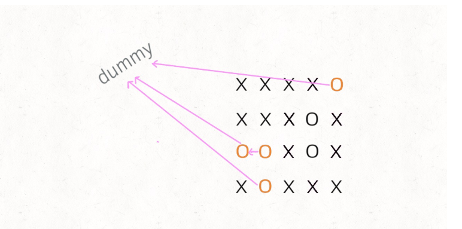

## 描述

> Leetcode-130： 被围绕的区域
>
> 给定一个二维的矩阵，包含 'X' 和 'O'（字母 O）。
>
> 找到所有被 'X' 围绕的区域，并将这些区域里所有的 'O' 用 'X' 填充。
>
> 示例:
>
> X X X X
> X O O X
> X X O X
> X O X X
> 运行你的函数后，矩阵变为：
>
> X X X X
> X X X X
> X X X X
> X O X X
> 解释:
>
> 被围绕的区间不会存在于边界上，换句话说，任何边界上的 'O' 都不会被填充为 'X'。 任何不在边界上，或不与边界上的 'O' 相连的 'O' 最终都会被填充为 'X'。如果两个元素在水平或垂直方向相邻，则称它们是“相连”的。
>
> 链接：https://leetcode-cn.com/problems/surrounded-regions
>
> 


## 分析

1. dfs搜索：将边界上的‘O’及其连通的先设置成‘#’标识，这些是不会被填充的，等搜索完毕之后再将这些标志换回‘O’。而在里面的‘O’就是被包围的区域，通过双层循环将里面的’O‘替换成’X‘即可。

2. 并查集：并查集的思想就是，同一个连通区域内的所有点的根节点是同一个。将每个点映射成一个数字。先假设每个点的根节点就是他们自己，然后我们以此输入连通的点对，然后将其中一个点的根节点赋成另一个节点的根节点，这样这两个点所在连通区域又相互连通了。

   并查集代码：UF

   ```java
   /**
    * @author Hongliang Zhu
    * @create 2020-01-25 21:25
    */
   // 并查集 UF
   public class UF {
       private int count = 0; // 连通分量
       private int[] parent;
       // 新增一个数组记录树的“重量”
       private int[] size;
   
       // 构造
       public UF(int n){ // n个元素
           this.count = n;
           size = new  int[n];
           parent = new int[n];
           // 一开始每一个节点自成一个集合，都不连通
           for (int i = 0;  i < n;  i++){
               parent[i]  = i; // 自己的父节点指向自己
               size[i] = 1; // 每隔几何只有自身一个元素
           }
       }
   
       public int find(int x){
           int root = parent[x];
           while (parent[x] != x){ // 路径压缩
               x = parent[x];
           }
           return x;
       }
   
   
       public boolean isSameSet(int a, int b){
           return find(a) == find(b);
       }
   
       public int count(){
           return count;
       }
   
       public void union(int a, int b){
           int rootA = find(a);
           int rootB = find(b);
           if(rootA == rootB){
               return; // 同一个集合不能合并
           }else{
               if(size[rootA] > size[rootB]){
                   parent[rootB] = rootA;
                   size[rootA] += size[rootB];
               }else {
                   parent[rootA] = rootB;
                   size[rootB] += size[rootA];
               }
           }
           count--; // 连通分量个数减一
       }
   
   
   
   }
   ```

    **可以把那些不需要被替换的** **`O`** **看成一个拥有独门绝技的门派，它们有一个共同祖师爷叫** **`dummy`****，这些** **`O`** **和** **`dummy`** **互相连通，而那些需要被替换的** **`O`** **与** **`dummy`** **不连通**。 如下图:

   

   

   ​		首先要解决的是，根据我们的实现，Union-Find 底层用的是一维数组，构造函数需要传入这个数组的大小，而题目给的是一个二维棋盘。

   ​		这个很简单，二维坐标 `(x,y)` 可以转换成 `x * n + y` 这个数（`m` 是棋盘的行数，`n` 是棋盘的列数）。敲黑板，**这是将二维坐标映射到一维的常用技巧**。

   ​		其次，我们之前描述的「祖师爷」是虚构的，需要给他老人家留个位置。索引 `[0.. m*n-1]` 都是棋盘内坐标的一维映射，那就让这个虚拟的 `dummy` 节点占据索引 `m * n` 好了。

   ​		我们的思路是把所有边界上的 O看做一个连通区域。遇到 O 就执行并查集合并操作，这样所有的 O 就会被分成两类

   1. 和边界上的 O在一个连通区域内的。这些 O 我们保留。
   2. 不和边界上的O 在一个连通区域内的。这些 O 就是被包围的，替换。


## 代码

1. dfs版本

   ```java
   class Solution {
       int[][] directions = {{0, 1}, {0, -1}, {1, 0}, {-1, 0}};
       public void solve(char[][] board) {
           if(board == null || board.length == 0)
               return;
           int m = board.length;
           int n = board[0].length;
           //  边缘搜索
           for(int i = 0; i < m; i++){
               for(int j = 0; j < n; j++){
                   if((i == 0 || j == 0 || i == m-1 || j == n-1)  &&  (board[i][j] == 'O')){
                       dfs(board, i, j);
                   }
               }
           }
           //
          for(int i = 0; i < m; i++){
              for(int j = 0; j < n; j++){
                  if(board[i][j] == 'O'){
                      board[i][j] = 'X';
                  }
                  if(board[i][j] == '#'){
                      board[i][j] = 'O';
                  }
                  
              }
          }
               
   
       }
   
   
       public void dfs(char[][] board, int i,  int j){
           if(i < 0 || j < 0 || i >= board.length || j >= board[0].length || board[i][j] != 'O')
               return;
           board[i][j] = '#';
           for(int[] d: directions){
               dfs(board, i+d[0], d[1]+j);
           }
       }
   
   }
   ```

   

2. 并查集

   ```java
       // 使用并查集解决
       public static void solveUF(char[][] board) {
           if(board==null || board.length == 0)
               return;
           int m = board.length;
           int n = board[0].length;
           // 边界上的‘O’的根节点都是dummy
           UF uf = new UF(n * m + 1);//  增加一个存储dummy节点
           int dummy = m * n;
   
           for(int i = 0; i < m; i++){
               for(int j = 0; j < n; j++){
                   if(board[i][j] == 'O'){ // 目标
                       if(i == 0 || j == 0 || i == m -1 || j == n -1) { // 如果是边界上的'O'， 与dummy合并
                           uf.union(i*n+j, dummy);
                       }else{ // 里面的
                           // 方向数组 d 是上下左右搜索的常用手法
                           int[][] d = new int[][]{{1,0}, {0,1}, {0,-1}, {-1,0}};
                           // 将此 O 与上下左右的 O 连通
                           for (int k = 0; k < 4; k++) {
                               int x = i + d[k][0];
                               int y = j + d[k][1];
                               if (board[x][y] == 'O')
                                   uf.union(x * n + y, i * n + j);
                           }
                       }
                   }
               }
           }
   
           for (int  i = 1;  i < m-1; i++){
               for( int j = 1; j < n-1; j++){
                   if(!uf.isSameSet(i*n+j, dummy)){
                       board[i][j] = 'X';
                   }
               }
           }
   
   
       }
   
   ```

   

参考：

1.  https://cyc2018.github.io/CS-Notes
2.  https://labuladong.gitbook.io/algo/gao-pin-mian-shi-xi-lie/unionfind-suan-fa-ying-yong#yi-dfs-de-ti-dai-fang-an 

