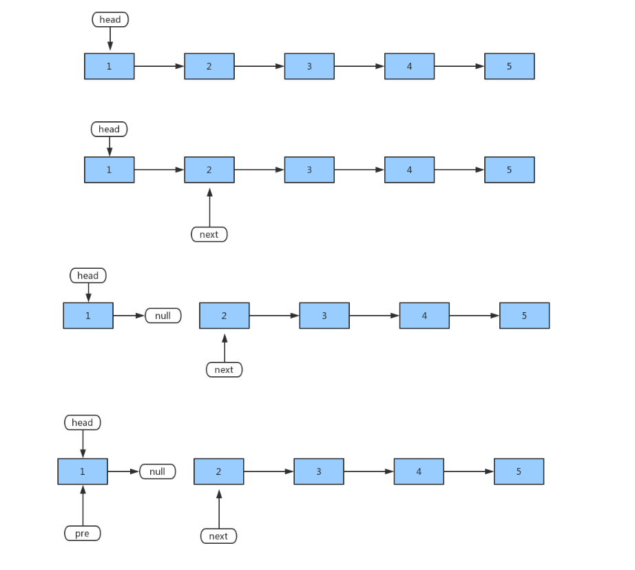
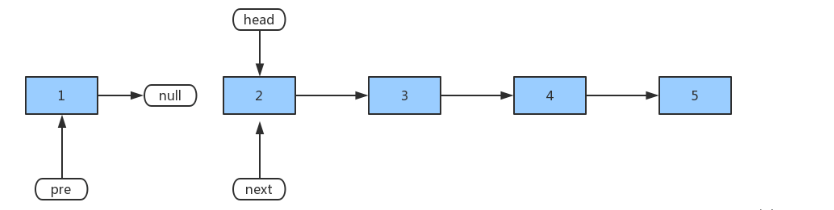
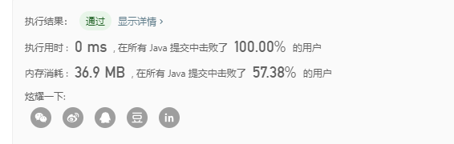

# 描述

> leetcode206： 反转链表 【简单】
>
> 反转一个单链表。
>
> 示例:
>
> 输入: 1->2->3->4->5->NULL
> 输出: 5->4->3->2->1->NULL
> 进阶:
> 你可以迭代或递归地反转链表。你能否用两种方法解决这道题？
>
>
> 链接：https://leetcode-cn.com/problems/reverse-linked-list
>

# 分析

- 迭代： 如下图：

  



​	时间复杂度：O(n) 。 假设 *n* 是列表的长度，时间复杂度是 O(n)。

​	空间复杂度：O(1)。

2. 递归

   1、找到递归出口

   2、确定返回值

   3、分析单次递归需要做的事情

   下面，我们来具体分析一下：

   首先，找到递归出口，这个还是非常简单的，就是当前即将反转的节点为 null 或者是 反转链表 为 null 时（一轮递归其实就只有两个节点，后面会讲），说明已经全部反转完毕了，即递归出口；
   其次，确定返回值，我们只需要返回反转链表的头结点即可；
   最后，分析单次递归需要做的事情，递归其实每一轮做的事情都是一样的，我们不需要去重复考虑，这样反而会很乱，只需要考虑单轮递归需要做什么就可以了。在这里，我们就只有两个节点，一个是即将反转的节点元素，一个是已经反转完毕的链表头结点。 我们要做的一轮递归只是 将当前节点加入到反转链表中，仅此而已。
   链接：https://leetcode-cn.com/problems/reverse-linked-list/solution/bang-zhu-da-jia-li-jie-di-gui-zuo-fa-by-jeromememo/

   


# 代码

 https://github.com/Castile/algorithm/blob/master/leetcode/src/LinkedList/leetcode206_ReverseLinkedList.java 

```java
package LinkedList;
/**
 * @author Hongliang Zhu
 * @create 2020-02-06 17:09
 */

/*
    反转单链表： 要求时间复杂度为O((n) ，空间复杂度为O(1)；
    Input: 1->2->3->4->5->NULL
    Output: 5->4->3->2->1->NULL
 */
public class leetcode206_ReverseLinkedList {
    // 迭代
    public static ListNode reverseList(ListNode head) {
        if(head == null)   return head;
        ListNode pre = null;
        ListNode next = null;
        while (head != null) {
            next = head.next;
            head.next = pre;
            pre = head;
            head = next;
        }
        return pre;
    }
    // 递归版本
    public static  ListNode reverdeList_Recur(ListNode head){
       return help(head, null, head.next);
    }
    public static ListNode help(ListNode head, ListNode pre, ListNode next){
        if(head == null)    return pre;
        next = head.next;
        head.next = pre;
        pre = head;
        head = next;
        return help(head, pre, next);
    }


    // 优美递归
    public static ListNode reverseListRR(ListNode head){
        if(head == null || head.next == null)   return head;
        ListNode p = reverseListRR(head.next);
        //这里的cur就是最后一个节点
        ListNode cur = reverseList(head.next);

        //如果链表是 1->2->3->4->5，那么此时的cur就是5
        //而head是4，head的下一个是5，下下一个是空
        //所以head.next.next 就是5->4
        head.next.next = head; //防止链表循环，需要将head.next设置为空
        head.next  = null; //每层递归函数都返回cur，也就是最后一个节点
        return p;
    }


    public static void printLinkedList(ListNode head){
        if(head == null) return;
        ListNode p = head;
        while (p != null){
            System.out.print(p.val +"\t");
            p = p.next;
        }
        System.out.println();
    }

    public static void main(String[] args) {
        ListNode head = new ListNode(1);
        ListNode n1 = new ListNode(2);
        ListNode n2 = new ListNode(3);
        ListNode n3 = new ListNode(4);
        ListNode n4 = new ListNode(5);
        head.next = n1;
        n1.next = n2;
        n2.next = n3;
        n3.next = n4;

        printLinkedList(head);

        ListNode re = reverseListRR(head);

        printLinkedList(re);


    }

}

```




