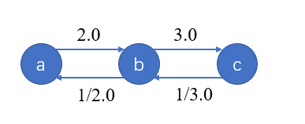
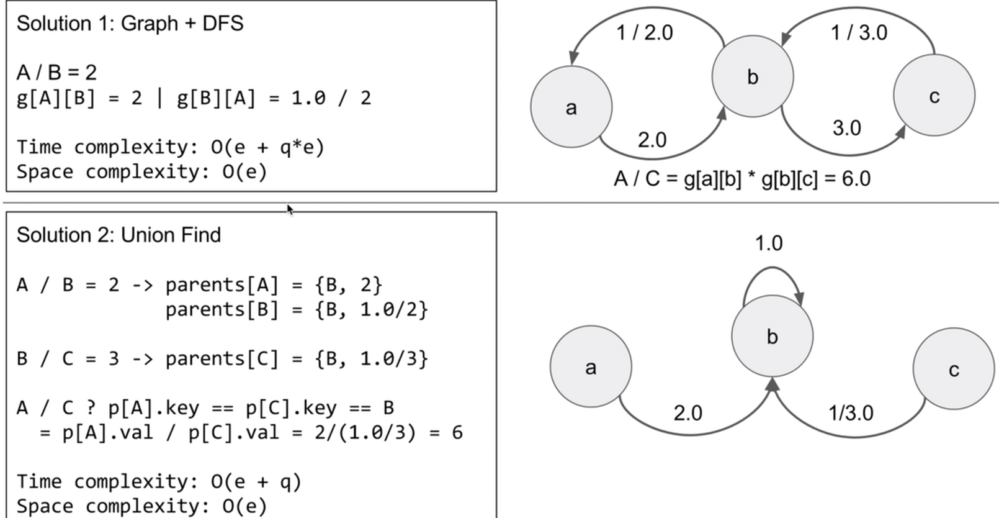

## 描述

> 给出方程式 A / B = k, 其中 A 和 B 均为代表字符串的变量， k 是一个浮点型数字。根据已知方程式求解问题，并返回计算结果。如果结果不存在，则返回 -1.0。
>
> 示例 :
> 给定 a / b = 2.0, b / c = 3.0
> 问题: a / c = ?, b / a = ?, a / e = ?, a / a = ?, x / x = ? 
> 返回 [6.0, 0.5, -1.0, 1.0, -1.0 ]
>
> 输入为: vector<pair<string, string>> equations, vector<double>& values, vector<pair<string, string>> queries(方程式，方程式结果，问题方程式)， 其中 equations.size() == values.size()，即方程式的长度与方程式结果长度相等（程式与结果一一对应），并且结果值均为正数。以上为方程式的描述。 返回vector<double>类型。
>
> 基于上述例子，输入如下：
>
> equations(方程式) = [ ["a", "b"], ["b", "c"] ],
> values(方程式结果) = [2.0, 3.0],
> queries(问题方程式) = [ ["a", "c"], ["b", "a"], ["a", "e"], ["a", "a"], ["x", "x"] ]. 
> 输入总是有效的。你可以假设除法运算中不会出现除数为0的情况，且不存在任何矛盾的结果。
> 链接：https://leetcode-cn.com/problems/evaluate-division
>

此题难度为中等，但是我做了一天....， 太菜了。。。对于我来说还是比较复杂的题目了。

## 分析

1. dfs：使用深度优先搜索就比较直观。每个字母相当于一个节点，在给定的equations中建立合适的数据结构，建图，要求方程式的结果相当于求两个节点之间是否可以到达，可以到达则求出其代价，不能到达就设为-1.0.

   我觉得此题的关键就是建图。

   

   a/c = (a/b) * (b/c)，所以我们可以用**图**来解决 。

2. 并查集： 比较特殊，在路径压缩那块比较复杂。。。以后补上吧

   


## 代码

Leetcode AC 代码：

```java
class Solution {
    public double[] calcEquation(List<List<String>> equations, double[] values, List<List<String>> queries) {
        // 使用map的数据结构更好
        // 表示 a->b 的权重 即 a / b 的值
        Map<String, Map<String, Double>> g = new HashMap<>();
        buildGraph(g, equations, values);

        double[] res = new double[queries.size()];
        Arrays.fill(res, -1.0);
        int index= 0 ;
        for(List<String> q: queries){
            String a = q.get(0);
            String b = q.get(1);
            if(!g.containsKey(a) || !g.containsKey(b)){
                index++;
            }else{
                dfs(g, a, b, res, new HashSet<>(), index, 1.0);
                index++;
            }
        }
        return res;
        
    }


    // 建图
    private void buildGraph(Map<String, Map<String, Double>> g, List<List<String>> equations, double[] values){
        
        int index = 0;
        for(List<String> e: equations){
            String a = e.get(0);
            String b = e.get(1);
            g.putIfAbsent(a, new HashMap<>());
            g.putIfAbsent(b, new HashMap<>());
            g.get(a).put(b, values[index]);   // a / b
            g.get(b).put(a, 1.0 / values[index]); //  b / a
            index++;
            g.get(a).put(a, 1.0);
            g.get(b).put(b, 1.0);
        }
    }

    private void dfs(Map<String, Map<String, Double>> g, String a, String b, double[] res, Set<String> visited, int index,  double  tmp)       {
        visited.add(a);
        if(g.get(a) == null || g.get(a).size() == 0){
            // 说明a没有与其他点相连
            return;
        }
        if(g.get(a).containsKey(b)){  //  刚好有a->b的路径
            res[index] = g.get(a).get(b) * tmp;
            return;
        }
        for(String next: g.get(a).keySet()){
            if(visited.contains(next))  continue;
            dfs(g, next, b, res, visited, index, g.get(a).get(next)*tmp);
        }
    }

}
```


还有一些问题未解决，比如下面是自己写的代码，在idea上运行没毛病，但是在leetcode上就出错了。具体原因不详，欢迎大家提出问题进行交流，不胜感激！

```java
class Solution_DFS{

    public double[] calcEquation(List<List<String>> equations, double[] values, List<List<String>> queries) {
        Map<String, Map<String, Double>>  g = new HashMap<>(); // 图
        bulidGraph(g, equations, values);
        double[] res = new double[queries.size()]; //   结果集合

        Arrays.fill(res, -1.0); // 全部设置成-1.0；

        int index = 0;
        // 遍历问题式子
        for(List<String> q: queries){
            String a = q.get(0);
            String b = q.get(1);
            if(!g.containsKey(a) || !g.containsKey(b)){
                index++;
            }else {
                dfs(g, a, b, res, index, new HashSet<>(), 1.0);
                index++;
            }

        }
        return res;

    }
    
    

    // 下面这个方法在leetcode行不通
    public double[] calcEquation_dfs(List<List<String>> equations, double[] values, List<List<String>> queries) {
        Map<String, Map<String, Double>> g = new HashMap<>();
        bulidGraph(g, equations, values);
        int index = 0;
        double[] ans = new double[queries.size()];
        for (List<String> q: queries){
            String x = q.get(0);
            String y = q.get(1);
            if(!g.containsKey(x) || !g.containsKey(y)){
                ans[index] = -1.0;
                index++;
                continue;
            }
            HashSet<String> visited = new HashSet<>();
            ans[index] = divide(x, y, g, visited);
            index++;
        }
        return ans;
    }

    // get a / b
    private double divide(String a, String b, Map<String, Map<String, Double>> g, Set<String> visitied){
        if( a == b){
            return 1.0;
        }
        visitied.add(a);
        for(String next: g.get(a).keySet()){
            if(visitied.contains(next)) continue;
            double d = divide(next, b, g, visitied); //  d = next / b
            //  a /b =  next /b * a / next
            if(d > 0)
                return d * g.get(a).get(next);
        }
        return -1.0;

    }

    private void dfs(Map<String, Map<String, Double>> g, String a, String b, double[] res, int index, Set<String> visited, double tmp){
        visited.add(a);
        if(g.get(a) == null || g.get(a).size() == 0){
            return;
        }
        if(g.get(a).containsKey(b)) {
            //  刚好存在 a->b
            res[index] = g.get(a).get(b) * tmp;
            return;
        }
        for(String next: g.get(a).keySet()){
            if(visited.contains(next))  continue;
            dfs(g, next, b, res, index, visited, g.get(a).get(next) * tmp);
        }

    }

    private void bulidGraph(Map<String, Map<String, Double>>  g , List<List<String>> equations, double[] values){
        int index = 0;
        for(List<String> e: equations){
            String a = e.get(0);
            String b = e.get(1);
            g.putIfAbsent(a, new HashMap<>());
            g.putIfAbsent(b, new HashMap<>());
            g.get(a).put(b, values[index]);   //  a -> b  : a / b
            g.get(b).put(a, 1.0 / values[index]); //  b -> a : b / a;
            index++;
            g.get(a).put(a, 1.0);
            g.get(b).put(b, 1.0);  //  自己到自己的权重为1
        }

    }


}
```


