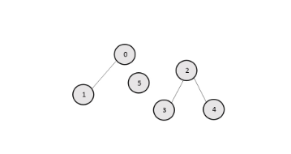

## 描述

> Leetcode547：Friend_Circles 朋友圈
>
> 班上有 N 名学生。其中有些人是朋友，有些则不是。他们的友谊具有是**传递性**。如果已知 A 是 B 的朋友，B 是 C 的朋友，那么我们可以认为 A 也是 C 的朋友。所谓的朋友圈，是指所有朋友的集合。
>
> 给定一个 N * N 的矩阵 M，表示班级中学生之间的朋友关系。如果M[i][j] = 1，表示已知第 i 个和 j 个学生互为朋友关系，否则为不知道。你必须输出所有学生中的已知的朋友圈总数。
>
> 示例 1:
>
> 输入: 
> [[1,1,0],
>  [1,1,0],
>  [0,0,1]]
> 输出: 2 
> 说明：已知学生0和学生1互为朋友，他们在一个朋友圈。
> 第2个学生自己在一个朋友圈。所以返回2。
> 示例 2:
>
> 输入: 
> [[1,1,0],
>  [1,1,1],
>  [0,1,1]]
> 输出: 1
> 说明：已知学生0和学生1互为朋友，学生1和学生2互为朋友，所以学生0和学生2也是朋友，所以他们三个在一个朋友圈，返回1。
> 注意：
>
> N 在[1,200]的范围内。
> 对于所有学生，有M[i][i] = 1。
> 如果有M[i][j] = 1，则有M[j][i] = 1。
>
>
> 链接：https://leetcode-cn.com/problems/friend-circles
>
> 并查集、dfs、bfs


## 分析

1. 并查集：转化为求连通个数。 好友关系可以看成是一个无向图，例如第 0 个人与第 1 个人是好友，

   那么 M[0][1]和 M[1][0]的值都为 1。 很简单直观。

   并查集：

   ```java
   // 并查集 UF
   public class UF {
       private int count = 0; // 连通分量
       private int[] parent;
       // 新增一个数组记录树的“重量”
       private int[] size;
   
       // 构造
       public UF(int n){ // n个元素
           this.count = n;
           size = new  int[n];
           parent = new int[n];
           // 一开始每一个节点自成一个集合，都不连通
           for (int i = 0;  i < n;  i++){
               parent[i]  = i; // 自己的父节点指向自己
               size[i] = 1; // 每隔几何只有自身一个元素
           }
       }
   
       public int find(int x){
           int root = parent[x];
           while (parent[x] != x){ // 路径压缩
               x = parent[x];
           }
           return x;
       }
   
   
       public boolean isSameSet(int a, int b){
           return find(a) == find(b);
       }
   
       public int count(){
           return count;
       }
   
       public void union(int a, int b){
           int rootA = find(a);
           int rootB = find(b);
           if(rootA == rootB){
               return; // 同一个集合不能合并
           }else{
               if(size[rootA] > size[rootB]){
                   parent[rootB] = rootA;
                   size[rootA] += size[rootB];
               }else {
                   parent[rootA] = rootB;
                   size[rootB] += size[rootA];
               }
           }
           count--; // 连通分量个数减一
       }
   
   
   
   }
   ```

2. dfs：  给定的矩阵可以看成图的邻接矩阵。这样我们的问题可以变成无向图连通块的个数。 

   > 
   >
   > M=
   >
   >  [1 1 0 0 0 0
   >  1 1 0 0 0 0
>  0 0 1 1 1 0
   >  0 0 1 1 0 0
   >  0 0 1 0 1 0
   >  0 0 0 0 0 1]

   

   ​	 如果我们把 M 看成图的邻接矩阵，则图为： 



​			 在这个图中，点的编号表示矩阵 M 的下标，i 和 j之间有一条边当且仅当M[i][j]为 1。 

​					为了找到连通块的个数，一个简单的方法就是使用深度优先搜索，从每个节点开始，我们使用一个大		小为 N 的 visited数组（M大小为 N×N ），这样 visited[i] 表示第 i 个元素是否被深度优先搜索访问过。每使		用一次深度优先搜索，即重新选择了一个点进行dfs，连通分量的个数就加一。

3. bfs:  方法与dfs类似，只是遍历方式是层次遍历， 使用的数据结构是队列。在广度优先搜索中，我们从一个特定点开始，访问所有邻接的节点。然后对于这些邻接节点，我们依然通过访问邻接节点的方式，知道访问所有可以到达的节点。因此，我们按照一层一层的方式访问节点。


## 代码

```java
package search;
import java.util.LinkedList;
import java.util.Queue;
/**
 * @author Hongliang Zhu
 * @create 2020-01-29 20:57
 */
public class leetcode547_FriendCircles {

    // 深度优先
    public static void dfs(int[][] M, int[] visited, int i) {
        for (int j = 0; j < M.length; j++) {
            if (M[i][j] == 1 && visited[j] == 0) { // 是连通的并且还未访问
                visited[j] = 1;
                dfs(M, visited, j);
            }
        }
    }

    public static int findCircleNum_DFS(int[][] M) {
        int count = 0;
        int n = M.length;
        int[] visited = new int[n];
        for (int i = 0; i < n; i++) {
            if (visited[i] == 0) {
                dfs(M, visited, i);
                count++;  // 执行一次dfs表示增加了一个连通块
            }
        }
        return count;
    }


    /*
        下面使用并查集
     */
     static int []parents;
     static int []size;
     static int count1 = 0; //  连通分量
     public static void makeSet(int n){
         parents = new int[n];
         size = new int[n];
         count1 = n;
         for(int i = 0;  i < n; i++){
             size[i] = 1;
             parents[i] = i;
         }

     }
     public static int find(int a){
         int root = parents[a];
         while(root!= parents[root]){
             root = parents[root];
         }
         return root;
     }
     public static void union(int a, int b){
         int roota = find(a);
         int rootb = find(b);
         if(roota != rootb){
             if(size[roota] > size[rootb]){
                 parents[rootb] = roota;
                 size[roota] = size[roota]+size[rootb];
             }else{
                 parents[roota] = rootb;
                 size[rootb] = size[roota]+size[rootb];
             }
             count1--;
         }
     }

    public static int findCircleNum(int[][] M) {

        int n = M.length;
        makeSet(n);
        for(int i = 0;  i< n; i++){
             for( int j = i+1; j < n; j++){
                 if(M[i][j] == 1)// 朋友
                 {
                     union(i, j);
                 }
             }
        }

        return count1;  // 返回连通分量的个数
    }


    // 广度优先遍历
    public static int findCircleNum_BFS(int[][] M) {
        int n = M.length;
        int count = 0;
        int[] visited = new int[n];
        Queue<Integer> queue = new LinkedList<>();
        for(int i = 0; i < n; i++){
            if(visited[i] == 0){
                queue.add(i);
                while (!queue.isEmpty()){
                    int k = queue.remove();
                    visited[k] = 1;
                    for(int j = 0; j < n; j++){
                        if(M[k][j] == 1 && visited[j] == 0)
                            queue.add(j);
                    }
                }
                count++;
            }
        }

        return count;

     }


    public static void main(String[] args) {
        int[][] M = {{1, 1, 0}, {1, 1, 0}, {0, 0, 1}};

        System.out.println(findCircleNum_DFS(M));  // 2
        System.out.println(findCircleNum_BFS(M));// 2
        System.out.println(findCircleNum(M));// 2

    }

}

```

注： 使用并查集速度最快。


