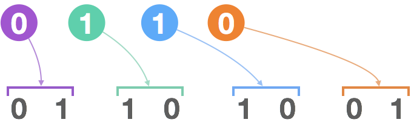

# 描述

> leetcode： 779 第K个语法符号
>
> 在第一行我们写上一个 0。接下来的每一行，将前一行中的0替换为01，1替换为10。
>
> 给定行数 N 和序数 K，返回第 N 行中第 K个字符。（K从1开始）
>
>
> 例子:
>
> 输入: N = 1, K = 1
> 输出: 0
>
> 输入: N = 2, K = 1
> 输出: 0
>
> 输入: N = 2, K = 2
> 输出: 1
>
> 输入: N = 4, K = 5
> 输出: 1
>
> 解释:
> 第一行: 0
> 第二行: 01
> 第三行: 0110
> 第四行: 01101001
>
> 链接：https://leetcode-cn.com/problems/k-th-symbol-in-grammar
> 

# 分析

既然每一行都是根据上一行来生成的，把这样的上下两行写成比特形式找一下规律。

  

如果当前行为 `"0110"`，由此生成的下一行为 `"01101001"`。 

  

据此可以总结出规律，第 K 个数字是上一行第 (K+1) / 2 个数字生成的。如果上一行的数字为 0，被生成的数字为 1 - (K%2)，如果上一行的数字为 1，被生成的数字为 K%2。

 如果k是偶数，表明是右子树，奇数为左子树。 


>   还有其他方法，见官方题解： https://leetcode-cn.com/problems/k-th-symbol-in-grammar/solution/di-kge-yu-fa-fu-hao-by-leetcode/ 


# 代码

github： https://github.com/Castile/algorithm/blob/master/leetcode/src/RecurrenceAndDynamicProgramming/leetcode799_kthGrammar.java 

```java
package RecurrenceAndDynamicProgramming;

/**
 * @author Hongliang Zhu
 * @create 2020-02-16 14:22
 */
/*
在第一行我们写上一个 0。接下来的每一行，将前一行中的0替换为01，1替换为10。

给定行数 N 和序数 K，返回第 N 行中第 K个字符。（K从1开始）

 */
public class leetcode799_kthGrammar {

    public  int kthGrammar(int N, int K) {
        if(N==1) return 0;
        int ans = kthGrammar(N-1, (K+1)>>1);
        if(ans==1) {
            return K%2==0?0:1;
        } else {
            return K%2==0?1:0;
        }
    }


}

```

