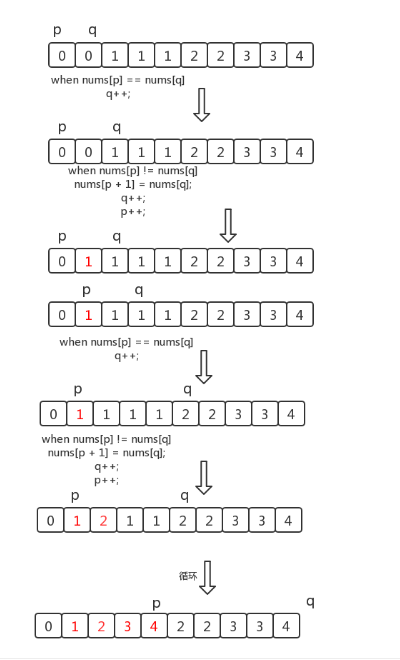

## 描述

> 给定一个排序数组，你需要在原地删除重复出现的元素，使得每个元素只出现一次，返回移除后数组的新长度。不要使用额外的数组空间，你必须在原地修改输入数组并在使用 O(1) 额外空间的条件下完成。
> 链接：https://leetcode-cn.com/problems/remove-duplicates-from-sorted-array

示例 1:

给定数组 nums = [1,1,2], 

函数应该返回新的长度 2, 并且原数组 nums 的前两个元素被修改为 1, 2。 

你不需要考虑数组中超出新长度后面的元素。

示例 2:

给定 nums = [0,0,1,1,1,2,2,3,3,4],

函数应该返回新的长度 5, 并且原数组 nums 的前五个元素被修改为 0, 1, 2, 3, 4


## 思路

可以采用快慢指针，即双指针思路，这种方法在线性表查重，判断环上用的比较多。



​	数组完成排序后，我们可以放置两个指针 p 和q，其中p是慢指针，而 q 是快指针。只要 nums[p] = nums[q]，我们就增加 q以跳过重复项。当我们遇到 nums[p] ≠ nums[q] 时，跳过重复项的运行已经结束，因此我们必须把它（nums[q]）的值复制到 nums[p+1]。然后递增 p，接着我们将再次重复相同的过程，直到q到达数组的末尾为止。

​	时间复杂度O(n),  空间复杂度O(1)：

```java
class Solution {
    public int removeDuplicates(int[] nums) {
        if(nums.length == 0){
            return 0;
        }
        int p = 0;
        int q = 1;
        while(q < nums.length){
            if(nums[p] == nums[q]){
                q++;
            }else{

                nums[p+1] = nums[q];
                p++;
            }
        }
     
        return p + 1 ;
        
    }
}
```

相关： [https:/Castile.github.io/2020/01/22/leetcode-80-删除排序数组的重复项2/](https://castile.github.io/Castile.github.io/2020/01/22/leetcode-80-删除排序数组的重复项2/) 