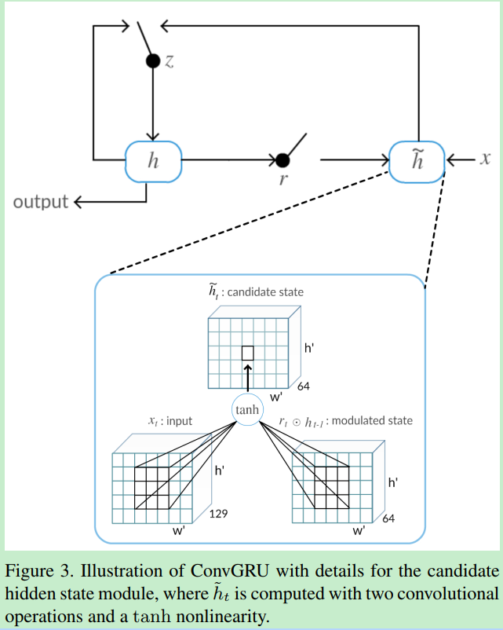
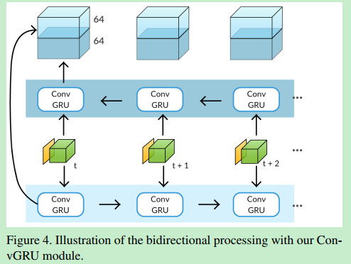
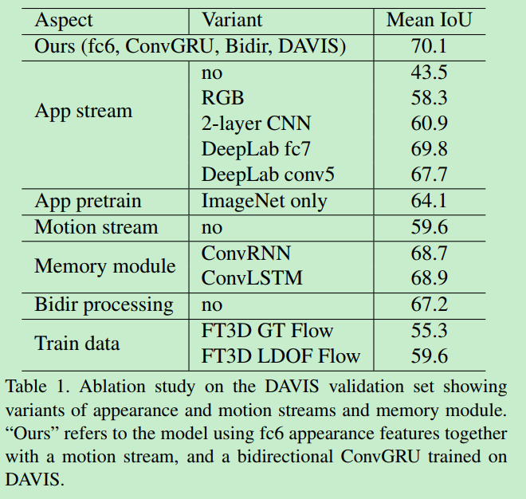
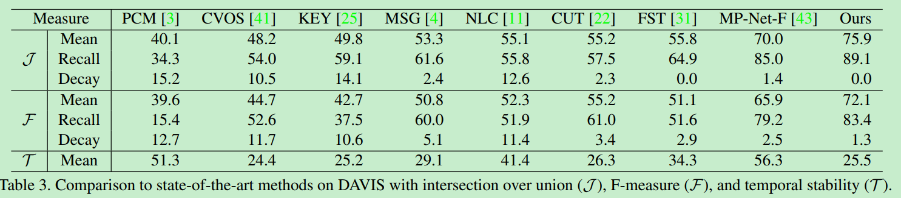
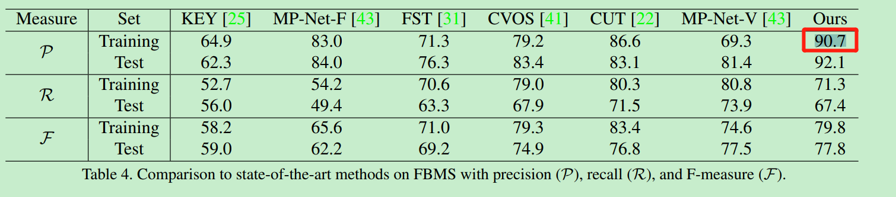
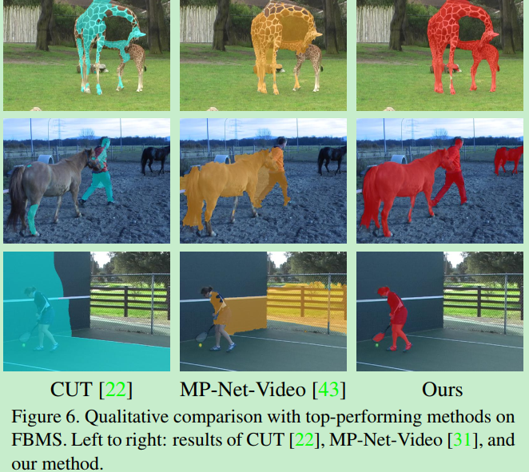

  # Learning Video Object Segmentation with Visual Memory  

此论文也是旨在解决运动目标分割任务。引入`two-stream`网络，同时带有一个memory module。Memory module用来捕获视频中目标的演化，由`convolutional gated recurrent     units`（`ConvGRU`）构成。Two stream包括appearance stream和temporal stream。 网络的两个流分别在视频序列中学习空间和时序特征。

 使用双流网络的思路是利用外观和运动的互补性来构建随着时间推移而发展的对象的强大表示。例如，当一个物体在场景中移动时，外观和运动网络都是同样有效的，但是一旦它变成静止的，运动网络就不能像外观网络一样估计这个物体。 

# Contributions

1. present an approach for moving object segmentation in unconstrained videos that does not require any manually-annotated frames in the input video。网络结构包含 memory unit，this is the first recurrent network based approach to accomplish the video segmentation task。

2. 在DAVIS和Freiburg-Berkeley两个数据集上得到state-of-the-art的结果。

# Networks

1. Appearance stream：采用DeepLab网络，在PASCAL VOC上预训练过。取视频的一帧作为输入,输出一个大小为 128 x w/8 x h/8的预测特征。deeplab网络的aspp模块使得特征保持了一个相对较高的特征空间分辨率，并且在每个像素的表示中包含上下文信息。 

   使用fc6层，每个像素的特征维度为1024， 然后经过两个1x1的卷积层，tanh非线性操作，将通道降至128维。这些层和ConvGRU一起训练。

2. Temporal stream：是一个motion prediction network，网络采用MPNet（作者之前的工作），在FlyingThings3D 上预训练过。光流作为motion network的输入，产生一个w/4 x h/4 的运动预测， 其中每个值表示对应像素运动的可能性。 

3. Memory module：由convolutional gated units (ConvGRU)构成。两条分支的输出结果concat在一起，作为Conv GRU的输入。

4. Bidirectional processing：考虑到视频存在这样的情况：目标前几帧是静止的，后面才开始移动。作者的方法前向处理不能分割好初始帧的目标，因为缺少prior memory representation of the object in the first frame。所以采取双向处理的方式。

#  Visual memory module  

 ConvGRU模块的关键部分是是状态矩阵h ，对于帧 $ t $  , ConvGRU使用双流网络中融合后的特征 $x_t$ 和 前一个状态 $h_{t-1} $ 来计算新的状态 $ h_t $。 通过一个更新门 $z_t$ 和遗忘门 $r_t$ 来进行动态的计算。这些状态和门都是3D的张量，可以刻画视频序列中的时空特征，有效的记忆运动的目标个目标的位置。公式如下：

更新门 $z_t$   决定将多少记忆合并到新状态 ，遗忘门 $r_t$ 控制前一个状态的影响。 也就是说有多少先前的状态被允许进入候选记忆。  如果$r_t$接近于零，则该单元将忘记先前计算的状态 $ h_{t-1}$ 

 一个像素的视觉记忆表示不仅取决于输入和该像素处的前一状态，还取决于它的局部邻域。增加卷积内核的大小允许模型处理更大运动的时空模式。 

 综上所述，该模型学习将当前帧的外观特征与记忆的视频表示相结合，以细化运动预测，甚至在运动对象变为静止时的情况下，他可以完全恢复之前的观察结果到的状态。

#   Bidirectional processing  

 考虑这样一个例子:一个物体在视频序列的开始是静止的，然后在后面的帧中开始移动。 前面描述的方法，即按顺序处理视频帧(正向)，不能在初始帧中分割对象。这是因为在第一帧中缺少对象的预先记忆表示。受双向循环模型在语音领域的应用启发，我们使用双向处理步骤来改进我们的框架。

由两个并行的ConvGRU，第一个从第一帧开始前向处理，第二个从最后一帧开始后向处理。  为了生成一个128 x w/8 x h/8 的输出，在每一个时间步将来自两个方向的激活输出被串接起来。然后通过一个3x3的卷积操作，产生一个64 x w/8 x h/8 的特征图，最后连接一个1x1的卷积层和softmax分类层得到最终的二值分割掩码。这个双向的ConvGRU在训练和测试中均会用到。这考虑了整个视频序列的信息。【**ps: 但是对于场景发生变化的情况下，这样的似乎不太合理。。。**】

在实验部分展示了双向处理能够带来将近3%的提升（在DAVIS数据集上）， 双向处理对FBMS数据集的影响更为突出，在FBMS数据集中，前景目标在视频开始时可以是静态的，比单向处理改进了5% 。

#   Training  

一个ConvGRU 模型有6个卷积层，视频序列长度为n，一共需要6n个卷积层，双向的话，就需要12n个卷积层。 这种内存需求使得端到端训练整个模型(包括外观和运动流)变得不可行。我们求助于使用预先训练过的外观和运动网络，并对ConvGRU进行训练。 

 使用DAVIS数据集的训练集来学习ConvGRU权重 ，Davis数据集中视频序列的每一帧都是运动的， 这使记忆模块倾向于不间断运动流的存在。 当一个对象在测试序列中停止移动时， 这导致了ConvGRU从失败的数据中学到的教训 。  我们增加了训练数据来模拟这种走走停停的场景，从而为真实的视频学习一个更健壮的模型。 

创建一个新的训练序列，最后5帧是重复的，用来模拟目标停止运动，其他帧的ground-truth不变， 最后五帧没有使用任何运动输入。这些收工处理的数据以一个固定比例的迭代代替常规的样本。 

 鉴于ground truth segmentation决定了训练的损失，即，它用于所有的帧，ConvGRU显式地记忆序列的初始部分的移动对象，然后在运动缺失的帧分割它。 

 我们通过在批处理中复制前五帧来进行类似的训练集扩展，以模拟在视频开始时对象是静态的情况。 

# 其他训练细节

1. loss：   binary cross entropy   

2. optimzier： RMSProp

3. lr : 1e-4

4. weight decay:0.005

5. 所有卷积层(ConvGRU内部的层除外)的初始化都是使用标准的xavier方法完成的.

6. 在每次更新参数之前，进行梯度裁剪，使其位于预定义的范围内，以避免数值问题 。

7. 数据： 随机选择一个视频序列，选择连续的14帧作为一个batch

8. 7 × 7 convolutions in all the ConvGRU operations  
9. 对模型进行30000次迭代训练，并将含有附加序列的批次比例设置为20%。
10.  使用一个完全连接的CRF来在后处理步骤中细化边界。 

# Ablation Study

在Davis数据集中不同的组件的影响：

# Results

## On Davis2016

## On FBMS

