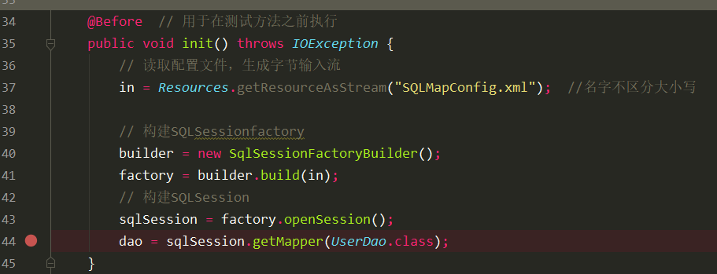
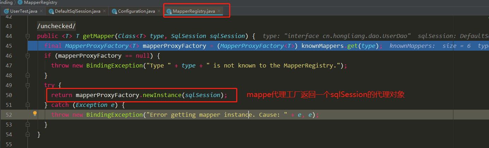
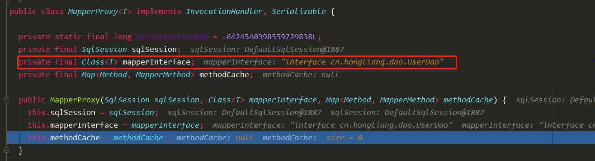
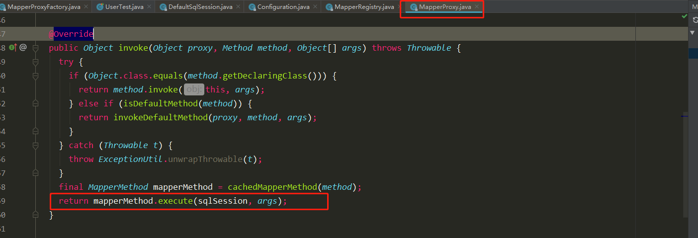
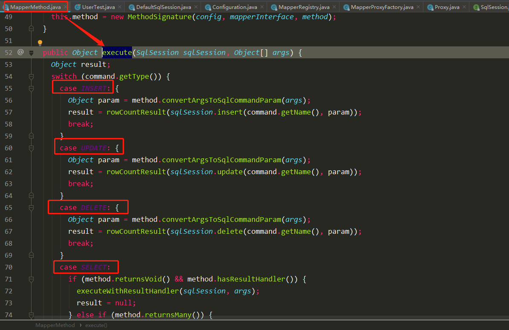
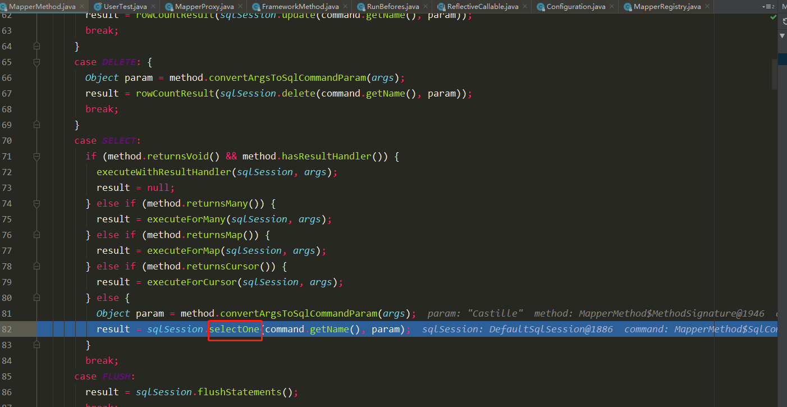
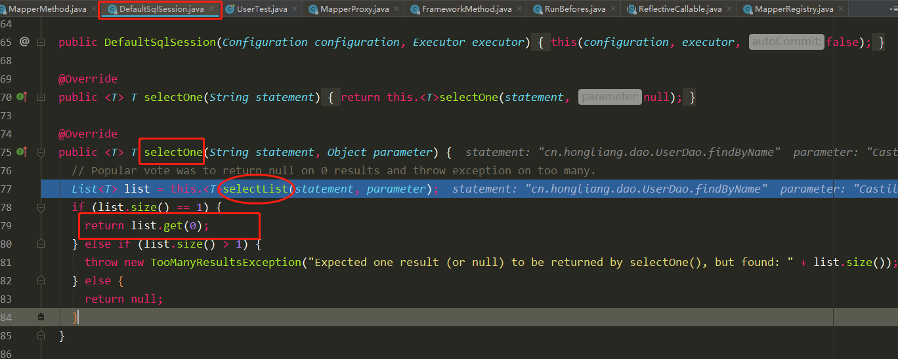

# 代理Dao执行过程

```java
    // 读取配置文件，生成字节输入流
        in = Resources.getResourceAsStream("SQLMapConfig.xml");  //名字不区分大小写

        // 构建SQLSessionfactory
        builder = new SqlSessionFactoryBuilder();
        factory = builder.build(in);
        // 构建SQLSession
        sqlSession = factory.openSession();
        dao = sqlSession.getMapper(UserDao.class);  // 获取 代理Dao
```



1. 首先进入DefaultSqlSession类里面的getMapper()f方法

   ```java
   @Override
     public <T> T getMapper(Class<T> type) {
       return configuration.<T>getMapper(type, this);
     }
   ```

2. 进入到configuration类中去调用getMapper方法

   ```java
   public <T> T getMapper(Class<T> type, SqlSession sqlSession) {
       return mapperRegistry.getMapper(type, sqlSession);
   }
   ```

3. mapperRegistry.getMapper(type, sqlSession) 通过一个代理工厂返回一个代理对象。



4. 来看看这个代理工厂内部做了啥子: `MapperProxyFactory.java`

   ```java
   
   // 动态代理
     @SuppressWarnings("unchecked")
     protected T newInstance(MapperProxy<T> mapperProxy) {
       return (T) Proxy.newProxyInstance(mapperInterface.getClassLoader(), new Class[] { mapperInterface }, mapperProxy); // mapperProxy代理的对象
     }
   
     public T newInstance(SqlSession sqlSession) {
       final MapperProxy<T> mapperProxy = new MapperProxy<T>(sqlSession, mapperInterface, methodCache);
       return newInstance(mapperProxy);  // 调用了上面的newInstance方法
     }
   
   ```

   

   MapperProxy实现了InvocationHandler接口。重写invoke方法，内部调用被代理类的对应方法。

   

5. 最后执行这个方法的execute方法，看看这个方法：

   

   可以看到会调用对应的CRUD操作。

6. 调用Dao的findByName方法， 返回一个User对象，所以执行SelectOne方法

   

   里面是调用SelectList方法，然后返回结果的第一个




# 完整过程图


