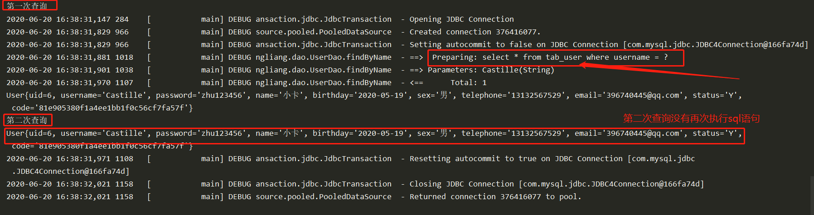
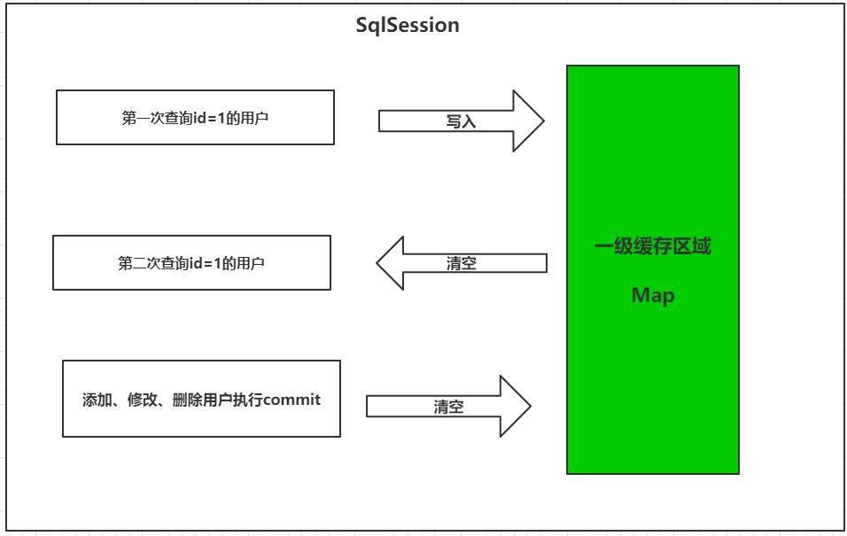
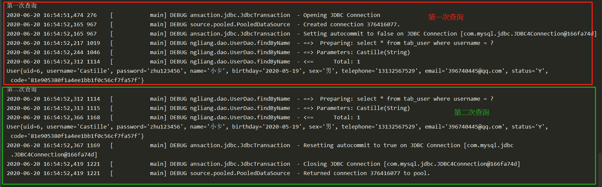
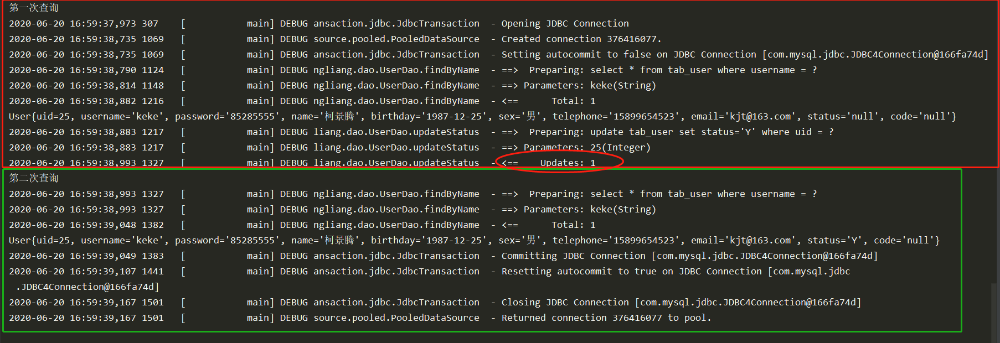
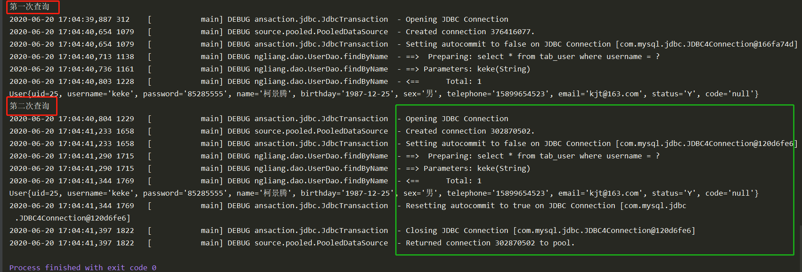
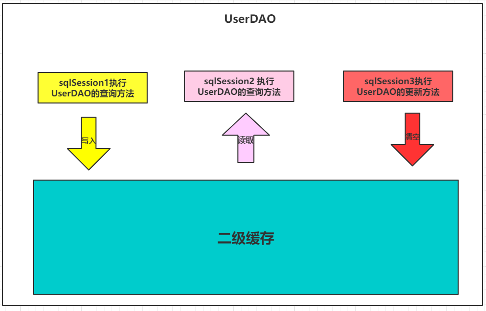
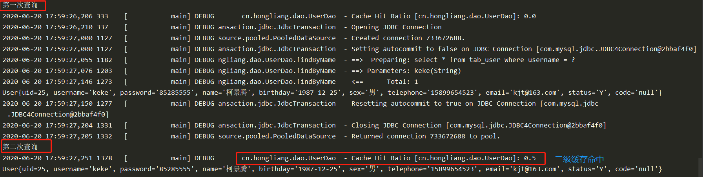

# MyBatis缓存

像大多数的持久化框架一样，`Mybatis` 也提供了缓存策略，通过缓存策略来减少数据库的查询次数，从而提 高性能。 `Mybatis` 中缓存分为一级缓存，二级缓存。 但是在默认的情况下， 只开启一级缓存 。

# 一级缓存

一级缓存是 `SqlSession` 级别的缓存，只要 `SqlSession` 没有 `flush` 或 `close`，它就存在。 

 ## 1. 证明一级缓存的存在 

首先在一个test里面重复两次相同的查询

```java
 @Test
    public void test(){
        System.out.println("第一次查询");
        User castille = dao.findByName("Castille");
        System.out.println(castille);
        System.out.println("第二次查询");
        User castille1 = dao.findByName("Castille");
        System.out.println(castille1);

    }

```

然后执行查询，查看日志输出：



我们可以发现，虽然在上面的代码中我们查询了两次，但最后只执行了一次数据库操作，这就是 Mybatis 提 供给我们的一级缓存在起作用了。因为一级缓存的存在，导致第二次查询 name为castille 的记录时，并没有发出sql语句 从数据库中查询数据，而是从一级缓存中查询。 

## 2. 一级缓存的分析 

一级缓存是 `SqlSession` 范围的缓存，当调用 `SqlSession` 的修改，添加，删除，`commit()`，`close()`等方法时，就会清空一级缓存。 



第一次发起查询用户 id 为 1 的用户信息，先去找缓存中是否有 id 为 1 的用户信息，如果没有，从**数据库**查 询用户信息。 得到用户信息，将用户信息存储到**一级缓存**中。  如果 `sqlSession` 去执行 commit 操作（执行插入、更新、删除），清空 `SqlSession` 中的一级缓存，**这样 做的目的为了让缓存中存储的是最新的信息，避免脏读**。 第二次发起查询用户 id 为 1 的用户信息，先去找缓存中是否有 id 为 1 的用户信息，缓存中有，直接从缓存 中获取用户信息。

## 3. 测试一级缓存的清空 

### 使用 sqlSession.clearCache()清空缓存

```java
  @Test
    public void test(){
        System.out.println("第一次查询");
        User castille = dao.findByName("Castille");
        System.out.println(castille);

//        dao = sqlSession.getMapper(UserDao.class); //  重新获得SQLSession
        sqlSession.clearCache(); // 清空缓存

        System.out.println("第二次查询");
        User castille1 = dao.findByName("Castille");
        System.out.println(castille1);
```



可以看到上述结果，执行了两次的sql语句的查询。因为一级缓存被清空了，所以第二次查询需要在数据库中查询。

### 做了更新操作

```java
 @Test
    public void testCache(){
        System.out.println("第一次查询");
        User ke = dao.findByName("keke");
        System.out.println(ke);

        // 更新操作
        dao.updateStatus(ke);

        System.out.println("第二次查询");
        User keke = dao.findByName("keke");
        System.out.println(keke);

    }

```



### 不同的sqlSession

```java
 @Test
    public void testCache1(){
        System.out.println("第一次查询");
        User ke = dao.findByName("keke");
        System.out.println(ke);

//        再次获得sqlSession
        sqlSession = factory.openSession();
        dao = sqlSession.getMapper(UserDao.class);


        System.out.println("第二次查询");
        User keke = dao.findByName("keke");
        System.out.println(keke);

    }
```




-------------


# 二级缓存

## 1. 二级缓存结构图 



二级缓存是 `mapper` 映射级别的缓存，多个 `SqlSession` 去操作同一个 `Mapper` 映射的 `sql` 语句，多个 `SqlSession` 可以共用二级缓存，二级缓存是跨 `SqlSession` 的。或者说 二级缓存存在于 `SqlSessionFactory` 生命周期中。 

首先开启 `mybatis` 的二级缓存。  `sqlSession1`去查询用户信息，查询到用户信息会将查询数据存储到二级缓存中。

如果 `SqlSession3` 去执行相同 `mapper` 映射下 `sql`，执行 `commit` 提交，将会清空该 `mapper` 映射下的二级缓存区域的数据。 

`sqlSession2` 去查询与 `sqlSession1` 相同的用户信息，首先会去缓存中找是否存在数据，如果存在直接从 缓存中取出数据。

## 2.  二级缓存的开启与关闭 

- 第一步：在 `SqlMapConfig.xml` 文件开启二级缓存 

  因为 `cacheEnabled` 的取值默认就为 true，所以这一步可以省略不配置。为 true 代表开启二级缓存；为 false 代表不开启二级缓存。

  ```xml
  <settings> 
   <!-- 开启二级缓存的支持 -->  <setting name="cacheEnabled" value="true"/> </settings> 
  ```

- 第二步：配置相关的 `Mapper` 映射文件 

  ```xml
  <?xml version="1.0" encoding="UTF-8"?> 
  <!DOCTYPE mapper     PUBLIC "-//mybatis.org//DTD Mapper 3.0//EN"     "http://mybatis.org/dtd/mybatis-3-mapper.dtd"> 
  <mapper namespace="cn.hongliang.dao.UserDao">  
      <!-- 开启二级缓存的支持 --> 
      <cache></cache>
  </mapper
  ```

  <cache>标签表示当前这个 `mapper` 映射将使用二级缓存，区分的标准就看 `mapper` 的 `namespace` 值。 

- 第三步：配置 `statement` 上面的 `useCache` 属性 

  ```xml
   <select id="findByName" resultType="cn.hongliang.beans.User"  useCache="true">
          select * from tab_user where username = #{username}
      </select>
  ```

  将 `UserDao.xml` 映射文件中的<select>标签中设置 `useCache=”true”`代表当前这个 `statement` 要使用 二级缓存，如果不使用二级缓存可以设置为 `false`

  **注意：针对每次查询都需要最新的数据 sql，要设置成 useCache=false，禁用二级缓存。** 

##  3. 二级缓存测试 

```java
   @Test
    public void testCachelevel2(){
        System.out.println("第一次查询");
        User ke = dao.findByName("keke");
        System.out.println(ke);

        sqlSession.close(); // 一级缓存关闭

//        再次获得sqlSession
        SqlSession sqlSession2 = factory.openSession();
        dao = sqlSession2.getMapper(UserDao.class);


        System.out.println("第二次查询");
        User keke = dao.findByName("keke");
        System.out.println(keke);
        
        

    }
```



经过上面的测试，我们发现执行了两次查询，并且在执行第一次查询后，我们关闭了一级缓存，再去执行第二 次查询时，我们发现并没有对数据库发出 `sql` 语句，所以此时的数据就只能是来自于我们所说的二级缓存。

```xml
<!--     开启二级缓存-->
    <cache readOnly="true"></cac

```

注意上面的`readonly`。readOnly 为只读属性， 默认为 false

> false: 可读写， 在创建对象时， 会通过反序列化得到缓存对象的拷贝。 因此在速度上会相对慢一点， 但重在安全。
>
> true: 只读， 只读的缓存会给所有调用者返回缓存对象的相同实例。 因此性能很好， 但如果修改了对象， 有可能会导致程序出问题。

所以使用readOnly=true的话，返回的是同一个实例，如果为false的话，则会反序列一个新的实例，则是不同的对象。

**注意**：**当我们在使用二级缓存时，所缓存的类一定要实现 java.io.Serializable 接口，这种就可以使用序列化 方式来保存对象**。


##  4. 注意事项

1. 由于在更新时会刷新缓存， 因此需要注意使用场合：查询频率很高， 更新频率很低时使用， 即经常使用 `select`, 相对较少使用`delete`, `insert`, `update`。

2. 缓存是以 `namespace` 为单位的，不同 `namespace` 下的操作互不影响。但刷新缓存是刷新整个 `namespace` 的缓存， 也就是你 `update` 了一个， 则整个缓存都刷新了。

3. 最好在 **「只有单表操作」** 的表的 `namespace` 使用缓存， 而且对该表的操作都在这个 `namespace` 中。 否则可能会出现数据不一致的情况。


# 参考

1. https://blog.csdn.net/weixin_37139197/article/details/82908377 