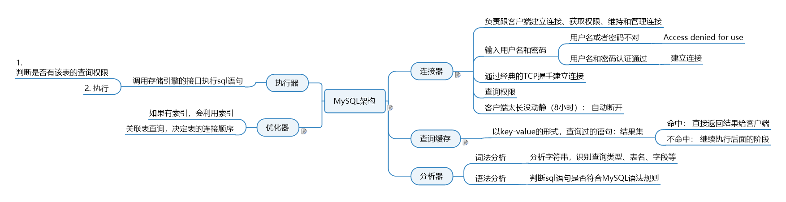

# 查询语句执行过程分析


## MySQL基础架构



大体来说，MySQL 可以分为 Server 层和存储引擎层两部分。 

 

 Server 层包括连接器、查询缓存、分析器、优化器、执行器等，涵盖 MySQL 的大多数核心服务功能，以及所有的内置函数（如日期、时间、数学和加密函数等），所有跨存储引擎的功能都在这一层实现，比如存储过程、触发器、视图等。 

 而存储引擎层负责数据的存储和提取。其架构模式是插件式的，支持 InnoDB、MyISAM、Memory 等多个存储引擎。现在最常用的存储引擎是 InnoDB，它从 MySQL 5.5.5 版本开始成为了默认存储引擎。 

## 1. MySQL的框架有几个组件, 各是什么作用?
连接器：负责跟客户端建立连接、获取权限、维持和管理连接。

查询缓存：查询请求先访问缓存(key 是查询的语句，value 是查询的结果)。命中直接返回。不推荐使用缓存，更新会把缓存清除(关闭缓存：参数 query_cache_type 设置成 DEMAND)。

分析器：对 SQL 语句做解析，判断sql是否正确。

优化器：决定使用哪个索引，多表关联（join）的时候，决定各个表的连接顺序。

执行器：执行语句，先判断用户有无查询权限，使用表定义的存储引擎。

## 2. 使用查询缓存就一定好么？

大多数情况下我会建议你不要使用查询缓存，为什么呢？因为查询缓存往往弊大于利

**查询缓存的失效非常频繁，只要有对一个表的更新，这个表上所有的查询缓存都会被清空**。因此很可能你费劲地把结果存起来，还没使用呢，就被一个更新全清空了。对于更新压力大的数据库来说，查询缓存的命中率会非常低。除非你的业务就是有一张静态表，很长时间才会更新一次。比如，一个系统配置表，那这张表上的查询才适合使用查询缓存。 

需要注意的是，MySQL 8.0 版本直接将查询缓存的整块功能删掉了，也就是说 8.0 开始彻底没有这个功能了。分析器 

## 3. Server层和存储引擎层各是什么作用?

Server 层包括连接器、查询缓存、分析器、优化器、执行器等，涵盖 MySQL 的大多数核心服务功能，以及所有的内置函数（如日期、时间、数学和加密函数等），所有跨存储引擎的功能都在这一层实现，比如存储过程、触发器、视图等。

存储引擎层负责数据的存储和提取。其架构模式是插件式的，支持 InnoDB、MyISAM、Memory 等多个存储引擎。现在最常用的存储引擎是 InnoDB，它从 MySQL 5.5.5 版本开始成为了默认存储引擎。

##  3. you have an error in your SQL syntax 这个保存是在词法分析里还是在语法分析里报错?
语法分析
## 4. 对于表的操作权限验证在哪里进行?
执行器

## 5. 执行器的执行查询语句的流程是什么样的?

```sql
select * from T where ID=10;
```

先判断是否有该表的操作权限，有则进行下面的操作，没有则报错

1）调用 InnoDB 引擎接口取这个表的第一行，判断 ID 值是不是 10，如果不是则跳过，如果是则将这行存在结果集中；

2)调用引擎接口取“下一行”，重复相同的判断逻辑，直到取到这个表的最后一行。

3）执行器将上述遍历过程中所有满足条件的行组成的记录集作为结果集返回给客户端

 

## 问题
如果表 T 中没有字段 k，而你执行了这个语句 select * from T where k=1, 那肯定是会报“不存在这个列”的错误： “Unknown column ‘k’ in ‘where clause’”。你觉得这个错误是在我们上面提到的哪个阶段报出来的呢？

答案： 分析器。 有人回答执行器，原因是这个时候才打开表获取数据，但是表的字段不是数据啊，是事先定义好的，所以可以直接读取的，不需要打开表。

那么，分析器的作用就是就是对你输入的sql字符串进行词法分析，这时候会检查你的表名，列名等。在Oracle数据库中会在分析阶段判断语句是否正确，表是否存在，列是否存在，mysql也借鉴了其设计思想。