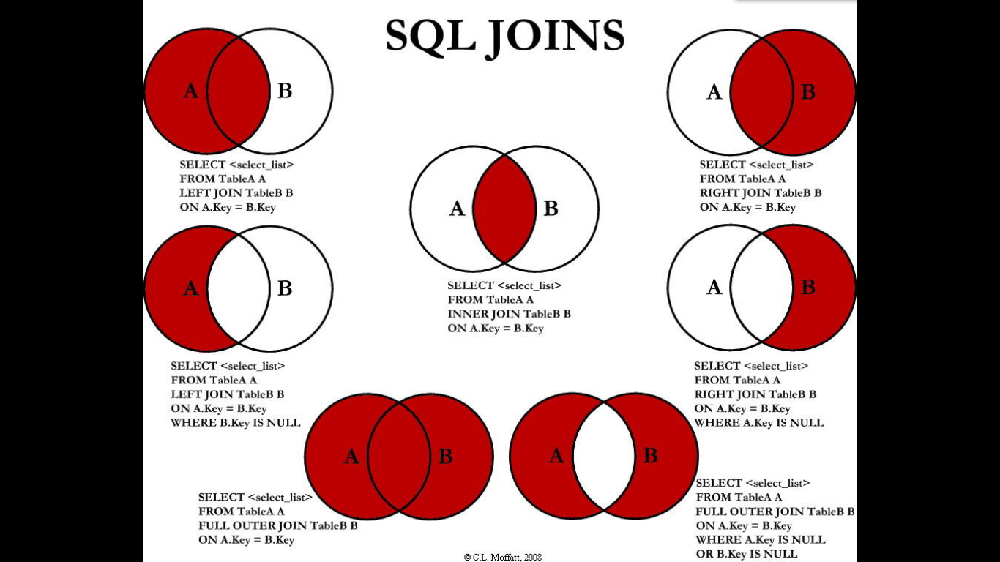

# MySQL中的连接查询

一共有7大连接查询，如下图所示



通过举例来理解吧。

# 建库建表

```mysql
USE test;
CREATE TABLE `t_dept` (
 `id` INT(11) NOT NULL AUTO_INCREMENT,
 `deptName` VARCHAR(30) DEFAULT NULL,
 `address` VARCHAR(40) DEFAULT NULL,
 PRIMARY KEY (`id`)
) ENGINE=INNODB AUTO_INCREMENT=1 DEFAULT CHARSET=utf8;
 
CREATE TABLE `t_emp` (
 `id` INT(11) NOT NULL AUTO_INCREMENT,
 `name` VARCHAR(20) DEFAULT NULL,
  `age` INT(3) DEFAULT NULL,
 `deptId` INT(11) DEFAULT NULL,
empno INT  NOT NULL,
 PRIMARY KEY (`id`),
 KEY `idx_dept_id` (`deptId`)
 #CONSTRAINT `fk_dept_id` FOREIGN KEY (`deptId`) REFERENCES `t_dept` (`id`)
) ENGINE=INNODB AUTO_INCREMENT=1 DEFAULT CHARSET=utf8;
 
 
 
INSERT INTO t_dept(deptName,address) VALUES('华山','华山');
INSERT INTO t_dept(deptName,address) VALUES('丐帮','洛阳');
INSERT INTO t_dept(deptName,address) VALUES('峨眉','峨眉山');
INSERT INTO t_dept(deptName,address) VALUES('武当','武当山');
INSERT INTO t_dept(deptName,address) VALUES('明教','光明顶');
 INSERT INTO t_dept(deptName,address) VALUES('少林','少林寺');
 
INSERT INTO t_emp(NAME,age,deptId,empno) VALUES('风清扬',90,1,100001);
INSERT INTO t_emp(NAME,age,deptId,empno) VALUES('岳不群',50,1,100002);
INSERT INTO t_emp(NAME,age,deptId,empno) VALUES('令狐冲',24,1,100003);
 
INSERT INTO t_emp(NAME,age,deptId,empno) VALUES('洪七公',70,2,100004);
INSERT INTO t_emp(NAME,age,deptId,empno) VALUES('乔峰',35,2,100005);
INSERT INTO t_emp(NAME,age,deptId,empno) VALUES('灭绝师太',70,3,100006);
INSERT INTO t_emp(NAME,age,deptId,empno) VALUES('周芷若',20,3,100007);
INSERT INTO t_emp(NAME,age,deptId,empno) VALUES('张三丰',100,4,100008);
INSERT INTO t_emp(NAME,age,deptId,empno) VALUES('张无忌',25,5,100009);
INSERT INTO t_emp(NAME,age,deptId,empno) VALUES('韦小宝',18,NULL,100010);
 
```

```mysql
SELECT * FROM t_emp;  # 10
```


一共有10条记录。

```mysql
SELECT * FROM t_dept; # 6
```


部门有6条记录，表示六大门派


# 七大连接查询

## AB共同

即查询两张表中共同的部分，即上图的交集。


查询所有 有门派的人员信息：

```mysql
SELECT * FROM t_emp a INNER JOIN t_dept b ON a.`deptId` = b.`id`;
```


从结果中发现，门派表中的“少林”与员工表的“韦小宝”不在查询结果中。只查询了两表的交集部分。**因为韦小宝不属于任何门派，而员工表中没有少林派的人员。**

------------

## A的全集


列出**所有用户**，并显示其机构信息：

```mysql
SELECT * FROM t_emp a LEFT JOIN t_dept b ON a.`deptId` = b.`id`;
```


要求列出所有的用户，应该使用**左连接**， 员工表为主表，将主表 中的数据全部查询出来，从表是部门表，与员工表不对应的部分查询为NULL。

---------


## B的全集


列出**所有门派** ：

```mysql
SELECT * FROM t_emp a RIGHT JOIN t_dept b ON a.`deptId` = b.`id`;
```


上述结果中，将所有的门派查询出来了，右边的表为主表，而左边的员工表中，有匹配的就查询，无匹配的就填充NULL。


## A的独有

所谓A的独占就是说查询出来的结果中只在A表中出现的记录，B表中无匹配。


相当于A的全集中将中间的“抠掉”,  也就是说将两表的公共部分去掉。其标准查询模板是：

```mysql
Select <select list> from A left join B on a.key = b.key where b.key IS NULL;
```


如： 查询所有不入门派的人员, 我们需要做的就是将上面红框部分的去掉，获取剩下的蓝色框部分。

```mysql
SELECT * FROM t_emp a LEFT JOIN t_dept b ON a.`deptId` = b.`id` WHERE b.`id` IS NULL;
```


---


## B的独有


同上的分析。相当于B的全集中将中间的“抠掉”,  也就是说将两表的公共部分去掉，或者说我要去的B的独有部分，A 就没啥事情了，将B全集中结果去掉A的那部分就是B的独有了。其标准查询模板是：

```mysql
Select <select list> from A right join B on a.key = b.key where a.key IS NULL;
```

查询所有没人入的门派：


```mysql
SELECT * FROM t_emp a RIGHT JOIN t_dept b ON a.`deptId` = b.`id` WHERE a.`deptId` IS NULL;
```


查出来的是少林派，的确是少林派没有人加入。

-------


## AB全有


其标准查询模板是：

```mysql
select <select list > from A FULL OUTER JOIN B ON A.key = B.key;
```

列出所有人员和门派的对应关系：

```mysql
SELECT * FROM t_emp a FULL OUTER JOIN t_dept b ON a.`deptId` = b.`id`;
```

保存如下：


这是因为MYSQL不支持`FULL JOIN`。

可以使用UNION， 可以去重

```mysql
 SELECT	* FROM t_emp a LEFT JOIN t_dept  b ON a.`deptId` = b.`id`
 UNION
 SELECT * FROM t_emp a RIGHT JOIN t_dept  b ON a.`deptId` = b.`id`;
```


分析一下, 一目了然，就是三个的并集：


---------


## A的独有+B的独有


列出所有没入派的人员和没人入的门派

没入派的就是韦小宝，没人入的门派是少林派

和上面一样，就是A的独有并上B的独有，也可以使用UNION关键字

```mysql
 # 7. 列出所有没入派的人员和没人入的门派
 SELECT * FROM t_emp a LEFT JOIN t_dept b ON a.`deptId` = b.`id` WHERE b.`id` IS NULL 
 UNION
 SELECT * FROM t_emp a RIGHT JOIN t_dept b ON a.`deptId` = b.`id` WHERE a.`deptId` IS NULL;
```


# 进阶

如果在上面的部门表上加上对应的门派掌门字段

```mysql
ALTER TABLE t_dept ADD CEO INT(11);

UPDATE t_dept SET CEO=2 WHERE id=1;
UPDATE t_dept SET CEO=4 WHERE id=2;
UPDATE t_dept SET CEO=6 WHERE id=3;
UPDATE t_dept SET CEO=8 WHERE id=4;
UPDATE t_dept SET CEO=9 WHERE id=5;
SELECT * FROM t_dept;
```


1. 求各个门派对应的掌门人名称:

   ```mysql
    SELECT * FROM t_dept b LEFT JOIN t_emp a ON  a.`id`= b.`CEO`;
   ```

   

2. 求所有当上掌门人的平均年龄:

   ```mysql
    SELECT AVG(a.`age`) FROM t_emp a INNER JOIN t_dept b ON a.`id` = b.`CEO`;
   ```

   

3. 求所有人物对应的掌门名称:

   ```mysql
    SELECT c.`name` NAME, ab.name ceoName FROM t_emp c LEFT JOIN 
    (SELECT b.`id`, a.`name` FROM t_dept b LEFT JOIN t_emp a ON  a.`id`= b.`CEO`) ab
    ON c.`deptId`= ab.id;
   ```

   这里涉及到了三表连接。在第一题中我们已经查询到了每一个门派的掌门姓名，然后我们需要查询每一个人对应的掌门姓名，可以利用第一题查询 到的结果作为另一张表，然后使用员工表去左连接查询。

   