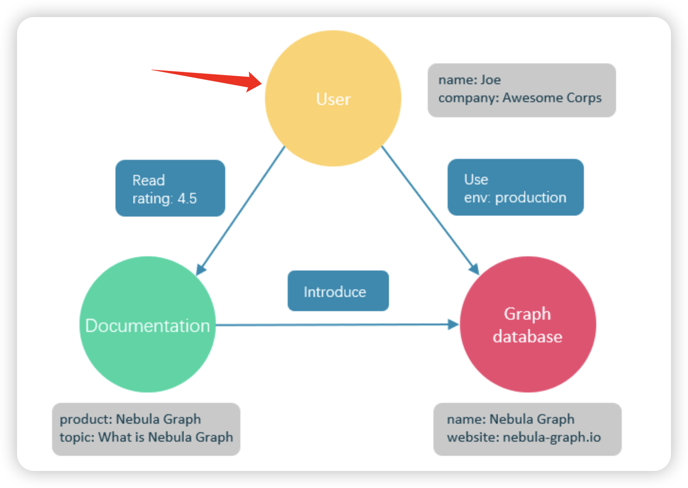

# 图数据库概述

图数据库是专门存储庞大的图形网络并从中检索信息的数据库。它可以将图中的数据高效存储为点（Vertex）和边（Edge），还可以将属性（Property）附加到点和边上。

图数据库适合存储大多数从现实抽象出的数据类型。世界上几乎所有领域的事物都有内在联系，像关系型数据库这样的建模系统会提取实体之间的关系，并将关系单独存储到表和列中，而实体的类型和属性存储在其他列甚至其他表中，这使得数据管理费时费力。

NebulaGraph 作为一个典型的图数据库，可以将丰富的关系通过边及其类型和属性自然地呈现。

