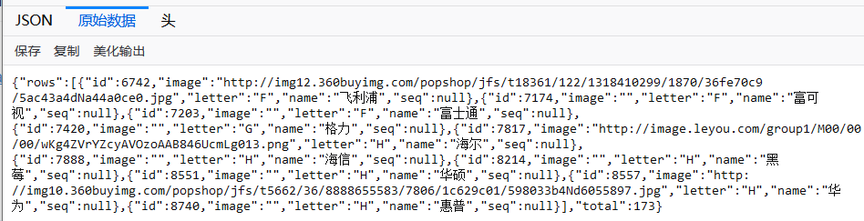

# 问题

最近一个项目中使用了pageHelper分页插件。项目地址 : http://git.oschina.net/free/Mybatis_PageHelper。 在controller中使用该插件进行分页查询遇到如下两个问题：

1. 找不到分页插件pagehelper的class: NotFoundClass exception 。。。
2. 在controller中return分页查询的结果，浏览器响应的json对象为空。。。奇了怪了！


# 解决

1. 首先在common-service模块中的pom引入pageHelper的jar包：

   ```xml
    <dependency>
               <groupId>com.github.pagehelper</groupId>
               <artifactId>pagehelper</artifactId>
           </dependency>
   
           <dependency>
               <groupId>com.github.miemiedev</groupId>
               <artifactId>mybatis-paginator</artifactId>
           </dependency>
   ```

   注意上面的mybatis-paginator 是pagehelper所依赖的包， 也需要一并引入。
   
   为了程序的优雅性，并不推荐网上一些解决方案，直接再web层的pom引用分页的jar包。使用分布式模块，远程调用service，在service层引入jar包
   
2. 这个错误。。。其实，就是分页的结果pojo需要写上get和set方法！！！！需要符合一个标准的java bean对象的标准。

   ```java
   package com.qingcheng.entity;
   
   
   import java.io.Serializable;
   import java.util.List;
   
   /**
    *
    * 分页结果的封装实体类
    * @author Hongliang Zhu
    * @create 2020-06-11 16:50
    */
   public class PageResult<T> implements Serializable { //  泛型类 ： 可以封装任何数据的分页查询结果
   
       private Long total; // 总记录数
   
       private List<T> rows; // 数据
   
       public PageResult(Long total, List<T> rows) {
           this.total = total;
           this.rows = rows;
       }
   
       public Long getTotal() {
           return total;
       }
   
       public void setTotal(Long total) {
           this.total = total;
       }
   
       public List<T> getRows() {
           return rows;
       }
   
       public void setRows(List<T> rows) {
           this.rows = rows;
       }
   
       @Override
       public String toString() {
           return "PageResult{" +
                   "total=" + total +
                   ", rows=" + rows +
                   '}';
       }
   
   
   }
   
   ```

   这错误太坑了。。。怪自己！ 之后成功解决，也该睡了，心累。

   

   