# 缓存穿透

缓存穿透的概念很简单。用户想要查询一个数据。发现redis内存数据库中没有，也就是缓存没有命中。于是向持久层数据库查询，发现也没有，于是本次查询失败。当用户很多的时候，缓存都没有命中，于是都去请求了持久层数据库，这会给持久层数据库造成很大的压力，这时候就相当于出现了缓存穿透。

黑客： id=-1，id = -2 ... 访问请求。这些id在redis中找不到，在数据库中也找不到。解决办法就是将找不到的id号在`redis`中存为null值，但是由于大量的id都找不到，而redis有内存淘汰策略，会将有效的数据淘汰掉，`redis`里面会有大量无效的数据。

## 缓存空对象

 缓存空对象是指当一个请求过来缓存中和数据库中都不存在该请求的数据，第一次请求就会跳过缓存进行数据库的访问，并且访问数据库后返回为空，此时也将该空对象进行缓存。 

```java
public class UserServiceImpl {
     @Autowired
     UserDAO userDAO;
     @Autowired
     RedisCache redisCache;
 
     public User findUser(Integer id) {
          Object object = redisCache.get(Integer.toString(id));
          // 缓存中存在，直接返回
          if(object != null) {
               // 检验该对象是否为缓存空对象，是则直接返回null
               if(object instanceof NullValueResultDO) {
                    return null;
               }
               return (User)object;
          } else {  
               // 缓存中不存在，查询数据库
               User user = userDAO.getUser(id);
               // 存入缓存
               if(user != null) {
                    redisCache.put(Integer.toString(id),user);
               } else {
                    // 将空对象存进缓存
                    redisCache.put(Integer.toString(id), new NullValueResultDO());
               }
               return user;
          }
     }          
}
```

 若是再次进行访问该空对象的时候，就会直接**击中缓存**，而不是再次**数据库**， 但是缓存空对象会带来比较大的问题，就是缓存中会存在很多空对象，占用**内存的空间**，浪费资源，一个解决的办法就是设置空对象的**较短的过期时间**，代码如下： 

```java
// 再缓存的时候，添加多一个该空对象的过期时间60秒
redisCache.put(Integer.toString(id), new NullValueResultDO(),60);
```


终极解决方案：在`redis`与`mysql`中间加一个过滤器，过滤器中需要保存未来可能查询的字段值。

过滤器不能重量级，当查询的字段多样化的时候，可能会导致内存紧张，导致过滤效率降低。布隆过滤器登场

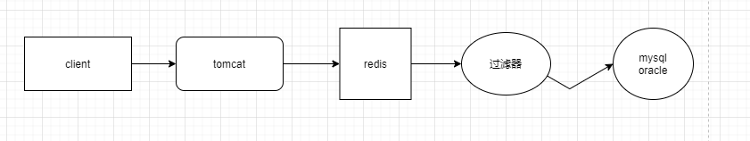

## 布隆算法

我们希望过滤器不能占用太多的内存，是一个轻量级的过滤器。

布隆过滤器是一种基于**概率**的**数据结构**，主要用来判断某个元素是否在集合内，它具有**运行速度快**（时间效率），**占用内存小**的优点（空间效率），但是有一定的**误识别率**和**删除困难**的问题。它只能告诉你某个元素一定不在集合内或可能在集合内。

布隆过滤器的特点如下：

1. 一个非常大**的二进制位数组** （数组里只有0和1）
2. 若干个**哈希函数**
3. **空间效率**和**查询效率高**
4. 不存在**漏报**（False Negative）：某个元素在某个集合中，肯定能报出来。
5. 可能存在**误报**（False Positive）：某个元素不在某个集合中，可能也被爆出来。
6. 不提供删除方法，代码维护困难。
7. 位数组初始化都为0，它不存元素的具体值，当元素经过哈希函数哈希后的值（也就是数组下标）对应的数组位置值改为1。

 

布隆算法：通过错误率来换取空间的算法。是一个数据标识算法，内部是一个二进制位数组（`bitmap`）

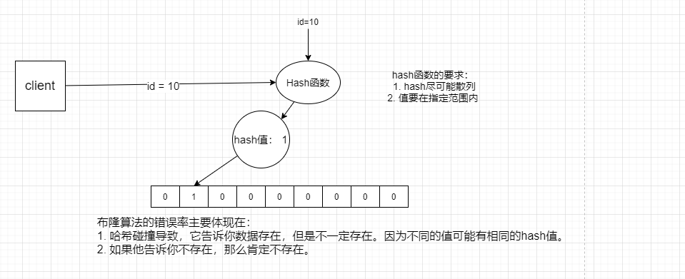

布隆过滤器会有一定的错误率，但是这个错误率在实际情况下影响并不大。如果它告诉你存在这个id值，但其实并不在，我们允许他去查询数据库，这点压力mysql还是可以承受得住的，不至于这么脆弱。

但是我们还是希望错误率越低越好，那么，错误率是什么引起的。刚刚说的hash碰撞，与数组的大小、hash函数有关系。

当数组越长，hash碰撞的概率就低。

还与hash函数的个数有关系，hash函数映射不同的hash值。

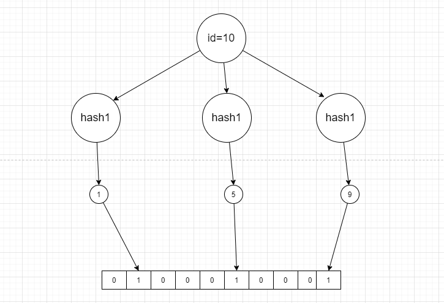

只有当三个hash函数的值都相同的时候，才会发生hash碰撞。

并不是hash函数越多越好，很多hash函数的话，可能会导致不管传入的什么值，都会返回“存在”，这样的话错误率是越来越高的。所以要把握度。

如果未来客户端往是数据库中中提交信息，也是通过上面的流程，我们是在插入数据的时候在过滤器中标志数据还是先插入到数据库中，然后返回来标识呢？

**我们可以先插入到数据库中，然后通过异步的方式，设置一个时间，将新数据在过滤器上标识。**

**那么为什么不能删除元素呢？**

原因很简单，因为删除元素后，将对应元素的下标设置为零，可能别的元素的下标也引用改下标，这样别的元素的判断就会收到影响，原理图如下：

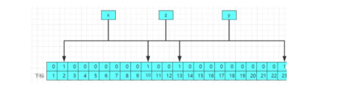

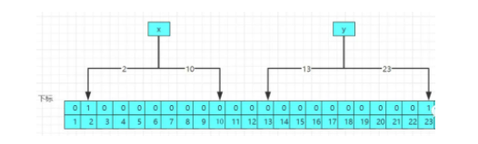

当你删除z元素之后，将对应的下标10和13设置为0，这样导致x和y元素的下标受到影响，导致数据的判断不准确，所以直接不提供删除元素的api。

##  手写一个布隆过滤器

以上说的都是布隆过滤器的原理，只有理解了原理，在实际的运用才能如鱼得水，下面就来实操代码，手写一个简单的布隆过滤器。

对于要手写一个布隆过滤器，首先要明确布隆过滤器的核心：

- 若干哈希函数
- 存值得Api
- 判断值得Api

```java
import java.util.BitSet;
/**
 * @author Hongliang Zhu
 * @create 2020-09-13 12:18
 *
 * 手写一个简单的布隆过滤器
 */
public class BloomFilter {
    // 布隆过滤器的 的长度
    private static final int SIZE = 2 << 10;
    // 模拟实现不同的hash函数
    private  static final int[] num = new int[]{5, 19, 23, 31, 47, 71};
    // 初始化位数组
    private BitSet bits = new BitSet(SIZE);
    // 用于存储Hash函数
    private MyHash[] hashFunc = new MyHash[num.length];
    // 初始化hash函数
    private BloomFilter(){
        for(int i = 0; i < num.length; i++){
            hashFunc[i] = new MyHash(SIZE, num[i]);
        }
    }

    // 存入
    public void add(String value){
        // hash计算
        for(MyHash func : hashFunc){
            // 将为数组对应的哈希下标得位置得值改为1
            bits.set(func.hash(value), true);

        }
    }

    //  判断是否存在
    public boolean contains(String value){
        if(value == null){
            return false;
        }
        boolean res = true;
        for(MyHash func : hashFunc){
            res = res && bits.get(func.hash(value));
        }
        return res;
    }

    public static void main(String[] args) {
        BloomFilter filter = new BloomFilter();
        String value = "4243212355312";
        System.out.println(filter.contains(value));
        filter.add(value);
        System.out.println(filter.contains(value));

    }

}


class  MyHash{
    private int cap;
    private int seed;

    public MyHash(int cap, int seed) {
        this.cap = cap;
        this.seed = seed;
    }

    public int hash(String value){
        int res = 0;
        int len = value.length();
        for(int i = 0;i < len; i++){
            res = seed * res + value.charAt(i);
        }
        return (cap-1) & res;
    }


}
```

> false
>
> true

在实际项目中可以使用别人已经写好的布隆过滤器，比如谷歌的 `Google Guava`，只需要在项目中引入一下依赖： 

```xml
<dependency>
    <groupId>com.google.guava</groupId>
    <artifactId>guava</artifactId>
    <version>27.0.1-jre</version>
</dependency>
```

```java
public static void MyBloomFilterSysConfig {

     @Autowired
     OrderMapper orderMapper
     
    // 1.创建布隆过滤器  第二个参数为预期数据量10000000，第三个参数为错误率0.00001
    BloomFilter<CharSequence> bloomFilter =  BloomFilter.create(Funnels.stringFunnel(Charset.forName("utf-8")),10000000, 0.00001);
    // 2.获取所有的订单，并将订单的id放进布隆过滤器里面
    List<Order> orderList = orderMapper.findAll()
    for (Order order;orderList ) {
        Long id = order.getId();
        bloomFilter.put("" + id);
    }
}
```

 在实际项目中会启动一个**系统任务**或者**定时任务**，来初始化布隆过滤器，将热点查询数据的id放进布隆过滤器里面，当用户再次请求的时候，使用布隆过滤器进行判断该订单的id是否在布隆过滤器中存在，不存在直接返回null，具体操作代码： 

```java
// 判断订单id是否在布隆过滤器中存在
bloomFilter.mightContain("" + id)
```

 布隆过滤器的缺点就是要维持容器中的数据，因为订单数据肯定是频繁变化的，实时的要更新布隆过滤器中的数据为最新。

---

 

# 缓存击穿

 这个跟**缓存雪崩**有点像，但是又有一点不一样，缓存雪崩是因为大面积的缓存失效，打崩了DB，而缓存击穿不同的是**缓存击穿**是指**一个Key**非常热点，在不停的扛着大并发，大并发集中对这一个点进行访问，当这个Key在失效的瞬间，持续的大并发就穿破缓存，直接请求数据库，就像在一个完好无损的桶上凿开了一个洞。 

缓存击穿这里强调的是**并发**，造成缓存击穿的原因有以下两个：

1. 该数据没有人查询过 ，第一次就大并发的访问。（冷门数据）
2. 添加到了缓存，`reids`有设置数据失效的时间 ，这条数据刚好失效，大并发访问（热点数据）

 **缓存击穿**的话，设置热点数据永远不过期。或者使用分布式锁解决。

但是是对于一般的场景来说，缓存击穿不需要去解决。因为mysql可以承受。

当用户出现**大并发**访问的时候，在查询缓存的时候和查询数据库的过程加锁，只能第一个进来的请求进行执行，当第一个请求把该数据放进缓存中，接下来的访问就会直接集中缓存，防止了**缓存击穿**。 

业界比价普遍的一种做法，即根据key获取value值为空时，锁上，从数据库中`load`数据后再释放锁。若其它线程获取锁失败，则等待一段时间后重试。这里要注意，分布式环境中要使用**分布式锁**，**单机**的话用普通的锁（`synchronized`、`Lock`）就够了。 

单机版的锁：

```java
// 获取库存数量
public String getProduceNum(String key) {
    try {
        synchronized (this) {   //加锁
            // 缓存中取数据，并存入缓存中
            int num= Integer.parseInt(redisTemplate.opsForValue().get(key));
            
            if (num> 0) {
                //没查一次库存-1
                redisTemplate.opsForValue().set(key, (num- 1) + "");
                System.out.println("剩余的库存为num：" + (num- 1));
            } else {
                System.out.println("库存为0");
            }
        }
    } catch (NumberFormatException e) {
        e.printStackTrace();
    } finally {
    }
    return "OK";
}
```

分布式锁可以使用Redisson来实现。

```java
public String getProduceNum(String key) {
    // 获取分布式锁
    RLock lock = redissonClient.getLock(key);
    try {
        // 获取库存数
        int num= Integer.parseInt(redisTemplate.opsForValue().get(key));  
        // 上锁           
        lock.lock();
        if (num> 0) {
            //减少库存，并存入缓存中
            redisTemplate.opsForValue().set(key, (num - 1) + "");
            System.out.println("剩余库存为num：" + (num- 1));
        } else {
            System.out.println("库存已经为0");
        }
    } catch (NumberFormatException e) {
        e.printStackTrace();
    } finally {
        //解锁
        lock.unlock();
    }
    return "OK";
}
```

## 分布式锁

需要加锁的条件

1. 共享资源
2. 共享资源互斥
3. 多任务环境

缺一不可。

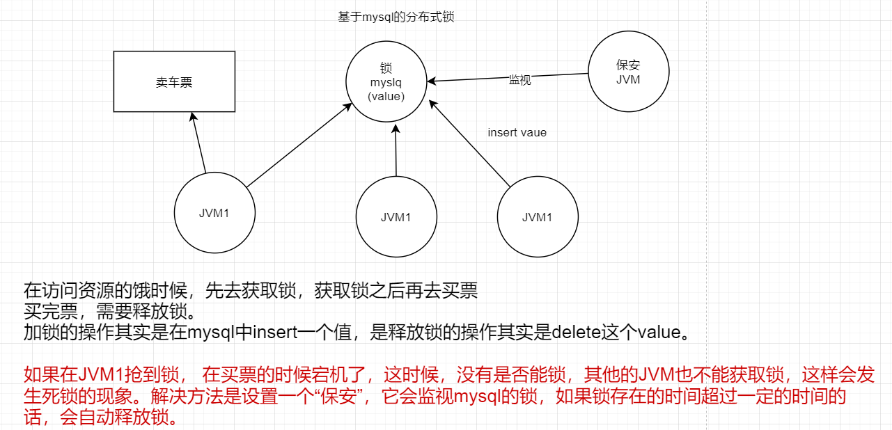

但是设置“保安”也可能会发生死锁，因为保安可能会挂。

考虑另一个场景，加入现在JVM1抢到了锁，可以去买票了，但是在买票的过程中，JVM1出现了GC，我们知道，GC的话用户线程会挂起，所以买票会休眠，如果GC时间大于“保安JVM”设置的时间，那么到时会收回锁，这时其他的JVM都可以获取锁，那么就可能出现两个JVM一起来买票。这样的话很可能出现一票多卖的问题。

那么，我们应该给“保安JVM”的超时时间多长合适呢？我们并不知道JVM休眠的时间多少，加入设置超时时间为1小时，那么在买票的第一秒钟宕机了的话，需要等待59分59秒才能获取锁，这样就无法在单位时间内卖出更多的票了。如果超时时间设置的比较短，那么可能会出现上面所说的JVM乱入的现象。所以超时时间的设置是比较重要的。

使用redis分布式锁的原因是redis天生具有有效期这个特性，就不用“保安JVM”了。但是基于redis来做的话还是会出现这个度的问题，超时时间。【后期看看redission框架】

我们一般使用`zookeeper`来设置分布式锁。

zookeeper是一个分布式的一致性服务。

总结一下分布式锁的解决思路：

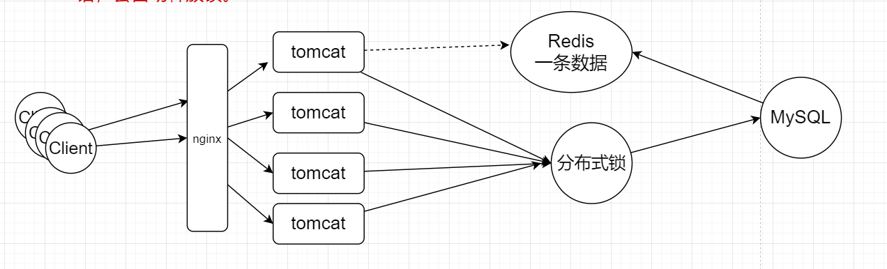

发生缓存击穿的时候，多个请求一起打在mysql，如果需要访问myslq的话，必须先获得分布式锁，先获取分布式锁的那个client先去mysql查询数据，然后缓存在redis中，之后的client就不需要再次抢分布式锁了，直接在redis缓存中去查询即可。这就是分布式锁解决缓存击穿的原理。


# 缓存雪崩

 同一时间**缓存大面积失效**，那一瞬间Redis跟没有一样，那这个数量级别的请求直接打到数据库几乎是灾难性的。

**导致缓存雪崩的原因：**

1. **缓存数据的有效期是一致的， 造成缓存大面积失效**
2. **Redis宕机**


对于缓存雪崩的解决方案有以下两种：

1. 搭建**高可用**的集群，防止单机的redis宕机。
2. 设置不同的过期时间，防止同意之间内大量的key失效。

 处理缓存雪崩简单，在批量往**Redis**存数据的时候，把每个Key的失效时间都加个随机值就好了，这样可以保证数据不会在同一时间大面积失效，我相信，Redis这点流量还是顶得住的。

如果Redis挂了，那么可以设置Redis集群。

Redis集群有**切片集群**和**主从复制**

切片集群就是将热点数据分散放在各个服务器上

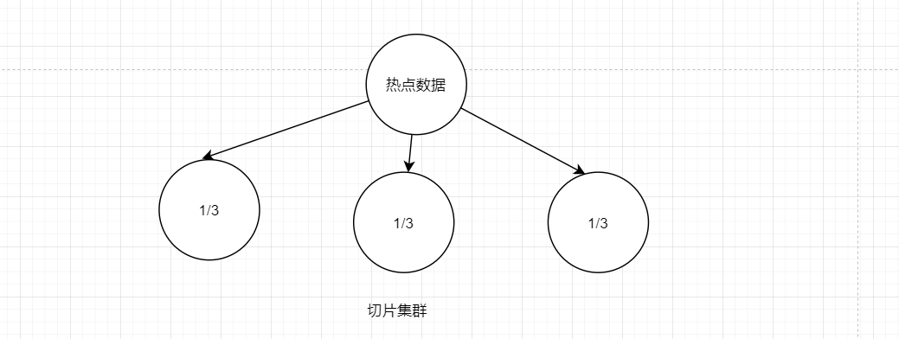

主从复制的话就是每台服务器存放相同的数据

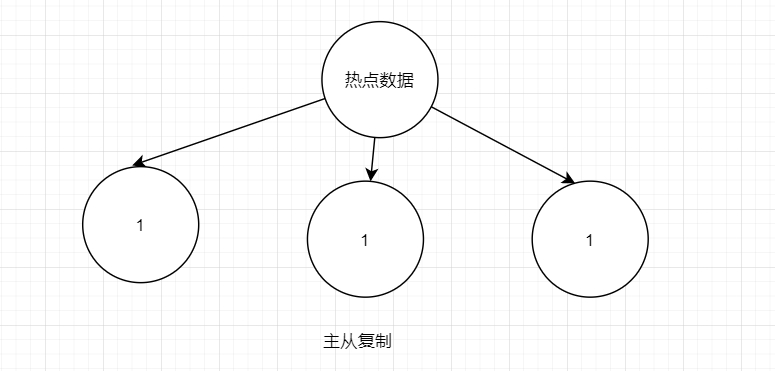


# 一致性Hash算法

上面说的切片集群，当数据量很大的时候，建议这么做。但是我们不能做到每一台服务器上的数据都是平均的，可能会发生数据倾斜。假如现在新增一台服务器，我们需要从其他的服务器复制一部分数据给新的服务器，这样会发生大量的复制，在复制的过程中，redis服务器是无法提供服务的？？？（不能fork子进程去复制吗），那么就又会发生缓存雪崩的现象。

那么一致性Hash算法就可以解决**集群动态扩展问题。**内部是通过**哈希环**来实现的。

在实现分布式缓存的时候，我们怎么讲数据平均地去分配到redis服务器中？

加入现在redis集群中只有两台数据库。如下所示分配原理。

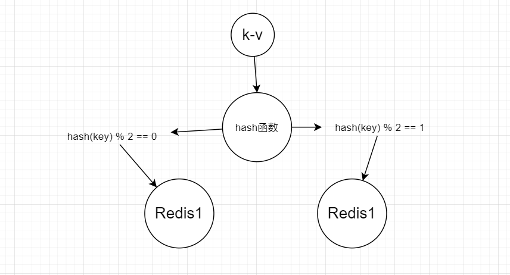

假如新增一台服务器，hash函数应该%3 ，这时候需要将原来的数据的重新分配。这样会导致大量的数据迁移。原来能找的数据现在找不到了，导致大量的缓存失效，出现缓存雪崩的现象。那么可以使用一致性hash算法来解决。内部是通过**哈希环**来实现的。

## hash环

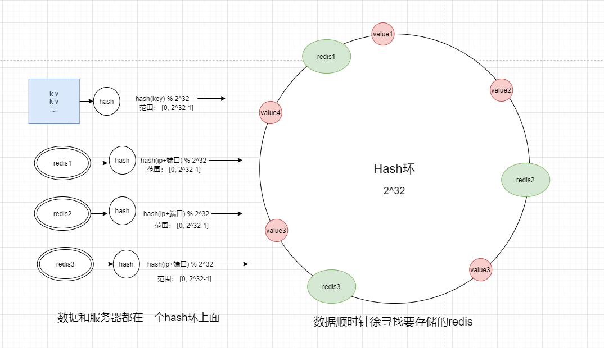

将数据和redis都映射到一个hash环上面，数据顺时针去寻找要存储的redis。

这样可以避免大量数据的迁移。但是还是可能会发生数据倾斜。

解决方法就是设置**虚拟节点**。

我们理想的环境是，让数据均匀地覆盖到每一台服务器上，但是使用一致性hash算法映射到hash环中很有可能是倾斜的。

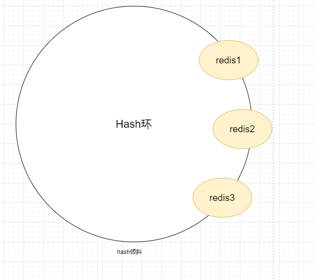

这样会导致大量的数据都缓存在redis1中，导致分局分布极度不均匀，机器没有平均地被使用。要想数据均匀分布到服务器上，很直观的想法就是让服务器的数量尽量多，且均匀地出现在hash环上面。

我们可以给每一个服务器设置许多虚拟节点。

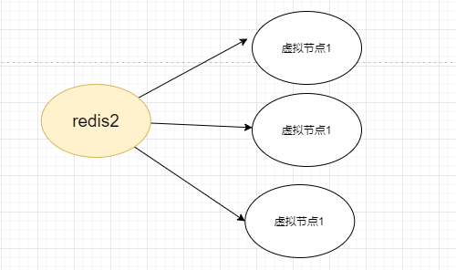

虚拟节点越多，就更有概率使其均匀分布在hash环上面。

具体缓存读写的时候先找到虚拟节点，然后在从虚拟节点找到真实redis服务器实现读写。这样就解决了数据倾斜的问题。

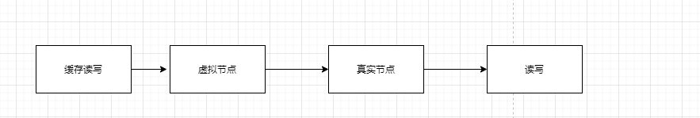


最后，解决几个问题。

## 一致性hash的性质

### 平衡性

也就是hash的结果应该尽可能分散，避免出现过多的hash碰撞。

### 单调性

所谓单调性也就是指，当有新的节点增加的时候，旧数据的寻找方式应该一致，即按照原来的方式找到数据所对应的服务器，而新数据可以按照新的散列算法找到服务器。

如果不单调的话，当新的节点 增加的时候，导致所有的数据都需要重新计算，这样会有大量的数据迁移，开销很大。

### 分散性

在分布式环境中，终端有可能看不到所有的缓冲，而是只能看到其中的一部分。当终端希望通过哈希过程将内容映射到缓冲上时，由于不同终端所见的缓冲范围有可能不同，从而导致哈希的结果不一致，最终的结果是相同的内容被不同的终端映射到不同的缓冲区中。这种情况显然是应该避免的，因为它导致相同内容被存储到不同缓冲中去，降低了系统存储的效率。分散性的定义就是上述情况发生的严重程度。好的哈希算法应能够尽量避免不一致的情况发生，也就是尽量降低分散性。 

### 负载

负载问题实际上是从另一个角度看待分散性问题。既然不同的终端可能将相同的内容映射到不同的缓冲区中，那么对于一个特定的缓冲区而言，也可能被不同的用户映射为不同的内容。与分散性一样，这种情况也是应当避免的，因此好的哈希算法应能够尽量降低缓冲的负荷。 

### 平滑性(Smoothness)

平滑性是指缓存服务器的数目平滑改变和缓存对象的平滑改变是一致的。

## hash环上是怎么定位所在的服务器的

定位数据存储在哪台服务器的方法为：将数据key使用相同的函数Hash计算出哈希值，并确定此数据在环上的位置，从此位置沿环顺时针“行走”，第一台遇到的服务器就是其应该定位到的服务器

**可以为这些服务器维护一条二分查找树，定位服务器的过程就是在二分查找树中找刚好比其大的节点。** 

如果一台服务器不可用，则受影响的数据仅仅是此服务器到其环空间中前一台服务器（即沿着逆时针方向行走遇到的第一台服务器）之间数据，其它不会受到影响。

在一致性哈希算法中，如果增加一台服务器，则受影响的数据仅仅是新服务器到其环空间中前一台服务器（即沿着逆时针方向行走遇到的第一台服务器）之间数据，其它数据也不会受到影响。 

综上所述，一致性哈希算法对于节点的增减都只需重定位环空间中的一小部分数据，具有较好的**容错性和可扩展性。** 

## 假如出现数据倾斜怎么办

当服务节点太少的话，很容易因为节点分布不均匀而造成数据倾斜问题。

一致性hash算法引入了虚拟节点机制。 即对每一个服务节点计算多个哈希（可以用原节点key+"##xxxk"作为每个虚拟节点的key，然后求hashcode）， 每个计算结果位置都放置一个此服务节点，称为虚拟节点。

具体做法可以在服务器ip或主机名的后面增加编号来实现。例如上面的情况，可以为每台服务器计算三个虚拟节点，于是可以分别计算 “Node A#1”、“Node A#2”、“Node A#3”、“Node B#1”、“Node B#2”、“Node B#3”的哈希值，于是形成六个虚拟节点。

数据定位算法不变，只是多了一步虚拟节点到实际节点的映射，例如定位到“Node A#1”、“Node A#2”、“Node A#3”三个虚拟节点的数据均定位到Node A上。这样就解决了服务节点少时数据倾斜的问题。在实际应用中，通常将虚拟节点数设置为32甚至更大，因此即使很少的服务节点也能做到相对均匀的数据分布。 

 一致性hash算法在分布式环境中应用的很广，只要是涉及到分布式存储的负载均衡问题，一致性hash都是很好的解决的方案。 

## Hash环是一个什么数据结构

我们知道，一致性hash算法是基于hash环来实现的，怎么构造一个$ 2^{32}$ 的整数环？然后根据节点名称的hash值将服务器节点放置在这个hash环中。应该选用什么样的数据结构，才能使得时间复杂度最低？

最直观的考虑，是使用一个list，而且是有序的。每次按照顺序去找数据所对应的服务节点。时间复杂度为O(N)。

如果采用二叉查找树，查找的时间复杂度可以为O(logN）。但是不能简单使用一般的二叉树，因为在最坏的情况下，可能会链化。时间复杂度退化为O(N)。

我们可以使用AVL树或者红黑树。

使用红黑树的原因如下：

1. 因为红黑树本身主要的作用就是存储有序的数据，这其实和第一种方案想一块去了，但是效率比使用list效率快多了。

2. JDK中提供了红黑树的数据结构代码实现 TreeMap和TreeSet。

   以TreeMap为例，TreeMap本身提供了一个`tailMap`(K fromKey)方法，支持从红黑树中查找比fromKey大的值的集合，但并不需要遍历整个数据结构，然后再从集合中取第一个即可，更方便的TreeMap提供了`higherKey`(k key)，可以直接获取第一个比参数key大的对象，这里要注意的是，如果tailMap.isEmpty()==true或higherkey返回null，代表数据在环的末端，这时应该取tailMap中最小的元素作为存储服务器，即tailMap.firstKey()。 


## 虚拟节点是怎么和物理节点对应的

加入节点A的key为keyA，我们可以循环生成若干个虚拟节点，key分别为keyA##VN0、keyA##VN1、keyA##VN2.....keyA##VNn。然后采用上面的hash算法分别求这些虚拟节点的hashcode，然后放入hash环中（即TreeMap中），定位数据所属的服务器节点时，假设返回keyA##VNk，则通过截取可以获取物理节点keyA。

# 参考

1. [一不小心肝出了4W字的Redis面试教程](https://mp.weixin.qq.com/s?__biz=MzAxNjM2MTk0Ng==&mid=2247492908&idx=2&sn=c267f0a64a0351c04ec90aee67adea53&chksm=9bf75599ac80dc8f4dd0c0c7e26d02687d9b2d09c65e31cbbe93e7538141a31717ddb092d3d0&mpshare=1&scene=24&srcid=0910zUE11c03LEUNb2MMQlcQ&sharer_sharetime=1599710287928&sharer_shareid=aeb401628295afea2c86016b3d2e688a&key=c3402f98b9ff36461430d990546f29bfee944ed635248dc88054dbf8009b06d8618ec57a50704ad9bb8a909c006789d1e5b3746ef9e424bc694da2f72645940c7643236ec0f2c6161f1529cd0b7766464850db79ab9570fb2ad0b0a7f3e3dcb4648db6b2d653b7497ff50dc767275e4a8c36f99b2e92233b4fca409ac156c633&ascene=14&uin=MjY3ODQ2NDEwMA%3D%3D&devicetype=Windows+10+x64&version=62090538&lang=zh_CN&exportkey=AdPC4RHJGpcux7aZXd97k0Y%3D&pass_ticket=i7dXOrdw4RePybTZOo6ZJhWekdu7HluH0I8XZTjYjDnJGqh1XgpinBI8xO777jWR&wx_header=0)
2. https://blog.csdn.net/wudiyong22/article/details/78687246


