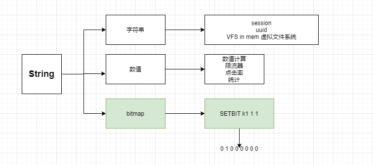
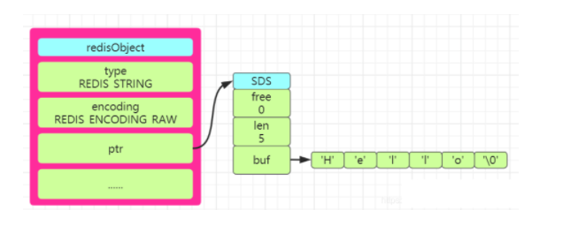
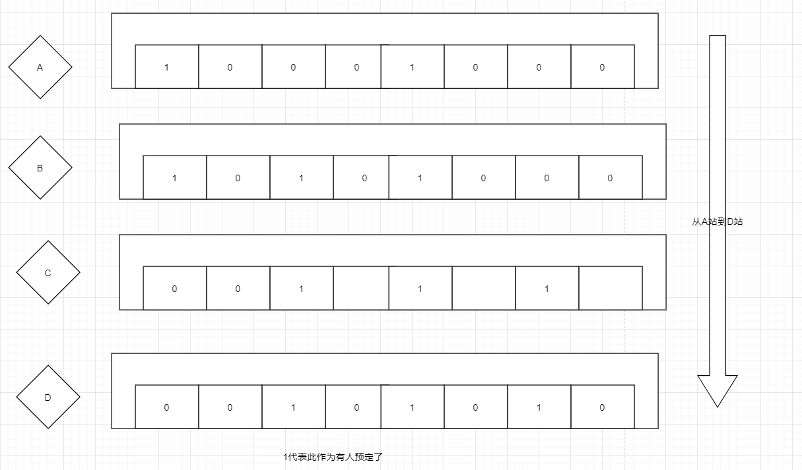
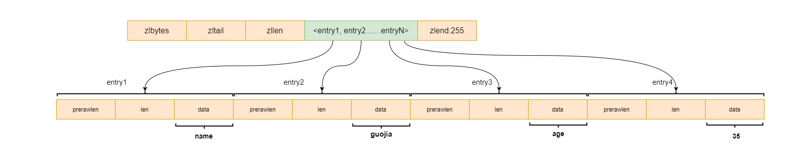

---
tags:
  - redis
title: Redis的Value类型及其应用场景
categories:
  - Redis
cover: /img/cover/redis.jpg
date: 2020-09-13 11:49:24
toc: true
---


# String

## 数据类型

字符串类型，也可以进行数值计算，bitmap也属于String。



```bash
127.0.0.1:6379> set a hello
OK
127.0.0.1:6379> get a
"hello"
```

String类型的数据结构存储方式有三种`int、raw、embstr`。那么这三种存储方式有什么区别 

```bash
127.0.0.1:6379> set k1 345
OK
127.0.0.1:6379> object encoding k1
"int"
127.0.0.1:6379> set k2 3.2000
OK
127.0.0.1:6379> object encoding k2
"embstr"
127.0.0.1:6379> 
```

Redis中规定假如存储的是**整数型值**，比如`set num 123`这样的类型，就会使用 int的存储方式进行存储，在redisObject的**ptr属性**中就会保存该值。 

假如存储的**字符串是一个字符串值并且长度大于32个字节**就会使用`SDS（simple dynamic string）`方式进行存储，并且encoding设置为raw；若是**字符串长度小于等于32个字节**就会将encoding改为embstr来保存字符串.

 SDS称为**简单动态字符串**，对于SDS中的定义在Redis的源码中有的三个属性`int len、int free、char buf[]`。  len保存了字符串的长度，free表示buf数组中未使用的字节数量，buf数组则是保存字符串的每一个字符元素。 



SDS与C语言字符串有什么区别呢？

Redis没有使用C语言的字符串，而是自己定义和设计了自己的字符串类型，具有很多优势、

1. C语言的字符串类型没有len属性，如果要获得字符串的长度只能遍历一遍去统计，时间复杂度为O(n)。而Redis中的SDS有len这个属性，直接返回len值就行，时复为O(1)。

2. C语言两个字符串拼接如果没有分配足够长度的空间的话，会出现缓冲区溢出的情况。而redis会先根据 len的属性判断空间是否满足要求，空间不够时会相应扩展，不会缓冲区溢出。

    具体的空间预分配原则是：**当修改字符串后的长度len小于1MB，就会预分配和len一样长度的空间，即len=free；若是len大于1MB，free分配的空间大小就为1MB**。 

3. SDS有空间预分配和惰性空间释放两种策略。在为字符串分配空间的时候，分配的空间比实际要多。能**减少连续的执行字符串增长带来内存重新分配的次数** 。

4.  当字符串被**缩短**的时候，SDS也不会立即回收不适用的空间，而是通过`free`属性将不使用的空间记录下来，等后面使用的时候再释放。 

5. SDS是二进制安全的，除了可以储存字符串以外还可以储存二进制文件（如图片、音频，视频等文件的二进制数据）；而c语言中的字符串是以空字符串作为结束符，一些图片中含有结束符，因此不是二进制安全的。 

| c语言字符串                          | SDS                            |
| :----------------------------------- | :----------------------------- |
| 获取长度的时间复杂度为O(n)           | 获取长度的时间复杂度为O(1)     |
| 不是二进制安全的                     | 是二进制安全的                 |
| 只能保存字符串                       | 还可以保存二进制数据           |
| n次增长字符串必然会带来n次的内存分配 | n次增长字符串内存分配的次数<=n |


## VFS 虚拟文件系统

```bash
127.0.0.1:6379> set /root/user/video a.ma4
OK
127.0.0.1:6379> get /root/user/video
"a.ma4"

```

## 数值计算

```bash
127.0.0.1:6379> set k1 4
OK
127.0.0.1:6379> DECR k1
(integer) 3
127.0.0.1:6379> get k1
"3"
127.0.0.1:6379> INCRBY k1 5
(integer) 8
127.0.0.1:6379> get k1
"8"
```

## strlen 计算的是字节数

```bash
127.0.0.1:6379> set k1 a
OK
127.0.0.1:6379> STRLEN a
(integer) 0
127.0.0.1:6379> STRLEN k1
(integer) 1
127.0.0.1:6379> APPEND k1 xxoo
(integer) 5
127.0.0.1:6379> STRLEN k1
(integer) 5
127.0.0.1:6379> APPEND k1 朱
(integer) 8
127.0.0.1:6379> get k1
"axxoo\xe6\x9c\xb1"
127.0.0.1:6379> strlen k1
(integer) 8

```

# bitmap

是一个二进制位

```bash
127.0.0.1:6379> SETBIT k1 1 1 # 0 1 0 0 0 0 0 0
(integer) 0
127.0.0.1:6379> get k1
"@" # 表示是ASCII码
```

```bash
127.0.0.1:6379> SETBIT k1 7 1   # 0 1 0 0 0 0 0 1
(integer) 0
127.0.0.1:6379> get k1
"A"

127.0.0.1:6379> SETBIT k2 1 1
(integer) 0
127.0.0.1:6379> SETBIT k2 6 1
(integer) 0
127.0.0.1:6379> get k2
"B"
```

## 与或操作

```bash
127.0.0.1:6379> BITOP and andkey k1 k2
(integer) 1
127.0.0.1:6379> get andkey
"@"
# 0 1 0 0 0 0 0 1
 # 0 1 0 0 0 0 1 0
 # --> 0 1 0 0 0 0 0 0   @
 
 
 127.0.0.1:6379> BITOP or  orkey k1 k2
(integer) 1
127.0.0.1:6379> get orkey
"C"
```

如果设置的位数很大，会自动进行字节拓宽

```bash

127.0.0.1:6379> SETBIT k1 9999 1
(integer) 0
127.0.0.1:6379> STRLEN k1
(integer) 1250
127.0.0.1:6379>
```

## bitcount统计1的个数

```bash
127.0.0.1:6379> BITCOUNT k1 0 0
(integer) 2
127.0.0.1:6379> BITCOUNT k1 0 -1
(integer) 3
```

## bitmap的应用场景

### 用户统计

需求： 统计任意时间窗 统计用户的登录天数

使用bitmap来做。

比如统计一年内用户的登录天数，可以创建一个365位的bitmap，用户在哪一天登陆了，就将对应的位置为1，然后使用bitcount来统计1的个数，即为用户的登录总天数。

```bash
127.0.0.1:6379> SETBIT hongliang 2 1
(integer) 0
127.0.0.1:6379> SETBIT hongliang 364  1
(integer) 0
127.0.0.1:6379> BITCOUNT hongliang 0 -1
(integer) 2  # 两天

```

```bash
127.0.0.1:6379> STRLEN hongliang
(integer) 46  # 只消耗了46个字节就能存储一年的时间
```

### 京东618只要用户登录就送一个礼物

假设京东有2个亿个用户，那么我们需要准备多少份礼物。

用户分为活跃用户和僵尸用户，我们应该为活跃用户准备礼物。

```bash
127.0.0.1:6379> SETBIT 20200101 2 1  # 2020年1月1日，用户3登陆了
(integer) 0
127.0.0.1:6379> SETBIT 20200101 6 1 # 2020年1月1日，用户7登陆了
(integer) 0
127.0.0.1:6379> SETBIT 20200102 6 1 # 2020年1月2日，用户7登陆了
(integer) 0
```

这样设计，我们可以看出， 1月1日和1月2日两天只有两个用户登陆了，我们可以使用或运算来得出2.

```bash
127.0.0.1:6379> BITOP or res 20200101  20200102
(integer) 1
127.0.0.1:6379> BITCOUNT res 0 -1
(integer) 2
```

### 12306

12306买票问题



将座位的情况缓存到redis中，每一个站的座位情况使用bitmap来处理。

假如客户P买了从A-B的车票，客户Q想买A-D的车票，那么只需要将ABCD四个站的bitmap进行或运算即可，为0的那个座位才能买。

### linux权限管理

chmod 777  

rwx rwx rwx 持有者  持有组  其他人 任何人都有权限

三个位分别表示421

000 = 0

111=  7


# List

 Redis中的列表在3.2之前的版本是使用`ziplist`和`linkedlist`进行实现的。在3.2之后的版本就是引入了`quicklist`。 

linkedlist是一个双向链表。quicklist底层也是采用链表实现的。

**Redis中链表的特性：**

1. 每一个节点都有指向前一个节点和后一个节点的指针。
2. 头节点和尾节点的prev和next指针指向为null，所以链表是无环的。
3. 链表有自己长度的信息，获取长度的时间复杂度为O(1)。

## 数据结构使用

lpush  队列

rpop 栈

LinkedList 双向链表

lindex 数组

```bash
127.0.0.1:6379> LPUSH k1 a b c d e
(integer) 5
127.0.0.1:6379> LRANGE k1 0 -1
1) "e"
2) "d"
3) "c"
4) "b"
5) "a"
127.0.0.1:6379> LINDEX k1 2
"c"
127.0.0.1:6379> rpush k1 x y z
(integer) 8
127.0.0.1:6379> LRANGE k1 0 -1
1) "e"
2) "d"
3) "c"
4) "b"
5) "a"
6) "x"
7) "y"
8) "z"
127.0.0.1:6379> rpop k1
"z"
```

ltrim 保留数据

```bash

127.0.0.1:6379> LRANGE k1 0 -1
1) "e"
2) "d"
3) "c"
4) "b"
5) "a"
6) "x"
7) "y"
8) "z"
127.0.0.1:6379> rpop k1
"z"
127.0.0.1:6379> LTRIM k1 0 3 # 保留0-3的数据，其他的都删除
OK
127.0.0.1:6379> LRANGE k1 0 -1
1) "e"
2) "d"
3) "c"
4) "b"
```

## 应用场景

### 阻塞队列

 结合lpush和brpop命令就可以实现。生产者使用lupsh从列表的左侧插入元素，消费者使用brpop命令从队列的右侧获取元素进行消费。 

```java
package cn.hongliang.redismessage.config;

import org.springframework.beans.factory.annotation.Value;
import org.springframework.context.annotation.Bean;
import org.springframework.context.annotation.Configuration;
import org.springframework.data.redis.connection.RedisStandaloneConfiguration;
import org.springframework.data.redis.connection.jedis.JedisConnectionFactory;
import org.springframework.data.redis.core.RedisTemplate;
import org.springframework.data.redis.core.StringRedisTemplate;
import redis.clients.jedis.JedisPoolConfig;

/**
 * @author Hongliang Zhu
 * @create 2020-09-12 15:44
 */
@Configuration
public class RedisConfig {
    @Value("${spring.redis.host}")
    private String host;

    @Value("${spring.redis.port}")
    private int port;

    @Value("${spring.redis.pool.max-active}")
    private int maxActive;
    @Value("${spring.redis.pool.max-idle}")
    private int maxIdle;
    @Value("${spring.redis.pool.min-idle}")
    private int minIdle;
    @Value("${spring.redis.pool.max-wait}")
    private int maxWait;
    @Value("${spring.redis.database}")
    private int database;
    @Value("${spring.redis.timeout}")
    private int timeout;

    @Bean
    public JedisPoolConfig getRedisConfiguration(){
        JedisPoolConfig jedisPoolConfig = new JedisPoolConfig();
        jedisPoolConfig.setMaxTotal(maxActive);
        jedisPoolConfig.setMaxIdle(maxIdle);
        jedisPoolConfig.setMaxWaitMillis(maxWait);
        return jedisPoolConfig;
    }

    @Bean
    public JedisConnectionFactory getRedisConnectionFactory() {
        RedisStandaloneConfiguration redisStandaloneConfiguration = new RedisStandaloneConfiguration();
        redisStandaloneConfiguration.setHostName(host);
        redisStandaloneConfiguration.setPort(port);
        redisStandaloneConfiguration.setDatabase(database);
        JedisPoolConfig jedisPoolConfig= getRedisConfiguration();
//        redisStandaloneConfiguration.setPoolConfig(jedisPoolConfig);

        JedisConnectionFactory factory = new JedisConnectionFactory(redisStandaloneConfiguration);
        factory.setPoolConfig(jedisPoolConfig);
        return factory;
    }

    @Bean
    public RedisTemplate<?, ?> getRedisTemplate() {
        JedisConnectionFactory factory = getRedisConnectionFactory();
        RedisTemplate<?, ?> redisTemplate = new StringRedisTemplate(factory);
        return redisTemplate;
    }
}

```


```JAVA
package cn.hongliang.utils;

import org.springframework.beans.factory.annotation.Autowired;
import org.springframework.data.redis.core.RedisTemplate;
import org.springframework.stereotype.Component;

import java.util.List;

/**
 * @author Hongliang Zhu
 * @create 2020-09-12 15:59
 */
@Component
public class RedisUtil {

    @Autowired
    private RedisTemplate<String, Object> redisTemplate;

    /**
     * 存消息到消息队列中
     * @param key 键
     * @param value 值
     * @return
     */
    public boolean lPushMessage(String key, Object value) {
        try {
            redisTemplate.opsForList().leftPush(key, value);
            return true;
        } catch (Exception e) {
            e.printStackTrace();
            return false;
        }
    }

    /**
     * 从消息队列中弹出消息 - <rpop：非阻塞式>
     * @param key 键
     * @return
     */
    public Object rPopMessage(String key) {
        try {
            return redisTemplate.opsForList().rightPop(key);
        } catch (Exception e) {
            e.printStackTrace();
            return null;
        }
    }

    /**
     * 查看消息
     * @param key 键
     * @param start 开始
     * @param end 结束 0 到 -1代表所有值
     * @return
     */
    public List<Object> getMessage(String key, long start, long end) {
        try {
            return redisTemplate.opsForList().range(key, start, end);
        } catch (Exception e) {
            e.printStackTrace();
            return null;
        }
    }


}

```


# Hash

Hash对象的实现方式有两种，分别是ziplist、hashtable；

## ziplist

压缩列表`（ziplist）`是一组连续内存块组成的顺序的数据结构，压缩列表能够节省空间，压缩列表中使用多个节点来存储数据。

压缩列表是列表键和哈希键底层实现的原理之一，**压缩列表并不是以某种压缩算法进行压缩存储数据，而是它表示一组连续的内存空间的使用，节省空间**，压缩列表的内存结构图如下：



压缩列表中每一个节点表示的含义如下所示：

1. `zlbytes`：4个字节的大小，记录压缩列表占用内存的字节数。
2. `zltail`：4个字节大小，记录表尾节点距离起始地址的偏移量，用于快速定位到尾节点的地址。
3. `zllen`：2个字节的大小，记录压缩列表中的节点数。
4. `entry`：表示列表中的每一个节点。
5. `zlend`：表示压缩列表的特殊结束符号`'0xFF'`。

再压缩列表中每一个entry节点又有三部分组成，包括`previous_entry_ength、encoding、content`。

1. `previous_entry_ength`表示前一个节点entry的长度，可用于计算前一个节点的其实地址，因为他们的地址是连续的。
2. encoding：这里保存的是content的内容类型和长度。
3. content：content保存的是每一个节点的内容。

## 用法类似HashMap

类似HashMap， 用法如下：

```bash
help @hash

  HDEL key field [field ...]
  summary: Delete one or more hash fields
  since: 2.0.0

  HEXISTS key field
  summary: Determine if a hash field exists
  since: 2.0.0

  HGET key field
  summary: Get the value of a hash field
  since: 2.0.0

  HGETALL key
  summary: Get all the fields and values in a hash
  since: 2.0.0

  HINCRBY key field increment
  summary: Increment the integer value of a hash field by the given number
  since: 2.0.0

  HINCRBYFLOAT key field increment
  summary: Increment the float value of a hash field by the given amount
  since: 2.6.0

  HKEYS key
  summary: Get all the fields in a hash
  since: 2.0.0

  HLEN key
  summary: Get the number of fields in a hash
  since: 2.0.0

  HMGET key field [field ...]
  summary: Get the values of all the given hash fields
  since: 2.0.0

  HMSET key field value [field value ...]
  summary: Set multiple hash fields to multiple values
  since: 2.0.0

  HSCAN key cursor [MATCH pattern] [COUNT count]
  summary: Incrementally iterate hash fields and associated values
  since: 2.8.0

  HSET key field value
  summary: Set the string value of a hash field
  since: 2.0.0

  HSETNX key field value
  summary: Set the value of a hash field, only if the field does not exist
  since: 2.0.0

  HSTRLEN key field
  summary: Get the length of the value of a hash field
  since: 3.2.0

  HVALS key
  summary: Get all the values in a hash
  since: 2.0.0

```

设置和获取数据

```bash
127.0.0.1:6379> hset k1 name tom
(integer) 1
127.0.0.1:6379> HSET k1 age 12
(integer) 1
127.0.0.1:6379> keys *
1) "k1"
127.0.0.1:6379> HVALS k1  # 获取value
1) "tom"
2) "12"
127.0.0.1:6379> HKEYS k1 # 获取key
1) "name"
2) "age"
127.0.0.1:6379> HGET k1 name # 获取指定key的value值
"tom"
127.0.0.1:6379> HGET k1 age
"12"


127.0.0.1:6379> HINCRBY k1 age 3 # 数值计算
(integer) 15
127.0.0.1:6379> HVALS k1
1) "tom"
2) "15"
```

## 应用场景

1. 商品详情页
2. 聚合场景
3. 用户数据管理
4. 存储用户的信息： 用户id作为key，其他信息作为value
5. hash也可以用作高并发场景下使用Redis生成唯一的id。

```java
  // offset表示的是id的递增梯度值
    public Long getId(String key,String hashKey,Long offset) throws BusinessException{
        try {
            if (null == offset) {
                offset=1L;
            }
            // 生成唯一id
            return redisUtil.increment(key, hashKey, offset);
        } catch (Exception e) {
            //若是出现异常就是用uuid来生成唯一的id值
            int randNo=UUID.randomUUID().toString().hashCode();
            if (randNo < 0) {
                randNo=-randNo;
            }
            return Long.valueOf(String.format("%16d", randNo));
        }
    }
```

# Set

是一个无序的集合，不允许添加重复元素。 Set的底层实现是**ht和intset**，ht（哈希表）前面已经详细了解过，下面我们来看看intset类型的存储结构。 

intset也叫做整数集合，用于保存整数值的数据结构类型，它可以保存`int16_t`、`int32_t` 或者`int64_t` 的整数值。

在整数集合中，有三个属性值`encoding、length、contents[]`，分别表示编码方式、整数集合的长度、以及元素内容，length就是记录contents里面的大小。

在整数集合新增元素的时候，若是超出了原集合的长度大小，就会对集合进行升级，具体的升级过程如下：

1. 首先扩展底层数组的大小，并且数组的类型为新元素的类型。
2. 然后将原来的数组中的元素转为新元素的类型，并放到扩展后数组对应的位置。
3. 整数集合升级后就不会再降级，编码会一直保持升级后的状态。

## 无序去重

```bash
127.0.0.1:6379> sadd k1 a b c d a c
(integer) 4
127.0.0.1:6379> SMEMBERS k1
1) "a"
2) "c"
3) "b"
4) "d"
127.0.0.1:6379>
```

## SRANDMEMBER随机返回元素

```bash
127.0.0.1:6379> SRANDMEMBER k1 2
1) "b"
2) "c"
127.0.0.1:6379> SRANDMEMBER k1 4
1) "d"
2) "a"
3) "b"
4) "c"
```

返回的是一个集合，如果是正数，则返回的是一个不重复的集合，如果是负数，则可能会返回重复的集合。

```bash
127.0.0.1:6379> SRANDMEMBER k1 -3
1) "b"
2) "c"
3) "b"
127.0.0.1:6379> SRANDMEMBER k1 -3
1) "d"
2) "b"
3) "d"
127.0.0.1:6379> SRANDMEMBER k1 -3
1) "b"
2) "b"
3) "a"
127.0.0.1:6379> SRANDMEMBER k1 -3
1) "d"
2) "b"
3) "a"

127.0.0.1:6379> SRANDMEMBER k1 -8  # 负数的话会有重复数据
1) "c"
2) "a"
3) "b"
4) "d"
5) "b"
6) "d"
7) "a"
8) "d"

```


## 应用场景

1. 抽奖

2. 随机事件

3. 并查集（共同好友）

4. 推荐系统

   ```bash
   
   127.0.0.1:6379> SADD k1 a b c d e
   (integer) 5
   127.0.0.1:6379> SADD k2 b f c d r
   (integer) 5
   127.0.0.1:6379> SUNION k1 k2  # 并集
   1) "r"
   2) "c"
   3) "b"
   4) "d"
   5) "f"
   6) "a"
   7) "e"
   127.0.0.1:6379> SINTER k1 k2 # 交集 （共同好友）
   1) "d"
   2) "c"
   3) "b"
   
   # 差集
   
   127.0.0.1:6379> SDIFF k1 k2  # k1-k2 (减去k2中之后的)
   1) "a"
   2) "e"
   127.0.0.1:6379> SDIFF k2 k1 # k2-k1
   1) "f"
   2) "r"
   
   ```

   

# Zset

有序集合，通过score来排序。 ZSet的底层实现是`ziplist`和`skiplist` 

 `skiplist`也叫做**跳跃表**，跳跃表是一种有序的数据结构，它通过每一个节点维持多个指向其它节点的指针，从而达到快速访问的目的。 

```bash
BZPOPMAX key [key ...] timeout
  summary: Remove and return the member with the highest score from one or more sorted sets, or block until one is available
  since: 5.0.0

  BZPOPMIN key [key ...] timeout
  summary: Remove and return the member with the lowest score from one or more sorted sets, or block until one is available
  since: 5.0.0

  ZADD key [NX|XX] [CH] [INCR] score member [score member ...]
  summary: Add one or more members to a sorted set, or update its score if it already exists
  since: 1.2.0

  ZCARD key
  summary: Get the number of members in a sorted set
  since: 1.2.0

  ZCOUNT key min max
  summary: Count the members in a sorted set with scores within the given values
  since: 2.0.0

  ZINCRBY key increment member
  summary: Increment the score of a member in a sorted set
  since: 1.2.0

  ZINTERSTORE destination numkeys key [key ...] [WEIGHTS weight] [AGGREGATE SUM|MIN|MAX]
  summary: Intersect multiple sorted sets and store the resulting sorted set in a new key
  since: 2.0.0

  ZLEXCOUNT key min max
  summary: Count the number of members in a sorted set between a given lexicographical range
  since: 2.8.9

  ZPOPMAX key [count]
  summary: Remove and return members with the highest scores in a sorted set
  since: 5.0.0

  ZPOPMIN key [count]
  summary: Remove and return members with the lowest scores in a sorted set
  since: 5.0.0

  ZRANGE key start stop [WITHSCORES]
  summary: Return a range of members in a sorted set, by index
  since: 1.2.0

  ZRANGEBYLEX key min max [LIMIT offset count]
  summary: Return a range of members in a sorted set, by lexicographical range
  since: 2.8.9

  ZRANGEBYSCORE key min max [WITHSCORES] [LIMIT offset count]
  summary: Return a range of members in a sorted set, by score
  since: 1.0.5

  ZRANK key member
  summary: Determine the index of a member in a sorted set
  since: 2.0.0

  ZREM key member [member ...]
  summary: Remove one or more members from a sorted set
  since: 1.2.0

  ZREMRANGEBYLEX key min max
  summary: Remove all members in a sorted set between the given lexicographical range
  since: 2.8.9

  ZREMRANGEBYRANK key start stop
  summary: Remove all members in a sorted set within the given indexes
  since: 2.0.0

  ZREMRANGEBYSCORE key min max
  summary: Remove all members in a sorted set within the given scores
  since: 1.2.0

  ZREVRANGE key start stop [WITHSCORES]
  summary: Return a range of members in a sorted set, by index, with scores ordered from high to low
  since: 1.2.0

  ZREVRANGEBYLEX key max min [LIMIT offset count]
  summary: Return a range of members in a sorted set, by lexicographical range, ordered from higher to lower strings.
  since: 2.8.9

  ZREVRANGEBYSCORE key max min [WITHSCORES] [LIMIT offset count]
  summary: Return a range of members in a sorted set, by score, with scores ordered from high to low
  since: 2.2.0

  ZREVRANK key member
  summary: Determine the index of a member in a sorted set, with scores ordered from high to low
  since: 2.0.0

  ZSCAN key cursor [MATCH pattern] [COUNT count]
  summary: Incrementally iterate sorted sets elements and associated scores
  since: 2.8.0

  ZSCORE key member
  summary: Get the score associated with the given member in a sorted set
  since: 1.2.0

  ZUNIONSTORE destination numkeys key [key ...] [WEIGHTS weight] [AGGREGATE SUM|MIN|MAX]
  summary: Add multiple sorted sets and store the resulting sorted set in a new key
  since: 2.0.0

```

```bash
127.0.0.1:6379> ZADD k1 4 apple 3.2 banana 1.6 orange
(integer) 3
127.0.0.1:6379> ZRANGE k1 0 -1 withscores
1) "orange"
2) "1.6000000000000001"
3) "banana"
4) "3.2000000000000002"
5) "apple"
6) "4"
127.0.0.1:6379> ZRANGE k1 0 -1
1) "orange"
2) "banana"
3) "apple"

```

## 排序

```bash
127.0.0.1:6379> ZREVRANGE k1 0 -1 withscores  # 反转排序
1) "apple"
2) "4"
3) "banana"
4) "3.2000000000000002"
5) "orange"
6) "1.600000000000000
```

## 场景

### 排行榜

动态的排行榜。

### 有序事件

### 评论+分页

## 底层结构

跳跃表

```bash
127.0.0.1:6379> type k1
zset
127.0.0.1:6379> OBJECT encoding k1
"ziplist"
```

可以看到并不是我们所说的跳表，而是一个list，这是因为我们的元素比较少。

如果我们的元素数量很多或者某个元素的值很大的话，则会使用跳表。

```bash

127.0.0.1:6379> ZADD k1 99 saddddddddkakjfhkashfkaskfhkahsfkjahkjfawoiffahkfnakshfakkshfffffffffffffffffffffffffffffffaoifafskaaaaaaaaaaaaaaaaaaaaaaaaaaaaaaaaaaaaaaaaaaaaaaaaaaaaaaaaaaaaaaaaaaaaaaaaaaa
(integer) 1
127.0.0.1:6379> OBJECT encoding k1
"skiplist"  # 跳表

```


# 参考

1. [一不小心肝出了4W字的Redis面试教程](https://mp.weixin.qq.com/s?__biz=MzAxNjM2MTk0Ng==&mid=2247492908&idx=2&sn=c267f0a64a0351c04ec90aee67adea53&chksm=9bf75599ac80dc8f4dd0c0c7e26d02687d9b2d09c65e31cbbe93e7538141a31717ddb092d3d0&mpshare=1&scene=24&srcid=0910zUE11c03LEUNb2MMQlcQ&sharer_sharetime=1599710287928&sharer_shareid=aeb401628295afea2c86016b3d2e688a&key=ef51a5b0b69d9d306c00f4abee9eddaa00e68d39087cfe78143ce430aa51865e29531fc0369a864483b4023425c1a9b85f74b539312eb29777b1e08deaf2ea3b704c0d7a80f70fb15d926645afee7be6241ba170b4f95a4ed259f0b4434990df5bd726cde37d04eae3183132432a0fb84f501dca309f42345a14df02ba595982&ascene=14&uin=MjY3ODQ2NDEwMA%3D%3D&devicetype=Windows+10+x64&version=62090538&lang=zh_CN&exportkey=AUCwPrWXBVeQJVbPfd1FKjk%3D&pass_ticket=Kicr60fAH6%2BpfbmVo4a6oA%2FjHmaq6ZwlT93eWQKZrwNyGN%2FOj6siyPl6l0ivyzOl&wx_header=0)