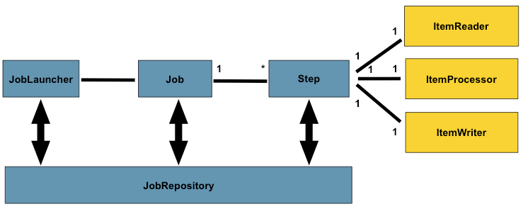
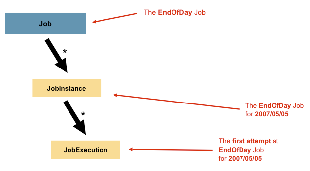
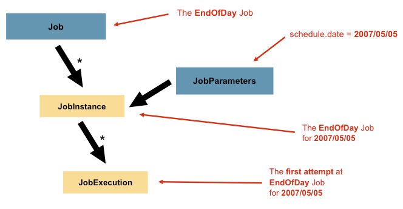
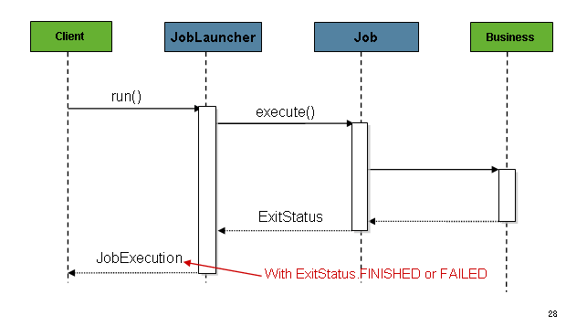

# 批处理领域语言

下图是批处理整体框架， spring Batch提供了层、组件和技术服务的物理实现，这些层、组件和技术服务通常存在于健壮的、可维护的系统中，用于创建从简单到复杂的批处理应用程序，其基础设施和扩展用于处理非常复杂的处理需求。 



黄色部分代表了Spring-batch的核心组件，每一个Job有一或者多个步骤（Step），每个Step都有一个ItemReader、ItemWriter和一个ItemProcessor。而启动一个Job需要一个Job执行器（JobLauncher），并且需要存储有关当前Job进程中的一些元数据（JobRepository）。

## 1. Job

 Job是封装整个批处理过程的实体。在Spring-Batch中，一个Job可以简单看做多个Step的容器。 它将逻辑上属于一个流的多个步骤组合在一起，并允许配置所有步骤的全局属性，例如可重新启动性。 



一个Job可以通过XMl、或者java配置的方式进行配置。主要包含：

- job的名称
- Step的定义和顺序
- Job是否可以restart


Job接口的默认实现有SimpleJob，提供了一些默认实现。使用Java 的配置方式

```java
@Bean
    public Job footballJob(){
        SimpleJob simpleJob = new SimpleJob();
        return simpleJob;
    }
```

## 2. JobInstance

代表是一个Job真正运行的实例。每个Job可以执行多次，每个JobInstance都与一个JobParameter绑定。

 JobInstance的定义与要加载的数据完全无关。完全由ItemReader实现决定如何加载数据。 

 使用相同的JobInstance决定是否使用以前执行的“状态”(即ExecutionContext，)。使用一个新的JobInstance意味着“从头开始”，而使用一个现有的实例通常意味着“从你离开的地方开始”。 


## 3. JobParameters

那么如何区分JobInstance之间的不同呢？答案就是JobParameters。JobParameters作为一系列的启动参数用于启动一个批处理任务。



假如一个Job启动了两个实例： 一个在1月1号启动，一个在1月2号启动，他们各自有自己的JobParameters。那么约定：JobInstance = Job+identifying JobParameters 。这允许开发人员有效地控制JobInstance的定义方式，因为他们可以控制传入的参数。 

## 4. JobExecution

JobExecution表示一个Job运行中的技术概念。 执行可能以失败或成功结束，但与给定执行对应的JobInstance不被认为是完成的，除非执行成功完成 。

 以前面描述的EndOfDay 的Job为例，考虑在第一次运行时失败的JobInstance。如果使用与第一次运行(01-01-2017)相同的标识作业参数再次运行它，则会创建一个新的JobExecution。但是，仍然只有一个JobInstance。

一个Job定义了任务是怎么样的以及是怎么被执行的， 然而，jobeexecution是运行期间实际发生情况的主要存储机制，它包含许多必须控制和持久化的属性。

| Property          | Definition                                                   |
| ----------------- | ------------------------------------------------------------ |
| Status            | A `BatchStatus` object that indicates the status of the execution. While running, it is `BatchStatus#STARTED`. If it fails, it is `BatchStatus#FAILED`. If it finishes successfully, it is `BatchStatus#COMPLETED` |
| startTime         | A `java.util.Date` representing the current system time when the execution was started. This field is empty if the job has yet to start. |
| endTime           | A `java.util.Date` representing the current system time when the execution finished, regardless of whether or not it was successful. The field is empty if the job has yet to finish. |
| exitStatus        | The `ExitStatus`, indicating the result of the run. It is most important, because it contains an exit code that is returned to the caller. See chapter 5 for more details. The field is empty if the job has yet to finish. |
| createTime        | A `java.util.Date` representing the current system time when the `JobExecution` was first persisted. The job may not have been started yet (and thus has no start time), but it always has a createTime, which is required by the framework for managing job level `ExecutionContexts`. |
| lastUpdated       | A `java.util.Date` representing the last time a `JobExecution` was persisted. This field is empty if the job has yet to start. |
| executionContext  | The "property bag" containing any user data that needs to be persisted between executions. |
| failureExceptions | The list of exceptions encountered during the execution of a `Job`. These can be useful if more than one exception is encountered during the failure of a `Job`. |

这些属性是**持久化**的，因此可以完全确定一个execution的执行状态。


## 5. Step

 它封装了批处理作业的一个独立的顺序阶段。 每个Job都完全由一个或多个步骤（Step）组成。一个步骤包含定义和控制实际批处理所需的所有信息。 

## 6. StepExecution

 每次运行Step时都会创建一个新的StepExecution，类似于jobeexecution。但是，如果一个步骤执行失败是因为它之前的步骤失败，则不会为它持久执行。  只有当其Step实际启动时，才会创建StepExecution。 


| Property         | Definition                                                   |
| ---------------- | ------------------------------------------------------------ |
| Status           | A `BatchStatus` object that indicates the status of the execution. While running, the status is `BatchStatus.STARTED`. If it fails, the status is `BatchStatus.FAILED`. If it finishes successfully, the status is `BatchStatus.COMPLETED`. |
| startTime        | A `java.util.Date` representing the current system time when the execution was started. This field is empty if the step has yet to start. |
| endTime          | A `java.util.Date` representing the current system time when the execution finished, regardless of whether or not it was successful. This field is empty if the step has yet to exit. |
| exitStatus       | The `ExitStatus` indicating the result of the execution. It is most important, because it contains an exit code that is returned to the caller. See chapter 5 for more details. This field is empty if the job has yet to exit. |
| executionContext | The "property bag" containing any user data that needs to be persisted between executions. |
| readCount        | The number of items that have been successfully read.        |
| writeCount       | The number of items that have been successfully written.     |
| commitCount      | The number of transactions that have been committed for this execution. |
| rollbackCount    | The number of times the business transaction controlled by the `Step` has been rolled back. |
| readSkipCount    | The number of times `read` has failed, resulting in a skipped item. |
| processSkipCount | The number of times `process` has failed, resulting in a skipped item. |
| filterCount      | The number of items that have been 'filtered' by the `ItemProcessor`. |
| writeSkipCount   | The number of times `write` has failed, resulting in a skipped item. |

## 7. ExecutionContext

ExecutionContext代表一系列key-value的数据map。 好的使用例子是方便重新启动。以平面文件输入为例，在处理单个行时，框架定期在提交点持久化ExecutionContext。 

## 8. JobRepository

 JobRepository是上述概念的持久化机制。提供了一些CRUD的操作、 当Job第一次启动时，从存储库中获得jobeexecution，并且在执行过程中，通过将StepExecution和jobeexecution实现传递给存储库来持久化它们。 

## 9. JobLauncher

Job 执行器、

## 10.  Item Reader

 ItemReader是一种抽象，表示对Step的输入的检索，每次一项。当ItemReader耗尽了它所能提供的项时，它将通过返回null来表示。关于ItemReader接口及其各种实现的更多细节可以在Readers和writer中找到。 

## 11. Item Writer

 它表示一个步骤的输出，一次一批或一组项目。通常，ItemWriter不知道它接下来应该接收的输入，只知道在当前调用中传递的项。

## 12. Item Processor

每一条数据的处理逻辑。 如果在处理该项时确定该项无效，则返回null表示不应写入该项。 


## 配置

执行批处理作业时的一个关键问题是重新启动作业时的行为。如果特定JobInstance的jobeexecute已经存在，则启动Job被认为是“重新启动” 

#### Restartability属性

 将restarttable设置为false意味着此Job不支持再次启动。重新启动不可重新启动的作业将引发JobRestartException异常 


##  EnableBatchProcessing

 @EnableBatchProcessing提供了用于构建批处理任务的基本配置。在这个基本配置中，除了许多可用于自动连接的bean之外，还创建了一个StepScope实例 

- `JobRepository`: bean name "jobRepository"
- `JobLauncher`: bean name "jobLauncher"
- `JobRegistry`: bean name "jobRegistry"
- `PlatformTransactionManager`: bean name "transactionManager"
- `JobBuilderFactory`: bean name "jobBuilders"
- `StepBuilderFactory`: bean name "stepBuilders"


## 改变存储机制

可能不需要将Job的状态存储在数据库中， 出于这个原因，Spring批处理提供了作业存储库的内存中的Map版本。

```java
// This would reside in your BatchConfigurer implementation
@Override
protected JobRepository createJobRepository() throws Exception {
    MapJobRepositoryFactoryBean factory = new MapJobRepositoryFactoryBean();
    factory.setTransactionManager(transactionManager);
    return factory.getObject();
}
```

请注意，内存中的存储库是不稳定的，因此不允许在JVM实例之间重新启动。它也不能保证同时启动两个具有相同参数的作业实例，并且不适合在多线程作业或本地分区Step中使用。因此，只要需要这些特性，就使用存储库的数据库版本。
  确实需要定义事务管理器，因为存储库中存在回滚语义，而且业务逻辑可能仍然是事务性的(例如RDBMS访问)。出于测试目的，许多人发现ResourcelessTransactionManager很有用。 

但是MapJobRepositoryFactoryBean已经过时了，将会在Spring-Batch 5.x版本中移除。因此如果想要基于内存的操作，那么可以配置一个本地的数据库，如H2， Apache Derby or HSQLDB 等，

```java
@Bean
public DataSource dataSource() {
    return new EmbeddedDatabaseBuilder()
            .setType(EmbeddedDatabaseType.H2)
            .addScript("/org/springframework/batch/core/schema-drop-h2.sql")
            .addScript("/org/springframework/batch/core/schema-h2.sql")
            .build();
}
```

配置数据源后需要结合createJobRepository来设置。


## 配置Configuring a JobLauncher

 获得jobeexecution后，将它传递给Job的execute方法，最终将jobeexecution返回给调用者，如下图所示 



```java
@Bean
public JobLauncher jobLauncher() {
	SimpleJobLauncher jobLauncher = new SimpleJobLauncher();
	jobLauncher.setJobRepository(jobRepository());
	jobLauncher.setTaskExecutor(new SimpleAsyncTaskExecutor());
	jobLauncher.afterPropertiesSet();
	return jobLauncher;
}
```


