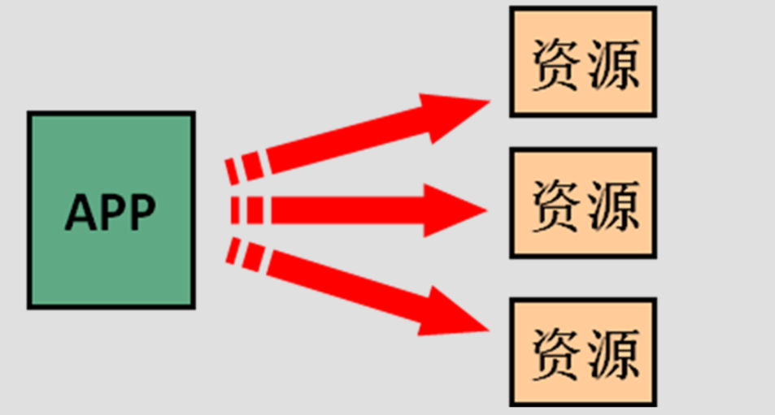
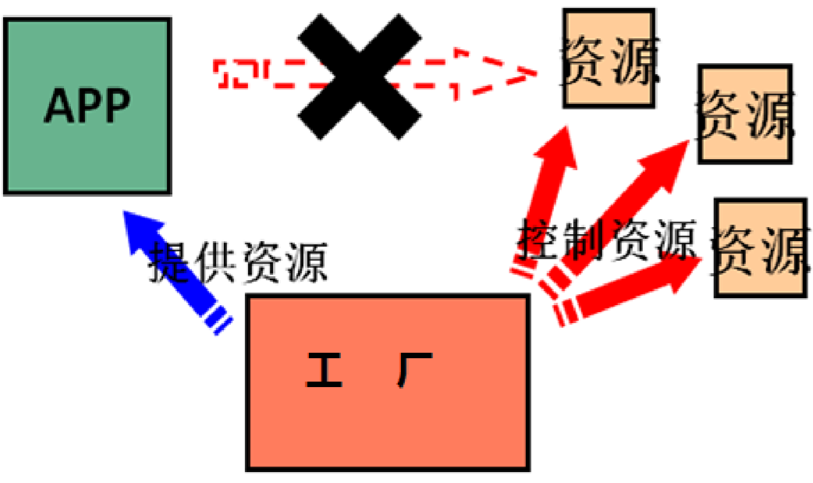

# IOC控制反转

你如何理解IOC？

这个问题首先要从程序的“高内聚、低耦合”开始说起。

那么，什么是程序的耦合？

因为耦合这个概念在各个行业都有相关自己的概念，这里只从软件行业的角度来说说。简单说耦合就是多个程序的模块之间的依赖关系。好的程序应该有较低的耦合，耦合是无法消除的，完全没有任何耦合的程序是没有意义的。而高耦合就是说“牵一发而动全身”，这显然不是我们想看到的。各个模块应该要尽量独立，当某个模块出问题了就直接修改这一个模块就可以了，不要让程序大改。。。代价人工消耗。。

# 程序的耦合

耦合有很多种， 它们之间的耦合度由高到低排列如下 ：

1. **内容耦合**。当一个模块直接修改或操作另一个模块的数据时，或一个模块不通过正常入口而转入另 一个模块时，这样的耦合被称为内容耦合。**内容耦合是最高程度的耦合，应该避免使用之。**  
2. **公共耦合**。两个或两个以上的模块共同引用一个全局数据项，这种耦合被称为公共耦合。在具有大 量公共耦合的结构中，确定究竟是哪个模块给全局变量赋了一个特定的值是十分困难的。 
3. 外部耦合 。一组模块都访问同一全局简单变量而不是同一全局数据结构，而且不是通过参数表传 递该全局变量的信息，则称之为外部耦合。  
4.  **控制耦合** 。一个模块通过接口向另一个模块传递一个控制信号，接受信号的模块根据信号值而进 行适当的动作，这种耦合被称为控制耦合。  
5. 标记耦合 。若一个模块 A 通过接口向两个模块 B 和 C 传递一个公共参数，那么称模块 B 和 C 之间 存在一个标记耦合。  
6.  **数据耦合**。模块之间通过参数来传递数据，那么被称为数据耦合。数据耦合是最低的一种耦合形 式，系统中一般都存在这种类型的耦合，因为为了完成一些有意义的功能，往往需要将某些模块的输出数据作为另一些模块的输入数据。 
7. 非直接耦合 。两个模块之间没有直接关系，它们之间的联系完全是通过主模块的控制和调用来实 现的。

重点关注加粗部分的耦合，即内容耦合、公共耦合、控制耦合、数据耦合。

**耦合是影响软件复杂程度和设计质量的一个重要因素，在设计上我们应采用以下原则：如果模块间必须 存在耦合，就尽量使用数据耦合，少用控制耦合，限制公共耦合的范围，尽量避免使用内容耦合。** 

# 高内聚

那么，还有个“高内聚”，所谓高内聚是从模块的内部结构角度来观察的，就是说内聚表示了一个模块的内部各个元素彼此结合的紧密程度。内聚是从 **功能角度**来度量**模块内**的联系，一个好的内聚模块应当恰好做一件事。它描述的是模块内的功能联系。

高内聚简单来说就是自己尽量自己完成自己的事情，不要麻烦别人。自己得事情内部解决，对外只提供公共的接口来访问功能。

**程序讲究的是低耦合，高内聚。就是同一个模块内的各个元素之间要高度紧密，但是各个模块之 间的相互依存度却不要那么紧密。** 

内聚和耦合是密切相关的，同其他模块存在高耦合的模块意味着低内聚，而高内聚的模块意味着该模块同其他模块之间是低耦合。在进行软件设计时，应力争做到高内聚，低耦合。 

# 高耦合举例

下面来举几个例子来说明一下。

在传统的基于MVC三层架构开发模式下，我们会写一个DAO接口，这是一个数据访问对象，用来作为持久层接口，还会写一个service来处理业务逻辑，表示业务层，但是业务层需要持久层接口来实现各种业务逻辑。就像下面这样：

```java
public class UserServiceImpl implements UserService {

    private UserDao dao = new UserDaoImpl();
}
```

业务层调用持久层，并且此时业务层在依赖持久层的接口和实现类。如果此时没有持久层实现类，编译将不能通过。这种编译期依赖关系，应该在我们开发中杜绝。我们需要优化代码解决。 这就是一个典型的耦合。

再来一个例子吧：

`JDBC`都学过，使用JDBC来操作数据库的时候，我们首先需要加载驱动，然后创建连接，执行sql。。。， 注册驱动的时候我们可以通过`DriverManager` 的 `register` 方法来注册驱动，也可以使用Class.forName（Class...） 通过反射去加载驱动类完成注册。但是我们一般推荐使用Class.forName（）的方式，为啥呢？？？

```java
public static void main(String[] args) throws Exception {  
    //1.注册驱动   		
    //riverManager.registerDriver(new com.mysql.jdbc.Driver());
    Class.forName("com.mysql.jdbc.Driver"); 
  	//2.获取连接   
   //3.获取预处理 sql 语句对象   
    //4.获取结果集   
    //5.遍历结果集 
	 
} 
```

我们知道JDBC 是 sun 公司提供一套用于数据库操作的接口。java 程序员只需要面向这套接口编程即可。不同的数据库厂商，需要针对这套接口，提供不同实现。不同的实现的集合，即为不同数据库的驱动。

 java.sql.Driver 接口是所有 JDBC 驱动程序需要实现的接口，每个厂商实现的方式不一样，在程序中不需要直接去访问实现了 Driver 接口的类，而是由驱动程序管理器类 (java.sql.DriverManager) 去调用这些 Driver 实现。

> Oracle 的驱动：oracle.jdbc.driver.OracleDriver
> 		mySql 的驱动： com.mysql.jdbc.Driver

如果使用`DriverManager.registerDriver`方式会依赖某种具体的数据库(`mysql`)，需要在编译的时候就要导入对应的包，这样程序的耦合行较高。如果这时候更换了数据库品牌（比如 `Oracle`），需要 修改源码来重新数据库驱动。这显然不是我们想要的。 

而采用`Class.forName（）`的方式是在运行时动态加载的。看如下源码

```java
public class Driver extends NonRegisteringDriver implements java.sql.Driver {  
    // ~ Static fields/initializers  
    // ---------------------------------------------  
  
    //  
    // Register ourselves with the DriverManager  
    //  
    static {  
        try {  
            java.sql.DriverManager.registerDriver(new Driver());  
        } catch (SQLException E) {  
            throw new RuntimeException("Can't register driver!");  
        }  
    } 
```

静态代码块的方式来注册驱动，也就是说通过class.forName的方式是通过直接加载字节码的。根据类加载原理，一个class加载进内存，连接，初始化，会先执行类的静态代码块和对静态变量的初始化操作，所以在加载的时候就可以注册数据库驱动。

好了，刚刚分析了数据库驱动注册使用DriverManager.registerDriver的方式会导致程序的耦合性提高，我们使用Class.forName()的方式来对程序解耦，他是通过反射的方式来注册驱动的。

```java
Class.forName("com.mysql.jdbc.Driver");//此处只是一个字符串 
```

此时的好处是，我们的类中不再依赖具体的驱动类，此时就算删除 `mysql` 的驱动 jar 包，依然可以编译（运 行就不要想了，没有驱动不可能运行成功的）。 同时，也产生了一个新的问题，`mysql` 驱动的全限定类名字符串是在 `java` 类中写死的，一旦要改还是要修改源码。 解决这个问题也很简单，使用**配置文件配置**。 


# 工厂模式解耦

在实际开发中我们可以把三层的对象都使用配置文件配置起来，当启动服务器应用加载的时候，让一个类中的

方法通过读取配置文件，把这些对象创建出来并存起来。在接下来的使用的时候，直接拿过来用就好了。 那么，这个读取配置文件，创建和获取三层对象的类就是工厂。

# Ioc控制反转Inversion Of Control 

通过以上的分析，我们大概对解耦有了一个基本的思路，就是我们的对象要存起来，放在一个地方，然后谁要用就去取。

那么问题来了，对象要存在哪里呢？我们学过集合框架，使用List还是用`Map`来存储呢？其实这是根据我们是否有查找的需求，有查找需求，肯定使用Map效率更高一些。

所以，`Spring`的解决思路就是在应用加载的时候，使用Map来存放`MVC`三层使用到的对象，这个`Map`就是`Spring`的容器。

刚刚我们说了工厂模式可以解耦，啥是工厂模式呢？

我么以前创建对象的方式就是通过`new`关键字来创建的，是主动的获取。所谓工厂就是负责给我们从容器中获取指定对象的类。这时候我们获取对象的方式发生了改变。 不再是`new`了。交给工厂去帮我们获得。有工厂为我们查找或者创建对象。是被动的。 






**这种被动接收的方式获取对象的思想就是控制反转，它是 spring 框架的核心之一。**

**到这里了，我们需要明确，`Ioc`解决的问题就是降低程序的耦合。**也就是削减我们代码中的依赖关系。

控制反转，就是`java`对象不再有我们自己来控制管理了，全部交给`Spring`的容器来管理！

所以称为“控制反转”， 精髓： **反转**！！！

