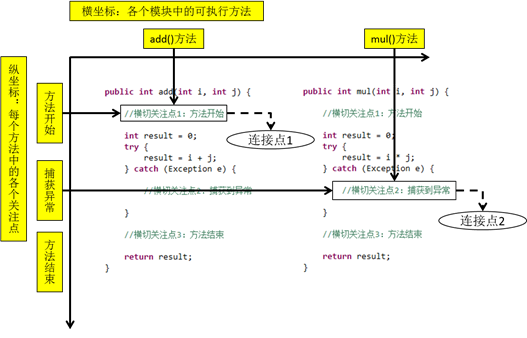
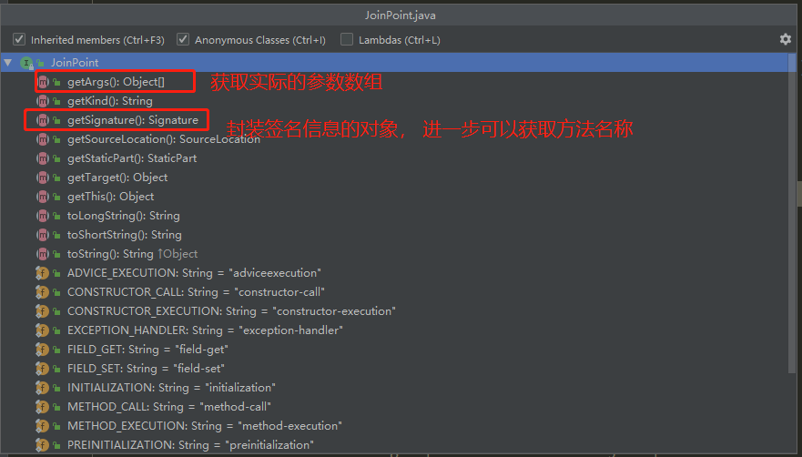
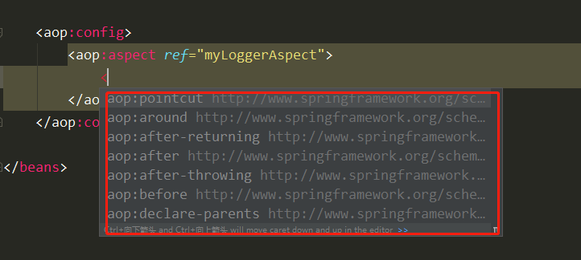

# AOP概述

什么是`aop`(Aspect Oriented Programming ),  翻译过来就是“面向切面编程”， 你们估计听过OOP 面向对象编程，对这个已经很熟悉了，那么他们俩有什么关系呢？？？答案是： 没有啥关系。。。，非要说有啥关系，或许能说AOP是OOP的一种延伸吧，AOP可以做到OOP办不到的事情。

那，OOP不能做到的事情是什么呢？

在面向对象编程思想中，我们认为世间万物一切皆对象，面向对象编程的思想就是我要做一件事情，我不需要自己去做，交给专业的人去做，让各个对象组合去帮我们做成一件事情。

在OOP中，我们是纵向编程， 纵向继承机制 。

AOP中是横向抽取机制。

我们一般写程序都是从上到下，需要什么就要创建什么，如果有多个相同的业务，每一业务都要做一些公共的验证或者处理，那么在每个业务中都需要写同样的代码，这样代码很多重复，繁琐。而AOP的作用就是将一些公共的代码或者功能抽取出来，生成一个切面（后面会说到），然后哪个地方需要验证，处理就在程序执行的过程中动态地去插入这些代码。这些代码可能在程序的执行前，方法执行后等等。。。，这就是AOP里面的连接点和通知了。这些稍后再讲。

AOP编程操作的主要对象是切面(`aspect`)，而切面用于**模块化横切关注点（公共功能）**。

**简单来说aop的作用就是在程序运行期间，不修改源码对已有方法进行增强。** 


# AOP 优点

减少重复代码     提高开发效率     维护方便

# AOP术语

## 横切关注点

从每个方法中抽取出来的同一类非核心业务。就是公共的功能代码

## 切面（Aspect）

封装横切关注点信息的类，每个关注点体现为一个通知方法。

也就是把这些公共的代码或者功能抽取成为一个类，这个类，就是我们所说的切面。

## 通知（Advice）

在切面中的横切关注点用在目标对象中的方法就是通知，通知包含：用在啥地方（执行前？执行后？），使用的是啥功能（验证？ 打印日志？）。

说白了就是切面必须要完成的各个**具体工作**。

> 通知的类型：前置通知,后置通知,异常通知,最终通知,环绕通知。 

## 目标（Target）

目标对象，很简单，就是你要增强的对象。

## 代理对象

向目标对象应用通知之后创建的代理对象。一个类被 AOP 织入增强后，就产生一个结果代理类。

 AOP中会通过代理的方式，对目标对象生成一个代理对象，代理对象中会加入需要增强功能，通过代理对象来间接的方式目标对象，起到增强目标对象的效果。 

## 连接点（Join Point）

横切关注点在程序代码中的具体体现，对应程序执行的某个特定位置。例如：类某个方法调用前、调用后、方法捕获到异常后等。

也就是说，所谓连接点是指那些被拦截到的点。在 spring 中,这些点指的是方法,因为 spring 只支持方法类型的连接点。

在应用程序中可以使用横纵两个坐标来定位一个具体的连接点：  



##         切入点(pointcut)  

所谓切入点是指我们要对哪些 `Joinpoint` 进行拦截的定义。

切入点就是定位连接点的**方式**。每个类的方法中都包含多个连接点，所以连接点是类中客观存在的事物。如果把连接点看作数据库中的记录，那么切入点就是查询条件——**AOP可以通过切入点定位到特定的连接点**。切点通过org.springframework.aop.Pointcut 接口进行描述，它使用类和方法作为连接点的查询条件。

也就是说是用来指定需要将通知使用到哪些地方，比如需要用在哪些类的哪些方法上，切入点就是做这个配置的。 是要通过切入点表达式来 配置和指定。


# AOP的实现

AOP是通过动态代理的方式实现的。

动态代理的特点： 字节码随用随创建，随用随加载。  它与静态代理的区别也在于此。因为静态代理是字节码一上来就创建好，并完成加载。  装饰者模式就是静态代理的一种体现。

动态代理技术有两种，一种是基于接口的动态代理，另一种是基于子类的动态代理。

## 基于接口的动态代理

由JDK 官方的 Proxy 类实现。  要求：被代理类最少实现一个接口。 

在很久以前，演员和剧组都是直接见面联系的。没有中间人环节。  而随着时间的推移，产生了一个新兴职业：经纪人（中间人），这个时候剧组再想找演员就需要通过经纪 人来找了。下面我们就用代码演示出来。 

```java
/** 
 * 一个经纪公司的要求:  
 *   能做基本的表演和危险的表演 
 */ 
public interface IActor {  
    /** 
  	* 基本演出   
  	* @param money   
  	*/  
    
    public void basicAct(float money);  
    /** 
  	* 危险演出   
  	* @param money   
  	*/  
    public void dangerAct(float money); 
}


/** 
 * 一个演员  
 */ 
//实现了接口，就表示具有接口中的方法实现。即：符合经纪公司的要求 
public class Actor implements IActor{    
    public void basicAct(float money){ 
  		System.out.println("拿到钱，开始基本的表演："+money);  
    }    
    public void dangerAct(float money){   
        System.out.println("拿到钱，开始危险的表演："+money);  
    } 
} 

```


使用代理来间接获取对象。要求被代理类至少实现一个接口。

创建的方式： `Proxy.newProxyInstance`(三个参数)

参数的含义：

> ClassLoader：和被代理对象使用相同的类加载器。
>
> Interfaces：和被代理对象具有相同的行为。实现相同的接口。  
>
> InvocationHandler：如何代理。 

```java
IActor proxyActor = (IActor) Proxy.newProxyInstance(
    actor.getClass().getClassLoader(),            actor.getClass().getInterfaces(), 
	new InvocationHandler(){
        
        /** 
     	* 执行被代理对象的任何方法，都会经过该方法。      
     	* 此方法有拦截的功能。      
     	*  
     	* 参数：      
     	*  proxy：代理对象的引用。不一定每次都用得到      
     	*  method：当前执行的方法对象      
     	*  args：执行方法所需的参数      
     	* 返回值：      
     	*  当前执行方法的返回值      
     	*/   
        @Override     
        public Object invoke(Object proxy, Method method, Object[] args) throws Throwable{
            ...
                
        }
    });
```


## 基于子类的动态代理

使用`CGLib`的`Enhancer`类创建代理对象。

要求被代理的对象不能是最终类。

方法参数：Enhancer.create(Class, Callback)

> Class: 被代理对象的字节码
>
> Callback：如何代理

```java
Actor cglibActor = (Actor) Enhancer.create(actor.getClass(),        
               new MethodInterceptor(){ 
                   /** 
                   * 执行被代理对象的任何方法，都会经过该方法。在此方法内部就可以对被代理对象的任何 方法进行增强。     
                   * 参数：     
                   *  前三个和基于接口的动态代理是一样的。     
                   *  MethodProxy：当前执行方法的代理对象。     
                   * 返回值：     
                   *  当前执行方法的返回值     
                   */ 
                   @Override    public Object intercept(Object proxy, Method method, Object[] args, MethodProxy methodProxy) throws Throwable { 
                   
                   
                       。。。代理
                       
                   }
                   
                   
});
```


## 关于代理的选择

在 spring 中，框架会根据目标类是否实现了接口来决定采用哪种动态代理的方式。 

# AspectJ

AspectJ：Java社区里最完整最流行的AOP框架。

在Spring2.0以上版本中，可以使用基于`AspectJ`注解或基于XML配置的AOP。


##         在Spring中启用AspectJ注解支持  

### 1. 导包 

导入对应的jar包

### 2. 配置

在bean.xml中配置aop.

当Spring IOC容器侦测到bean配置文件中的<aop:aspectj-autoproxy>元素时，会自动为 与AspectJ切面匹配的bean创建代理。

```xml
<?xml version="1.0" encoding="UTF-8"?>
<beans xmlns="http://www.springframework.org/schema/beans"
       xmlns:xsi="http://www.w3.org/2001/XMLSchema-instance" xmlns:aop="http://www.springframework.org/schema/aop"
       xmlns:context="http://www.springframework.org/schema/context"
       xsi:schemaLocation="http://www.springframework.org/schema/beans
       http://www.springframework.org/schema/beans/spring-beans.xsd
       http://www.springframework.org/schema/aop
       http://www.springframework.org/schema/aop/spring-aop-2.5.xsd http://www.springframework.org/schema/context http://www.springframework.org/schema/context/spring-context.xsd">

    <context:component-scan base-package="com.hongliang.aop"></context:component-scan>

<!--    开启aspectJ的自动代理功能 -->
    <aop:aspectj-autoproxy />

</beans>

```

### 3. 编码

举例： math的加减乘除，然后在执行过程中记录执行的方法，方法的参数，使用一个Logger类来作为切面。

MathI.java 接口

```java
package com.hongliang.aop;

/**
 * @author Hongliang Zhu
 * @create 2020-06-21 14:30
 */
public interface MathI {

    int add(int i, int j);

    int sub(int i, int j);

    int mul(int i, int j);

    int div(int i, int j);


}


```

MathImpl.java 实现类

```java
package com.hongliang.aop;

import org.springframework.stereotype.Component;

/**
 * @author Hongliang Zhu
 * @create 2020-06-21 14:31
 */
@Component
public class MathImpl implements MathI {
    public int add(int i, int j) {
        int result = i + j;
        return result;
    }

    public int sub(int i, int j) {
        int result = i - j;
        return result;
    }

    public int mul(int i, int j) {
        int result = i * j;
        return result;
    }

    public int div(int i, int j) {
        int result = i / j;
        return result;
    }
}

```

###          4. 用AspectJ注解声明切面  

1)    要在Spring中声明AspectJ切面，只需要在IOC容器中将切面声明为`bean`实例。

2)    当在Spring IOC容器中初始化AspectJ切面之后，Spring IOC容器就会为那些与 AspectJ切面相匹配的bean创建代理。

3)    在AspectJ注解中，切面只是一个带有`@Aspect`注解的Java类，它往往要包含很多通知。

4)    通知是标注有某种注解的简单的Java方法。

5)    AspectJ支持5种类型的通知注解：

① @Before：前置通知，在方法执行之前执行

② @After：后置通知，在方法执行之后执行

③ @AfterRunning：返回通知，在方法返回结果之后执行

④ @AfterThrowing：异常通知，在方法抛出异常之后执行

⑥ @Around：环绕通知，围绕着方法执行

```java
package com.hongliang.aop;
import org.aspectj.lang.JoinPoint;
import org.aspectj.lang.annotation.*;
import org.springframework.stereotype.Component;

import java.util.Arrays;

/**
 *
 * // 切面： 用来存储横切关注点
 * @author Hongliang Zhu
 * @create 2020-06-21 14:32
 */
@Component
@Aspect  //标注当前类是切面
public class MyLoggerAspect {


    /**
     *
     * 将方法指定为前置通知  value 为切入点表达式
     */
    @Before(value = "execution(* com.hongliang.aop.*.*(..))")
    public void beforeMethod(JoinPoint joinPoint){
        Object[] args = joinPoint.getArgs();
        String methodName = joinPoint.getSignature().getName();
        System.out.println("Method:" + methodName+"\t arguments: "+ Arrays.toString(args));
        System.out.println("方法执行之前");
    }


    /**
     * finally
     */
    @After("execution(* com.hongliang.aop.*.*(..))")
    public void afterMethod(){
        System.out.println("后置通知");
    }

    @AfterReturning(value = "execution(* com.hongliang.aop.*.*(..))" , returning = "result")
    public void returning(JoinPoint joinPoint, Object result){
        System.out.println(joinPoint.getSignature().getName()+"\t"+result);
        System.out.println("返回通知");
    }

    @AfterThrowing(value = "execution(* com.hongliang.aop.*.*(..))" , throwing = "ex")
    public void afterThrowing(Exception ex){
        System.out.println("出了异常啊:" +ex.getMessage());
    }

    @Around(value = "execution(* com.hongliang.aop.*.*(..))")
    public void aroundMethod(){

    }


}

```


# AOP细节

## 1. 切入点表达式

作用： 通过**表达式的方式**定位**一个或多个**具体的连接点。  

切入点表达式的写法:

关键字：execution(表达式)

表达式：
                    访问修饰符  返回值  包名.包名.包名...类名.方法名(参数列表)

 标准的表达式写法：
                    public void com.hongliangng.service.impl.AccountServiceImpl.saveAccount()

访问修饰符可以省略
                    void com.hongliangng.service.impl.AccountServiceImpl.saveAccount()

返回值可以使用通配符，表示任意返回值  

​			\* com.hongliangng.service.impl.AccountServiceImpl.saveAccount()

包名可以使用通配符，表示任意包。但是有几级包，就需要写几个

​			\*.\* \*.\*.\*.\*.AccountServiceImpl.saveAccount())

包名可以使用..表示当前包及其子包
                    \* \*..AccountServiceImpl.saveAccount()

类名和方法名都可以使用*来实现通配

​			* \*..\*.\*()

全通配写法：
                    \* \*..\*.\*(..)

实际开发中切入点表达式的通常写法：
                    切到业务层实现类下的所有方法
                        \* com.hongliangng.service.impl.\*.\*(..)

##  2. 当前连接点细节

切入点表达式通常都会是从宏观上定位一组方法，和具体某个通知的注解结合起来就能够确定对应的连接点。那么就一个具体的连接点而言，我们可能会关心这个连接点的一些具体信息，例如：当前连接点所在方法的方法名、当前传入的参数值等等。这些信息都封装在`JoinPoint`接口的实例对象中。

### JoinPoint



## 3. 通知

1)    在具体的连接点上要执行的操作。

2)    一个切面可以包括一个或者多个通知。

3)    通知所使用的注解的值往往是**切入点表达式**。

### 前置通知

前置通知：在方法执行之前执行的通知

使用`@Before`注解

### 后置通知

后置通知：后置通知是在连接点完成之后执行的，即连接点返回结果或者抛出异常的时候

使用`@After`注解

**无论连接点是正常返回还是抛出异常，后置通知都会执行**  （`finally`）

### 返回通知

1)    返回通知：无论连接点是正常返回还是抛出异常，后置通知都会执行。如果只想在连接点返回的时候记录日志，应使用返回通知代替后置通知。

2)    使用`@AfterReturning`注解，在返回通知中访问连接点的返回值

​     ①在返回通知中，只要将returning属性添加到@AfterReturning注解中，就可以访问连接点的返回值。该属性的值即为用来传入返回值的参数名称。

```java
@AfterReturning(value = "execution(* com.hongliang.aop.*.*(..))" , returning = "result")
    public void returning(JoinPoint joinPoint, Object result){
        System.out.println(joinPoint.getSignature().getName()+"\t"+result);
        System.out.println("返回通知");
    }
```


​     ②必须在通知方法的签名中添加一个同名参数。在运行时Spring AOP会通过这个参数传递返回值

​     ③原始的切点表达式需要出现在`pointcut`属性中

### 异常通知

1)    异常通知：只在连接点抛出异常时才执行异常通知

2)    将`throwing`属性添加到`@AfterThrowin`g注解中，也可以访问连接点抛出的异常。`Throwable`是所有错误和异常类的顶级父类，所以在异常通知方法可以捕获到任何错误和异常。

3)    如果只对某种特殊的异常类型感兴趣，可以将参数声明为其他异常的参数类型。然后通知就只在抛出这个类型及其子类的异常时才被执行

```java
  @AfterThrowing(value = "execution(* com.hongliang.aop.*.*(..))" , throwing = "ex")
    public void afterThrowing(Exception ex){
        System.out.println("出了异常啊:" +ex.getMessage());
    }
```


### 环绕通知

1)    环绕通知是所有通知类型中功能最为强大的，能够全面地控制连接点，甚至可以控制是否执行连接点。

2)    对于环绕通知来说，连接点的参数类型必须是`ProceedingJoinPoint`。它是 `JoinPoint`的子接口，允许控制何时执行，是否执行连接点。

3)    在环绕通知中需要明确调用`ProceedingJoinPoint`的`proceed()`方法来执行被代理的方法。如果忘记这样做就会导致通知被执行了，但目标方法没有被执行。

4)    注意：环绕通知的方法需要返回目标方法执行之后的结果，即调用 `joinPoint.proceed();`的返回值，否则会出现空指针异常。

```java
@Around("pt1()")  // 切入点表达式引用
    public Object aroundPrintLog(ProceedingJoinPoint proceedingJoinPoint){
        Object rtValue = null;
        try {
            Object[] args = proceedingJoinPoint.getArgs();
            System.out.println("前置： Logger类中的printLog方法开始记录日志了...");

            rtValue = proceedingJoinPoint.proceed(args); //
            System.out.println("后置： Logger类中的printLog方法开始记录日志了...");

            return rtValue;
        } catch (Throwable throwable) {
            throwable.printStackTrace();
            System.out.println("异常： Logger类中的printLog方法开始记录日志了...");

            throw new RuntimeException(throwable);
        }finally {
            System.out.println("最终：Logger类中的printLog方法开始记录日志了...");
        }
//        return rtValue;
    }
```

## 4. 重用切入点定义

1)    在编写`AspectJ`切面时，可以直接在通知注解中书写切入点表达式。但同一个切点表达式可能会在多个通知中重复出现。

2)    在`AspectJ`切面中，可以通过`@Pointcut`注解将一个切入点声明成简单的方法。切入点的方法体通常是空的，因为将切入点定义与应用程序逻辑混在一起是不合理的。

3)    切入点方法的访问控制符同时也控制着这个切入点的可见性。如果切入点要在多个切面中共用，最好将它们集中在一个公共的类中。在这种情况下，它们必须被声明为public。在引入这个切入点时，必须将类名也包括在内。如果类没有与这个切面放在同一个包中，还必须包含包名。

4)    其他通知可以通过方法名称引入该切入点

```java
 @Pointcut("execution(* com.hongliang.service.impl.*.*(..))")
    public void pt1(){

    }
```

## 5. 指定切面的优先级

1)    在同一个连接点上应用不止一个切面时，除非明确指定，否则它们的优先级是**不确定**的。

2)    切面的优先级可以通过实现`Ordered`接口或利用`@Order`注解指定。

3)    实现`Ordered`接口，`getOrder()`方法的返回值越小，优先级越高。

4)    若使用`@Order`注解，序号出现在注解中。

```java
@Component
@Aspect  //标注当前类是切面
@Order(0)
public class MyLoggerAspect {
}

@Component
@Aspect  //标注当前类是切面
@Order(1)
public class MyLoggerAspect01 {
    
}
```


# 基于XML的AOP配置

1. 把通知Bean也交给spring来管理

2. 使用aop:config标签表名开始AOP配置

3. 使用aop:aspect标签表明配置切面     

   id属性：是给切面提供一个唯一标识     ref属性：是指定通知类bean的Id。

4. 在aop:aspect标签的内部使用对应的标签来配置通知的类型

## 第一步：把通知类用 bean 标签配置起来 

通知类也就是切面

如果有注解的话，需要引入扫描包的标签

```xml
<context:component-scan base-package="com.hongliang.aop"></context:component-scan>
```

##  第二步：使用 aop:config 声明 aop 配置 

## 第三步：使用 aop:aspect 配置切面 



## 第四步：使用 aop:pointcut 配置切入点表达式 

## 第五步：使用 aop:xxx 配置对应的通知类型 

```xml
    <aop:config>
        <aop:aspect ref="myLoggerAspect">
            <aop:before method="beforeMethod" pointcut="execution(* com.hongliang.aop.*.*(..))"></aop:before>
        </aop:aspect>
    </aop:config>
```

```xml
   <!--            配置切入点表达式 : 所有切面可用 （但是必须放在配置切面之前 ）-->
        <aop:pointcut id="pt1" expression="execution(* com.hongliang.service.impl.*.*(..))"></aop:pointcut>
```


# 不使用 XML的配置方式 

在spring的配置类中引入 以下注解

```java
@Configuration 
@ComponentScan(basePackages="com.hongliang") @EnableAspectJAutoProxy 
public class SpringConfiguration { } 
 
 
```

