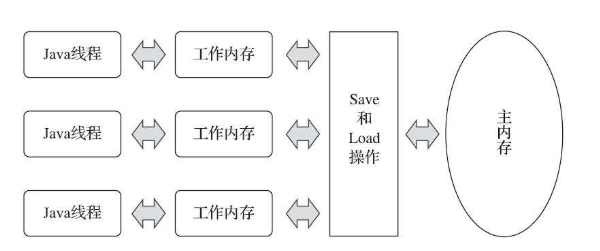
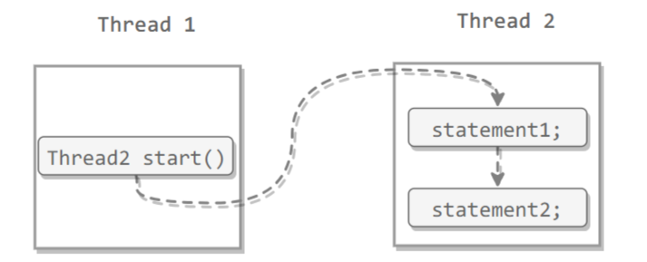

# Java内存模型

在讲解`synchronized`和`volatie`之前，我们首先需要了解`Java`内存模型(`JMM`)

《Java虚拟机规范》中曾试图定义一种“Java内存模型”（Java Memory Model，JMM）来屏蔽各种硬件和操作系统的内存访问差异，以实现让Java程序在各种平台下都能达到**一致的内存访问**效果。

## 主内存和工作内存

Java内存模型的主要目的是定义程序中各种变量的访问规则，即关注在虚拟机中把变量值存储到内存和从内存中取出变量值这样的底层细节。

每条线程还有自己的工作内存（`Working Memory`），线程的工作内存中保存了被该线程使用的变量的主内存副本，线程对变量的所有操作（读取、赋值等）都必须在工作内存中进行，而不能直接读写主内存中的数据。不同的线程之间也无法直接访问对方工作内存中的变量，线程间变量值的传递均需要通过主内存来完成，线程、主内存、工作内存三者的交互关系如图所示。




这是因为处理器上的寄存器的读写的速度比内存快几个数量级，为了解决这种速度矛盾，在它们之间加入了高速缓存。线程的工作线程一般就是用高速缓存或者寄存器来实现的。

加入高速缓存带来了一个新的问题：**缓存一致性**。如果多个缓存共享同一块主内存区域，那么多个缓存的数据可能会不一致，需要一些协议来解决这个问题。

## 内存之间的交互操作


- read：把一个变量的值从主内存传输到工作内存中
- load：在 read 之后执行，把 read 得到的值放入工作内存的变量副本中
- use：把工作内存中一个变量的值传递给执行引擎
- assign：把一个从执行引擎接收到的值赋给工作内存的变量
- store：把工作内存的一个变量的值传送到主内存中
- write：在 store 之后执行，把 store 得到的值放入主内存的变量中
- lock：作用于主内存的变量，它把一个变量标识为一条线程独占的状态
- unlock 它把一个处于锁定状态的变量释放出来，释放后的变量才可以被其他线程锁定。

比较繁琐，目前简化了。将Java内存模型的操作简化为read、write、lock和unlock四种，但这只是语言描述上的等价化简，Java内存模型的基础设计并未改变。

## 内存模型的三大特性

- 原子性

- 可见性

- 有序性

Java内存模型是围绕着在并发过程中如何处理原子性、可见性和有序性这三个特征来建立的。

### 1.原子性（Atomicity）

Java内存模型要求lock、unlock、read、load、assign、use、store、write这八种操作都具有原子性，但是对于64位的数据类型（long和double），在模型中特别定义了一条宽松的规定：允许虚拟机将没有被volatile修饰的64位数据的读写操作划分为两次32位的操作来进行，即允许虚拟机实现自行选择是否要保证64位数据类型的load、store、read和write这四个操作的原子性，这就是所谓的“long和double的非原子性协定”（Non-Atomic Treatment of doubleand long Variables）。

如果有多个线程共享一个并未声明为volatile的long或double类型的变量，并且同时对它们进行读取和修改操作，那么某些线程可能会读取到一个既不是原值，也不是其他线程修改值的代表了“半个变量”的数值。不过这种读取到“半个变量”的情况是非常罕见的，经过实际测试[插图]，在目前主流平台下商用的64位Java虚拟机中并不会出现非原子性访问行为，但是对于32位的Java虚拟机，譬如比较常用的32位x86平台下的HotSpot虚拟机，对long类型的数据确实存在非原子性访问的风险。

可以大致认为基本数据类型的访问、读写都是具备原子性的。原子性保证可以用原子操作如 `AtomicInteger`  和`AtomicDoouble`等...,  除了使用原子类之外，也可以使用 `synchronized` 互斥锁来保证操作的原子性。它对应的内存间交互操作为：`lock` 和 `unlock`，在虚拟机实现上对应的字节码指令为 `monitorenter` 和 `monitorexit`。 

```java

import java.util.concurrent.CountDownLatch;
import java.util.concurrent.ExecutorService;
import java.util.concurrent.Executors;
import java.util.concurrent.atomic.AtomicInteger;

/**
 * @author Hongliang Zhu
 * @create 2020-06-19 9:40
 */
public class Atomic {
    public static void main(String[] args) throws InterruptedException {
//        AtomicAdd atomicAdd = new AtomicAdd();
        AddNotSafe addNotSafe = new AddNotSafe();
        final int threadNums = 1000;

        CountDownLatch  latch = new CountDownLatch(threadNums);
        ExecutorService service = Executors.newCachedThreadPool();

        for(int i = 0; i < threadNums; i++){
            service.execute(()->{
//                atomicAdd.add();
                addNotSafe.add();
                latch.countDown();
            });
        }
        latch.await();
        service.shutdown();
        System.out.println(addNotSafe.get());

    }
}

class AtomicAdd{  // 每次执行结果都是1000

    private AtomicInteger atomicInteger = new AtomicInteger();

    public void add(){
        atomicInteger.incrementAndGet();
    }

    public int get(){
        return atomicInteger.get();
    }


}

class AddNotSafe{  // 每次得出的结果都不一样 976/954 ，比1000小
    private int cnt = 0;
    public void add(){
        this.cnt+=1;
    }
    public int get(){
        return this.cnt;
    }

}
```

### 2.可见性（Visibility）

可见性就是指当一个线程修改了共享变量的值时，其他线程能够立即得知这个修改。 Java 内存模型是通过在变量修改后将新值同步回主内存，在变量读取前从主内存刷新变量值来实现可见性的。在下文的`volatile`讲解会了解到，**`volatile`可以保证变量的可见性，但是`volatile` 并不能保证操作的原子性。**

主要有三种实现可见性的方式：

- `volatile`
- `synchronized`，对一个变量执行 `unlock` 操作之前，必须把变量值同步回主内存。
- `final`，被 `final` 关键字修饰的字段在构造器中一旦初始化完成，并且没有发生 this 逃逸（其它线程通过 this 引用访问到初始化了一半的对象），那么其它线程就能看见 final 字段的值。**注意：final可以在class里面先定义，但是必须在构造器中为其初始化！！！**

### 3.有序性（Ordering）

有序性是指：在本线程内观察，所有操作都是有序的。在一个线程观察另一个线程，所有操作都是无序的，无序是因为发生了指令重排序。在 Java 内存模型中，允许编译器和处理器对指令进行重排序，重排序过程不会影响到单线程程序的执行，却会影响到多线程并发执行的正确性。

`volatile` 关键字通过添加**内存屏障**的方式来禁止指令重排，即重排序时不能把后面的指令放到内存屏障之前。

也可以通过 `synchronized` 来保证有序性，它保证每个时刻只有一个线程执行同步代码，相当于是让线程顺序执行同步代码

 

## 先行发生原则

“先行发生”（Happens-Before）的原则。这个原则非常重要，它是判断数据是否存在竞争，线程是否安全的非常有用的手段。

先行发生是Java内存模型中定义的两项操作之间的偏序关系，比如说操作A先行发生于操作B，其实就是说在发生操作B之前，操作A产生的影响能被操作B观察到，“影响”包括修改了内存中共享变量的值、发送了消息、调用了方法等。

 可以用 volatile 和 synchronized 来保证有序性。除此之外，JVM 还规定了先行发生原则，让一个操作无需控制就能先于另一个操作完成。 

下面是Java内存模型下一些“**天然的**”先行发生关系，这些先行发生关系无须任何**同步器**协助就已经存在，可以在编码中直接使用。如果两个操作之间的关系不在此列，并且无法从下列规则推导出来，则它们就没有顺序性保障，虚拟机可以对它们随意地进行重排序。

### 1.  程序次序规则

程序次序规则（Program Order Rule）：在一个线程内，按照**控制流顺序**，书写在前面的操作先行发生于书写在后面的操作。注意，这里说的是控制流顺序而不是程序代码顺序，因为要考虑分支、循环等结构。

### 2.管程锁定规则

管程锁定规则（Monitor Lock Rule）：一个`unlock`操作先行发生于后面对同一个锁的`lock`操作。这里必须强调的是“**同一个锁**”，而“**后面**”是指时间上的先后。

也就是说先获得的锁需要先解锁才能被后面的线程获得锁。


### 3.volatile变量规则

`volatile`变量规则（Volatile Variable Rule）：对一个`volatile`变量的写操作先行发生于后面对这个变量的读操作，这里的“后面”同样是指时间上的先后。**先写进去主内存，然后才能从主内存中读取到工作内存中。**


### 4. 线程启动规则

线程启动规则（Thread Start Rule）：Thread对象的`start()`方法先行发生于此线程的每一个动作。



### 5.线程终止规则

线程终止规则（Thread Termination Rule）：线程中的所有操作都先行发生于对此线程的终止检测，我们可以通过`Thread::join()`方法是否结束、`Thread::isAlive()`的返回值等手段检测线程是否已经终止执行。

### 6.线程中断规则

线程中断规则（Thread Interruption Rule）：对线程`interrupt()`方法的调用先行发生于被中断线程的代码检测到中断事件的发生，可以通过`Thread::interrupted()`方法检测到是否有中断发生。

也就是说，interrupt() 方法只是标记线程的中断，也就是线程设置一个中断标记，然后他可以通过interrupted() 方法来检测是否有中断发生。所以应该是先标记中断在检测中断。

###  7.对象终结规则

对象终结规则（Finalizer Rule）：一个对象的初始化完成（构造函数执行结束）先行发生于它的`finalize()`方法的开始。

### 8.传递性

传递性（Transitivity）：如果操作A先行发生于操作B，操作B先行发生于操作C，那就可以得出操作A先行发生于操作C的结论。


Java语言无须任何同步手段保障就能成立的先行发生规则有且只有上面这些..

### 先行发生原则举例

```java
private int value = 0;

    public int getValue() {
        return value;
    }

    public void setValue(int value) {
        this.value = value;
    }
```

假设存在线程A和B，线程A先（时间上的先后）调用了setValue(1)，然后线程B调用了同一个对象的getValue()，那么线程B收到的返回值是什么？

我们依次分析一下先行发生原则中的各项规则。由于两个方法分别由线程A和B调用，不在一个线程中，所以程序次序规则在这里不适用；由于没有同步块，自然就不会发生lock和unlock操作，所以管程锁定规则不适用；由于value变量没有被volatile关键字修饰，所以volatile变量规则不适用；后面的线程启动、终止、中断规则和对象终结规则也和这里完全没有关系。因为没有一个适用的先行发生规则，所以最后一条传递性也无从谈起，因此我们可以判定，尽管线程A在操作时间上先于线程B，但是无法确定线程B中getValue()方法的返回结果，换句话说，**这里面的操作不是线程安全的**。

那怎么修复这个问题呢？我们至少有两种比较简单的方案可以选择：要么把getter/setter方法都定义为`synchronized`方法，这样就可以套用管程锁定规则；要么把value定义为volatile变量，由于setter方法对value的修改不依赖value的原值，满足`volatile`关键字使用场景，这样就可以套用volatile变量规则来实现先行发生关系。


# 总结

`Java`内存模型的目标是为了屏蔽操作系统和硬件之间对内存的不同访问差异，让Java程序在各种平台下都能对数据达到一致的访问效果。也就是说，Java内存模型就是想定义变量的访问规则，关注在虚拟机中把变量值存储到内存和从内存中取出变量值这样的底层细节。

我们知道， 处理器上的寄存器的读写的速度比内存快几个数量级，为了解决这种速度矛盾，在它们之间加入了高速缓存。 但是引入高速缓存会带来一个新的问题：缓存一致性。因为Java内存模型中，每一个线程都有一个自己的工作内存，变量都是存储在主存中的，线程只能操作自己工作内存中的变量，不同线程之间的变量传递需要通过主存来完成。线程的工作内存是高速缓存实现的，当多个缓存通过访问主存中的同一块内存区域的话，多个缓存的数据可能会不一致，所以就需要一些规则或者说协议来约定来解决缓存不一致的问题。

关于主内存与工作内存之间的具体交互协议，即一个变量如何从主内存拷贝到工作内存，如何从工作内存同步回主内存的细节实现，java内存模型定义了八种操作。 内存中的交互操作包括read、write、load、store、sign、lock、unlock。

 Java内存模型是围绕着并发编程中原子性、可见性、有序性这三个特征来建立的。所谓原子性就是说 一个操作是不可中断的，要么全部执行成功要么全部执行失败，原子性可以通过jdk自带的原子类来实现；可见性就是如果有一个线程修改了一个共享变量的值，那么其他的线程也能看到修改的结果， Java 内存模型是通过在变量修改后将新值同步回主内存，在变量读取前从主内存刷新变量值来实现可见性的，实现可见性可以通过volatile、synchronized、final关键字来实现。有序性，即程序执行的顺序按照代码的先后顺序执行。因为编译器会对代码进行`指令重排序优化` ，带来了有序性问题，重排序过程不会影响到单线程程序的执行，却会影响到多线程并发执行的正确性。可以使用volatile关键字来禁止指令重排序，内部是通过内存屏障来实现。还可以通过 `synchronized` 来保证有序性，它保证每个时刻只有一个线程执行同步代码，相当于是让线程顺序执行同步代码。

 除了可以用 volatile 和 synchronized 来保证有序性，JVM 还规定了先行发生原则，让一个操作无需控制就能先于另一个操作完成。 有程序次序规则，管程锁定规则，volatile变量规则，线程启动规则，线程终止规则、线程中断规则，对象终结规则，传递性。


Java内存模型就先到这里，后面如果与其他感想的话会补充一下，接下来就要学习synchronized和volatile的原理，也就是Java并发机制的底层实现原理，这个比较重要。


# 参考

1.  https://cyc2018.github.io/CS-Notes 
2. 周志华：《深入理解Java虚拟机》第三版
