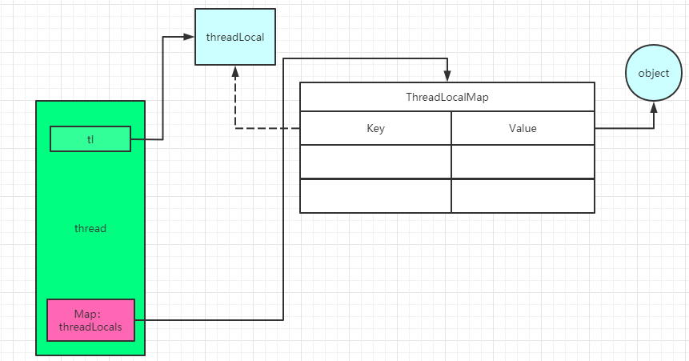

# ThreadLocal

当调用theadlocal的set的方法的时候， 

set方法的源码

```java
  public void set(T value) {
        Thread t = Thread.currentThread(); // 获取当前的线程
        ThreadLocalMap map = getMap(t); // 获取当前线程的ThreadLocalMap： threadlocals
        if (map != null)
            map.set(this, value); // 往map里面put值，key为threadlocal对象，value是threadlocal里面的值
        else
            createMap(t, value);
    }
```

进一步看一下getMap里面的内容

```java
ThreadLocalMap getMap(Thread t) {
        return t.threadLocals;
    }
```

在Thread类里面

```java
ThreadLocal.ThreadLocalMap threadLocals = null;
```

ThreadLocalMap底层是一个Map结构。在ThreadLocal里面的一个静态内部类，ThreadLocalMap里面又包含一个Entry的静态内部类，是一个k-v键值对的结构，key为threadlocal对象，value是里面的值。还继承了WeakReference， 所以这个Entry是一个弱引用对象，当垃圾收集器看到他的时候会直接回收。

```java
static class ThreadLocalMap {

        static class Entry extends WeakReference<ThreadLocal<?>> {
            /** The value associated with this ThreadLocal. */
            Object value;

            Entry(ThreadLocal<?> k, Object v) {
                super(k);
                value = v;
            }
        }

        /**
         * The initial capacity -- MUST be a power of two.
         */
        private static final int INITIAL_CAPACITY = 16;

        /**
         * The table, resized as necessary.
         * table.length MUST always be a power of two.
         */
        private Entry[] table;
}
```

当我们new了一个threadlocal对象，调用set方法的时候，先拿到 当前的线程的ThreadLocalMap threadlocals， 这是一个Map结构，key为threadlocal对象，value是threadlocal对象里面的值，key是通过一个弱引用指向threadlocal对象的。如下图所示。



为什么是弱引用呢？ 假如这是个强引用，当tl的引用置为null的时候，key的引用不为null，还指向了threadlocal对象，所以这时threadlocal将不会被回收，就可能发生内存泄漏。如果是弱引用的话，当JVM虚拟机运行gc的时候，发现threadlocal是一个弱引用，则直接将其回收，这样就可以解决内存泄漏问题。

还有一个问题，假如，这时候key为null了，要想通过get方法获得value的话是不可能获取到的，这个value对象的值怎么释放呢？所以，这也会产生内存泄漏 的情况，良好的编程习惯是将这一条记录remove掉，这样就防止了value这部分的内存泄漏。

假如使用的线程池，如果不清理掉旧的记录，当线程复用的时候，会导致数据混乱。所以，线程池的底层源码就是每次开启一个线程的时候都会将当前线程的ThreadLocalMap置为null。

# ThreadLocal的使用场景

spring关于事务的管理

mybatis中分页的处理。