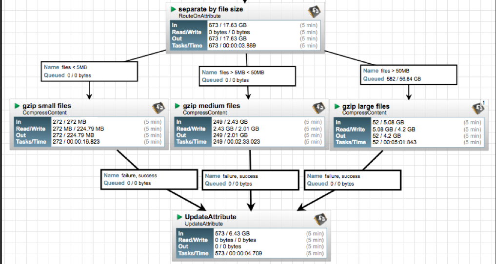
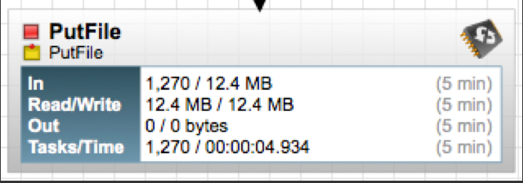

#   [NiFi/HDF Dataflow Optimization (Part 1 of 2)](https://community.cloudera.com/t5/Community-Articles/NiFi-HDF-Dataflow-Optimization-Part-1-of-2/ta-p/245102) 

# [NiFi/HDF Dataflow Optimization (Part 2 of 2) ](https://community.cloudera.com/t5/Community-Articles/NiFi-HDF-Dataflow-Optimization-Part-2-of-2/ta-p/245113)

## 怎么预防系统或者Processor过载运行

1. 使用connection中背压控制
2. 结合ControRate处理器

## 理解Processors所需的资源

 数据流优化的另一个方面是了解每个处理器所需的资源。这将允许更好的数据流执行。例如，CompressContent处理器将使用1个CPU/并发任务，因此，如果该处理器具有4个并发任务，并且队列中有4个文件，则该处理器将使用4个CPU，直到文件被压缩为止。对于小型文件，这比处理大型文件少于资源瓶颈。一个很好的例子是，将中小型，中和大文件都从单独的流路路径沿着3个不同的压缩处理器流动，每个流程都有自己的并发任务数量。在下面的示例中，所有三个CompressContent处理器都有一个并发任务。 

该图提供了优化吞吐量的一个很好的例子。每个CompressContent处理器的“ Tasks/Time”清楚地表明，随着文件的增加，压缩较大文件所需的时间呈指数较大。这提供了更好地利用CPU处理最多文件数量，而不是让任意的大文件放慢整个流程。这不是在文档中明确指出的，而是通过压缩NIFI内部或外部文件的唯一方法是使用每个文件使用要在完成操作的系统上使用CPU使用CPU。 

 请注意，处理器的某些文档指出了当特定处理器具有应意识到的行为时。例如，MemgeContent处理器的文档具有以下行：*建议仅使用单个传入连接配置处理器，因为不会从不同连接的FlowFiles创建一组FlowFiles。* 

 FlowFiles的大小和遍历各种数据流路径的流档数量将对某些处理器产生不同的影响。学习阅读有关处理器的信息可以帮助您确定何时何地应用一些或全部讨论的优化策略。 

## NIFI如何帮助您找到可以优化的位置/如何优化？ 

 每个处理器提供了大量信息，可以帮助DFM确定故障点在流动中的位置；请参阅下面的描述： 

**In**:  根据滑动5分钟的窗口，处理器从其传入连接的队列中取出的数据量。该值表示为<count> / <size>其中<count>是已从队列中提取的流file的数量，而<size>是这些FlowFiles内容的总大小。在此示例中，处理器已从输入队列中取出1270个flowfile，总共12.4兆字节（MB）。 

**Read/Write**: 处理器已从磁盘读取并写入磁盘的flowfile内容的总大小。这提供了有关此处理器所需的I/O性能的有价值的信息。有些处理器只能在不编写任何内容的情况下读取数据，而有些则不会读取数据，而只会写数据。其他人则既不读取也不会写数据，而某些处理器则将读取和写入数据。在此示例中，我们看到在过去的五分钟内，该处理器读取了12.4 MB的flowfile，并且还写了12.4 MB。这就是我们期望的，因为该处理器只是将流file的内容复制到磁盘上。 

**Out**： 处理器已转移到其出站连接的数据量。这不包括处理器删除自身的flowfiles，也不包括与自动终止的连接路由的流文件。就像上面的“ In”指标一样，此值表示为<count> / <size>，其中<count>是已将其传输到出站连接的flowfile的数量，<size>是这些FlowFiles内容的总大小。在此示例中，所有文件都写入磁盘，并且连接被自动终止，因此没有将文件移出到下游连接。 

 **Tasks/Time**： 反映了在过去5分钟内完成运行的任务数量以及这些任务完成的总时间。您可能有1个线程，一个任务需要20分钟才能完成。完成后，将在接下来的5分钟内添加到此累积报告中。时间的格式为< hour>：< minute >：< second >。请注意，所花费的时间可能超过五分钟，因为许多任务可以并行执行。例如，如果安排处理器运行60个并发任务，并且这些任务中的每一个都需要一秒钟才能完成，则所有60个任务可能会在一秒钟内完成。但是，在这种情况下，我们将看到时间指标表明它花了60秒，而不是1秒。 

利用处理器提供的信息，读取/写入的数量以及每个任务的任务/时间来查找图表上的“热点”。例如，如果大量任务运行，但是通过处理器传递的数据量较低，则处理器可能被配置为过于频繁或同时执行的任务过多。对于处理器，至少需要更仔细的外观。**一个完成任务很少的处理器以及较高的任务时间表明该处理器是CPU密集的。如果数据流量很高，并且处理器显示大量的已完成线程和高任务时间，则可以通过增加处理器调度的运行持续时间（Run Duration）来提高性能。** 

## 产生了背压

 如果在数据始终始终积压的流程中存在连接，则如果处理数据的任何延迟是不可接受的，则可能是一个关注点。但是，只需在以上的情况下向处理器添加更多并发任务，就可以在图表的另一部分中导致线程饥饿（下面更详细地介绍）。再次在这里，DFM必须注意了解为什么数据在图中的此特定点备份。它只是可以是一个非常密集的处理器，并且在整个图中只有如此多的CPU可使用。这些文件可能对系统非常大，并且可能需要每个文件的读取和写入，这是昂贵的操作。如果资源不是问题，请添加更多的并发任务，看看是否解决了积压的问题。如果资源是问题，则必须重新设计流量以更好地利用可用的内容，否则必须将工作负载分配到多个系统上，这意味着群集两个或多个系统以减少任何一个系统的负载。文件可能是积压的，因为对其进行处理的处理器是I/O密集型。处理器统计信息应显示。检查磁盘；我是/o还是接近100％？添加更多线程不会更快地处理文件，而是会导致线程饥饿。 

## NiFi线程饥饿

 优化的另一个方面是如何配置处理器，使其在流的一个区域占用太多可用资源，然后在流的另一个区域耗尽线程。

 假设有一个处理器是CPU和磁盘密集型，需要10个并行的任务来维持日常操作流量。然后对图进行修改以添加需要系统资源的其他数据流。将附加数据流添加到图表后，注意到具有10个并发任务的处理器无法跟上数据速率。因此，将另外5个并发任务添加到处理器中。然后，图上的另一个流开始备份数据，然后将其他并发任务添加到该流程中，依此类推……很快，已将太多并发任务添加到了图中，以至于数据流实际上永远不会获得线程，系统花费了确定哪个处理器应该获得线程的所有资源，但永远不会允许完成任务，并且系统陷入了此周期。 

 为了防止这种情况发生在数据流程中，每次更新或添加图表之后，DFM应检查系统资源利用率的当前级别。如果更新或添加后，数据开始在以前未看到的流程的点上积压，则更改以某种方式不堪重负，并建议关闭添加的流量，直到它可以确定哪个系统资源正在过度使用。另一个解决方案是通过集群系统将流量平衡在两个或多个系统上。 

## 集群

 即使在优化的数据流中，物理资源耗尽也可以而且确实发生。当这种情况发生时，最好的方法是将数据负载分散在NIFI群集中的多个NIFI实例上。 

 NIFI管理员或DataFlow Manager（DFM）可能会发现，在单个服务器上使用NIFI的一个实例不足以处理其拥有的数据量。因此，一种解决方案是在多个单独的NIFI服务器上运行相同的数据流。但是，这会引起管理问题，因为每次DFM都想更改或更新数据流，它们必须在每个服务器上进行更改，然后单独监视每个服务器。通过聚类NIFI服务器，可以使增加的处理能力以及单个接口进行通过，以使数据流更改并监视数据流。聚类允许DFM仅进行每个更改一次，然后将更改复制到集群的所有节点。通过单个接口，DFM还可以监视所有节点的健康和状态 

 NIFI集群的设计是一个简单的主/从模型，其中有一个或一个或多个从属。在NIFI群集中，我们将主人称为NIFI群集管理器（NCM），而奴隶称为节点。尽管该模型是主和从属的模型，但如果NCM死亡，则指示节点继续操作，因为它们是为了确保数据流保持生存。NCM的缺失仅表示新节点不能连接群集，并且在恢复NCM之前，不会发生群集流量变化。 