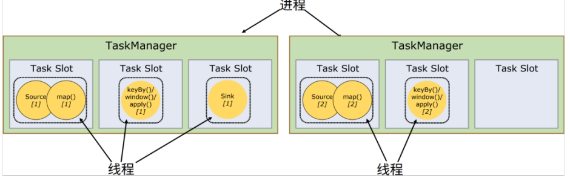
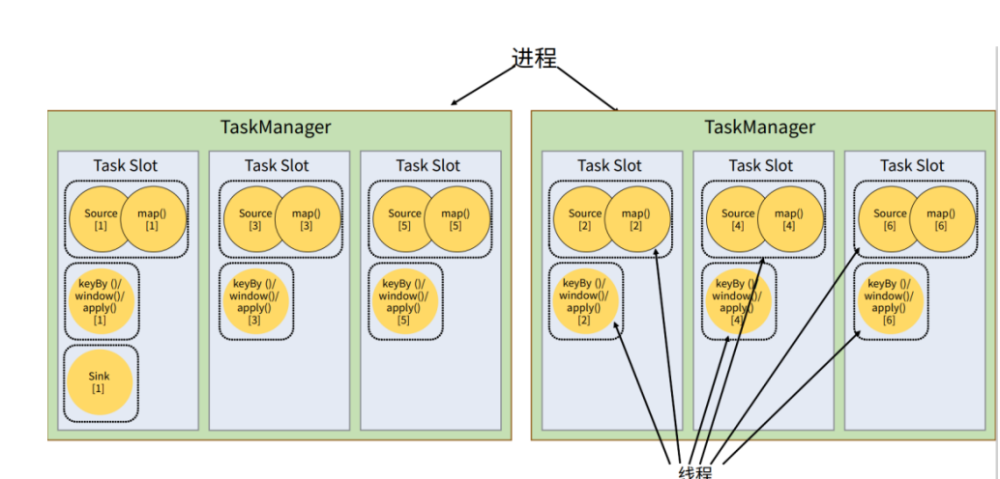
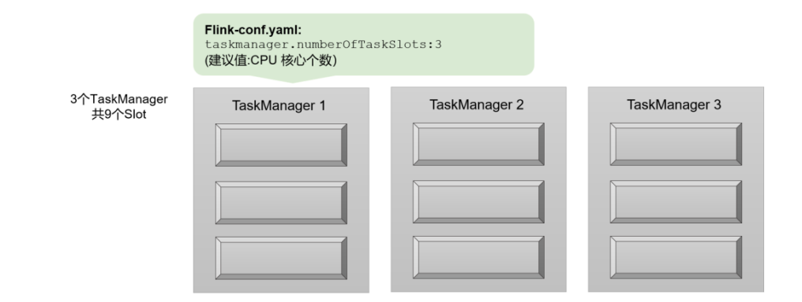
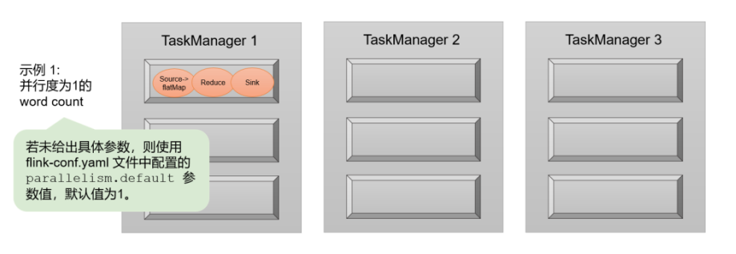
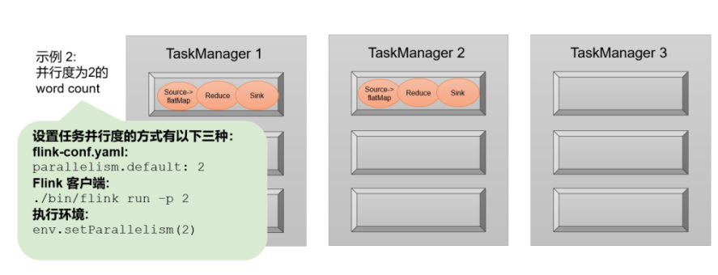
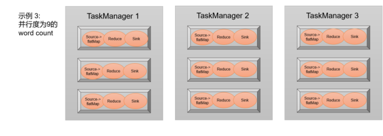
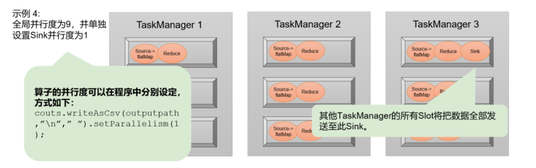

# 任务槽 （Task Slots） 

Flink 中每一个 worker(也就是 TaskManager)都是一个 JVM 进程，它可 6以启动多个独立的线程，来并行执行多个子任务（subtask）。

任务槽（task slot）其实表示了 TaskManager 拥有计算资源的一个固定大小的子集。 这些资源就是用来独立执行一个子任务的 

假如一个 TaskManager 有三个 slot，那么它会将管理的内存平均分成三份，每个 slot 独自 占据一份。这样一来，我们在 slot 上执行一个子任务时，相当于划定了一块内存“专款专用”，   就不需要跟来自其他作业的任务去竞争内存资源了。所以现在我们只要 2 个 TaskManager，就 可以并行处理分配好的 5 个任务了。

slot 目前仅仅用来**隔离内存**，不会涉及 CPU 的隔离。在具体应用时，可 以将 slot 数量配置为机器的 CPU 核心数，尽量避免不同任务之间对 CPU 的竞争。这也是开发 环境默认并行度设为机器 CPU 数量的原因 。

###   任务对任务槽的共享 

默认情况下，Flink 是允许子任务共享 slot 的。 只要属于同一个作业，那么对于不同任务节点的并行子任务，就可以放到同一个 slot 上执行。

每个任务节点的并行子任务一字排开，占据不同的 slot；而不同 的任务节点的子任务可以共享 slot。一个 slot 中，可以将程序处理的所有任务都放在这里执行， 我们把它叫作保存了整个作业的运行管道（pipeline）。 

 我们知道，一个 slot 对应了一组独立的计算资源。在之前不做共享的时候，每个任务都平 等地占据了一个 slot，但其实不同的任务对资源的占用是不同的。例如这里的前两个任务， source/map 尽管是两个算子合并算子链得到的，但它只是基本的数据读取和简单转换，计算耗 时极短，一般也不需要太大的内存空间；而 window 算子所做的窗口操作，往往会涉及大量的 数据、状态存储和计算，我们一般把这类任务叫作“资源密集型”（intensive）任务。当它们 被平等地分配到独立的 slot 上时，实际运行我们就会发现，大量数据到来时 source/map 和 sink 任务很快就可以完成，但 window 任务却耗时很久；于是下游的 sink 任务占据的 slot 就会等待 闲置，而上游的 source/map 任务受限于下游的处理能力，也会在快速处理完一部分数据后阻 塞对应的资源开始等待（相当于处理**背压**）。这样资源的利用就出现了极大的不平衡，“忙的忙 死，闲的闲死”。 解决这一问题的思路就是允许 slot 共享。当我们将资源密集型和非密集型的任务同时放到 一个 slot 中，它们就可以自行分配对资源占用的比例，从而保证最重的活平均分配给所有的 TaskManager。 

同一个任务节点的并行子任务是不能共享 slot 的，所以允许 slot 共享之后，运行作业所需的 slot 数量正好就是作业中所有算子并行度的最大值。这样一来，我们考虑当前集群需 要配置多少 slot 资源时，就不需要再去详细计算一个作业总共包含多少个并行子任务了，只看 最大的并行度就够了。  

###  任务槽和并行度的关系  

假设一共有 3 个 TaskManager，每一个 TaskManager 中的 slot 数量设置为 3 个，那么一共有 9 个 task slot，表示集群最多能并行执行 9 个任务 

而我们定义 WordCount 程序的处理操作是四个转换算子： 

> source→ flatMap→ reduce→ sink

当所有算子并行度相同时，容易看出 source 和 flatMap 可以合并算子链，于是最终有三个任务节点.。如果我们没有任何并行度设置，而配置文件中默认 parallelism.default=1，那么程序运行的 默认并行度为 1，总共有 3 个任务。由于不同算子的任务可以共享任务槽，所以最终占用的 slot 只有 1 个。9 个 slot 只用了 1 个，有 8 个空闲。

设置并行度为 2，那么总共有 6 个任务，共享任 务槽之后会占用 2 个 slot：

把并行度设置为 9，这样所有 27 个任务就会完全占用 9 个 slot。 这是当前集群资源下能执行的最大并行度，计算资源得到了充分的利用

 再考虑对于某个算子单独设置并行度的场景。 考虑到输出可能是写入 文件，那会希望不要并行写入多个文件，就需要设置 sink 算子的并行度为 1。这时其他的算子 并行度依然为 9，所以总共会有 19 个子任务。根据 slot 共享的原则，它们最终还是会占用全 部的 9 个 slot，而 sink 任务只在其中一个 slot 上执行

整个流处理程序的并行度，就应该是所有算子并行度中最大的那个， 这代表了运行程序需要的 slot 数量。