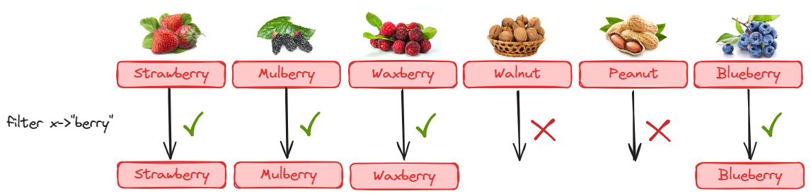
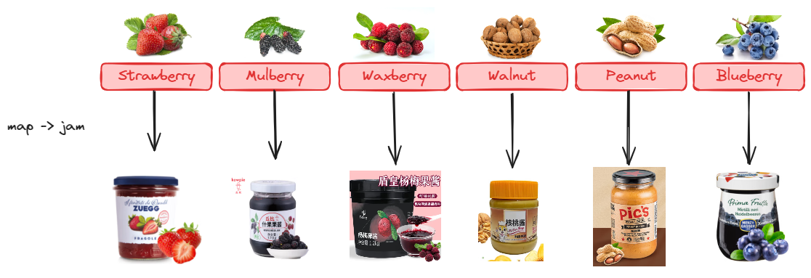
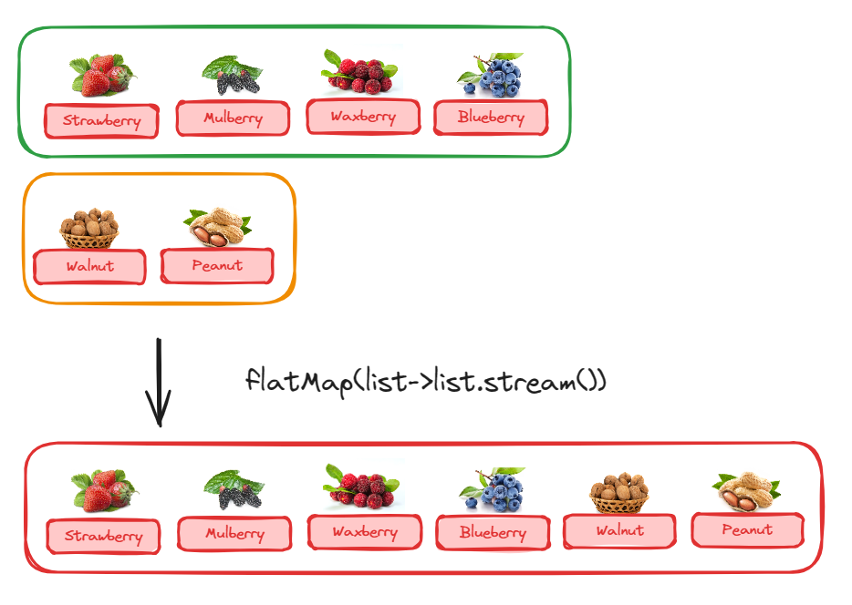
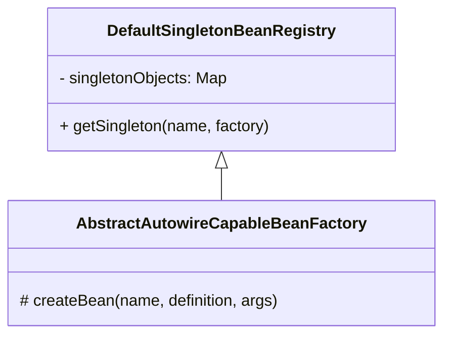

# 一. 道之伊始

宇宙初开之际，混沌之气笼罩着整个宇宙，一切模糊不清。

然后，盘古开天，女娲造人：日月乃出、星辰乃现，山川蜿蜒、江河奔流、生灵万物，欣欣向荣。此日月、星辰、山川、江河、生灵万物，谓之【对象】，皆随时间而化。

然而：日月之行、星汉灿烂、山川起伏、湖海汇聚，冥冥中有至理藏其中。名曰【道】，乃万物遵循之规律，亦谓之【函数】，它无问东西，亘古不变

作为**设计宇宙洪荒**的程序员

* 造日月、筑山川、划江河、开湖海、演化生灵万物、令其生生不息，则必用面向【对象】之手段
* 若定规则、求本源、追纯粹，论不变，则当选【函数】编程之思想

下面就让我们从【函数】开始。


## 什么是函数

什么是函数呢？函数即规则

数学上：


例如：

| INPUT | f(x) | OUTPUT |
| ----- | ---- | ------ |
| 1     | ?    | 1      |
| 2     | ?    | 4      |
| 3     | ?    | 9      |
| 4     | ?    | 16     |
| 5     | ?    | 25     |
| ...   | ...  | ...    |

* $f(x) = x^2$ 是一种规律， input 按照此规律变化为 output
* 很多规律已经由人揭示，例如 $e = m \cdot c^2$
* 程序设计中**更**可以自己去制定规律，一旦成为规则的制定者，你就是神


## 大道无情

### 无情

何为无情：

* 只要输入相同，无论多少次调用，无论什么时间调用，输出相同。


### 佛祖成道

例如

```java
public class TestMutable {

    public static void main(String[] args) {
        System.out.println(pray("张三"));
        System.out.println(pray("张三"));
        System.out.println(pray("张三"));
    }

    static class Buddha {
        String name;

        public Buddha(String name) {
            this.name = name;
        }
    }

    static Buddha buddha = new Buddha("佛祖");

    static String pray(String person) {
        return (person + "向[" + buddha.name + "]虔诚祈祷");
    }
}
```

以上 pray 的执行结果，除了参数变化外，希望函数的执行规则永远不变

```
张三向[佛祖]虔诚祈祷
张三向[佛祖]虔诚祈祷
张三向[佛祖]虔诚祈祷
```

然而，由于设计上的缺陷，函数引用了外界可变的数据，如果这么使用

```java
buddha.name = "魔王";
System.out.println(pray("张三"));
```

结果就会是

```java
张三向[魔王]虔诚祈祷
```

问题出在哪儿呢？函数的目的是除了参数能变化，其它部分都要不变，这样才能成为规则的一部分。佛祖要成为规则的一部分，也要保持不变

改正方法

```java
static class Buddha {
    final String name;

    public Buddha(String name) {
        this.name = name;
    }
}
```

或

```java
record Buddha(String name) { }
```

* 不是说函数不能引用外界的数据，而是它引用的数据必须也能作为规则的一部分
* 让佛祖不变，佛祖才能成为规则


### 函数与方法

方法本质上也是函数。不过方法绑定在对象之上，它是对象个人法则

函数是

* 函数（对象数据，其它参数）

而方法是

* 对象数据.方法（其它参数）


### 不变的好处

只有不变，才能在滚滚时间洪流中屹立不倒，成为规则的一部分。

多线程编程中，不变意味着线程安全


### 合格的函数无状态


## 大道无形

### 函数化对象

函数本无形，也就是它代表的规则：位置固定、不能传播。

若要有形，让函数的规则能够传播，需要将函数化为对象。

```java
public class MyClass {
    static int add(int a, int b) {
        return a + b;
    }
} 
```

与

```java
interface Lambda {
    int calculate(int a, int b);
}

Lambda add = (a, b) -> a + b; // 它已经变成了一个 lambda 对象
```

区别在哪？

* 前者是纯粹的一条两数加法规则，它的位置是固定的，要使用它，需要通过 MyClass.add 找到它，然后执行
* 而后者（add 对象）就像长了腿，它的位置是可以变化的，想去哪里就去哪里，哪里要用到这条加法规则，把它传递过去
* 接口的目的是为了将来用它来执行函数对象，此接口中只能有一个方法定义

函数化为对象做个比喻

* 之前是大家要统一去西天取经
* 现在是每个菩萨、罗汉拿着经书，入世传经

例如

```java
public class Test {
    interface Lambda {
        int calculate(int a, int b);
    }

    static class Server {
        public static void main(String[] args) throws IOException {
            ServerSocket ss = new ServerSocket(8080);
            System.out.println("server start...");
            while (true) {
                Socket s = ss.accept();
                Thread.ofVirtual().start(() -> {
                    try {
                        ObjectInputStream is = new ObjectInputStream(s.getInputStream());
                        Lambda lambda = (Lambda) is.readObject();
                        int a = ThreadLocalRandom.current().nextInt(10);
                        int b = ThreadLocalRandom.current().nextInt(10);
                        System.out.printf("%s %d op %d = %d%n",
                   s.getRemoteSocketAddress().toString(), a, b, lambda.calculate(a, b));
                    } catch (IOException | ClassNotFoundException e) {
                        throw new RuntimeException(e);
                    }
                });
            }
        }
    }

    static class Client1 {
        public static void main(String[] args) throws IOException {
            try(Socket s = new Socket("127.0.0.1", 8080)){
                Lambda lambda = (Lambda & Serializable) (a, b) -> a + b;
                ObjectOutputStream os = new ObjectOutputStream(s.getOutputStream());
                os.writeObject(lambda);
                os.flush();
            }
        }
    }
    
    static class Client2 {
        public static void main(String[] args) throws IOException {
            try(Socket s = new Socket("127.0.0.1", 8080)){
                Lambda lambda = (Lambda & Serializable) (a, b) -> a - b;
                ObjectOutputStream os = new ObjectOutputStream(s.getOutputStream());
                os.writeObject(lambda);
                os.flush();
            }
        }
    }
    
    static class Client3 {
        public static void main(String[] args) throws IOException {
            try(Socket s = new Socket("127.0.0.1", 8080)){
                Lambda lambda = (Lambda & Serializable) (a, b) -> a * b;
                ObjectOutputStream os = new ObjectOutputStream(s.getOutputStream());
                os.writeObject(lambda);
                os.flush();
            }
        }
    }
}
```

* 上面的例子做了一些简单的扩展，可以看到不同的客户端可以上传自己的计算规则


> ***P.S.***
>
> * 大部分文献都说 lambda 是匿名函数，但我觉得需要在这个说法上进行补充
> * 至少在 java 里，虽然 lambda 表达式本身不需要起名字，但不得提供一个对应接口嘛


### 行为参数化

已知学生类定义如下

```java
static class Student {
    private String name;
    private int age;
    private String sex;

    public Student(String name, int age, String sex) {
        this.name = name;
        this.age = age;
        this.sex = sex;
    }

    public int getAge() {
        return age;
    }

    public String getName() {
        return name;
    }

    public String getSex() {
        return sex;
    }

    @Override
    public String toString() {
        return "Student{" +
                "name='" + name + '\'' +
                ", age=" + age +
                ", sex='" + sex + '\'' +
                '}';
    }
}
```

针对一组学生集合，筛选出男学生，下面的代码实现如何，评价一下

```java
public static void main(String[] args) {
    List<Student> students = List.of(
            new Student("张无忌", 18, "男"),
            new Student("杨不悔", 16, "女"),
            new Student("周芷若", 19, "女"),
            new Student("宋青书", 20, "男")
    );

    System.out.println(filter(students)); // 能得到 张无忌，宋青书
}

static List<Student> filter(List<Student> students) {
    List<Student> result = new ArrayList<>();
    for (Student student : students) {
        if (student.sex.equals("男")) {
            result.add(student);
        }
    }
    return result;
}
```

如果需求再变动一下，要求找到 18 岁以下的学生，上面代码显然不能用了，改动方法如下

```java
static List<Student> filter(List<Student> students) {
    List<Student> result = new ArrayList<>();
    for (Student student : students) {
        if (student.age <= 18) {
            result.add(student);
        }
    }
    return result;
}

System.out.println(filter(students)); // 能得到 张无忌，杨不悔
```

那么需求如果再要变动，找18岁以下男学生，怎么改？显然上述做法并不太好... 更希望一个方法能处理各种情况，仔细观察以上两个方法，找不同。

不同在于筛选条件部分：

```java
student.sex.equals("男")
```

和

```java
student.age <= 18
```

既然它们就是不同，那么能否把它作为参数传递进来，这样处理起来不就一致了吗？

```java
static List<Student> filter(List<Student> students, ???) {
    List<Student> result = new ArrayList<>();
    for (Student student : students) {
        if (???) {
            result.add(student);
        }
    }
    return result;
}
```

它俩要判断的逻辑不同，那这两处不同的逻辑必然要用函数来表示，将来这两个函数都需要用到 student 对象来判断，都应该返回一个 boolean 结果，怎么描述函数的长相呢？

```java
interface Lambda {
    boolean test(Student student);
}
```

方法可以统一成下述代码

```java
static List<Student> filter(List<Student> students, Lambda lambda) {
    List<Student> result = new ArrayList<>();
    for (Student student : students) {
        if (lambda.test(student)) {
            result.add(student);
        }
    }
    return result;
}
```

好，最后怎么给它传递不同实现呢？

```java
filter(students, student -> student.sex.equals("男"));
```

以及

```java
filter(students, student -> student.age <= 18);
```

还有新需求也能满足

```java
filter(students, student -> student.sex.equals("男") && student.age <= 18);
```

这样就实现了以不变应万变，而变换即是一个个函数对象，也可以称之为行为参数化


### 延迟执行

在记录日志时，假设日志级别是 INFO，debug 方法会遇到下面的问题：

* 本不需要记录日志，但 expensive 方法仍被执行了

```java
static Logger logger = LogManager.getLogger();

public static void main(String[] args) {
    System.out.println(logger.getLevel());
    logger.debug("{}", expensive());
}

static String expensive() {
    System.out.println("执行耗时操作");
    return "结果";
}
```

改进方法1：

```java
if(logger.isDebugEnabled())
    logger.debug("{}", expensive());
```

显然这么做，很多类似代码都要加上这样 if 判断，很不优雅


改进方法2：

在 debug 方法外再套一个新方法，内部逻辑大概是这样：

```java
public void debug(final String msg, final Supplier<?> lambda) {
    if (this.isDebugEnabled()) {
        this.debug(msg, lambda.get());
    }
}
```

调用时这样：

```java 
logger.debug("{}", () -> expensive());
```

expensive() 变成了不是立刻执行，在未来 if 条件成立时才执行


### 函数对象的不同类型

```java
Comparator<Student> c = 
    			(Student s1, Student s2) -> Integer.compare(s1.age, s2.age);
        
BiFunction<Student, Student, Integer> f = 
                (Student s1, Student s2) -> Integer.compare(s1.age, s2.age);
```


# 二. 函数编程语法

## 表现形式

在 Java 语言中，lambda 对象有两种形式：lambda 表达式与方法引用

lambda 对象的类型是由它的行为决定的，如果有一些 lambda 对象，它们的入参类型、返回值类型都一致，那么它们可以看作是同一类的 lambda 对象，它们的类型，用函数式接口来表示


## 函数类型

练习：将 lambda 对象分类，见 PPT


函数接口的命名规律

* 带有 Unary 是一元的意思，表示一个参数
* 带有 Bi 或 Binary 是二元的意思，表示两个参数
* Ternary 三元
* Quatenary 四元
* ...


方法引用也是类似，入参类型、返回值类型都一致的话，可以看作同一类的对象，也是用函数式接口表示


## 六种方法引用

### 1）类名::静态方法名

如何理解：

* 函数对象的逻辑部分是：调用此静态方法
* 因此这个静态方法需要什么参数，函数对象也提供相应的参数即可

```java
public class Type2Test {
    public static void main(String[] args) {
        /*
            需求：挑选出所有男性学生
         */
        Stream.of(
                        new Student("张无忌", "男"),
                        new Student("周芷若", "女"),
                        new Student("宋青书", "男")
                )
                .filter(Type2Test::isMale)
                .forEach(student -> System.out.println(student));
    }

    static boolean isMale(Student student) {
        return student.sex.equals("男");
    }

    record Student(String name, String sex) {
    }
}
```

* filter 这个高阶函数接收的函数类型（Predicate）是：一个 T 类型的入参，一个 boolean 的返回值
  * 因此我们只需要给它提供一个相符合的 lambda 对象即可
* isMale 这个静态方法有入参 Student 对应 T，有返回值 boolean 也能对应上，所以可以直接使用

输出

```
Student[name=张无忌, sex=男]
Student[name=宋青书, sex=男]
```


### 2）类名::非静态方法名

如何理解：

* 函数对象的逻辑部分是：调用此非静态方法
* 因此这个函数对象需要提供一个额外的对象参数，以便能够调用此非静态方法
* 非静态方法的剩余参数，与函数对象的剩余参数一一对应

例1：

```java
public class Type3Test {
    public static void main(String[] args) {
        highOrder(Student::hello);
    }

    static void highOrder(Type3 lambda) {
        System.out.println(lambda.transfer(new Student("张三"), "你好"));
    }

    interface Type3 {
        String transfer(Student stu, String message);
    }

    static class Student {
        String name;

        public Student(String name) {
            this.name = name;
        }

        public String hello(String message) {
            return this.name + " say: " + message;
        }
    }
}
```

上例中函数类型的

* 参数1 对应着 hello 方法所属类型 Student
* 参数2 对应着 hello 方法自己的参数 String
* 返回值对应着 hello 方法自己的返回值 String

输出

```
张三 say: 你好
```


例2：改写之前根据性别过滤的需求

```java
public class Type2Test {
    public static void main(String[] args) {
        /*
            需求：挑选出所有男性学生
         */
        Stream.of(
                        new Student("张无忌", "男"),
                        new Student("周芷若", "女"),
                        new Student("宋青书", "男")
                )
                .filter(Student::isMale)
                .forEach(student -> System.out.println(student));
    }

    record Student(String name, String sex) {
        boolean isMale() {
            return this.sex.equals("男");
        }
    }
}
```

* filter 这个高阶函数接收的函数类型（Predicate）是：一个 T 类型的入参，一个 boolean 的返回值
  * 因此我们只需要给它提供一个相符合的 lambda 对象即可
* 它的入参1 T 对应着 isMale 非静态方法的所属类型 Student
* 它没有其它参数，isMale 方法也没有参数
* 返回值都是 boolean

输出

```
Student[name=张无忌, sex=男]
Student[name=宋青书, sex=男]
```


例3：将学生对象仅保留学生的姓名

```java
public class Type2Test {
    public static void main(String[] args) {
        Stream.of(
                        new Student("张无忌", "男"),
                        new Student("周芷若", "女"),
                        new Student("宋青书", "男")
                )
                .map(Student::name)
                .forEach(student -> System.out.println(student));
    }

    record Student(String name, String sex) {
        boolean isMale() {
            return this.sex.equals("男");
        }
    }
}
```

* map 这个高阶函数接收的函数类型是（Function）是：一个 T 类型的参数，一个 R 类型的返回值
* 它的入参1 T 对应着 name 非静态方法的所属类型 Student
* 它没有剩余参数，name 方法也没有参数
* 它的返回值 R 对应着 name 方法的返回值 String

输出

```
张无忌
周芷若
宋青书
```


### 3）对象::非静态方法名

如何理解：

* 函数对象的逻辑部分是：调用此非静态方法
* 因为对象已提供，所以不必作为函数对象参数的一部分
* 非静态方法的剩余参数，与函数对象的剩余参数一一对应

```java
public class Type4Test {
    public static void main(String[] args) {
        Util util = new Util(); // 对象
        Stream.of(
                        new Student("张无忌", "男"),
                        new Student("周芷若", "女"),
                        new Student("宋青书", "男")
                )
                .filter(util::isMale)
                .map(util::getName)
                .forEach(student -> System.out.println(student));
    }

    record Student(String name, String sex) {
        boolean isMale() {
            return this.sex.equals("男");
        }
    }

    static class Util {
        boolean isMale(Student student) {
            return student.sex.equals("男");
        }
        String getName(Student student) {
            return student.name();
        }
    }
}
```

其实较为典型的一个应用就是 `System.out` 对象中的非静态方法，最后的输出可以修改为

```java
.forEach(System.out::println);
```

这是因为 

* forEach  这个高阶函数接收的函数类型（Consumer）是一个 T 类型参数，void 无返回值
* 而 System.out 对象中有非静态方法 void println(Object x) 与之一致，因此可以将此方法化为 lambda 对象给 forEach 使用


### 4）类名::new

对于构造方法，也有专门的语法把它们转换为 lambda 对象

函数类型应满足

* 参数部分与构造方法参数一致
* 返回值类型与构造方法所在类一致

例如：

```java
public class Type5Test {
    static class Student {
        private final String name;
        private final int age;

        public Student() {
            this.name = "某人";
            this.age = 18;
        }

        public Student(String name) {
            this.name = name;
            this.age = 18;
        }

        public Student(String name, int age) {
            this.name = name;
            this.age = age;
        }

        @Override
        public String toString() {
            return "Student{" +
                    "name='" + name + '\'' +
                    ", age=" + age +
                    '}';
        }
    }

    interface Type51 {
        Student create();
    }

    interface Type52 {
        Student create(String name);
    }

    interface Type53 {
        Student create(String name, int age);
    }

    public static void main(String[] args) {
        hiOrder((Type51) Student::new);
        hiOrder((Type52) Student::new);
        hiOrder((Type53) Student::new);
    }

    static void hiOrder(Type51 creator) {
        System.out.println(creator.create());
    }

    static void hiOrder(Type52 creator) {
        System.out.println(creator.create("张三"));
    }

    static void hiOrder(Type53 creator) {
        System.out.println(creator.create("李四", 20));
    }
}
```


### 5）this::非静态方法名

算是形式2的特例，只能用在类内部

```java
public class Type6Test {
    public static void main(String[] args) {
        Util util = new UtilExt();
        util.hiOrder(Stream.of(
                new Student("张无忌", "男"),
                new Student("周芷若", "女"),
                new Student("宋青书", "男")
        ));
    }

    record Student(String name, String sex) {

    }

    static class Util {
        boolean isMale(Student student) {
            return student.sex.equals("男");
        }

        boolean isFemale(Student student) {
            return student.sex.equals("女");
        }

        void hiOrder(Stream<Student> stream) {
            stream
                    .filter(this::isMale)
                    .forEach(System.out::println);
        }
    }
}
```


### 6）super::非静态方法名

算是形式2的特例，只能用在类内部（用在要用 super 区分重载方法时）

```java
public class Type6Test {
	
    //...
    
    static class UtilExt extends Util {
        void hiOrder(Stream<Student> stream) {
            stream
                    .filter(super::isFemale)
                    .forEach(System.out::println);
        }
    }
}
```


### 7）特例

函数接口和方法引用之间，可以差一个返回值，例如

```java
public class ExceptionTest {
    public static void main(String[] args) {
        Runnable task1 = ExceptionTest::print1;
        Runnable task2 = ExceptionTest::print2;
    }
    
    static void print1() {
        System.out.println("task1 running...");
    }

    static int print2() {
        System.out.println("task2 running...");
        return 1;
    }
}
```

* 可以看到 Runnable 接口不需要返回值，而实际的函数对象多出的返回值也不影响使用


## 闭包（Closure）

何为闭包，闭包就是**函数对象**与**外界变量**绑定在一起，形成的整体。例如

```java
public class ClosureTest1 {
    interface Lambda {
        int add(int y);
    }
    
    public static void main(String[] args) {
        int x = 10;

        highOrder(y -> x + y);
    }

    static void highOrder(Lambda lambda) {
        System.out.println(lambda.add(20));
    }
}
```

* 代码中的 $y \rightarrow x + y$ 和 $x = 10$，就形成了一个闭包
* 可以想象成，函数对象有个背包，背包里可以装变量随身携带，将来函数对象甭管传递到多远的地方，包里总装着个 $x = 10$
* 有个限制，局部变量 x 必须是 final 或 effective final 的，effective final 意思就是，虽然没有用 final 修饰，但就像是用 final 修饰了一样，不能重新赋值，否则就语法错误。
  * 意味着闭包变量，在装进包里的那一刻，就不能变化了
  * 道理也简单，为了保证函数的不变性，防止破坏成道
* 闭包是一种给函数执行提供数据的手段，函数执行既可以使用函数入参，还可以使用闭包变量


例

```java
public class ClosureTest2 {

    // 闭包作用：给函数对象提供参数以外的数据
    public static void main(String[] args) throws IOException {
        // 创建 10 个任务对象，并且每个任务对象给一个任务编号
        List<Runnable> list = new ArrayList<>();
        for (int i = 0; i < 10; i++) {
            int k = i + 1;
            Runnable task 
                = () -> System.out.println(Thread.currentThread()+":执行任务" + k);
            list.add(task);
        }

        ExecutorService service = Executors.newVirtualThreadPerTaskExecutor();
        for (Runnable task : list) {
            service.submit(task);
        }
        System.in.read();
    }
}
```


## 柯里化（Carrying）

柯里化的作用是让函数对象分步执行（本质上是利用多个函数对象和闭包）

例如：

```java
public class Carrying1Test {
    public static void main(String[] args) {
        highOrder(a -> b -> a + b);
    }

    static void highOrder(Step1 step1) {
        Step2 step2 = step1.exec(10);
        System.out.println(step2.exec(20));
        System.out.println(step2.exec(50));
    }

    interface Step1 {
        Step2 exec(int a);
    }

    interface Step2 {
        int exec(int b);
    }
}
```

代码中

*  $a \rightarrow ...$ 是第一个函数对象，它的返回结果  $b \rightarrow ...$ 是第二个函数对象
* 后者与前面的参数 a 构成了闭包
* step1.exec(10) 确定了 a 的值是 10，返回第二个函数对象 step2，a 被放入了 step2 对象的背包记下来了
* step2.exec(20) 确定了 b 的值是 20，此时可以执行 a + b 的操作，得到结果 30
* step2.exec(50) 分析过程类似


## 高阶函数（Higher-Order Functions）

### 1) 内循环

不想写集合便利代码

不知道那种遍历效率高

对集合的元素只读

### 2) 遍历二叉树

### 3) 简单流

```java
package com.castile.functional.hiorder;

import java.util.ArrayList;
import java.util.Arrays;
import java.util.Collection;
import java.util.List;
import java.util.function.Consumer;
import java.util.function.Function;
import java.util.function.Predicate;

/**
 * @description:
 * @author: Castile
 * @create: 2024-04-17 20:15
 * @Version 1.0
 **/
public class SimpleStream<T> {
    private Collection<T> collection;

    public static void main(String[] args) {
        List<Integer> list = Arrays.asList(1, 2, 3, 4, 5, 6, 7, 8);
        SimpleStream.of(list)
                .filter(x -> (x & 1) == 1)
                .map(x -> x * x)
                .forEach(System.out::println);
    }

    public void forEach(Consumer<T> consumer) {
        for (T t : collection) {
            consumer.accept(t);
        }
    }

    public SimpleStream<T> filter(Predicate<T> predicate) {
        ArrayList<T> list = new ArrayList<>();

        for (T t : collection) {
            if (predicate.test(t)) {
                list.add(t);
            }
        }

        return new SimpleStream<>(list);
    }


    public <U> SimpleStream<U> map(Function<T, U> function) {
        ArrayList<U> list = new ArrayList<>();

        for (T t : collection) {
            list.add(function.apply(t));
        }

        return new SimpleStream<>(list);
    }

    public static <T> SimpleStream<T> of(Collection<T> collection) {
        return new SimpleStream<>(collection);
    }

    private SimpleStream(Collection<T> collection) {
        this.collection = collection;
    }
}

```


### 4) 简单流-化简

```java
 public T reduce(T init, BinaryOperator<T> operator) {
        T p = init;
        for (T t : collection) {
            p = operator.apply(p, t);
        }
        return p;
    }
```


### 5) 简单流-收集


## 综合练习

✅❌

### 1）判断语法正确性

```java
interface Lambda1 {
    int op(int a, int b);
}

interface Lambda2 {
    void op(Object obj);
}
```


1. `Lambda1 lambda = a, b -> a - b`  ❌
2. `Lambda1 lambda = (c, d) -> c * d` ✅
3. `Lambda1 lambda = (int a, b) -> a + b` ❌
4. `Lambda2 lambda = Object a -> System.out.println(a)` ❌


### 2）写出等价的 lambda 表达式

```java
static class Student {
    private String name;
    
    public Student(String name) {
        this.name = name;
    }

    public String getName() {
        return name;
    }

    public void setName(String name) {
        this.name = name;
    }

    @Override
    public boolean equals(Object o) {
        if (this == o) return true;
        if (o == null || getClass() != o.getClass()) return false;
        Student student = (Student) o;
        return Objects.equals(name, student.name);
    }

    @Override
    public int hashCode() {
        return Objects.hash(name);
    }
}
```


1. `Math::random`   

   `()->Math.random()`

2. `Math::sqrt`

   `(double number)->Math.sqrt(number)`

3. `Student::getName`

   `(Student stu)->stu.getName()`

4. `Student::setName`

   `(Student stu, String newName) -> stu.setName(newName)`

5. `Student::hashCode`

   `(Student stu) -> stu.hashCode()`

6. `Student::equals`

   `(Student stu, Object o) -> stu.equals(o)`


假设已有对象 `Student stu = new Student("张三");`

1. `stu::getName`

   `()->stu.getName()`

2. `stu::setName`

   `(String newName)->stu.setName(newName)`

3. `Student::new`

   `(String name)->new Student(name)`


### 3）使用函数接口解决问题

把下列方法中，可能存在变化的部分，抽象为函数对象，从外界传递进来

```java
static List<Integer> filter(List<Integer> list) {
    List<Integer> result = new ArrayList<>();
    for (Integer number : list) {
        // 筛选：判断是否是偶数，但以后可能改变判断规则
        if((number & 1) == 0) {
            result.add(number);
        }
    }
    return result;
}
```


```java
static List<String> map(List<Integer> list) {
    List<String> result = new ArrayList<>();
    for (Integer number : list) {
        // 转换：将数字转为字符串，但以后可能改变转换规则
        result.add(String.valueOf(number));
    }
    return result;
}
```


```java
static void consume(List<Integer> list) {
    for (Integer number : list) {
        // 消费：打印，但以后可能改变消费规则
        System.out.println(number);
    }
}
```


```java
static List<Integer> supply(int count) {
    List<Integer> result = new ArrayList<>();
    for (int i = 0; i < count; i++) {
        // 生成：随机数，但以后可能改变生成规则
        result.add(ThreadLocalRandom.current().nextInt());
    }
    return result;
}
```


### 4）写出等价的方法引用

```java
Function<String, Integer> lambda = (String s) -> Integer.parseInt(s);
```


```java
BiPredicate<List<String>, String> lambda = (list, element) -> list.contains(element);
```


```java
BiPredicate<Student, Object> lambda = (stu, obj) -> stu.equals(obj);
```


```java
Predicate<File> lambda = (file) -> file.exists();
```


```java
Runtime runtime = Runtime.getRuntime();

Supplier<Long> lambda = () -> runtime.freeMemory();
```


### 5）补充代码

```java
record Color(Integer red, Integer green, Integer blue) { }
```

如果想用 `Color::new` 来构造 Color 对象，还应当补充哪些代码


### 6）实现需求

```java
record Student(String name, int age) { }

static void highOrder(Predicate<Student> predicate) {
    List<Student> list = List.of(
            new Student("张三", 18),
            new Student("张三", 17),
            new Student("张三", 20)
    );
    for (Student stu : list) {
        if (predicate.test(stu)) {
            System.out.println("通过测试");
        }
    }
}
```

传入参数时，分别用

* 类名::静态方法名
* 类名::非静态方法名

来表示【学生年龄大于等于18】的条件


# 三. Stream API

## 过滤

```java
record Fruit(String cname, String name, String category, String color) { }

Stream.of(
    new Fruit("草莓", "Strawberry", "浆果", "红色"),
    new Fruit("桑葚", "Mulberry", "浆果", "紫色"),
    new Fruit("杨梅", "Waxberry", "浆果", "红色"),
    new Fruit("核桃", "Walnut", "坚果", "棕色"),
    new Fruit("草莓", "Peanut", "坚果", "棕色"),
    new Fruit("蓝莓", "Blueberry", "浆果", "蓝色")
)
```





找到所有浆果

```java
.filter(f -> f.category.equals("浆果"))
```

找到蓝色的浆果

方法1：

```java
.filter(f -> f.category().equals("浆果") && f.color().equals("蓝色"))
```


方法2：让每个 lambda 只做一件事，两次 filter 相对于并且关系

```java
.filter(f -> f.category.equals("浆果"))
.filter(f -> f.color().equals("蓝色"))
```


方法3：让每个 lambda 只做一件事，不过比方法2强的地方可以 or，and，nagate 运算

```java
.filter(((Predicate<Fruit>) f -> f.category.equals("浆果")).and(f -> f.color().equals("蓝色")))
```


## 映射




```java
.map(f -> f.cname() + "酱")
```


## 降维

例1




```java
Stream.of(
        List.of(
                new Fruit("草莓", "Strawberry", "浆果", "红色"),
                new Fruit("桑葚", "Mulberry", "浆果", "紫色"),
                new Fruit("杨梅", "Waxberry", "浆果", "红色"),
                new Fruit("蓝莓", "Blueberry", "浆果", "蓝色")
        ),
        List.of(
                new Fruit("核桃", "Walnut", "坚果", "棕色"),
                new Fruit("草莓", "Peanut", "坚果", "棕色")
        )
)
    
.flatMap(Collection::stream)    
```

* 这样把坚果和浆果两个集合变成了含六个元素的水果流


例2：

```java
Stream.of(
        new Order(1, List.of(
                new Item(6499, 1, "HUAWEI MateBook 14s"),
                new Item(6999, 1, "HUAWEI Mate 60 Pro"),
                new Item(1488, 1, "HUAWEI WATCH GT 4")
        )),
        new Order(1, List.of(
                new Item(8999, 1, "Apple MacBook Air 13"),
                new Item(7999, 1, "Apple iPhone 15 Pro"),
                new Item(2999, 1, "Apple Watch Series 9")
        ))
)
```

想逐一处理每个订单中的商品

```java
.flatMap(order -> order.items().stream())
```

这样把一个有两个元素的订单流，变成了一个有六个元素的商品流


## 构建

根据已有的数组构建流

```java
Arrays.stream(array)
```

根据已有的 Collection 构建流（包括 List，Set 等）

```java
List.of("a","b","c").stream()
```

把一个对象变成流

```java
Stream.of("d")
```

把多个对象变成流

```java
Stream.of("x", "y")
```


## 拼接

两个流拼接

```java
Stream.concat(Stream.of("a","b","c"), Stream.of("d"))
```


## 截取

```java
Stream.concat(Stream.of("a", "b", "c"), Stream.of("d"))
    .skip(1)
    .limit(2)
```

* skip 是跳过几个元素
* limit 是限制处理的元素个数


* dropWhile 是 drop 流中元素，直到条件不成立，留下剩余元素

* takeWhile 是 take 流中元素，直到条件不成立，舍弃剩余元素


## 生成

生成从 0 ~ 9 的数字

```java
IntStream.range(0, 10)
```

或者

```java
IntStream.rangeClosed(0, 9)
```


如果想订制，可以用 iterate 方法，例如下面生成奇数序列

```java
IntStream.iterate(1, x -> x + 2)
```

* 参数1 是初始值
* 参数2 是一个特殊 Function，即参数类型与返回值相同，它会根据上一个元素 x 的值计算出当前元素
* 需要用 limit 限制元素个数


也可以用 iterate 的重载方法

```java
IntStream.iterate(1, x -> x < 10, x -> x + 2)
```

* 参数1 是初始值
* 参数2 用来限制元素个数，一旦不满足此条件，流就结束
* 参数3 相当于上个方法的参数2


iterate 的特点是根据上一个元素计算当前元素，如果不需要依赖上一个元素，可以改用 generate 方法

例如下面是生成 5 个随机 int

```java
Stream.generate(()-> ThreadLocalRandom.current().nextInt()).limit(5)
```

不过如果只是生成随机数的话，有更简单的办法

```java
ThreadLocalRandom.current().ints(5)
```

如果要指定上下限，例如下面是生成从 0~9 的100个随机数

```java
ThreadLocalRandom.current().ints(100, 0, 10)
```


## 查找与判断

下面的代码找到流中任意（Any）一个偶数

```java
int[] array = {1, 3, 5, 4, 7, 6, 9};

Arrays.stream(array)
    .filter(x -> (x & 1) == 0)
    .findAny()
    .ifPresent(System.out::println);
```

* 注意 findAny 返回的是 OptionalInt 对象，因为可能流中不存在偶数
* 对于 OptionalInt 对象，一般需要用 ifPresent 或 orElse（提供默认值）来处理


与 findAny 比较类似的是 firstFirst，它俩的区别

* findAny 是找在流中任意位置的元素，不需要考虑顺序，对于上例返回 6 也是可以的
* findFirst 是找第一个出现在元素，需要考虑顺序，对于上例只能返回 4
* findAny 在顺序流中与 findFirst 表现相同，区别在于并行流下会更快


判断流中是否存在任意一个偶数

```java
Arrays.stream(array).anyMatch(x -> (x & 1) == 0)
```

* 它返回的是 boolean 值，可以直接用来判断


判断流是否全部是偶数

```java
Arrays.stream(array).allMatch(x -> (x & 1) == 0)
```

* 同样，它返回的是 boolean 值，可以直接用来判断


判断流是否全部不是偶数

```java
Arrays.stream(array).noneMatch(x -> (x & 1) == 0)
```

* noneMatch 与 allMatch 含义恰好相反


## 排序与去重

已知有数据

```java
record Hero(String name, int strength) { }

Stream.of(
    new Hero("独孤求败", 100),
    new Hero("令狐冲", 90),
    new Hero("风清扬", 98),
    new Hero("东方不败", 98),
    new Hero("方证", 92),
    new Hero("任我行", 92),
    new Hero("冲虚", 90),
    new Hero("向问天", 88),
    new Hero("不戒", 88)
)
```

要求，首先按 strength 武力排序（逆序），武力相同的，按姓名长度排序（正序）

仅用 lambda 来解

```java
.sorted((a,b)-> {
    int res = Integer.compare(b.strength(), a.strength());
    return (res == 0) ? Integer.compare(a.nameLength(), b.nameLength()) : res; 
})
```

方法引用改写

```java
.sorted(
    Comparator.comparingInt(Hero::strength)
      .reversed()
      .thenComparingInt(Hero::nameLength)
)
```

其中：

* comparingInt 接收一个 key 提取器（说明按对象中哪部分来比较），返回一个比较器
* reversed 返回一个顺序相反的比较器
* thenComparingInt 接收一个 key 提取器，返回一个新比较器，新比较器在原有比较器结果相等时执行新的比较逻辑


增加一个辅助方法

```java
record Hero(String name, int strength) {
    int nameLength() {
        return this.name.length();
    }
}
```


原理：

```java
.sorted((e, f) -> {
    int res =
        ((Comparator<Hero>) (c, d) ->
            ((Comparator<Hero>) (a, b) -> Integer.compare(a.strength(), b.strength()))
                .compare(d, c))
            .compare(e, f);
    return (res == 0) ? Integer.compare(e.nameLength(), f.nameLength()) : res;
})
```

如果不好看，改成下面的代码

```java
.sorted(step3(step2(step1())))

static Comparator<Hero> step1() {
    return (a, b) -> Integer.compare(a.strength(), b.strength());
}

static Comparator<Hero> step2(Comparator<Hero> step1) {
    return (c, d) -> step1.compare(d, c);
}

static Comparator<Hero> step3(Comparator<Hero> step2) {
    return (e, f) -> {
        int res = step2.compare(e, f);
        return (res == 0) ? Integer.compare(e.nameLength(), f.nameLength()) : res;
    };
}
```


## 化简

`reduce(init, (p,x) -> r)`

* init 代表初始值
* `(p,x) -> r` 是一个 BinaryOperator，作用是根据上次化简结果 p 和当前元素 x，得到本次化简结果 r

这样两两化简，可以将流中的所有元素合并成一个结果


## 收集

collect( supplier, accumulator, combiner)

* supplier 是描述如何创建收集容器 c ：`()-> c`
* accumulator 是描述如何向容器 c 添加元素 x：`(c, x) -> void`
* combiner 是描述如何合并两个容器：`(c1, c2) -> void`
  * 串行流下不需要合并容器
  * 并行流如果用的是并发容器，也不需要合并


## 收集器

Collectors 类中提供了很多现成的收集器，详情见网页


## 下游收集器

做 groupingBy 分组收集时，组内可能需要进一步的数据收集，称为下游收集器，详情见网页


## 基本流

基本类型流指 IntStream、LongStream 和 DoubleStream，它们在做数值计算时有更好的性能。


转换成基本流

* mapToInt
* mapToLong
* mapToDouble
* flatMapToInt
* flatMapToLong
* flatMapToDouble
* mapMultiToInt
* mapMultiToLong
* mapMultiToDouble

基本流转对象流

* mapToObj
* boxed


## 特性

1. 一次使用：流只能使用一次（终结方法只能调用一次）
2. 两类操作：
   1. 中间操作，lazy 懒惰的
   2. 终结操作，eager 迫切的


## 并行

```java
Stream.of(1, 2, 3, 4)
    .parallel()
    .collect(Collector.of(
            () -> {
                System.out.printf("%-12s %s%n",simple(),"create");
                return new ArrayList<Integer>();
            },
            (list, x) -> {
                List<Integer> old = new ArrayList<>(list);
                list.add(x);
                System.out.printf("%-12s %s.add(%d)=>%s%n",simple(), old, x, list);
            },
            (list1, list2) -> {
                List<Integer> old = new ArrayList<>(list1);
                list1.addAll(list2);
                System.out.printf("%-12s %s.add(%s)=>%s%n", simple(),old, list2, list1);
                return list1;
            },
            list -> list,
            Collector.Characteristics.IDENTITY_FINISH
    ));
```


## 效率

### 1) 数组求和

其中

* primitive 用 loop 循环对 int 求和
* intStream 用 IntStream 对 int 求和
* boxed 用 loop 循环对 Integer 求和
* stream 用 Stream 对 Integer 求和

元素个数 100

| Benchmark        | Mode | Cnt  | Score (ns/op) | Error (ns/op) | Units |
| ---------------- | ---- | ---- | ------------- | ------------- | ----- |
| T01Sum.primitive | avgt | 5    | 25.424        | ± 0.782       | ns/op |
| T01Sum.intStream | avgt | 5    | 47.482        | ± 1.145       | ns/op |
| T01Sum.boxed     | avgt | 5    | 72.457        | ± 4.136       | ns/op |
| T01Sum.stream    | avgt | 5    | 465.141       | ± 4.891       | ns/op |

元素个数 1000

| Benchmark        | Mode | Cnt  | Score (ns/op) | Error (ns/op) | Units |
| ---------------- | ---- | ---- | ------------- | ------------- | ----- |
| T01Sum.primitive | avgt | 5    | 270.556       | ± 1.277       | ns/op |
| T01Sum.intStream | avgt | 5    | 292.467       | ± 10.987      | ns/op |
| T01Sum.boxed     | avgt | 5    | 583.929       | ± 57.338      | ns/op |
| T01Sum.stream    | avgt | 5    | 5948.294      | ± 2209.211    | ns/op |

元素个数 10000

| Benchmark        | Mode | Cnt  | Score (ns/op) | Error (ns/op) | Units |
| ---------------- | ---- | ---- | ------------- | ------------- | ----- |
| T01Sum.primitive | avgt | 5    | 2681.651      | ± 12.614      | ns/op |
| T01Sum.intStream | avgt | 5    | 2718.408      | ± 52.418      | ns/op |
| T01Sum.boxed     | avgt | 5    | 6391.285      | ± 358.154     | ns/op |
| T01Sum.stream    | avgt | 5    | 44414.884     | ± 3213.055    | ns/op |

结论：

* 做数值计算，优先挑选基本流（IntStream 等）在数据量较大时，它的性能已经非常接近普通 for 循环
* 做数值计算，应当避免普通流（Stream）性能与其它几种相比，慢一个数量级


### 2) 求最大值

其中（原始数据都是 int，没有包装类）

* custom 自定义多线程并行求最大值
* parallel 并行流求最大值
* sequence 串行流求最大值
* primitive loop 循环求最大值

元素个数 100

| Benchmark             | Mode | Cnt  | Score (ns/op) | Error (ns/op) | Units |
| --------------------- | ---- | ---- | ------------- | ------------- | ----- |
| T02Parallel.custom    | avgt | 5    | 39619.796     | ± 1263.036    | ns/op |
| T02Parallel.parallel  | avgt | 5    | 6754.239      | ± 79.894      | ns/op |
| T02Parallel.primitive | avgt | 5    | 29.538        | ± 3.056       | ns/op |
| T02Parallel.sequence  | avgt | 5    | 80.170        | ± 1.940       | ns/op |

元素个数 10000

| Benchmark             | Mode | Cnt  | Score (ns/op) | Error (ns/op) | Units |
| --------------------- | ---- | ---- | ------------- | ------------- | ----- |
| T02Parallel.custom    | avgt | 5    | 41656.093     | ± 1537.237    | ns/op |
| T02Parallel.parallel  | avgt | 5    | 11218.573     | ± 1994.863    | ns/op |
| T02Parallel.primitive | avgt | 5    | 2217.562      | ± 80.981      | ns/op |
| T02Parallel.sequence  | avgt | 5    | 5682.482      | ± 264.645     | ns/op |

元素个数 1000000

| Benchmark             | Mode | Cnt  | Score (ns/op) | Error (ns/op) | Units |
| --------------------- | ---- | ---- | ------------- | ------------- | ----- |
| T02Parallel.custom    | avgt | 5    | 194984.564    | ± 25794.484   | ns/op |
| T02Parallel.parallel  | avgt | 5    | 298940.794    | ± 31944.959   | ns/op |
| T02Parallel.primitive | avgt | 5    | 325178.873    | ± 81314.981   | ns/op |
| T02Parallel.sequence  | avgt | 5    | 618274.062    | ± 5867.812    | ns/op |

结论：

* 并行流相对自己用多线程实现分而治之更简洁
* 并行流只有在数据量非常大时，才能充分发力，数据量少，还不如用串行流


### 3) 并行(发)收集

元素个数 100

| Benchmark            | Mode | Cnt  | Score (ns/op) | Error (ns/op) | Units |
| -------------------- | ---- | ---- | ------------- | ------------- | ----- |
| loop1                | avgt | 5    | 1312.389      | ±  90.683     | ns/op |
| loop2                | avgt | 5    | 1776.391      | ± 255.271     | ns/op |
| sequence             | avgt | 5    | 1727.739      | ±  28.821     | ns/op |
| parallelNoConcurrent | avgt | 5    | 27654.004     | ± 496.970     | ns/op |
| parallelConcurrent   | avgt | 5    | 16320.113     | ± 344.766     | ns/op |

元素个数 10000

| Benchmark            | Mode | Cnt  | Score (ns/op) | Error (ns/op) | Units |
| -------------------- | ---- | ---- | ------------- | ------------- | ----- |
| loop1                | avgt | 5    | 211526.546    | ± 13549.703   | ns/op |
| loop2                | avgt | 5    | 203794.146    | ± 3525.972    | ns/op |
| sequence             | avgt | 5    | 237688.651    | ±  7593.483   | ns/op |
| parallelNoConcurrent | avgt | 5    | 527203.976    | ±  3496.107   | ns/op |
| parallelConcurrent   | avgt | 5    | 369630.728    | ± 20549.731   | ns/op |

元素个数 1000000

| Benchmark            | Mode | Cnt  | Score (ms/op) | Error (ms/op) | Units |
| -------------------- | ---- | ---- | ------------- | ------------- | ----- |
| loop1                | avgt | 5    | 69.154        | ± 3.456       | ms/op |
| loop2                | avgt | 5    | 83.815        | ± 2.307       | ms/op |
| sequence             | avgt | 5    | 103.585       | ± 0.834       | ns/op |
| parallelNoConcurrent | avgt | 5    | 167.032       | ± 15.406      | ms/op |
| parallelConcurrent   | avgt | 5    | 52.326        | ± 1.501       | ms/op |

结论：

* sequence 是一个容器单线程收集，数据量少时性能占优
* parallelNoConcurrent 是多个容器多线程并行收集，时间应该花费在合并容器上，性能最差
* parallelConcurrent 是一个容器多线程并发收集，在数据量大时性能较优


### 4）MethodHandle 性能

正常方法调用、反射、MethodHandle、Lambda 的性能对比

| Benchmark          | Mode  | Cnt  | Score         | Error           | Units |
| ------------------ | ----- | ---- | ------------- | --------------- | ----- |
| Sample2.lambda     | thrpt | 5    | 389307532.881 | ± 332213073.039 | ops/s |
| Sample2.method     | thrpt | 5    | 157556577.611 | ± 4048306.620   | ops/s |
| Sample2.origin     | thrpt | 5    | 413287866.949 | ± 65182730.966  | ops/s |
| Sample2.reflection | thrpt | 5    | 91640751.456  | ± 37969233.369  | ops/s |


## 综合练习

1. 将 filter 的课堂例题修改为方法引用方式实现

2. takeWhile 与 filter 的区别

3. 三级排序

4. 包含 null 值的排序

5. 二维流扁平映射

6. 三维流扁平映射

7. 用 stream 打印九九乘法表

8. 用 stream 生成斐波那契数列的前 10 项

   ```java
   Stream.iterate(new int[]{1, 1}, x -> new int[]{x[1], x[0] + x[1]})
       .map(x -> x[0])
       .limit(10)
   ```

9. 自定义 Collector 求平均 


# 四. 实际应用

## 数据统计分析

### 1）每月的销售量

结果应为

```
1970-01 订单数1307
2020-01 订单数14270
2020-02 订单数17995
2020-03 订单数18688
2020-04 订单数11868
2020-05 订单数40334
2020-06 订单数41364
2020-07 订单数76418
2020-08 订单数100007
2020-09 订单数70484
2020-10 订单数104063
2020-11 订单数66060
```

* 其中 1970-01 应该是数据的问题


```java
lines.skip(1)
    .map(l -> l.split(","))
    .collect(groupingBy(a -> YearMonth.from(formatter.parse(a[TIME])), 
                        TreeMap::new, counting()))
    .forEach((k, v) -> {
        System.out.println(k + " 订单数 " + v);
    });
```


### 2）销量最高的月份

结果应为

```
1970-01 订单数1307
2020-01 订单数14270
2020-02 订单数17995
2020-03 订单数18688
2020-04 订单数11868
2020-05 订单数40334
2020-06 订单数41364
2020-07 订单数76418
2020-08 订单数100007
2020-09 订单数70484
2020-10 订单数104063  *
2020-11 订单数66060
```


```java
lines.skip(1)
    .map(l -> l.split(","))
    .collect(groupingBy(a -> YearMonth.from(formatter.parse(a[TIME])), counting()))
    .entrySet()
    .stream()
    .max(Comparator.comparingLong(Map.Entry::getValue))
    // 也可以用 Map.Entry.comparingByValue()
    .orElse(null);
```


### 3）求销量最高的商品

结果应为

```
1515966223517846928=2746
```


```java
lines.skip(1)
    .map(l -> l.split(","))
    .collect(groupingBy(a -> a[PRODUCT_ID], counting()))
    .entrySet()
    .stream()
    .max(Comparator.comparingLong(Map.Entry::getValue))
    .orElse(null);
```


### 4）下单最多的前10用户

结果应为

```
1.515915625512423e+18 订单数1092
1.5159156255121183e+18 订单数1073
1.515915625512378e+18 订单数1040
1.515915625512377e+18 订单数1028
1.5159156255136955e+18 订单数1002
1.515915625512422e+18 订单数957
1.515915625513446e+18 订单数957
1.515915625513447e+18 订单数928
1.515915625514598e+18 订单数885
1.5159156255147195e+18 订单数869
```


```java
lines.skip(1)
    .map(l -> l.split(","))
    .collect(groupingBy(a -> a[USER_ID], counting()))
    .entrySet()
    .stream()
    .sorted(Map.Entry.<String, Long>comparingByValue().reversed())
    .limit(10).forEach(e -> {
        System.out.println(e.getKey() + " 订单数 " + e.getValue());
    });
```

或者

```java
static class MyQueue<E> extends PriorityQueue<E> {
    private int max;

    public MyQueue(Comparator<? super E> comparator, int max) {
        super(comparator);
        this.max = max;
    }

    @Override
    public boolean offer(E e) {
        boolean r = super.offer(e);
        if (this.size() > max) {
            this.poll();
        }
        return r;
    }
}


lines.skip(1)
    .map(l -> l.split(","))
    .collect(groupingBy(a -> a[USER_ID], counting()))
    .entrySet()
    .stream()
    .parallel()
    .collect(
            () -> new MyQueue<>(Map.Entry.comparingByValue(), 10),
            MyQueue::offer,
            AbstractQueue::addAll
    );
```


### 5.1）每个地区下单最多的用户

结果应为：

```
上海=Optional[1.5159156255127636e+18=634]
广东=Optional[1.515915625512377e+18=1028]
天津=Optional[1.5159156255120858e+18=530]
四川=Optional[1.5159156255121551e+18=572]
浙江=Optional[1.5159156255121183e+18=564]
重庆=Optional[1.515915625512764e+18=632]
湖北=Optional[1.5159156255121183e+18=509]
湖南=Optional[1.5159156255120548e+18=545]
江苏=Optional[1.5159156255122386e+18=551]
海南=Optional[1.5159156255121178e+18=556]
北京=Optional[1.5159156255128172e+18=584]
```


```java
lines.skip(1)
    .map(line -> line.split(","))
    .collect(groupingBy(array -> array[USER_REGION], 
                        groupingBy(array -> array[USER_ID], counting())))
    .entrySet().stream()
    .map(e -> Map.entry(
            e.getKey(),
            e.getValue().entrySet().stream().max(Map.Entry.comparingByValue())
    ))
    .forEach(System.out::println);
```


### 5.2）每个地区下单最多的前3用户

结果应为

```
上海
--------------------------
1.5159156255127636e+18=634
1.515915625512118e+18=583
1.515915625512422e+18=561
广东
--------------------------
1.515915625512377e+18=1028
1.5159156255121544e+18=572
1.5159156255120845e+18=571
天津
--------------------------
1.5159156255120858e+18=530
1.5159156255122383e+18=504
1.5159156255123333e+18=481
四川
--------------------------
1.5159156255121551e+18=572
1.5159156255123768e+18=568
1.515915625512055e+18=552
浙江
--------------------------
1.5159156255121183e+18=564
1.515915625513058e+18=520
1.515915625512423e+18=513
重庆
--------------------------
1.515915625512764e+18=632
1.5159156255121188e+18=572
1.515915625512085e+18=562
湖北
--------------------------
1.5159156255121183e+18=509
1.515915625512818e+18=508
1.5159156255148017e+18=386
湖南
--------------------------
1.5159156255120548e+18=545
1.5159156255120855e+18=543
1.5159156255134449e+18=511
江苏
--------------------------
1.5159156255122386e+18=551
1.5159156255122842e+18=541
1.5159156255120842e+18=499
海南
--------------------------
1.5159156255121178e+18=556
1.5159156255128174e+18=547
1.5159156255122022e+18=545
北京
--------------------------
1.5159156255128172e+18=584
1.515915625512423e+18=579
1.5159156255123786e+18=558
```


```java
lines.skip(1)
    .map(l -> l.split(","))
    .collect(groupingBy(a -> a[USER_REGION], groupingBy(a -> a[USER_ID], counting())))
    /*.forEach((k,v)->{
        System.out.println(k);
        System.out.println("---------------");
        v.forEach((x,y)->{
            System.out.println(x + ":" + y);
        });
    });*/
    .entrySet()
    .stream()
    .map(e ->
        Map.entry(
            e.getKey(),
            e.getValue().entrySet().stream()
                .sorted(Map.Entry.<String, Long>comparingByValue().reversed())
            	.limit(3)
            	.toList()
        )
    ).forEach(e -> {
        System.out.println(e.getKey());
        System.out.println("--------------------------");
        e.getValue().forEach(System.out::println);
    });
```


### 6.1）按类别统计销量

结果应为

```
accessories.bag 订单数 3063
accessories.umbrella 订单数 33
apparel.costume 订单数 2
apparel.glove 订单数 1942
apparel.shirt 订单数 235
apparel.shoes 订单数 2
apparel.sock 订单数 21
apparel.trousers 订单数 99
apparel.tshirt 订单数 372
appliances.environment.air_conditioner 订单数 7379
appliances.environment.air_heater 订单数 2599
appliances.environment.climate 订单数 101
appliances.environment.fan 订单数 3855
appliances.environment.vacuum 订单数 15971
appliances.environment.water_heater 订单数 3644
appliances.iron 订单数 8249
appliances.ironing_board 订单数 2128
appliances.kitchen.blender 订单数 8672
appliances.kitchen.coffee_grinder 订单数 811
appliances.kitchen.coffee_machine 订单数 1250
appliances.kitchen.dishwasher 订单数 2663
appliances.kitchen.fryer 订单数 97
appliances.kitchen.grill 订单数 1579
appliances.kitchen.hood 订单数 9045
appliances.kitchen.juicer 订单数 1187
appliances.kitchen.kettle 订单数 12740
appliances.kitchen.meat_grinder 订单数 4520
appliances.kitchen.microwave 订单数 7615
appliances.kitchen.mixer 订单数 2610
appliances.kitchen.oven 订单数 4000
appliances.kitchen.refrigerators 订单数 20259
appliances.kitchen.steam_cooker 订单数 464
appliances.kitchen.toster 订单数 1381
appliances.kitchen.washer 订单数 14563
appliances.personal.hair_cutter 订单数 2716
appliances.personal.massager 订单数 1724
appliances.personal.scales 订单数 6727
appliances.sewing_machine 订单数 1576
appliances.steam_cleaner 订单数 119
auto.accessories.alarm 订单数 252
auto.accessories.anti_freeze 订单数 109
auto.accessories.compressor 订单数 276
auto.accessories.player 订单数 117
auto.accessories.radar 订单数 80
auto.accessories.videoregister 订单数 533
computers.components.cdrw 订单数 158
computers.components.cooler 订单数 3377
computers.components.cpu 订单数 4147
computers.components.hdd 订单数 5054
computers.components.memory 订单数 1597
computers.components.motherboard 订单数 860
computers.components.power_supply 订单数 986
computers.components.sound_card 订单数 26
computers.components.videocards 订单数 1190
computers.desktop 订单数 1041
computers.ebooks 订单数 397
computers.gaming 订单数 164
computers.network.router 订单数 6473
computers.notebook 订单数 25866
computers.peripherals.camera 订单数 1041
computers.peripherals.joystick 订单数 1192
computers.peripherals.keyboard 订单数 3803
computers.peripherals.monitor 订单数 3272
computers.peripherals.mouse 订单数 12664
computers.peripherals.printer 订单数 3458
computers.peripherals.scanner 订单数 74
construction.components.faucet 订单数 133
construction.tools.drill 订单数 622
construction.tools.generator 订单数 46
construction.tools.heater 订单数 348
construction.tools.light 订单数 10
construction.tools.pump 订单数 65
construction.tools.saw 订单数 169
construction.tools.screw 订单数 2408
construction.tools.welding 订单数 183
country_yard.cultivator 订单数 33
country_yard.lawn_mower 订单数 111
country_yard.watering 订单数 5
country_yard.weather_station 订单数 53
electronics.audio.acoustic 订单数 438
electronics.audio.dictaphone 订单数 12
electronics.audio.headphone 订单数 20084
electronics.audio.microphone 订单数 1062
electronics.audio.subwoofer 订单数 70
electronics.calculator 订单数 35
electronics.camera.photo 订单数 348
electronics.camera.video 订单数 133
electronics.clocks 订单数 6474
electronics.smartphone 订单数 102365
electronics.tablet 订单数 6395
electronics.telephone 订单数 2437
electronics.video.projector 订单数 114
electronics.video.tv 订单数 17618
furniture.bathroom.bath 订单数 232
furniture.bathroom.toilet 订单数 44
furniture.bedroom.bed 订单数 451
furniture.bedroom.blanket 订单数 68
furniture.bedroom.pillow 订单数 1882
furniture.kitchen.chair 订单数 3084
furniture.kitchen.table 订单数 11260
furniture.living_room.cabinet 订单数 3117
furniture.living_room.chair 订单数 1439
furniture.living_room.shelving 订单数 2572
furniture.living_room.sofa 订单数 401
furniture.universal.light 订单数 22
kids.bottles 订单数 63
kids.carriage 订单数 41
kids.dolls 订单数 379
kids.fmcg.diapers 订单数 11
kids.skates 订单数 1159
kids.swing 订单数 8
kids.toys 订单数 643
medicine.tools.tonometer 订单数 1106
sport.bicycle 订单数 569
sport.diving 订单数 10
sport.ski 订单数 17
sport.snowboard 订单数 3
sport.tennis 订单数 87
sport.trainer 订单数 210
stationery.battery 订单数 5210
stationery.cartrige 订单数 2473
stationery.paper 订单数 1085
stationery.stapler 订单数 97
```


```java
 lines.skip(1)
        .map(l -> l.split(","))
        .filter(a -> !a[CATEGORY_CODE].isEmpty())
        .collect(groupingBy(a -> a[CATEGORY_CODE], TreeMap::new, counting()))
        .forEach((k, v) -> {
            System.out.println(k + " 订单数 " + v);
        });
```


### 6.2）按一级类别统计销量

结果应为

 ```
 accessories 订单数 3096
 apparel 订单数 2673
 appliances 订单数 150244
 auto 订单数 1367
 computers 订单数 76840
 construction 订单数 3984
 country_yard 订单数 202
 electronics 订单数 157585
 furniture 订单数 24572
 kids 订单数 2304
 medicine 订单数 1106
 sport 订单数 896
 stationery 订单数 8865
 ```


```java
lines.skip(1)
    .map(l -> l.split(","))
    .filter(a -> !a[CATEGORY_CODE].isEmpty())
    .collect(groupingBy(TestData::firstCategory, TreeMap::new, counting()))
    .forEach((k, v) -> {
        System.out.println(k + " 订单数 " + v);
    });
```


```java
static String firstCategory(String[] a) {
    String category = a[CATEGORY_CODE];
    int dot = category.indexOf(".");
    return category.substring(0, dot);
}
```


### 7）按价格区间统计销量

* p <100
* 100<= p <500
* 500<=p<1000
* 1000<=p

结果应为

```
[0,100)=291624
[1000,∞)=14514
[500,1000)=52857
[100,500)=203863
```


```java
static String priceRange(Double price) {
    if (price < 100) {
        return "[0,100)";
    } else if (price >= 100 && price < 500) {
        return "[100,500)";
    } else if (price >= 500 && price < 1000) {
        return "[500,1000)";
    } else {
        return "[1000,∞)";
    }
}


lines.skip(1)
    .map(line -> line.split(","))
    .map(array -> Double.parseDouble(array[PRICE]))
    .collect(groupingBy(TestData::priceRange, counting()))
```


### 8）不同年龄段女性所下不同类别订单

* a < 18
* 18 <= a < 30
* 30 <= a < 50
* 50 <= a

```
[0,18)       accessories      81
[0,18)       apparel          60
[0,18)       appliances       4326
[0,18)       computers        1984
...
[18,30)      accessories      491
[18,30)      apparel          488
[18,30)      appliances       25240
[18,30)      computers        13076
...
[30,50)      accessories      890
[30,50)      apparel          893
[30,50)      appliances       42755
[30,50)      computers        21490
...
[50,∞)       accessories      41
[50,∞)       apparel          41
[50,∞)       appliances       2255
[50,∞)       computers        1109
...
```


```java
static String ageRange(String[] array) {
    int age = Double.valueOf(array[USER_AGE]).intValue();
    if (age < 18) {
        return "[0,18)";
    } else if (age < 30) {
        return "[18,30)";
    } else if (age < 50) {
        return "[30,50)";
    } else {
        return "[50,∞)";
    }
}

lines.skip(1)
    .map(line -> line.split(","))
    .filter(array -> !array[CATEGORY_CODE].isEmpty())
    .filter(array -> array[USER_SEX].equals("女"))
    .collect(groupingBy(TestData::ageRange, 
                        groupingBy(TestData::firstCategory, TreeMap::new, counting())))
```


## 异步处理

例子 1: 使用`ExecutorService`

```java
static Logger logger = LoggerFactory.getLogger("Test");

public static void main(String[] args) {
    try (ExecutorService service = Executors.newFixedThreadPool(2)) {
        logger.info("开始统计");
        service.submit(() -> monthlySalesReport(map->map.entrySet().forEach(e->logger.info(e.toString()))));
        logger.info("执行其它操作");
    }

}

private static void monthlySalesReport(Consumer<Map<YearMonth, Long>> consumer) {
    try (Stream<String> lines = Files.lines(Path.of("./data.txt"))) {
        Map<YearMonth, Long> collect = lines.skip(1)
                .map(line -> line.split(","))
                .collect(groupingBy(array -> YearMonth.from(formatter.parse(array[TIME])), TreeMap::new, counting()));
        consumer.accept(collect);
    } catch (IOException e) {
        throw new RuntimeException(e);
    }
}
```


例子 2: 使用`CompletableFuture`

```java
static Logger logger = LoggerFactory.getLogger("Test");

public static void main(String[] args) throws InterruptedException {
    logger.info("开始统计");
    CompletableFuture
        	.supplyAsync(() -> monthlySalesReport())
            .thenAccept(map -> map.entrySet().forEach(e -> logger.info(e.toString())));
    logger.info("执行其它操作");
    Thread.sleep(10000);
}

private static Map<YearMonth, Long> monthlySalesReport() {
    try (Stream<String> lines = Files.lines(Path.of("./data.txt"))) {
        Map<YearMonth, Long> collect = lines.skip(1)
                .map(line -> line.split(","))
                .collect(groupingBy(array -> YearMonth.from(formatter.parse(array[TIME])), TreeMap::new, counting()));
        return collect;
    } catch (IOException e) {
        throw new RuntimeException(e);
    }
}
```


## 框架设计

* 什么是框架？
  * 半成品软件，帮助开发者快速构建应用程序
  * 框架提供的都是固定**不变的**、**已知的**、可以重用的代码
  * 而那些每个应用不同的业务逻辑，**变化的**、**未知的**部分，则在框架外由开发者自己实现


### 将未知交给子类

Spring 延迟创建 bean




Spring 中的很多类有非常复杂的继承关系，并且它们分工明确，你做什么，我做什么，职责是划分好的。例如：

* DefaultSingletonBeanRegistry 是父类，它有个职责是缓存单例 bean，用下面方法实现

```java
public Object getSingleton(String beanName, ObjectFactory<?> factory)
```

* 但如何创建 bean，这个父类是不知道的，创建 bean 是子类 AbstractAutowireCapableBeanFactory 的职责

```java
Object createBean(String beanName, RootBeanDefinition mbd, @Nullable Object[] args) {
    ...
}
```

* 父类中 getSingleton 的内部就要使用 singletonFactory 函数对象来获得创建好的对象

```java
public Object getSingleton(String beanName, ObjectFactory<?> singletonFactory) {
    ...
    Object singletonObject = this.singletonObjects.get(beanName);
    if(singletonObject == null) {
        ...
        singletonObject = singletonFactory.getObject();
        addSingleton(beanName, singletonObject);
    }
}
```

* 最后子类创建单例 bean 时，会把 ObjectFactory 这个函数对象传进去
  * 创建其它 scope bean，不需要用 getSingleton 缓存

```java
protected <T> T doGetBean(...) {
    ...
    if (mbd.isSingleton()) {
        sharedInstance = getSingleton(beanName, () -> {
            ...
            return createBean(beanName, mbd, args);
        }); 
    }
    ...
}
```


### 将未知交给用户

JdbcTemplate

```sql
create table student (
   id int primary key auto_increment,
   name varchar(16),
   sex char(1)
);

insert into student values
	(1, '赵一伤', '男'),
	(2, '钱二败', '男'),
	(3, '孙三毁', '男'),
	(4, '李四摧', '男'),
	(5, '周五输', '男'),
	(6, '吴六破', '男'),
	(7, '郑七灭', '男'),
	(8, '王八衰', '男');
```

spring 中 JdbcTemplate 代码

```java
public class TestJdbc {
    public static void main(String[] args) {
        HikariDataSource dataSource = new HikariDataSource();
        dataSource.setJdbcUrl("jdbc:mysql://localhost:3306/test");
        dataSource.setUsername("root");
        dataSource.setPassword("root");

        JdbcTemplate template = new JdbcTemplate(dataSource);
        String sql = "select id,name,sex from student";
        template.query(sql, (rs, index) -> {
            int id = rs.getInt("id");
            String name = rs.getString("name");
            String sex = rs.getString("sex");
            return new Student(id, name, sex);
        }).forEach(System.out::println);
    }

    record Student(int id, String name, String sex) {

    }
}
```

* 对 query 来讲，建立数据库连接，创建 Statement 对象，执行查询这些步骤都是固定的
* 而结果要如何用 java 对象封装，这对框架代码是未知的，用 RowMapper 接口代表，将来它的 lambda 实现将结果转换成需要的 java 对象


ApplicationListener

```java
public class MyEvent extends ApplicationEvent {
    public MyEvent(Object source) {
        super(source);
    }
}

@SpringBootApplication
public class TestExtend {
    public static void main(String[] args) {
        ConfigurableApplicationContext context 
            = SpringApplication.run(TestExtend.class, args);
        context.publishEvent(new MyEvent("context"));
    }

    @Bean
    public ApplicationListener<MyEvent> myListener() {
        return (event -> System.out.println("收到事件:" + event));
    }

    @RestController
    static class MyController {
        @Autowired
        private ApplicationContext context;

        @GetMapping("/hello")
        public String hello() {
            context.publishEvent(new MyEvent("controller"));
            return "hello";
        }
    }
}
```

* 对 spring 来讲，它并不知道如何处理事件
* 因此可以提供一个类型为 ApplicationListener 的 lambda 对象


### 延迟拼接条件

Mybatis-Plus

```java
@SpringBootApplication
@MapperScan
public class TestMyBatisPlus {

    public static void main(String[] args) {
        ConfigurableApplicationContext context 
            = SpringApplication.run(TestMyBatisPlus.class, args);
        StudentMapper mapper = context.getBean(StudentMapper.class);

        test(mapper, List.of("赵一伤"));
    }

    static void test(StudentMapper mapper, List<String> names) {
        LambdaQueryWrapper<Student> query = new LambdaQueryWrapper<>();
        query.in(!names.isEmpty(), Student::getName, names);
        System.out.println(mapper.selectList(query));
    }
}
```

比较典型的用法有两处：

第一，在调用 in 等方法添加条件时，第一个参数是 boolean 为 true 才会拼接 SQL 条件，否则不拼接

如何实现的呢？用 DoSomething 类型的 lambda 对象来延迟拼接操作

```java
@FunctionalInterface
public interface DoSomething {
    void doIt();
}

protected final Children maybeDo(boolean condition, DoSomething something) {
    if (condition) {
        something.doIt();
    }
    return typedThis;
}
```

* 然而，它在实现 `()->appendSqlSegments(...)` 拼接时，是不断修改一个 expression 状态变量，为函数编程所不齿


### 偏门用法

第二，如果用 LambdaQueryWrapper 拼接 sql 条件时，**为了取得列名**，采用了这个办法

```java
Student::getName
```

它要做的事很简单，但内部实现却比较复杂

1. 必须用 `Student::getName` 方法引用，而不能用其它 Lambda 对象
2. 它会实现 Serializable 接口，序列化时会把它变成 SerializedLambda
3. 想办法拿到 SerializedLambda 对象（反射调用 writeReplace）
4. 通过 SerializedLambda 能够获得它对应的实际方法，也就是 String getName() 和所在类 Student
5. 再通过方法名推导得到属性名（去掉 is，get）即 name
6. 所在类 Student 知道了，属性名 name 也有了，就可以进一步确定列名
   1. 属性上的 @TableField 指定的列名优先
   2. 没有 @TableField，把属性名当作列名


> ***P.S.***
>
> * 不是很喜欢这种做法，比较恶心
> * 但它确实是想做这么一件事：在代码中全面使用 java 的字段名，避免出现数据库的列名


```java
public static void main(String[] args) throws Exception {
//        Type1 lambda = (Type1 & Serializable) (a, b) -> a + b;
    Type2 lambda = (Type2 & Serializable) Student::getName;
    // 将 lambda 对象序列化
    Method writeReplace = lambda.getClass().getDeclaredMethod("writeReplace");
    SerializedLambda serializedLambda = (SerializedLambda) writeReplace.invoke(lambda);

    // 得到 lambda 对象使用类、所属类和实现方法名
    System.out.println(serializedLambda.getCapturingClass());
    System.out.println(serializedLambda.getImplClass());
    System.out.println(serializedLambda.getImplMethodName());
}

interface Type2 {
    String get(Student student);
}

interface Type1 {
    int add(int a, int b);
}
```


## 并行计算

统计页面的访问次数

```java
public class ParallelTest {
    static Pattern reg = Pattern.compile("(\\S+) - \\[(.+)] (.+) (.+)");
    private static final int FILES = 100;

    public static void main(String[] args) throws ExecutionException, InterruptedException {
        for (int i = 0; i < 5; i++) {
            sequence();
        }
    }

    private static void sequence() throws InterruptedException, ExecutionException {
        long start = System.currentTimeMillis();
        Map<String, Long> m0 = new HashMap<>();
        for (int i = 0; i < FILES; i++) {
            Map<String, Long> mi = one(i);
            m0 = Stream.of(m0, mi)
                    .flatMap(m -> m.entrySet().stream())
                    .collect(toMap(Map.Entry::getKey, Map.Entry::getValue, Long::sum));
        }

        long sum = 0;
        for (Map.Entry<String, Long> e : m0.entrySet()) {
//            System.out.println(e);
            sum += e.getValue();
        }
        System.out.println(sum);
        System.out.println("cost: " + (System.currentTimeMillis() - start));
    }

    private static Map<String, Long> one(int i) {
        try (Stream<String> lines = Files.lines(Path.of(String.format("web_server_access_%d.log", i)))) {
            return lines
//                            .limit(10)
                    .map(reg::matcher)
                    .filter(Matcher::find)
                    .map(matcher -> matcher.group(3))
                    .collect(groupingBy(identity(), counting()));
        } catch (IOException e) {
            throw new RuntimeException(e);
        }
    }

    private static void parallel() throws InterruptedException, ExecutionException {
        long start = System.currentTimeMillis();
        List<CompletableFuture<Map<String, Long>>> futures = new ArrayList<>();
        for (int i = 0; i < FILES; i++) {
            int k = i;
            CompletableFuture<Map<String, Long>> future = CompletableFuture.supplyAsync(() -> one(k));
            futures.add(future);
        }

        CompletableFuture<Map<String, Long>> f0 = futures.getFirst();
        for (int i = 1; i < futures.size(); i++) {
            f0 = f0.thenCombine(futures.get(i), (m1, m2) ->
                    Stream.of(m1, m2)
                            .flatMap(m -> m.entrySet().stream())
                            .collect(toMap(Map.Entry::getKey, Map.Entry::getValue, Long::sum))
            );
        }
        Map<String, Long> map = f0.get();
        long sum = 0;
        for (Map.Entry<String, Long> e : map.entrySet()) {
//            System.out.println(e);
            sum += e.getValue();
        }
        System.out.println(sum);
        System.out.println("cost: " + (System.currentTimeMillis() - start));
    }
}
```


## UI 事件

```java
public class TestUIEvent {
    public static void main(String[] args) {
        JFrame frame = new JFrame("Lambda Example");
        JButton button = new JButton("Click me");

        // 使用Lambda表达式定义按钮的点击事件处理程序
        button.addActionListener(e -> {
            System.out.println("Button clicked!");
        });

        frame.add(button);
        frame.setSize(300, 200);
        frame.setDefaultCloseOperation(JFrame.EXIT_ON_CLOSE);
        frame.setVisible(true);
    }
}
```


# 五. 实现原理

## lambda 原理

以下面代码为例

```java
public class TestLambda {
    public static void main(String[] args) {
        test((a, b) -> a + b);
    }

    static void test(BinaryOperator<Integer> lambda) {
        System.out.println(lambda.apply(1, 2));
    }
}
```

执行结果

```
3
```


### 第一步，生成静态方法

如何证明？用反射

```java
for (Method method : TestLambda.class.getDeclaredMethods()) {
    System.out.println(method);
}
```

输出为（去掉了包名，容易阅读）

```java
public static void TestLambda.main(java.lang.String[])
static void TestLambda.test(BinaryOperator)
private static java.lang.Integer TestLambda.lambda$main$0(Integer,Integer)
```

* 可以看到除了我们自己写的 main 和 test 以外，多出一个名为 `lambda$main$0` 的方法

* 这个方法是在编译期间由编译器生成的方法，是 synthetic（合成）方法

* 它的参数、内容就是 lambda 表达式提供的参数和内容，如下面代码片段所示

  ```java
  private static Integer lambda$main$0(Integer a, Integer b) {
      return a + b;
  }
  ```

  

### 第二步，生成实现类字节码

如果是我自己造一个对象包含此方法，可以这么做

先创建一个类

```java
final class LambdaObject implements BinaryOperator<Integer> {

    @Override
    public Integer apply(Integer a, Integer b) {
        return TestLambda.lambda$main$0(a, b);
    }
}
```

将来使用时，创建对象

```java
test(new LambdaObject());
```

只不过，jvm 是在运行期间造出的这个类以及对象而已，要想查看这个类

在 jdk 21 中运行时添加虚拟机参数

```
-Djdk.invoke.LambdaMetafactory.dumpProxyClassFiles
```

早期 jdk 添加的参数是（没有去进行版本比对了）

```java
-Djdk.internal.lambda.dumpProxyClasses
```


若想实现在运行期间生成上述 class 字节码，有两种手段

* 一是动态代理，jdk 并没有采用这种办法来生成 Lambda 类
* 二是用 LambdaMetaFactory，它配合 MethodHandle API 在执行时更具性能优势

```java
public class TestLambda1 {
    public static void main(String[] args) throws Throwable {
        test((a, b) -> a + b);

        MethodHandles.Lookup lookup = MethodHandles.lookup();
        MethodType factoryType = MethodType.methodType(BinaryOperator.class);
        MethodType interfaceMethodType = MethodType.methodType(Object.class, Object.class, Object.class);
        MethodType implementsMethodType = MethodType.methodType(Integer.class, Integer.class, Integer.class);

        MethodHandle implementsMethod = lookup.findStatic(TestLambda1.class, "lambda$main$1", implementsMethodType);

        MethodType lambdaType = MethodType.methodType(Integer.class, Integer.class, Integer.class);
        CallSite callSite = LambdaMetafactory.metafactory(lookup,
                "apply", factoryType, interfaceMethodType,
                implementsMethod,
                lambdaType);

        BinaryOperator<Integer> lambda = (BinaryOperator) callSite.getTarget().invoke();
        test(lambda);
    }

    static Integer lambda$main$1(Integer a, Integer b) {
        return a + b;
    }

    static void test(BinaryOperator<Integer> lambda) {
        System.out.println(lambda.apply(1, 2));
    }
}
```

其中

* "apply" 是接口方法名
* factoryType 是工厂方法长相
* interfaceMethodType 是接口方法长相
* implementsMethod 是实现方法
  * implementsMethodType 是实现方法长相
* lambdaType 是实际函数对象长相

* callSite.getTarget() 实际是调用实现类的构造方法对应的 mh，最后 invoke 返回函数对象


## 方法引用原理

```java
public class TestLambda3 {
    public static void main(String[] args) throws Throwable {
		test(String::toLowerCase);
        
        MethodHandles.Lookup lookup = MethodHandles.lookup();
        MethodType factoryType = MethodType.methodType(Function.class);
        MethodType interfaceMethodType = MethodType.methodType(Object.class, Object.class);
        MethodHandle implementsMethod = lookup.findVirtual(String.class, "toLowerCase", MethodType.methodType(String.class));
        MethodType lambdaType = MethodType.methodType(String.class, String.class);
        CallSite callSite = LambdaMetafactory.metafactory(lookup,
                "apply", factoryType, interfaceMethodType,
                implementsMethod,
                lambdaType);

        Function<String, String> lambda = (Function<String, String>) callSite.getTarget().invoke();
        System.out.println(lambda.apply("Tom"));
    }

    static void test(Function<String,String> lambda) {
        System.out.println(lambda.apply("Tom"));
    }
}
```


## 闭包原理

捕获基本类型变量

```java
int c = 10;
test((a, b) -> a + b + c);

static void test(BinaryOperator<Integer> lambda) {
    System.out.println(lambda.apply(1, 2));
}
```


生成一个带 3 个参数的方法，但它和 BinaryOperator 还差一个 int 参数

```java
static Integer lambda$main$1(int c, Integer a, Integer b) {
    return a + b + c;
}
```


```java
public class TestLambda2 {
    public static void main(String[] args) throws Throwable {
//        int c = 10;
//        test((a, b) -> a + b + c);

        MethodHandles.Lookup lookup = MethodHandles.lookup();
        MethodType factoryType = MethodType.methodType(BinaryOperator.class, int.class);
        MethodType interfaceMethodType = MethodType.methodType(Object.class, Object.class, Object.class);
        MethodType implementsMethodType = MethodType.methodType(Integer.class, int.class, Integer.class, Integer.class);

        MethodHandle implementsMethod = lookup.findStatic(TestLambda2.class, "lambda$main$1", implementsMethodType);

        MethodType lambdaType = MethodType.methodType(Integer.class, Integer.class, Integer.class);
        CallSite callSite = LambdaMetafactory.metafactory(lookup,
                "apply", factoryType, interfaceMethodType,
                implementsMethod,
                lambdaType);

        BinaryOperator<Integer> lambda = (BinaryOperator) callSite.getTarget().invoke(10);
        test(lambda);
    }

    static Integer lambda$main$1(int c, Integer a, Integer b) {
        return a + b + c;
    }

    static void test(BinaryOperator<Integer> lambda) {
        System.out.println(lambda.apply(1, 2));
    }
}
```

不同之处

* factoryType，除了原本的接口类型之外，多了实现方法第一个参数的类型
* 产生 lambda 对象的时候，通过 invoke 把这个参数的实际值传进去


这样产生的 LambdaType 就是这样，并且生成 Lambda 对象时，c 的值被固定为 10

```java
final class LambdaType implements BinaryOperator {
    private final int c;

    private TestLambda2$$Lambda(int c) {
        this.c = c;
    }

    public Object apply(Object a, Object b) {
        return TestLambda2.lambda$main$1(this.c, (Integer)a, (Integer)b);
    }
}
```


捕获引用类型变量

```java
public class TestLambda4 {
    static class MyRef {
        int age;

        public MyRef(int age) {
            this.age = age;
        }
    }
    public static void main(String[] args) throws Throwable {
        /*MyRef ref = new MyRef(10);
        test((a, b) -> a + b + ref.age);*/

        MethodHandles.Lookup lookup = MethodHandles.lookup();
        MethodType factoryType = MethodType.methodType(BinaryOperator.class, MyRef.class);
        MethodType interfaceMethodType = MethodType.methodType(Object.class, Object.class, Object.class);
        MethodType implementsMethodType = MethodType.methodType(Integer.class, MyRef.class, Integer.class, Integer.class);

        MethodHandle implementsMethod = lookup.findStatic(TestLambda4.class, "lambda$main$1", implementsMethodType);

        MethodType lambdaType = MethodType.methodType(Integer.class, Integer.class, Integer.class);
        CallSite callSite = LambdaMetafactory.metafactory(lookup,
                "apply", factoryType, interfaceMethodType,
                implementsMethod,
                lambdaType);

        BinaryOperator<Integer> lambda = (BinaryOperator) callSite.getTarget().bindTo(new MyRef(20)).invoke();
        test(lambda);
    }

    static Integer lambda$main$1(MyRef c, Integer a, Integer b) {
        return a + b + c.age;
    }

    static void test(BinaryOperator<Integer> lambda) {
        System.out.println(lambda.apply(1, 2));
    }
}
```

与捕获基本类型变量类似，不过

除了

```java
callSite.getTarget().invoke(new MyRef(20));
```

还可以

```java
callSite.getTarget().bindTo(new MyRef(20)).invoke();
```


## Stream 构建

自定义可切分迭代器

```java
public class TestSpliterator {
    static class MySpliterator<T> implements Spliterator<T> {
        T[] array;
        int begin;
        int end;

        public MySpliterator(T[] array, int begin, int end) {
            this.array = array;
            this.begin = begin;
            this.end = end;
        }

        @Override
        public boolean tryAdvance(Consumer<? super T> action) {
            if (begin > end) {
                return false;
            }
            action.accept(array[begin++]);
            return true;
        }

        @Override
        public Spliterator<T> trySplit() {
            if (estimateSize() > 5) {
                int mid = (begin + end) >>> 1;
                MySpliterator<T> res = new MySpliterator<>(array, begin, mid);
                System.out.println(Thread.currentThread().getName() + "=>" + res);
                begin = mid + 1;
                return res;
            }
            return null;
        }

        @Override
        public String toString() {
            return Arrays.toString(Arrays.copyOfRange(array, begin, end + 1));
        }

        @Override
        public long estimateSize() {
            return end - begin + 1;
        }

        @Override
        public int characteristics() {
            return Spliterator.SUBSIZED | Spliterator.ORDERED;
        }
    }

    public static void main(String[] args) {
        Integer[] all = new Integer[]{1, 2, 3, 4, 5, 6, 7, 8, 9, 10};
        MySpliterator<Integer> spliterator = new MySpliterator<>(all, 0, 9);


        StreamSupport.stream(spliterator, false)
                .parallel()
                .forEach(x -> System.out.println(Thread.currentThread().getName() + ":" + x));
    }
}
```

练习：按每次切分固定大小来实现