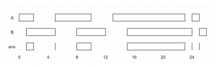

# 区间调度算法

区间调度问题是一个很经典的贪心算法问题。  贪⼼算法可以认为是动态规划算法的⼀个特例， 相⽐动态规划， 使⽤贪⼼算法需要满⾜更多的条件（贪⼼选择性质），但是效率⽐动态规划要⾼ 。

## [leetcode435. 无重叠区间](https://leetcode-cn.com/problems/non-overlapping-intervals/)

给定一个区间的集合，找到需要移除区间的最小数量，使剩余区间互不重叠。

> 注意:
>
> 1. 可以认为区间的终点总是大于它的起点。
>
> 2. 区间 [1,2] 和 [2,3] 的边界相互“接触”，但没有相互重叠。
> 示例 1:
>
> 输入: [ [1,2], [2,3], [3,4], [1,3] ]
>
> 输出: 1
>
> 解释: 移除 [1,3] 后，剩下的区间没有重叠。
> 示例 2:
>
> 输入: [ [1,2], [1,2], [1,2] ]
>
> 输出: 2
>
> 解释: 你需要移除两个 [1,2] 来使剩下的区间没有重叠。
> 示例 3:
>
> 输入: [ [1,2], [2,3] ]
>
> 输出: 0
>
> 解释: 你不需要移除任何区间，因为它们已经是无重叠的了

这个问题有许多看起来不错的贪⼼思路， 却都不能得到正确答案。 ⽐如说：也许我们可以每次选择可选区间中开始最早的那个？ 但是可能存在某些区间开始很早， 但是很⻓， 使得我们错误地错过了⼀些短的区间。 或者我们每次选择可选区间中最短的那个？ 或者选择出现冲突最少的那个区间？ 这些⽅案都能很容易举出反例， 不是正确的⽅案。

正确的思路其实很简单， 可以分为以下三步：

1. 从区间集合 intvs 中选择⼀个区间 x， 这个 x 是在当前所有区间中结束早的（end 最⼩） 
2. 把所有与 x 区间相交的区间从区间集合 intvs 中删除。
3.  重复步骤 1 和 2， 直到 intvs 为空为⽌。 之前选出的那些 x 就是最⼤不
   相交⼦集。  

```java
class Solution {
    public int eraseOverlapIntervals(int[][] intervals) {
        if(intervals.length == 1){
            return 0;
        }
        Arrays.sort(intervals, (a, b)-> a[1]-b[1]);
        int count = 0;
        int x_end = Integer.MIN_VALUE;
        for(int[] a: intervals){
            if(a[0] < x_end ){
                count++;
            }else{
               x_end =  a[1];
            }
        }
        return count;
    }
}
```

## [leetcode452. 用最少数量的箭引爆气球](https://leetcode-cn.com/problems/minimum-number-of-arrows-to-burst-balloons/)

在二维空间中有许多球形的气球。对于每个气球，提供的输入是水平方向上，气球直径的开始和结束坐标。由于它是水平的，所以y坐标并不重要，因此只要知道开始和结束的x坐标就足够了。开始坐标总是小于结束坐标。平面内最多存在10^4个气球。

一支弓箭可以沿着x轴从不同点完全垂直地射出。在坐标x处射出一支箭，若有一个气球的直径的开始和结束坐标为 xstart，xend， 且满足  xstart ≤ x ≤ xend，则该气球会被引爆。可以射出的弓箭的数量没有限制。 弓箭一旦被射出之后，可以无限地前进。我们想找到使得所有气球全部被引爆，所需的弓箭的最小数量。

**Example:**

```
输入:
[[10,16], [2,8], [1,6], [7,12]]

输出:
2

解释:
对于该样例，我们可以在x = 6（射爆[2,8],[1,6]两个气球）和 x = 11（射爆另外两个气球）。
```

这个问题和区间调度算法⼀模⼀样！ 如果最多有 n 个不重叠的区间， 那么就⾄少需要 n 个箭头穿透所有区间。只是有⼀点不⼀样， 在 intervalSchedule 算法中， 如果两个区间的边界触碰， 不算重叠； ⽽按照这道题⽬的描述， 箭头如果碰到⽓球的边界⽓球也会爆炸， 所以说相当于区间的边界触碰也算重叠。

在上道题目的基础上稍微修改即可：

```java
class Solution {
    public int findMinArrowShots(int[][] points) {
        // 无重叠的+1 
         if(points.length == 1){
            return 1;
        }
        Arrays.sort(points, (a, b)-> a[1]-b[1]);
        int count = 0;
        int x_end = Integer.MIN_VALUE;
        for(int[] a: points){
            if(a[0] > x_end ){
                count++;
           
               x_end =  a[1];
            }
        }
        return count;
        

    }
}
```


#   区间调度问题之区间合并  

## [leetcode56. 合并区间](https://leetcode-cn.com/problems/merge-intervals/)

给出一个区间的集合，请合并所有重叠的区间。

**示例 1:**

```
输入: intervals = [[1,3],[2,6],[8,10],[15,18]]
输出: [[1,6],[8,10],[15,18]]
解释: 区间 [1,3] 和 [2,6] 重叠, 将它们合并为 [1,6].
```

**示例 2:**

```
输入: intervals = [[1,4],[4,5]]
输出: [[1,5]]
解释: 区间 [1,4] 和 [4,5] 可被视为重叠区间。
```

⼀个区间可以表⽰为 [start, end] ， 前⽂聊的区间调度问题， 需要按 end排序， 以便满⾜贪⼼选择性质。 ⽽对于区间合并问题， 其实按 end 和start 排序都可以， 不过为了清晰起⻅， 我们选择按 start 排序。  

显然， 对于⼏个相交区间合并后的结果区间 x ， x.start ⼀定是这些相交区间中 start 最⼩的， x.end ⼀定是这些相交区间中 end 最⼤的。  

```java
class Solution {
    public int[][] merge(int[][] intervals) {
          if (intervals.length == 0) {
            return new int[0][2];
        }
        int m = intervals.length;
        int n = intervals[0].length;

        List<int[]  > res = new ArrayList<>();
       
        Arrays.sort(intervals, (a, b)->a[0]-b[0]);
        res.add(intervals[0]);
        for(int i = 0; i < m; i++){
            int[] curr = intervals[i];
            int[] last = res.get(res.size()-1); // 注意这里是引用
            if(curr[0] <= last[1]){
                // 找到最大的end
                last[1] = Math.max(last[1], curr[1]); //  会修改list中值
            }else{
               res.add(curr);
            }
        }

        return res.toArray(new int[res.size()][]);
    }
}
```


#  区间交集问题  

## [leetcode986. 区间列表的交集](https://leetcode-cn.com/problems/interval-list-intersections/)

给定两个由一些 **闭区间** 组成的列表，每个区间列表都是成对不相交的，并且已经排序。

返回这两个区间列表的交集。

*（形式上，闭区间 `[a, b]`（其中 `a <= b`）表示实数 `x` 的集合，而 `a <= x <= b`。两个闭区间的交集是一组实数，要么为空集，要么为闭区间。例如，[1, 3] 和 [2, 4] 的交集为 [2, 3]。）*

 

输入：A = [[0,2],[5,10],[13,23],[24,25]], B = [[1,5],[8,12],[15,24],[25,26]]

输出：[[1,2],[5,5],[8,10],[15,23],[24,24],[25,25]]

画图可知规律。

```java
class Solution {
    public int[][] intervalIntersection(int[][] A, int[][] B) {
        List<int[] > res = new ArrayList<>();
        int  i =0, j = 0;
        while( i < A.length && j < B.length){
            int a1 = A[i][0];
            int a2 = A[i][1];
            int b1 = B[j][0];
            int b2 = B[j][1];
            if(b2 >= a1 && a2 >= b1){
                res.add(new int[]{Math.max(a1,b1), Math.min(a2, b2)});
                
            }
            if(b2 < a2){
                j++;

            }else{
                i++;
            }
        }
        return res.toArray(new int[res.size()][]);

    }
}
```


# 参考

1. https://labuladong.gitbook.io/algo/suan-fa-si-wei-xi-lie/qu-jian-jiao-ji-wen-ti


