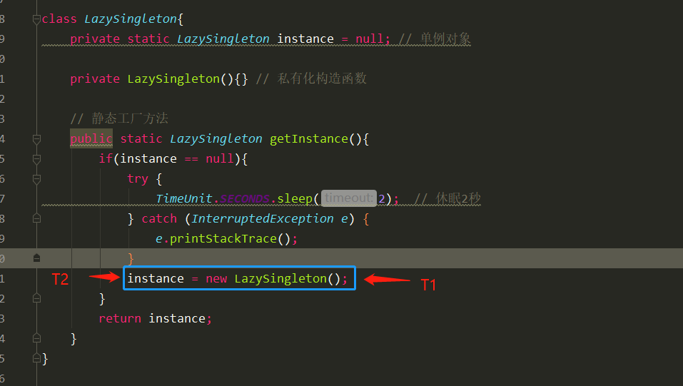
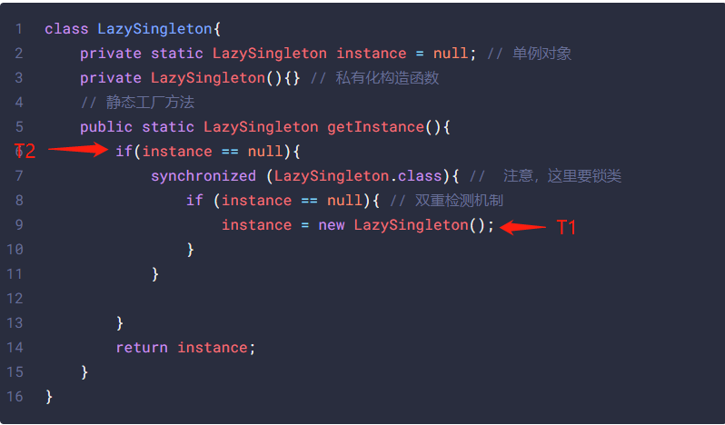
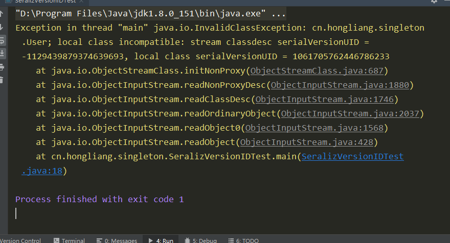

# 单例设计模式

# 涉及到的知识点

1. 类加载机制
2. 字节码知识
3. jvm指令重排序
4. java序列化机制

# 定义及应用场景

保证一个类只有一个实例，并且提供一个全局访问点

场景： 线程池、数据库连接池

# 单例设计模式八种方式

1. 饿汉式**(**静态常量**)**
2. 饿汉式（静态代码块）
3. 懒汉式(线程不安全)
4.  懒汉式(线程安全，同步方法)
5. 懒汉式(线程安全，同步代码块)
6.  双重检查
7. 静态内部类
8. 枚举

# 懒汉式

使用的时候才开始初始化

```java
class LazySingleton{
    private static LazySingleton instance = null; // 单例对象

    private LazySingleton(){} // 私有化构造函数

    // 静态工厂方法
    public static LazySingleton getInstance(){
        if(instance == null){
            instance = new LazySingleton();
        }
    }
}
```

>
>
>1.要想让一个类只能构建一个对象，自然不能让它随便去做new操作，因此Signleton的构造方法是私有的。
>
>2.instance是Singleton类的静态成员，也是我们的单例对象。它的初始值可以写成Null，也可以写成new Singleton()。至于其中的区别后来会做解释。
>
>3.getInstance是获取单例对象的方法。
>
>如果单例初始值是null，还未构建，则构建单例对象并返回。这个写法属于单例模式当中的**懒汉模式。**
>
>如果单例对象一开始就被new Singleton()主动构建，则不再需要判空操作，这种写法属于**饿汉模式**。
>
>这两个名字很形象：饿汉主动找食物吃，懒汉躺在地上等着人喂

但是上面的代码并不安全，为啥？在多线程的环境下去创建会导致返回多个不同的实例对象

```java
public class SingletonTest {

    public static void main(String[] args) {

        /**
         * 模拟两个线程
         */
        new Thread(()->{ LazySingleton l1 = getInstance();
            System.out.println(l1);}).start();
        new Thread(()->{ LazySingleton l1 = getInstance();
            System.out.println(l1);}).start();
    

    }

}

class LazySingleton{
    private static LazySingleton instance = null; // 单例对象

    private LazySingleton(){} // 私有化构造函数

    // 静态工厂方法
    public static LazySingleton getInstance(){
        if(instance == null){
            try {
                TimeUnit.SECONDS.sleep(2);  // 休眠2秒
            } catch (InterruptedException e) {
                e.printStackTrace();
            }
            instance = new LazySingleton();
        }
        return instance;
    }
}

```

> cn.hongliang.singleton.LazySingleton@6afa9656
> cn.hongliang.singleton.LazySingleton@2b3351f2

可以看到创建了两个不同的实例对象，单例失效了！

假设Singleton类刚刚被初始化，instance对象还是空，这时候两个线程同时访问getInstance方法：  因为Instance是空，所以两个线程同时通过了条件判断，开始执行new操作： 



这样的话两个线程分别创建一个实例。

对于线程不安全的问题，我们很直观的就想到加锁，使用synchronized关键字，改写代码如下：

```java
class LazySingleton{
    private static LazySingleton instance = null; // 单例对象
    private LazySingleton(){} // 私有化构造函数
    // 静态工厂方法
    public static LazySingleton getInstance(){
        if(instance == null){
            synchronized (LazySingleton.class){ //  注意，这里要锁类
                if (instance == null){ // 双重检测机制
                    instance = new LazySingleton();
                }
            }
         
        }
        return instance;
    }
}
```

> 细节问题：
>
> 1.  为了防止new Singleton被执行多次，因此在**new操作之前**加上`Synchronized` 同步锁，锁住整个类（注意，这里不能使用对象锁）。 因为锁实例是锁不到的，每个线程还是可以进来。
>
> 2. 在拿到锁之后，进入到 Synchronized 临界区以后，还要再做一次判空。 因为如果一个线程已经创建了一个实例，下一个进程进来的时候也会执行一次new Singleton操作，这样又创建了两个对象，所以这里要加上双重检测机制。
>

但是上面的代码还是有漏洞， 这就涉及到了JVM 的指令重排序问题了。

指令重排序：JVM会根据cpu的执行情况，改变程序指令的执行顺序。我们创建一个对象的时候经历了很多步操作，1. 加载： 加载对应的二进制字节码文件，并且在方法区创建对应的数据结构，2. 连接： a. 验证 b.解析 c.初始化， 3. 初始化： 给静态属性赋值。

```java
public class User {
    public static void main(String[] args) {
        User user = new User();
    }
}
```

反编译：

```bash
  Last modified 2020-8-8; size 435 bytes
  MD5 checksum 3b5f34a0e7b4eb8045214ecd6c8a007d
  Compiled from "User.java"
public class cn.hongliang.singleton.User
  minor version: 0
  major version: 52
  flags: ACC_PUBLIC, ACC_SUPER
Constant pool:
   #1 = Methodref          #4.#19         // java/lang/Object."<init>":()V
   #2 = Class              #20            // cn/hongliang/singleton/User
   #3 = Methodref          #2.#19         // cn/hongliang/singleton/User."<init>":()V
   #4 = Class              #21            // java/lang/Object
   #5 = Utf8               <init>
   #6 = Utf8               ()V
   #7 = Utf8               Code
   #8 = Utf8               LineNumberTable
   #9 = Utf8               LocalVariableTable
  #10 = Utf8               this
  #11 = Utf8               Lcn/hongliang/singleton/User;
  #12 = Utf8               main
  #13 = Utf8               ([Ljava/lang/String;)V
  #14 = Utf8               args
  #15 = Utf8               [Ljava/lang/String;
  #16 = Utf8               user
  #17 = Utf8               SourceFile
  #18 = Utf8               User.java
  #19 = NameAndType        #5:#6          // "<init>":()V
  #20 = Utf8               cn/hongliang/singleton/User
  #21 = Utf8               java/lang/Object
{
  public cn.hongliang.singleton.User();
    descriptor: ()V
    flags: ACC_PUBLIC
    Code:
      stack=1, locals=1, args_size=1
         0: aload_0
         1: invokespecial #1                  // Method java/lang/Object."<init>":()V
         4: return
      LineNumberTable:
        line 7: 0
      LocalVariableTable:
        Start  Length  Slot  Name   Signature
            0       5     0  this   Lcn/hongliang/singleton/User;

  public static void main(java.lang.String[]);
    descriptor: ([Ljava/lang/String;)V
    flags: ACC_PUBLIC, ACC_STATIC
    Code:
      stack=2, locals=2, args_size=1
         0: new           #2                  // class cn/hongliang/singleton/User
         3: dup
         4: invokespecial #3                  // Method "<init>":()V
         7: astore_1
         8: return
      LineNumberTable:
        line 9: 0
        line 10: 8
      LocalVariableTable:
        Start  Length  Slot  Name   Signature
            0       9     0  args   [Ljava/lang/String;
            8       1     1  user   Lcn/hongliang/singleton/User;
}
SourceFile: "User.java"

```

指向简单的一个new对象操作，会执行以下指令

```bash
memory =allocate();    //1：分配对象的内存空间 

ctorInstance(memory);  //2：初始化对象 

instance =memory;     //3：设置instance指向刚分配的内存地址 

```

但是这几条指令不是一成不变的，有可能会经过JVM和CPU的优化，指令重排成下面的顺序：

```bash
memory =allocate();  //1：分配对象的内存空间 

instance =memory;   //3：设置instance指向刚分配的内存地址 

ctorInstance(memory); //2：初始化对象 
```

当执行到第二条的时候，对象已经创建了，但是对象没有完成初始化，是一个不完整的对象。而此时线程T2 抢占到了cpu，在第一个if判断语句，得到的结果是不为空，然后直接返回此对象。这样得到的是一个未经过初始化的一个对象，之后很可能会出现空指针异常。



解决方法是使用volatile关键字，次关键字可以禁止指令重排序。所以改进后的单例设计模式如下

```java
class LazySingleton{
    private static volatile LazySingleton instance = null; // 单例对象
    private LazySingleton(){} // 私有化构造函数
    // 静态工厂方法
    public static LazySingleton getInstance(){
        if(instance == null){
            synchronized (LazySingleton.class){ //  注意，这里要锁类
                if (instance == null){ // 双重检测机制
                    instance = new LazySingleton();
                }
            }

        }
        return instance;
    }
}
```

 如此在线程T2看来，instance对象的引用要么指向null，要么指向一个初始化完毕的Instance，而不会出现某个中间态，保证了安全。 

# synchronized改为reentranlock如何写 

```java
public class LockSingleton {

   private static volatile LockSingleton instance = null;

   private static Lock lock = new ReentrantLock();

   private LockSingleton() {

   }

   public static LockSingleton getInstance(){
       if(instance == null){
           lock.lock();
           try {
               if (instance == null){
                   instance  = new LockSingleton();
               }
           }catch (Exception e) {
               e.printStackTrace();
           }finally {
               lock.unlock();
           }
       }
       return instance;

   }

    public static void main(String[] args) {

       new Thread(()->{
           try {
               TimeUnit.SECONDS.sleep(2);
           } catch (InterruptedException e) {
               e.printStackTrace();
           }
           instance = getInstance();
           System.out.println(instance);
       }).start();

        new Thread(()->{
            try {
                TimeUnit.SECONDS.sleep(2);
            } catch (InterruptedException e) {
                e.printStackTrace();
            }
            instance = getInstance();
            System.out.println(instance);
        }).start();


    }


}

```


# 饿汉模式

在类加载阶段就完成了实例化。通过类加载机制来保证线程安全

类加载有是三个步骤
加载： 加载对应的二进制字节码文件，并且在方法区创建对应的数据结构

连接： a. 验证 b.解析 c.初始化

初始化： 给静态属性赋值

```java
public class HungarySingleton {

    private static HungarySingleton instance = new HungarySingleton();
    // 私有化构造方法
    private HungarySingleton(){}

    // 公有的方法返回实例对象
    public static HungarySingleton getInstance() {
        return instance;
    }

}
```

1)    优点：这种写法比较简单，就是在类装载的时候就完成实例化。避免了线程同步问题。

2)    缺点：在类装载的时候就完成实例化，没有达到 Lazy Loading 的效果。如果从始至终从未使用过这个实例，则会造成内存的浪费。


# 静态内部类

```java
public class Singleton {

    ///静态内部类
    private static class InstanceHolder{
        private final static Singleton INSTANCE = new Singleton();
    }
    // 私有化构造方法
    private Singleton(){}
    
    public static Singleton getInstance() {
        return InstanceHolder.INSTANCE;
    }
}

```

1.  从外部无法访问静态内部类`InstanceHolder`，只有当调用`Singleton.getInstance`方法的时候，才能得到单例对象`INSTANCE`。 
2.  `INSTANCE`对象初始化的时机并不是在单例类`Singleton`被加载的时候，而是在调用`getInstance`方法，使得静态内部类`InstanceHolder`被加载的时候。因此这种实现方式是利用**classloader的加载机制**来实现**懒加载**，并保证构建单例的线程安全。 


可以看到，使用静态内部类的方法创建单例对象是很巧妙的，但是，和以上方法一样，都不能阻止使用反射机制来创建，也就是说，反射机制会打破上述单例模式。

来看看是怎么实现的。

# 反射打破单例

```java
public class RefectSingleton {

    public static void main(String[] args) throws Exception {
        // 首先获得构造器
        Class<?> clazz = Class.forName("cn.hongliang.singleton.Singleton");
        Constructor<?> declaredConstructor = clazz.getDeclaredConstructor();
        // 因为构造方法是private的， 所以设置暴力反射
        declaredConstructor.setAccessible(true);
        // 创建对象
        Singleton s1= (Singleton) declaredConstructor.newInstance();
        Singleton s2= (Singleton) declaredConstructor.newInstance();
        System.out.println(s1 == s2);
        System.out.println(s1.hashCode() == s2.hashCode());
    }

}
```

>
>
>false
>false

可以看到创建的两个实例对象，所以破坏了单例。

接下来介绍一下使用枚举类的方法来创建单例对象，枚举的方式可以阻止反射。

# 枚举

```java
public enum  SingletonEnum {
    INSTANCE;
}
```

1. 这借助 JDK1.5 中添加的枚举来实现单例模式。不仅能避免多线程同步问题，而且还能防止反序列化重新创建新的对象。
2. 缺点就是并不是使用懒加载的方式实现的。
3. 这种方式是 **Effective Java** 作者 **Josh Bloch** 提倡的方式.

如果使用反射来创建实例，会抛出异常。

```java
public class RefectSingleton {

    public static void main(String[] args) throws Exception {

        SingletonEnum singletonEnum1 = SingletonEnum.class.getDeclaredConstructor().newInstance();
        SingletonEnum singletonEnum2 = SingletonEnum.class.getDeclaredConstructor().newInstance();

        System.out.println(singletonEnum1 == singletonEnum2);
    }

}
```

>Exception in thread "main" java.lang.NoSuchMethodException: cn.hongliang.singleton.SingletonEnum.\<init>()
>at java.lang.Class.getConstructor0(Class.java:3082)
>at java.lang.Class.getDeclaredConstructor(Class.java:2178)
>at cn.hongliang.singleton.RefectSingleton.main(RefectSingleton.java:24)

刚刚说了枚举既可以防止反射创建单例也能够防止反序列化创建新的对象，我们继续看看什么是序列化。

# 序列化

## 什么是序列化？

序列化就是将java对象编码成二进制文件，课保存在磁盘中。

反序列化就是从文件中解码成一个对象。

## 怎么实现序列化

java对象实现`Serializable`接口，通过`ObjectOutputStream`， `ObjectInputputStream`实现序列化和反序列化。

## 什么样的数据会序列化到文件中

对象的默认序列化机制写入的内容是：对象的类，类签名，以及**非瞬态**（`transit`）和**非静态**字段的值，因为静态static的东西在方法区。

所以序列化的数据是在堆中的，将堆中数据的生命周期延长，持久化到文件，保存到磁盘中，文件扩展名是.object， 当我们以后想要使用这个类的时候就不需要new了，直接从文件中读取就行。

## serialVersionUID 

 `SerializableUID`号是根据类的特征和类的签名算出来的 ，主要用于判断是否为同一个版本的对象。如果没有加上`serialVersionUID` ，在反序列化之前更改了类的签名或者增加了一些字段，在反序列化的时候就报错。

```java
public class User implements Serializable {

    private String name;

}


public class SeralizVersionIDTest {

    public static void main(String[] args) throws Exception {
        User user = new User();
        // 序列化
//        ObjectOutputStream oos = new ObjectOutputStream(new FileOutputStream("user"));
//        oos.writeObject(user);
//         反序列化
        ObjectInputStream ois = new ObjectInputStream(new FileInputStream("user"));
        User user1 = (User) ois.readObject();
        System.out.println(user1.toString());

//        oos.close();
        ois.close();

    }
}

```

在反序列化之前，增加了一个属性

```java
public class User implements Serializable {

    private String name;
    private int age;

    private int id;

}

```

反序列化之后报错



所以我们需要手动指定一个`serialVersionUID` ，就可以正常反序列化了。

## 静态变量的序列化

我们在User类中加上一个静态变量

```java
public static int i = 100;
```

然后在序列化之后，将变量i修改成99， 通过反序列化之后i的值应该是多少呢？

```java
public class SeralizVersionIDTest {
    public static void main(String[] args) throws Exception {
        User user = new User();
        // 序列化
        ObjectOutputStream oos = new ObjectOutputStream(new FileOutputStream("user"));
        oos.writeObject(user);
        User.i = 99; // 序列化之后改变值

//         反序列化
        ObjectInputStream ois = new ObjectInputStream(new FileInputStream("user"));
        User user1 = (User) ois.readObject();
        System.out.println(user1.i);
        oos.close();
        ois.close();

    }
}
```

> 99

这说明了序列化不对静态变量序列化。我们总说是对象序列化，但是i数据属于类变量，所以不会序列化静态变量。

## 不想要序列化？transit

那么对于非静态变量就可以序列化，但是可不可以选择不序列化呢？

当然，那就是`transit`关键字

>
>
> `Transient` 关键字的作用是控制变量的序列化，在变量声明前加上该关键字，可以阻止该变量被序列化到文件中，在被反序列化后，`transient` 变量的值被设为初始值，如 `int` 型的是 0，对象型的是 `null`。 

## 父类的序列化

考虑这种情况，子类实现了`Serializable`接口，父类没有实现`Serializable`接口。看看序列化与反序列化的时候会出现什么情况。

```java
public class Father {
    public int money;
    public Father(int money) {
        this.money = 100;
    }
    public Father(){} // 默认的构造函数， 不加报错

}
class Son extends Father implements Serializable {
    public static final long serialVersionUID = 1L;
    private int a = 9;
}
```

```java
public class SeralizVersionIDTest {

    public static void main(String[] args) throws Exception {
        Son son = new Son();
        // 序列化
        ObjectOutputStream oos = new ObjectOutputStream(new FileOutputStream("son"));
        oos.writeObject(son);
//         反序列化
        ObjectInputStream ois = new ObjectInputStream(new FileInputStream("son"));
        Son s = (Son) ois.readObject();
        System.out.println(s.money); // 父亲那里继承下来的钱
        oos.close();
        ois.close();
    }
}

```

> 0

反序列化子类需要创建父类，调用父类默认的无参构造方法。

所以除了可以用tansit关键字修饰不想被序列化的属性之外，还可以将不想序列化的属性放入父类中，子类实现`Serializable`接口， 父类不实现。


# 单例解决序列化的问题

言归正传！！！！！！！！！！！！回到单例设计模式

下面以饿汉模式举例， 实现`Serializable`接口，看看序列化的问题

```java
public class HungarySingleton implements Serializable {

    private static HungarySingleton instance = new HungarySingleton();
    // 私有化构造方法
    private HungarySingleton(){}

    // 公有的方法返回实例对象
    public static HungarySingleton getInstance() {
        return instance;
    }

}
```

序列化测试

```java
public class SerializableTest {
    public static void main(String[] args) throws Exception {
        HungarySingleton instance = HungarySingleton.getInstance();
        // 序列化
        ObjectOutputStream oos = new ObjectOutputStream(new FileOutputStream("instance"));
        oos.writeObject(instance);
        // 反序列化
        ObjectInputStream ois = new ObjectInputStream(new FileInputStream("instance"));
        HungarySingleton instance1 = (HungarySingleton) ois.readObject();
        System.out.println(instance1 == instance);
    }
}
```

> false

可以发现返回的是两个对象，也就是说，序列化破坏了我们的单例模式！

那怎么解决呢？

使用 **readResolve**()

```java
public class HungarySingleton implements Serializable {
    public static final long serialVersioUID = 1L;
    private static HungarySingleton instance = new HungarySingleton();
    // 私有化构造方法
    private HungarySingleton(){}

    // 公有的方法返回实例对象
    public static HungarySingleton getInstance() {
        return instance;
    }

    private Object readResolve() {
        return instance;
    }

}
```

似乎是加了`readResolve()`方法后反序列化做的是浅拷贝,也就是拷贝的是之前对象的指针,指的还是原先的对象，  而不加默认是深拷贝?直接开辟新空间, 地址自然就不一样了.

如果使用枚举的话，可以解决序列化的问题。 使用枚举实现的单例模式，不但可以防止利用反射强行构建单例对象，而且可以在枚举类对象被**反序列化**的时候，保证反序列的返回结果是同一对象。 

