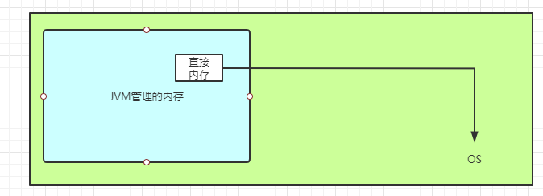
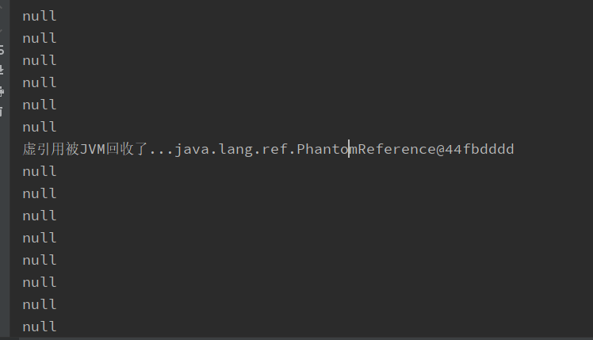

# 四大引用类型

## 强引用

被强引用关联的对象不会被回收。

使用 new 一个新对象的方式来创建强引用。

当内存不足。JVM开始垃圾回收，对于强引用的对象，**就算是出现了OOM也不会对该对象进行回收，死都不收。**

强引用是我们最常见的普通对象引用，只要还有强引用指向一个对象，就能表明对象还活着。垃圾收集器不会碰这种对象。Java中最常见的就是强引用，把一个对象赋给一个引用变量，这个引用变量就是一个强引用。当一个对象被强引用变量引用时，它处于可达状态，他是不可能被垃圾回收机制回收的。**即使该对象以后永远都不会被用到，jvm也不会回收**。因此，**强引用是造成Java内存泄露的主要原因之一。**

对于一个普通对象，如果没有其他的引用关系，只要超过了引用的作用域或者显示的将强引用赋值为null，一般就认为就是可以被垃圾收集的了，当然具体回收时机还要看垃圾收集策略。

```java
package cn.hongliang.reference;
import java.util.concurrent.TimeUnit;
/**
 * @author Hongliang Zhu
 * @Date 2020-08-26-20:10
 */
public class StrongReferenceDemo {
    public static void main(String[] args) {
        // 这样定义的默认是强引用
        Object obj1 = new Object();
        Object obj2 = obj1; // obj2引用赋值
        obj1 = null;// 置为null
        System.gc(); // 并不会马上执行垃圾回收 执行System.gc()函数的作用只是提醒或告诉虚拟机，希望进行一次垃圾回收。
        try {
            TimeUnit.SECONDS.sleep(5);
        } catch (InterruptedException e) {
            e.printStackTrace();
        }
        System.out.println(obj2);

    }

}

```

> java.lang.Object@1540e19d

## 软引用

被软引用关联的对象只有在内存不够的情况下才会被回收。

使用 SoftReference 类来创建软引用。

软引用通常用在对内存才能敏感的程序中，比如高速缓存就有用到软引用，内存够的时候就保留，不够就回收。

先设置JVM参数： -Xmx20m，  heap内存为20M

```java
package cn.hongliang.reference;
import java.lang.ref.SoftReference;
import java.util.Calendar;
import java.util.concurrent.TimeUnit;

/**
 * @author Hongliang Zhu
 * @Date 2020-08-26-20:19
 */
public class SoftReferenceDemo {

    public static void main(String[] args) {
        SoftReference<byte[] > softReference = new SoftReference<>(new byte[1024*1224*10]);
        System.out.println(softReference.get());

        System.gc();
        try {
            Thread.sleep(500);
        }catch (Exception e){
           e.printStackTrace();
        }
        System.out.println(softReference.get());
        byte[] a = new byte[1024*1024*10]; //再分配一个数组，heap将装不下，这时系统会进行垃圾回收，先回收一次，如果不够，就会把软引用回收

        System.out.println(softReference.get());  // 回收
    }

}

```

> [B@1540e19d
> [B@1540e19d
> null

假如有一个应用需要读取大量的本地图片，如果每一次读取图片都是从硬盘中读取则会严重影响性能；如果一次性全部加载到内存中又可能造成内存溢出。

此时可以使用软引用来解决这个问题。

设计思路： 用一个HashMap来保存图片的路径和相应图片对象的软引用之间的映射关系，在内存不足时候，JVM会自动回收这些缓存图片对象所占用的空间，从而有效地避免了OOM的问题。

```java
Map<String, SoftReference<Bitmap>> imgCache = new HashMap<>();
```

## 弱引用

被弱引用关联的对象**一定会被回收**，也就是说它只能存活到下一次垃圾回收发生之前。

使用 WeakReference 类来创建弱引用。

```java
import java.lang.ref.WeakReference;

/**
 * @author Hongliang Zhu
 * @Date 2020-08-26-20:38
 */
public class WeakRederenceDemo {

    public static void main(String[] args) {
        WeakReference<M> weakReference = new WeakReference<>(new M());
        System.out.println(weakReference.get());
        System.gc();
        System.out.println(weakReference.get());
    }

}

```

> cn.hongliang.reference.M@1540e19d
> null
> finalize


### weakHashMap

待补充...

## 虚引用

又称为幽灵引用或者幻影引用，一个对象是否有虚引用的存在，不会对其生存时间造成影响，也无法通过虚引用得到一个对象。

为一个对象设置虚引用的唯一目的是能在这个对象被回收时收到一个系统通知。

使用 PhantomReference 来创建虚引用。

顾名思义，就是**形同虚设**。与其他几种引用都不同，虚引用并不会决定对象的生命周期。如果一个对象仅持有虚引用，那么它就和没有任何引用一样，在任何时候都可能被垃圾回收器回收。他不能单独使用，也不能通过他访问对象。虚引用必须和引用队列（ReferenceQueue）联合使用。

虚引用的主要作用是跟踪对象被垃圾回收的状态。仅仅是提供了一种确保对象被finalize以后做某些事情的机制。PhantomReference 的get方法总是返回null。因此无法访问对应的引用对象。其意义在于说明一个对象已经进入finalization阶段，可以被gc回收。用来实现比finalization机制更灵活的回收操作。

换句话说，设置虚引用关联的唯一目的就是在这个对象被收集器回收的时候收到一个系统通知或者后续添加进一步处理。java技术允许使用finalize方法在垃圾收集器将对象从内存中移除出去之前 做必要的清理工作。

实际上，这个和**直接内存**有关。虚引用的作用就是为了管理直接内存。

我们程序的内存通常是由JVM来管理的，垃圾回收器是工作在JVM里面，但是为了提高效率，比如说，当OS收到了网络发送来的数据，会通过OS的系统内核的方法将传来的数据放在OS的内存里面，如果Java程序要用的话，需要从OS的内存中copy过来，这样的效率太低了。所以在新版的JVM中提供了一个直接内存（DirectByteBuffer），他可以通过虚拟机的一个指针直接指向OS管理的内存中。可以直接访问操作系统的内存，这样就不需要copy一份了。



那么JVM怎么回收这部分系统内存呢？

内部机制就是用的虚引用，虚引用new的时候，执指向一个对象，这个对象要回收的时候，会将其放入一个队列里面，相当于跟踪这个对象。主要分为两步，第一步将其放入队列，第二步是通过队列来进行回收的。需要回收的时候发起一个通知。

```java
package cn.hongliang.reference;

import java.lang.ref.PhantomReference;
import java.lang.ref.Reference;
import java.lang.ref.ReferenceQueue;
import java.util.LinkedList;
import java.util.List;
import java.util.concurrent.TimeUnit;

/**
 * @author Hongliang Zhu
 * @Date 2020-08-26-20:53
 */
public class PhantomReferenceDemo {
    private static final List<Object> list = new LinkedList<>();
    private static final ReferenceQueue<M> queue = new ReferenceQueue<>();

    public static void main(String[] args) {
        PhantomReference<M> phantomReference = new PhantomReference<>(new M(), queue);
        System.out.println(phantomReference.get());
        new Thread(()->{
            while (true){
                list.add(new byte[1024*1024]);
                try {
                    TimeUnit.SECONDS.sleep(1);
                } catch (InterruptedException e) {
                    e.printStackTrace();
                    Thread.currentThread().interrupt();
                }
                System.out.println(phantomReference.get());
            }
        }).start();

        new Thread(()->{
            while (true){
                Reference<? extends M> poll = queue.poll();
                if(poll != null){
                    System.out.println("虚引用被JVM回收了..." + poll);
                }
            }
        }).start();
    }
}

```

> 

