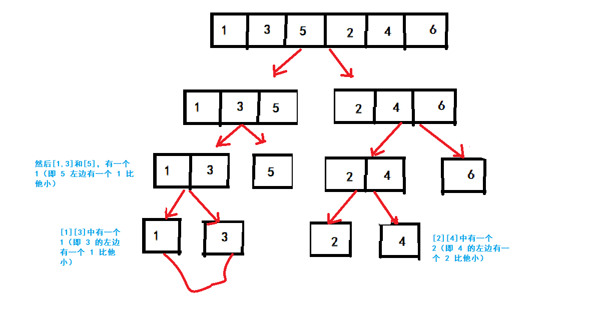

# 问题描述

>  **小和问题：** 在一个数组中，每一个数左边比当前数小的数累加起来，叫做这个数组的小和。求一个数组的小和。 
>
> 数组小和的定义如下：
>
> 例如，数组s = [1, 3, 5, 2, 4, 6]
>
> 在s[0]的左边小于或等于s[0]的数的和为0；
>
> 在s[1]的左边小于或等于s[1]的数的和为1；
>
> 在s[2]的左边小于或等于s[2]的数的和为1+3=4；
>
> 在s[3]的左边小于或等于s[3]的数的和为1；
>
> 在s[4]的左边小于或等于s[4]的数的和为1+3+2=6；
>
> 在s[5]的左边小于或等于s[5]的数的和为1+3+5+2+4=15。
>
> 所以s的小和为0+1+4+1+6+15=27
>
> 给定一个数组s，实现函数返回s的小和
>
> 要求时间复杂度为`O(logN)`， 空间复杂度为`O(N).`
>
> 牛客网： [计算数组的小和]( https://www.nowcoder.com/practice/edfe05a1d45c4ea89101d936cac32469?tpId=101&tqId=33089&tPage=1&rp=1&ru=/ta/programmer-code-interview-guide&qru=/ta/programmer-code-interview-guide/question-ranking ).

## 输入描述:

> 第一行有一个整数N。表示数组长度接下来一行N个整数表示数组内的数

## 输出描述:

> 一个整数，表示答案。

示例1：

> 输入：
>
> 6
>
> 1 3 5 2 4 6

> 输出：
>
> 27

## 备注

$1 \le N \le 10^5$

$-100 \le arr_i \le 100$


-----

# 分析

可以使用暴力方法，双重for循环，遍历数组中每一个元素，计算它左边比他小的数，累加起来即得答案。

但是题目要求时间复杂度为 $O(log N)$ , 此题可用归并排序思想来解答， 在merge的过程中计算小和。

- a. 将当前序列分为两个子序列，分别求其小和

- b. 对a划分得到的两个子序列进行merge操作，得到合并过程产生的小和，再加上a得到的两个子序列的小和之和

- c. 递归地执行a和b。

  > 求一个数组的小和，可以转化为求每个元素在小和累加过程出现的次数，然后将当前元素与出现次数相乘，累加得到小和。
  > 假设当前元素为a，a右边比a大的元素个数则为a在小和累加过程出现的次数 。



--------

# 代码

 注意两个细节， 这个题目的小和，当左边的数字和当前的数相等时，也算一个小和。所有循环里面的判断if 应该是 <= 。然后就是help数组的大小应为high-low+1， 注意拷贝回原数组的细节： 

github：  https://github.com/Castile/algorithm/blob/master/leetcode/src/Sort/smallSum.java 

```java

import java.util.Scanner;

/**
 *
 * @author Hongliang Zhu
 * @create 2020-02-29 22:53
 */
public class Main {
    // 暴力方法 O(N^2)
    public static long  smallSum(int[] arr){
        long sum = 0;
        for(int i = 0; i < arr.length; i++){
            for(int j = 0; j < i; j++){
                if(arr[j] < arr[i]){
                    sum+=arr[j];
                }
            }
        }
        return sum;
    }

    public static long samllSum_merge(int[] arr, int low, int high){
        if(low == high) return 0;
        // 计算mid的位置
        int mid = low + (( high - low ) >> 1); // 这样可以避免溢出，而且使用了位运算，效率更高
        return samllSum_merge(arr, low, mid) + samllSum_merge(arr, mid+1, high) + merge(arr, low, mid, high);
    }
    // 归并两个有序的数组
    public static long merge(int[]arr, int low, int mid, int high){
        int[] help = new int[high - low + 1]; // 注意此处数组的大小
        long result = 0;
        int p = low;
        int q = mid + 1;
        int k = 0;
        while (p <= mid && q <= high){
            if(arr[p] <= arr[q]){ //  左边比又变小，产生小和
                result += arr[p] * ( high - q + 1);
                help[k++] = arr[p++];
            }else if(arr[p] > arr[q]){
                help[k++] = arr[q++];
            }
        }
        while(p <= mid){
            help[k] = arr[p++];
            k++;
        }
        while(q <= high){
            help[k] = arr[q++];
            k++;
        }
        // copy
        for(int i = 0; i < high - low + 1; i++){
            arr[low + i] = help[i];
        }
        return result;
    }

    public static void main(String[] args) {

        Scanner scanner = new Scanner(System.in);
        int n = scanner.nextInt();
        int[] arr = new int[n];
        for(int i = 0; i <n; i++){
            arr[i] = scanner.nextInt();
        }
        long sum =  samllSum_merge(arr,0, arr.length -1);
        System.out.println(sum);

    }

}

```