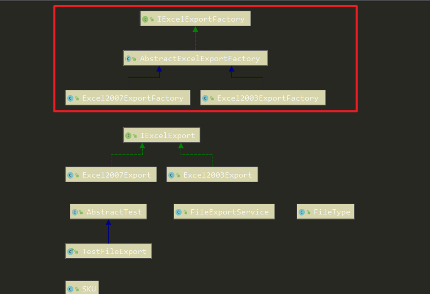

# 工厂方法模式

定义一个用于创建对象的**接口**，让**子类**决定实例化哪个类，Factory Method 使一个**类**的实例化延迟到其子类。

工厂方法模式包含五种角色

- 抽象工厂
- 具体工厂
- 抽象产品
- 具体产品
- 客户方角色

宗旨： 在抽象工厂的接口和抽象类李面定义工厂方法，创建抽象产品。而将创建具体产品的操作延迟在具体的工厂和工厂方法中

目的： 解除框架在创建对象时，对具体类的依赖，实现两者的解耦。

## 和简单工厂模式的区别

简单工厂模式决定创建的对象是根据工厂类中的静态工厂方法的入参来决定的，而工厂方法模式决定创建具体的对象是由具体的工厂类，也就是抽象工厂的子类来确定的。


## 接口

这里的接口是用于创建对象的，往往会创建相应的抽象了，这里统称为抽象工厂。


## 子类

指的是抽象工厂的子类，子类的任务时实现工厂接口中定义的工厂方法。抽象工厂的子类称之为工厂模式里面的具体工厂。

## 类

让**子类**决定实例化哪个类，这个类指的就是具体的产品，返回的是一个真正的类


## 工厂方法模式示例代码

```java
public class FileExportService {
    private static final Logger LOG = LoggerFactory.getLogger(FileExportService.class);

    public void exportExcel(List<SKU> skuList, FileType fileType) {
        LOG.info("文件导出服务");
        IExcelExportFactory excelExportFactory = null;
        IExcelExport excelExport = null;
        switch (fileType) {
            case EXCEL_2003:
                excelExportFactory = new Excel2003ExportFactory();
                break;
            case EXCEL_2007:
                excelExportFactory = new Excel2007ExportFactory();
                break;
        }
        if (null != excelExportFactory) {
            excelExport = excelExportFactory.createExcelExport();
            excelExport.exportExcel(skuList);
        } else {
            LOG.info("不支持的文件类型");
        }

    }
}

```

类图：



这段代码和下面的代码是否类似？

```java
public class FileExportService {
    private static final Logger LOG = LoggerFactory.getLogger(FileExportService.class);
    public void exportFile(List<SKU> skuList,FileType fileType){
        IExcelExport excelExport=null;
        switch (fileType){
            case EXCEL_2003:
                LOG.info("文件导出服务:excel2003");
                excelExport=new Excel2003Export();
                break;
            case EXCEL_2007:
                LOG.info("文件导出服务:excel2007");
                excelExport=new Excel2003Export();
                break;
        }
        if(null !=excelExport){
            excelExport.exportExcel(skuList);
        }else{
            LOG.info("不支持的文件类型");
        }
    }
}

```

Excel2003Export/Excel2003Export都是具体的产品了，上面的工厂方法模式实际上是创建了具体的工厂。两者逻辑以相似，但是灵魂却相似、

客户方角色使用Service服务，创建工厂比创建具体某个产品简单许多，因为具体的产品往往比较复杂，依赖较多，考虑的东西比较多，这里工厂方法模式将创建具体的产品的细节延迟到具体的工厂方法里面了。

## 工厂方法模式的另一种“形态”

工厂方法模式常常和模板方法模式联合使用。抽象产品+抽象工厂 = 框架

规则： 抽象工厂里面定义的工厂方法里面去定义规则

流程：在抽象工厂的抽象类中定义模板方法

规则和流程定义得好不好，符不符合业务需求，扩展性强不强，就是体现架构师功力的地方。

何为架构师：

> 当你开始定义规则，当你开始关注接口和抽象类，当你开发的代码是给其他程序员提供支持和服务的时候，你就踏上了架构师之路！


## 抽象工厂

```java
public interface IExcelExportFactory {
    /**
     * 工厂方法
     *
     * @return
     */
    IExcelFile createExcel();

    /**
     * 工厂方法
     *
     * @return
     */
    IFileTitleRow createFileTitleRow();

    /**
     * 工厂方法
     *
     * @return
     */
    ITableTitleRow createTableTitleRow();

    /**
     * 工厂方法
     *
     * @return
     */
    IDataRow createDataRow();

    /**
     * 工厂方法
     *
     * @return
     */
    ITotalRow createTotalRow();

    /**
     * 模板方法模式：模板方法
     *
     * @param skuList
     */
    void exportExcel(List<SKU> skuList);
}

```


## 抽象类

```java
public abstract class AbstractExcelExportFactory implements IExcelExportFactory {
    private static final Logger LOG = LoggerFactory.getLogger(AbstractExcelExportFactory.class);
    /*
     *Excel文件
     */
    protected IExcelFile excelFile = null;

    /**
     * 模板方法模式：个性化方法，同时也是钩子方法
     */
    @Override
    public IFileTitleRow createFileTitleRow() {
        //可以提供一个默认实现,创建文件标题行对象，并添加到excel文件中。。。
        LOG.info("抽象工厂:创建文件标题行对象");
        return null;
    }

    /**
     * 模板方法模式：个性化方法，同时也是钩子方法。
     */
    @Override
    public IExcelFile createExcel() {
        //可以提供一个默认实现,比如创建一个excel2003对应的workbook。
        LOG.info("抽象工厂:创建Excel文件对象，默认为2003版本");
        return new IExcelFile() {
            @Override
            public void addFileTitleRow(IFileTitleRow fileTitleRow) {

            }

            @Override
            public void addTableTitleRow(ITableTitleRow tableTitleRow) {

            }

            @Override
            public void addDataRow(IDataRow dataRow) {

            }

            @Override
            public void addTotalRow(ITotalRow totalRow) {

            }
        };
    }

    /**
     * 模板方法模式：模板方法
     *
     * @param skuList
     */
    @Override
    public final void exportExcel(List<SKU> skuList) {
        LOG.info("抽象工厂-模板方法:导出Excel文件");
        excelFile = createExcel();
        IFileTitleRow fileTitleRow = createFileTitleRow();
        ITableTitleRow tableTitleRow = createTableTitleRow();
        IDataRow dataRow = createDataRow();
        ITotalRow totalRow = createTotalRow();
        excelFile.addFileTitleRow(fileTitleRow);
        excelFile.addTableTitleRow(tableTitleRow);
        excelFile.addDataRow(dataRow);
        excelFile.addTotalRow(totalRow);
    }
}

```

其中，客户方角色相当于此模板方法，使用了抽象工厂的工厂方法去创建对象。

