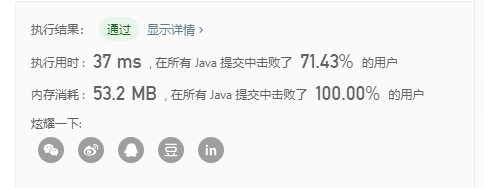

# 描述

在数组中的两个数字，如果前面一个数字大于后面的数字，则这两个数字组成一个逆序对。输入一个数组，求出这个数组中的逆序对的总数。

```java
输入: [7,5,6,4]
输出: 5
```

# 代码

归并排序的应用，在merge操作的时候就可以计算出逆序对

```java
class Solution {
    public int reversePairs(int[] nums) {
        return merge(nums, 0, nums.length - 1);
    }

    public int merge(int[] nums,  int low, int high){
        if(low >= high) return 0;
        int mid = low + ((high  - low) >> 1);  // 要加括号
        return merge(nums, low, mid) + merge(nums, mid+1, high) + mergr_op(nums, low, mid, high);
    }

    public int mergr_op(int[] nums, int low, int mid, int high){
        int k = 0; 
        int[] help = new int[high  - low +1];
        int p1 = low;
        int p2 = mid+1;
        int res = 0; // 逆序对的个数
        while(p1 <= mid && p2 <= high){
            if(nums[p1] <= nums[p2]){
                help[k++] = nums[p1++];
            }else if(nums[p1] > nums[p2]){
                res += (mid - p1  + 1);
                help[k++] = nums[p2++];
            }
            
        }
        while(p1 <= mid){
                help[k++] = nums[p1++];
            }
            while(p2 <= high){
                help[k++] = nums[p2++];
            }
            //copy
            for(int i = 0; i < high  - low +1; i++){
                nums[low + i] = help[i];
            }
            return res;
    }
}
```

结果：

