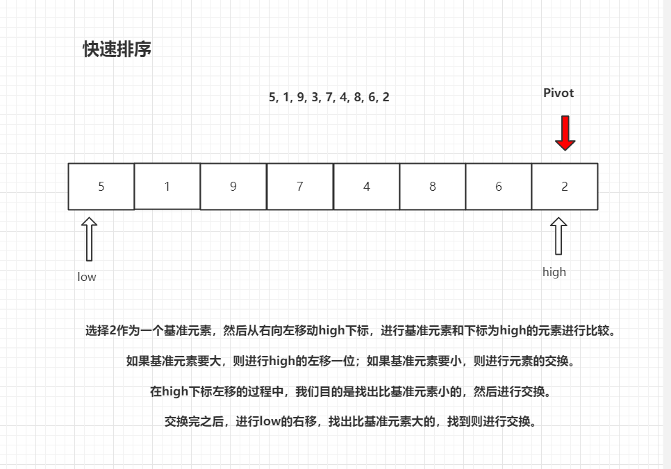

# 描述

## 快速排序

 快速排序的思想是，通过一趟排序将待排记录分割成独立的两部分，其中一部分记录的关键字均比另一部分记录的关键字小，则可分别对这两部分记录继续进行排序，以达到整个序列有序的目的。

 快速排序之所以快，是因为它使用了**分治法**。它虽然也是通过不断的*比较*和*移动*来实现排序的，只不过它的实现，增大了比较的距离和移动的距离。而冒泡排序只是相邻的比较和交换。 



```java
package Sort.QuickSort;

/**
 * 快速排序优化，随机快速排序
 * @author Hongliang Zhu
 * @create 2020-03-10 22:13
 */
public class quickS1 {

    public static void quickSort(int[] arrs){
        if(arrs == null || arrs.length < 2) return;
        quick(arrs, 0, arrs.length-1);
    }

    /**
     *
     * @param arr  数组
     * @param left  左边界 0
     * @param right 右边界 下标
     */
    public static void quick(int[] arr, int left, int right){
        if(left < right){
            // 随机选择一个数域最后一个数进行交换
            swap(arr, left+(int)(Math.random()*(right-left+1)), right);  // Math.random() 返回[0, 1) 的随机数
            int[] pivot = partition(arr, left, right);
            quick(arr, left, pivot[0] - 1);
            quick(arr, pivot[0]+1, right);
        }

    }

    //  以数组最后一个元素为轴枢，将整个数组划分为 小于、等于、大于 三个部分
    public static int[] partition(int[] arr, int left, int right){
        int less = left - 1;
        int greater = right;
        while (left < greater){
            if (arr[left] < arr[right]){
                less++;
                swap(arr, less, left);//
                left++;
            }else if( arr[left] > arr[right]){
                // 交换more前一个元素
                greater--;
                swap(arr, left, greater);
            }else {
                left++;
            }
        }
        swap(arr, left, right);
        return new int[]{less + 1, greater};

    }

    public static void swap(int[] arr, int i, int j){
        int t = arr[i];
        arr[i] = arr[j];
        arr[j] = t;
    }

    public static void main(String[] args) {
        int[] arr = {43, -31, 10, -38, -42, -2, 22, 29, 30, 15, -60, -50, -13, 26, 3, 22, 27, 24, 18, 18, 42, -40, 22, 8, 33, -52, -70, -55, 31, 42, 82, 19, -8, 8, 41, -35, 59, 65, -23, 3, -34, 65};
        quickSort(arr);
        for (int i: arr){
            System.out.print(i+" ");
        }
        System.out.println();

    }

}

```

经典快排和数据的状态有关：当然上述代码是经过优化了

- 当数据是极端情况，比如： `9，8，7，6，5，4，3，2，1`。 选择最后一个元素为轴枢，会发现，每一个元素都比轴枢大，进行一次快速排序之后，最后会将轴枢放在第一位，复杂度都是：$O(N^2)$ . 

上面代码减少了不必要的交换，即将轴枢保存了下来， 不用每次都交换，在最终确定位置的时候再交换。

进一步优化： 我们都知道，递归对性能是有一定影响的，`quickSort`函数尾部有两次递归操作。如果待排序的序列极为极端不平衡，递归的深度几乎接近于n的高度（没有了二分法的优势）。这样的时间复杂度也是达到了最坏的程度$ O (N^2) $ ，而不是平衡时的$O(nlogn)$。

时间慢也就算了，但是栈的大小也是有限的，每次递归操作都消耗一定的栈空间，函数的参数越多，每次递归调用参数耗费的空间也是越多。

如果能减少递归，性能也因此大大提高:

```java
    public void quickSort(int[] arrs, int low, int high) {
        if (arrs == null || arrs.length == 0) return;
        while(low < high){ //  改成迭代式 ， 减少递归
            int Pivot = Patition(arrs, low, high);
            quickSort(arrs, low, Pivot-1);
//            quickSort(arrs, Pivot + 1, high);
            low = Pivot+1;
        }

    }
```

这是一个很好的方法。我们把if改成while，然后一次递归之后，左边的部门已经排好序了，low已经没有用处了，所以把pivot+1赋值给low作为下一个参数， 对右半部分排序，减少了一半的递归程度。

因此采用迭代而不是递归的方法可以缩减堆栈深度，从而提高了整体性能。


## 荷兰国旗问题一

其实荷兰国旗问题就是一个数组划分的问题

 给定一个数组`arr`，和一个数`num`，请把**小于等于**`num`的数放在数组的左边，大于`num`的数放在数组的右边。 要求额外空间复杂度`O(1)`，时间复杂度`O(N)`。

### 分析 

很明显这就是快速排序的一次划分的过程，只不过轴枢是给定的一个数。

### 代码

```java
package Sort.QuickSort;
/**
 * 荷兰国旗问题一：
 * 给定一个数组arr，和一个数num，请把小于等于num的数放在数组的左边，
 * 大于num的数放在数组的右边。 要求额外空间复杂度O(1)，时间复杂度O(N)；
 *
 * @author Hongliang Zhu
 * @create 2020-03-10 23:22
 */
public class SpiltArray {

    public static void splitArray_(int[] arr, int num) {
        if (arr == null || arr.length < 2) return;
        sort(arr, 0, arr.length - 1, num);
    }

    public static void sort(int[] arr, int left, int right, int num) {
        int less = left - 1;
        while (left <= right) {
            if (arr[left] <= num) {
                swap(arr, ++less, left++);
            } else {
                left++;
            }
        }
    }

    public static void swap(int[] arr, int i, int j) {
        int t = arr[i];
        arr[i] = arr[j];
        arr[j] = t;
    }

    public static void main(String[] args) {
//        int[] arr = {1, 2, 8, -2, 4, 3, 4, 2, 8, 12, 3, 9, 8, 10, 9, 5, -1, 4, 9, 2};
        int[] arr = {1, 2, 8, 4, 3, 12, 10, 9, 2, 3};
        splitArray_(arr, 6);
        for (int i : arr) {
            System.out.print(i + " ");
        }
        System.out.println();
    }

}

```


## 荷兰国旗问题二

 给定一个数组arr，和一个数num，请把小于num的数放在数组的左边，等于num的数放在数组的中间，大于num的数放在数组的右边。 要求额外空间复杂度O(1)，时间复杂度O(N)  。

这题与上面的题目区别是，这个题目是要将数组划分成三个部分，**大于部分，等于部分，小于部分。**

参照快速排序代码，很容易解出来。直接看代码就懂了。

```java
package Sort.QuickSort;

/**
 * 荷兰国旗问题二：
 * 给定一个数组arr，和一个数num，请把小于num的数放在数组的左边，
 * 等于num的数放在数组的中间，大于num的数放在数组的右边。
 * 要求额外空间复杂度O(1)，时间复杂度O(N)
 *
 * @author Hongliang Zhu
 * @create 2020-03-10 22:13
 */
public class SplitArray2 {

    public static int[] SplitArray2(int[] arrs, int num) {
        if (arrs == null || arrs.length < 2) return null;
        int[] p = sort(arrs, 0, arrs.length - 1, num);
        return p;
    }


    //  以数组最后一个元素为轴枢，将整个数组划分为 小于、等于、大于 三个部分
    public static int[] sort(int[] arr, int left, int right, int num) {
        int less = left - 1;
        int greater = right + 1;
        while (left < greater) {
            if (arr[left] < num) {
                swap(arr, ++less, left++);

            } else if (arr[left] > arr[right]) {
                swap(arr, --greater, left);
            } else {
                left++;
            }
        }
        swap(arr, left, right);
        return new int[]{less + 1, greater};

    }

    public static void swap(int[] arr, int i, int j) {
        int t = arr[i];
        arr[i] = arr[j];
        arr[j] = t;
    }

    public static void main(String[] args) {
//        int[] arr = {43, -31, 10, -38, -42, -2, 22, 29, 30, 15, -60, -50, -13, 26, 3, 22, 27, 24, 18, 18, 42, -40, 22, 8, 33, -52, -70, -55, 31, 42, 82, 19, -8, 8, 41, -35, 59, 65, -23, 3, -34, 65};

        int[] arr = {1, 2, 6, 4, 8, 6, 10, 12, 6, 9, 2, 3};

        int[] p = SplitArray2(arr, 6);
        for (int i : arr) {
            System.out.print(i + " ");
        }
        System.out.println();

        System.out.println("==============");
        System.out.println("小于的区域：");
        for (int i = 0; i < p[0]; i++) {
            System.out.print(arr[i] + " ");
        }
        System.out.println();
        System.out.println("==============");
        System.out.println("等于的区域：");
        for (int i = p[0]; i <= p[1]; i++) {
            System.out.print(arr[i] + " ");
        }
        System.out.println();

        System.out.println("==============");
        System.out.println("大于的区域：");
        for (int i = p[1]+1; i < arr.length; i++) {
            System.out.print(arr[i] + " ");
        }
        System.out.println();


    }

}

```

> 1 2 3 4 2 6 6 6 9 10 8 12 
>
> 小于的区域：
>
> 1 2 3 4 2 
>
> 等于的区域：
>
> 6 6 6 
>
> 大于的区域：
> 		9 10 8 12 