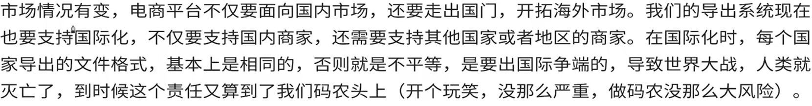
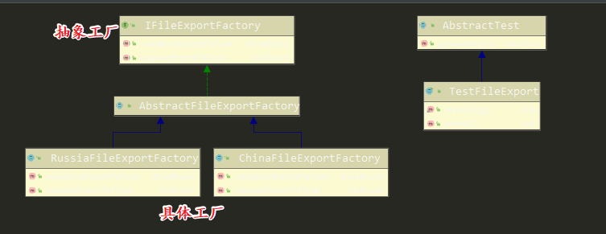
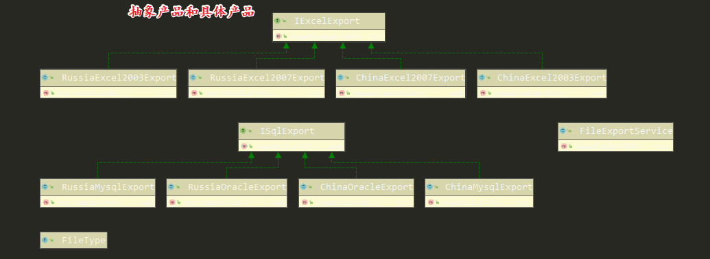
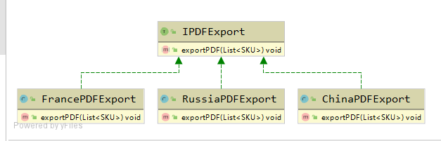
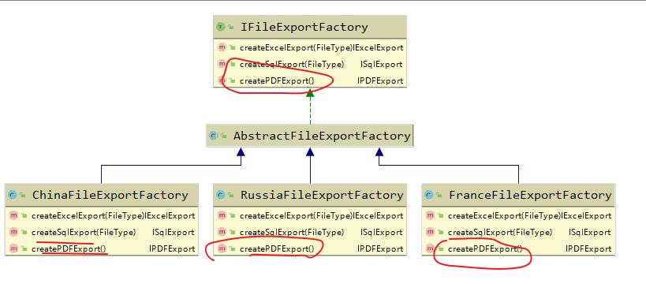
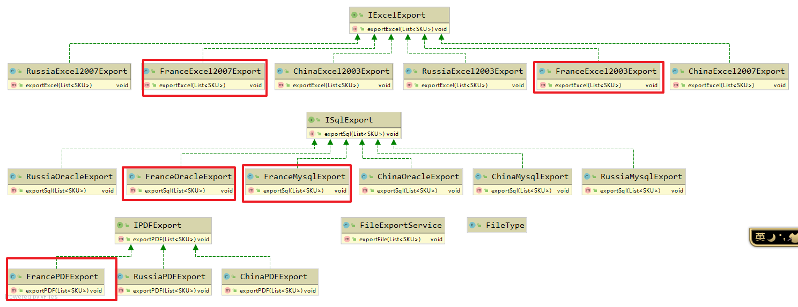
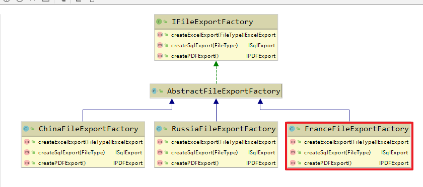

[toc]

# 抽象工厂模式

和工厂方法模式相似，包含五种角色：

- 抽象工厂
- 具体工厂
- 抽象产品
- 具体产品
- 客户方角色

其通过抽象工厂定义的一系列的工厂方法，每个工厂方法生成一类抽象产品。

宗旨： 通过每一个具体的工厂，负责生产一系列相关或者相互依赖的产品。

## 概念

提供一个创建一系列相关或者相互依赖**对象**的**接口**，而无需指定他们的**具体类**


### 对象

工厂模式里面的产品，注意，产品有两类，抽象产品和具体产品，抽象工厂创建的都是抽象产品，具体工厂创建的都是具体产品的对象。

产品是有特点的，“一系列相关或者相互依赖的对象”，这里面包含了产品族的概念。

### 接口

创建对象的接口，就是工厂模式的抽象工厂

### 具体类

指的就是具体产品


## 基本思路

N个工厂方法相加，是否等于抽象工厂

产品族出现之时，抽象工厂开工之际

产品族 VS 产品分类


## N个工厂方法相加，是否等于抽象工厂

一个导出模块，只支持Excel文件格式，远远不够没需要支持其他格式，比如SQL。CSV、甚至word、pdf等。

由原来的单一文件格式增加到三种、四种甚至更多的时候，如果多个工厂方法模式的相加，量变会不会引起质变？如果需求没变化的话，只是新增一种文件格式，并不会引起质的变化，只需要增加一套工厂方法模式即可。

只有产品族出现了，才需要使用更加复杂的更加强大的抽象工厂设计模式、


## 产品族出现之时，抽象工厂开工之际

何为产品族？



比如，我们的系统现在西药支持中国和俄罗斯两个国家的文件导出

中国： Excel文件（Excel2003， Excel2007）， SQL文件（Mysql、oracle）

俄罗斯：Excel文件（Excel2003， Excel2007）， SQL文件（Mysql、oracle）

中国就是一个产品族了。


## 产品族和产品分类

两个概念很重要

按照上面的说法，Excel文件、SQL文件或者Word文件、PDF文件这些都属于产品分类。

一个抽象工厂模式，支持生产多个产品分类，而且产品分类下面，还可以再分类，也就是二级分类、三级分类等，比如Excel分类，可以分为Excel2003， Excel2007等

而导出的文件，如果要区分中国和俄罗斯，以及其他地区的国家，产品族就出现了。

族的本质也是分类，只是给分配换了一个名字而已，但是在抽象工厂模式里面，产品族有特殊的约定。

1. 一个产品族，往往需要包含所有的产品分类（并不是必须的），比如俄罗斯地区的导出文件，也需要支持Excel、SQL、Word、PDF等各种文件。
2. 一个系统，同一时刻，往往只能选择一个产品族，但是可以使用多个产品分类。比如，中国地区的商家，往往只会选择中国地区的文件导出。不会两个都需要，总之，不同产品族的产品一般不会同时使用，对于一个商家，可以选择多个产品分类，但是往往同一时刻，只需要选择一个产品族。
3. 同一个产品族里面的产品，往往有依赖关系。同一个产品族，里面的不同的产品之间，可以有依赖性。而不同的产品族，里面的产品，则一般不会有依赖关系。比如中国地区的PDF文件格式不会依赖其他地区的文件格式，但是可以依赖中国地区其他分类的文件格式。

 

## 需求

需要支持中国、俄罗斯的Excel和SQL文件格式的导出。Excel支持Excel2003和Excel2007，Sql文件支持mysql和oracle两种格式。

## 代码实现

### 抽象工厂



```java
public interface IFileExportFactory {
    IExcelExport createExcelExport(FileType fileType);

    ISqlExport createSqlExport(FileType fileType);
}
```


具体工厂

```java
public class ChinaFileExportFactory extends AbstractFileExportFactory {
    private static final Logger LOG = LoggerFactory.getLogger(ChinaFileExportFactory.class);

    @Override
    public IExcelExport createExcelExport(FileType fileType) {
        switch (fileType) {
            case CHINA_EXCEL_2003:
                LOG.info("创建中国-excel2003文件导出对象");
                return new ChinaExcel2003Export();
            case CHINA_EXCEL_2007:
                LOG.info("创建中国-excel2007文件导出对象");
                return new ChinaExcel2007Export();
            default:
        }
        return null;
    }

    @Override
    public ISqlExport createSqlExport(FileType fileType) {
        switch (fileType) {
            case CHINA_MYSQL:
                LOG.info("创建中国-mysql文件导出对象");
                return new ChinaMysqlExport();
            case CHINA_ORACLE:
                LOG.info("创建中国-oracle文件导出对象");
                return new ChinaOracleExport();
            default:
        }
        return null;
    }
}
```


### 抽象产品和具体产品



```java
public interface IExcelExport {
    void exportExcel(List<SKU> skuList);
}
```

```java
public class ChinaExcel2003Export implements IExcelExport {
    private static final Logger LOG = LoggerFactory.getLogger(ChinaExcel2003Export.class);

    public void exportExcel(List<SKU> skuList) {
        LOG.info("导出中国-excel2003文件");
    }
}
```

```java
public class ChinaExcel2007Export implements IExcelExport {
    public void exportExcel(List<SKU> skuList) {

    }
}
```

```java
public class RussiaExcel2003Export implements IExcelExport {
    public void exportExcel(List<SKU> skuList) {

    }
}
```

```java
public class RussiaExcel2007Export implements IExcelExport {
    public void exportExcel(List<SKU> skuList) {
    }
}
```

### 客户方

```java
public class FileExportService {
    private static final Logger LOG = LoggerFactory.getLogger(FileExportService.class);

    public void exportFile(List<SKU> skuList) {
        LOG.info("文件导出服务");
        IFileExportFactory fileExportFactory = new ChinaFileExportFactory();
        IExcelExport excelExport = fileExportFactory.createExcelExport(FileType.CHINA_EXCEL_2003);
        ISqlExport sqlExport = fileExportFactory.createSqlExport(FileType.CHINA_MYSQL);
        excelExport.exportExcel(skuList);
        sqlExport.exportSql(skuList);
    }

}
```


## 抽象工厂模式如何扩展

需求增加：文件格式增加PDF格式，国家增加对法国的支持

分析：

新增pdf文件格式，增加产品分类，需要进行以下操作：

1. 增加pdf相关的抽象产品和具体产品，注意，具体产品的个数，一般等于产品族的数量。因为要支持中国、俄罗斯、法国 的pdf文件的导出，所以需要3个pdf的具体产品。

   

   

2. 工厂方法里面需要增加响应的工厂方法，每一个工厂方法生产一类产品



以新增法国为例，增加产品族，需要增加以下操作

1. 所有的产品分类，都需要增加对新的产品族的支持

   

2. 增加产品族对应的具体工厂

   

   

   看起来扩展一下还是比较复杂的。。。

## 使用场景（Scene）

什么情况下使用抽象工厂模式？

> 当一个系统中，需要创建的对象或者产品有多个类别，而且也有产品族出现时，就可以使用抽象工厂模式

## 开源代码搜索工厂模式的应用

地址： https://sourcegraph.com/search

```shell
repo:^github\.com/spring-projects/spring-framework$ file:^spring-beans/src/main/java/org/springframework/beans/factory/BeanFactory\.java
```


doubble框架里面使用了非常经典的工厂方法模式+ 模板模式的案例


