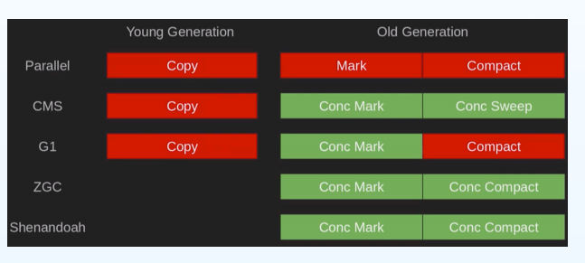

# Java GC介绍


GC是垃圾搜集的意思，是jvm的一个重要部分。

## 怎么算是垃圾

1. 废弃的对象
2. 任何时候都不再使用的对象

## 怎么判断是否是垃圾

1. 引用计数法：会有循环引用的问题
2. GC roots搜索： 可达性分析算法（JVM使用的）

## 垃圾收集器


以上是 HotSpot 虚拟机中的垃圾收集器，连线表示垃圾收集器可以配合使用。

单线程与多线程：单线程指的是垃圾收集器只使用一个线程，而多线程使用多个线程；

串行与并行：串行指的是垃圾收集器与用户程序交替执行，这意味着在执行垃圾收集的时候需要停顿用户程序；并行指的是垃圾收集器和用户程序同时执行。除了 CMS 和 G1 之外，其它垃圾收集器都是以串行的方式执行。

## 垃圾收集算法

1. mark-sweep： 有内存碎片问题，有些对象分配不到空间

2. mark-sweep-compact： 内存整理，解决了内存碎片问题

3. mark-copy：存活的对象复制到另外一块内存中。内存消耗大。

   

怎么优化？

## GC分代假设

堆分为新生代和老年代，一般创建的对象是在新生代创建，新生代创建的对象大多数都是朝生夕死的，GC也主要发生在新生代，在新生代会会回收大量的垃圾。经过几次新生代的GC后还存活下来的对象会被送入到老年代中。这个是有一个阈值来设置的。

在新生代和老年代分别使用不同的垃圾收集算法。


---

# 古典时期的GC算法

1.  Serial  

   年轻代Serial 

   ⽼年代SerialOld

2. Parallel 

   ParNew

   年轻代Parallel Scavenge

   ⽼年代Parallel Old 

## Serial

 

Serial 收集器为单线程环境设计，并只使用一个线程进行垃圾回收。 在回收时，**会暂停用户线程**，并不适用于并发环境。

Serial 收集器采用复制算法


## Parallel 

### ParNew

 

 它是 Serial 收集器的多线程版本。

它是 Server 场景下默认的新生代收集器，除了性能原因外，主要是因为除了 Serial 收集器，只有它能与 CMS 收集器配合使用。

### Parallel Scavenge 收集器

 其它收集器目标是尽可能缩短垃圾收集时用户线程的停顿时间，而它的目标是达到一个可控制的吞吐量，因此它被称为“**吞吐量优先**”收集器。这里的吞吐量指 CPU 用于运行用户程序的时间占总时间的比值。 

### Parallel Old 收集器

  

是 Parallel Scavenge 收集器的老年代版本。

在注重吞吐量以及 CPU 资源敏感的场合，都可以优先考虑 Parallel Scavenge 加 Parallel Old 收集器。


# 中古时代的GC算法

## CMS： Concurrent Mark Sweep 

> Stop The World：当进行垃圾收集的时候，必须暂停所有的用户线程。这种现象叫做Stop The World

分为以下四个流程：

- 初始标记：仅仅只是标记一下 GC Roots 能直接关联到的对象，速度很快，需要停顿。
- 并发标记：进行 GC Roots Tracing 的过程，它在整个回收过程中耗时最长，不需要停顿。
- 重新标记：为了修正并发标记期间因用户程序继续运作而导致标记产生变动的那一部分对象的标记记录，需要停顿。
- 并发清除：不需要停顿。

在整个过程中耗时最长的并发标记和并发清除过程中，收集器线程都可以与用户线程一起工作，不需要进行停顿。

具有以下缺点：

- 吞吐量低：低停顿时间是以牺牲吞吐量为代价的，导致 CPU 利用率不够高。
- 无法处理浮动垃圾，可能出现 `Concurrent Mode Failure`。浮动垃圾是指并发清除阶段由于用户线程继续运行而产生的垃圾，这部分垃圾只能到下一次 GC 时才能进行回收。由于浮动垃圾的存在，因此需要预留出一部分内存，意味着 CMS 收集不能像其它收集器那样等待老年代快满的时候再回收。如果预留的内存不够存放浮动垃圾，就会出现 Concurrent Mode Failure，这时虚拟机将临时启用 Serial Old 来替代 CMS。
- 标记 - 清除算法导致的空间碎片，往往出现老年代空间剩余，但无法找到足够大连续空间来分配当前对象，不得不提前触发一次 Full GC。


以前的垃圾收集算法想Serial是串行的，垃圾收集的时候必须暂停用户线程，后来有了Parallel的垃圾收集器，目的是降低用户线程等待的时间，所以引入了多线程的垃圾收集器，垃圾收集是并行的多个线程处理。但是感觉还是比较慢，所以有了CMS，搞一个可以让用户线程和垃圾收集线程齐头并进的收集器，用户线程可以和垃圾收集线程并发执行。

CMS有以下特点：

1. 低延时的系统
2. 不进行Compact，使用的sweep，可能会产生内存碎片
3. 这是老年代的垃圾收集器
4. 可以配合Serial/ParNew 使用
5. removed in JEP363

## 为什么新生代不使用 CMS

新生代使用的copying算法，因为新生代的对象一般是朝生夕死的。复制算法的代价最小。

---

# 现代的垃圾收集器G1

G1垃圾收集其实jdk9 的默认垃圾收集器

1. 软实时、低延时、可设定目标（可以设定最大STW的停顿时间）

   -XX：MaxGCPauseMillis=N   250 by default

2. JDK9+默认的GC (JEP248)

3. 适用于较大的堆（> 4 ~ 6G ）

4. 可用于替代CMS

G1（`Garbage-First`），它是一款面向**服务端应用**的垃圾收集器，在多 CPU 和大内存的场景下有很好的性能。`HotSpot` 开发团队赋予它的使命是未来可以替换掉 CMS 收集器。

堆被分为新生代和老年代，其它收集器进行收集的范围都是整个新生代或者老年代，而 G1 可以直接对新生代和老年代一起回收。

-XXG1HeapRegionSize=N  2048 by fefault


 G1 把堆划分成多个大小相等的独立区域（`Region`），新生代和老年代不再物理隔离。 **G1垃圾收集器利用分而治之的思想将堆进行分区，划分为一个个的区域。**每次收集的时候，只收集其中几个区域，以此来控制垃圾回收产生的STW

**G1和其他GC算法最大的区别是弱化分代概念，引入分区思想！！！**

## 为什么会有G1

因为并发、并行和CMS垃圾收集器都有2个共同的问题：

1. 老年代收集器大部分操作都必须扫描**整个老年代空间**（标记，清除和压缩）。这就导致了GC随着Java堆空间而线性增加或减少
2. 年轻代和老年代是独立的连续内存块，所以要先决定年轻代和年老代放在虚拟地址空间的位置

## 跨代/跨Region引用

老年代对象可能持有年轻代的引⽤（跨代引⽤），不同的Region间互相引⽤，怎么处理这样的现象呢？


G1引入了两种数据结构，一个叫做Remembered Set(RS) 和 Card Table。

 Card Table ：表中的每个entry覆盖512Byte的内存空间 ，当对应的内存空间发⽣改变时，标记为dirty。也就是说，当我们写代码的时候，通过一个引用赋值操作，将某个对象指向其引用的时候，将这个对象所在的card置为dirty

比如一个Region有1M，那么每512个字节就有一个Card， 那么这一个Region就有2000个Card。


 RememberedSet： 指向Card Table中的对应entry ，可找到具体内存区域 。引入RS的通就是避免大范围的扫描，避免全堆扫描。

 每个 Region 都有一个 Remembered Set，用来记录该 Region 对象的引用对象所在的 Region。通过使用 Remembered Set，在做可达性分析的时候就可以避免全堆扫描。 

如上图，一个区域region1，分成若干个卡片，假如其中某个卡片里面的对象引用了其他region里面的对象的话，这个卡片的位置会被记入region2中的RS中，等Region2的对象回收的时候，根据RS去查询那个对象还在引用我，这样就避免了全堆扫描。

这是一个典型的空间换时间的操作。

通过引入 Region 的概念，从而将原来的一整块内存空间划分成多个的小空间，使得每个小空间可以单独进行垃圾回收。这种划分方法带来了很大的灵活性，**使得可预测的停顿时间模型成为可能**。通过记录每个 Region 垃圾回收时间以及回收所获得的空间（这两个值是通过过去回收的经验获得），并维护一个优先列表，每次根据允许的收集时间，优先回收价值最大的 Region。

如果不计算维护 Remembered Set 的操作，G1 收集器的运作大致可划分为以下几个步骤：

- 初始标记
- 并发标记
- 最终标记：为了修正在并发标记期间因用户程序继续运作而导致标记产生变动的那一部分标记记录，虚拟机将这段时间对象变化记录在线程的 Remembered Set Logs 里面，最终标记阶段需要把 Remembered Set Logs 的数据合并到 Remembered Set 中。这阶段需要停顿线程，但是可并行执行。
- 筛选回收：首先对各个 Region 中的回收价值和成本进行排序，根据用户所期望的 GC 停顿时间来制定回收计划。此阶段其实也可以做到与用户程序一起并发执行，但是因为只回收一部分 Region，时间是用户可控制的，而且停顿用户线程将大幅度提高收集效率。

具备如下特点：

- 空间整合：整体来看是基于“标记 - 整理”算法实现的收集器，从局部（两个 Region 之间）上来看是基于“复制”算法实现的，这意味着运行期间不会产生内存空间碎片。
- 可预测的停顿：能让使用者明确指定在一个长度为 M 毫秒的时间片段内，消耗在 GC 上的时间不得超过 N 毫秒。


## Write barrier

当一个对象引用了另一个对象是怎么记录下来的呢？ 他有事怎么知道有对象引用了它呢？使用的是Write barrier，写屏障来维护卡表和RS的。

写屏障可以看作在JVM层面上对“引用类型字段赋值”这个动作的AOP切面，在引用对象赋值时会产生一个环绕通知，供程序执行额外的动作，也就是说赋值前后都在写屏障的覆盖范畴内。

Write barrier其实是 JVM注⼊的⼀⼩段代码，⽤于记录指针变化 

```java
object.field = <reference> (putfield) 
```

 当更新指针时,标记Card为Dirty , 将Card存⼊Dirty Card Queue, 这个队由 ⽩/绿/⻩/红四个颜⾊。


##  更新Remembered Set  

By concurrent refinement threads

White： 天下太平，⽆事发⽣

Green zone (-XX:G1ConcRefinementGreenZone=N) ： Refinement线程开始被激活，开始更新RS

Yellow zone (-XX:G1ConcRefinementYellowZone=N) ： 全部Refinement线程开始激活

Red zone (-XX:G1ConcRefinementRedZone=N) ： 应⽤线程也参与排空队列的⼯作


##  Fully young GC  

1. STW (Evacuation Pause)  分散
2. 构建CS (Eden+Survivor) 
3. 扫描GC Roots 
4. Update RS：排空Dirty  ard Queue 
5. Process RS：找到被哪些那些⽼年代对象所引⽤ 
6. Object Copy 
7. Reference Processing 


> 记录每个阶段的时间，⽤于⾃动调优 
>
> 记录Eden/Survivor的数量和GC时间 
>
> 根据暂停⽬标⾃动调整Region的数量 
>
>  暂停⽬标越短，Eden数量越少 
>
> 吞吐量下降 
>
> -XX:+PrintAdaptiveSizePolicy 
>
> -XX:+PrintTenuringDistribution 


## Old GC

**当堆⽤量达到⼀定程度时触发**

-XX:InitiatingHeapOccupancyPercent=N   45 by default  

Old GC是**并发**(concurrent)进⾏的 、

三⾊标记算法：**不暂停应⽤线程的情况下进⾏标记** 

## 三⾊标记算法

黑色：表示对象以及被垃圾收集器访问过，且这个对象的所有引用都已经扫描过。黑色就代表对象以及扫描过了，他是安全存活的对象。

灰色：表示对象以及被垃圾收集器访问过，但这个对象上至少存在一个引用还没有被扫描过

白色： 表示对象还没有被垃圾收集器访问过。显然在可达性分析刚刚开始的阶段，所有的对象都是白色的，若在分析结束的阶段，仍然是白色的对象，表示


##  Mixed GC 

不⼀定⽴即发⽣ 

选择若⼲个Region进⾏  

​	默认1/8的Old Region ： -XX:G1MixedGCCountTarget=N 

​	Eden+Survivor Region 

​	STW, Parallel, Copying 

根据暂停⽬标，选择垃圾最多的Old Region优先进⾏ 

​	-XX:G1MixedGCLiveThresholdPercent=N (default 85)

​	-XX:G1HeapWastePercent=N  


# 未来：ZGC/Shenandoah 



令⼈恐怖的极低延时，使用了染色指针和多重映射


# 参考

1. https://www.bilibili.com/video/BV1D741177rV?p=2
2. https://cyc2018.github.io/CS-Notes/#/notes/Java%20%E8%99%9A%E6%8B%9F%E6%9C%BA?id=_7-g1-%e6%94%b6%e9%9b%86%e5%99%a8
3. https://www.cnblogs.com/GrimMjx/p/12234564.html