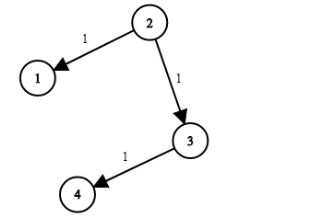
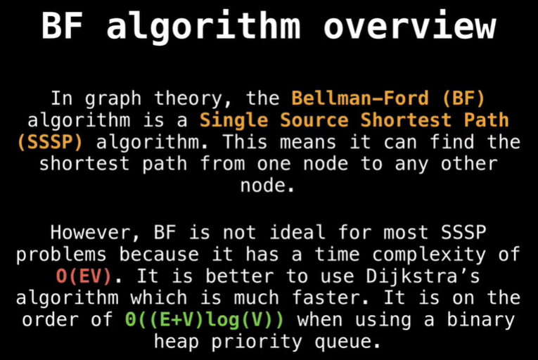
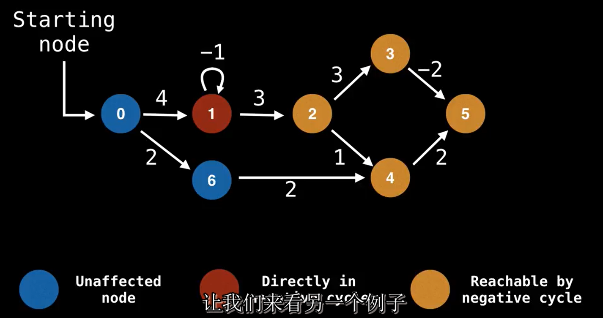
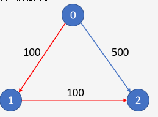

# 最短路径算法

**整理于网络**

- 单源最短路
  不带负权边：`Dijkstra`
  带负权边：`Bellman−Ford`、`SPFA`
- 多源最短路：`Floyd`
  

## Dijkstra

 **假设图中顶点V个，边E条，有如下结论** 

- 这是求解单元最短路径的经典算法，非常重要
- 其本质是贪心+`BFS`
- `Dijkstra`算法更适合稠密图（边多的）
- 无论图有没有环，`Dijkstra` 算法都是可以用的，它只是不能处理负权边，因为它本质上是贪心策略，每个点选择之后就不再更新，如果碰到了负边的存在就会破坏这个贪心的策略就无法处理了。
- 堆优化+邻接矩阵是常用的解法

### 例题

[leetcode-743 网络延迟时间]( https://leetcode-cn.com/problems/network-delay-time/ )

有 N 个网络节点，标记为 1 到 N。

给定一个列表 times，表示信号经过有向边的传递时间。 times[i] = (u, v, w)，其中 u 是源节点，v 是目标节点， w 是一个信号从源节点传递到目标节点的时间。

现在，我们从某个节点 K 发出一个信号。需要多久才能使所有节点都收到信号？如果不能使所有节点收到信号，返回 -1。



```
输入：times = [[2,1,1],[2,3,1],[3,4,1]], N = 4, K = 2
输出：2
```

- 堆优化的Dijkstra算法

  ```java
  import javafx.util.Pair;
  import java.util.*;
  
  /**
   * leetcode-743 网络延迟时间
   *
   * @author Hongliang Zhu
   * @create 2020-07-26 11:03
   */
  public class NetworkDelayTime {
  
      public int networkDelayTime(int[][] times, int N, int K) {
          int res = 0;
          // 建图 , 每个times就是一条边， 每条边包括起始点和终点已经这条边对应的权重
          Map<Integer, List<int[]>> Graph = new HashMap<>();
          for (int[] time : times) {
              Graph.computeIfAbsent(time[0], k -> new ArrayList<>()).add(new int[]{time[1], time[2]});
          }
          Set<Integer> visited = new HashSet<>();
          // 优先级队列，小根堆
          PriorityQueue<Pair<Integer, Integer>> q = new PriorityQueue<>(Comparator.comparingInt(Pair::getValue));
          // 将源点加入
          q.offer(new Pair<>(K, 0));
          while (!q.isEmpty()) {
              Pair<Integer, Integer> cur = q.poll();
  
              if (visited.contains(cur.getKey())) {
                  // 已经访问过了
                  continue;
              }
              visited.add(cur.getKey());
              res = Math.max(res, cur.getValue());
              // 将其相邻的边遍历
              for (int[] next : Graph.getOrDefault(cur.getKey(), new ArrayList<>())) {
                  if (visited.contains(next[0])) {
                      continue;
                  }
                  q.offer(new Pair<>(next[0], next[1] + cur.getValue()));
              }
          }
          return visited.size() == N ? res : -1;
      }
  
      public static void main(String[] args) {
          NetworkDelayTime solution = new NetworkDelayTime();
          int[][] times = {{2, 1, 1}, {2, 3, 1}, {3, 4, 1}};
          int result = solution.networkDelayTime(times, 4, 2);
          System.out.println(result);
      }
  
  }
  
  ```


## Bellman-Ford

### 什么是BF算法



BF这个算法也是求单源最短路径的一个算法，算法非常简洁。但是他并不是一个最优的一个方法，他的时间复杂度大于迪杰斯特拉算法。事实上，BF算法的时间复杂度正比于结点的个数和边个数的乘积，即`O(V*E)`。而迪杰斯特拉算法可以使用一个小根堆来实现，复杂度更小，是`O(E+V)log(V)`。

我们使用BF算法，是因为有时候迪杰斯特拉他算法在某些情况下不适用，也就是说图中会有负边权。当图中存在着负边时候，就有可能导致`negative cycle`。这种情况下，我们需要把它检测出来。如果使用迪杰斯特拉算法的话，会陷入一个循环之中，因为算法总能找到一个更短的路径。



红色的节点表示负环， 经过负环的节点的权重都会是负无穷， 黄色的节点。

### BF算法的步骤

E: 边数

V:顶点数

S:开始节点

D：开始节点到其他节点的单源最短路径，是一个大小为V的数组

- 将每个每个节点到开始节点的最短路径设为﹢无穷
- set D[S] = 0, 开始节点到自己为0；
- 对每一条边进行`V-1`次松弛操作

**松弛操作：**

1. 对于任意一条边 (u -> v)，取出他们存储好的权重 w( u -> v ).
2. 如果 `u.distance + w < v.distance`，那么做两个赋值操作：`v.distance = u.distance + w`，`v.previous = u`；这一步是松弛操作的核心。
3. 如果上面的判断不成立，什么都不做


问题来了，为啥是V-1次循环呢？

 **做 n - 1 次已经足够了**。算法导论上有证明：

1. 从原点开始走，到第 x 个节点，这中间只有 x - 1 条边（不考虑环路）
2. 如果一个图有 n 个节点，那么即使用最啰嗦的走法，到达一个点顶多需要走 n - 1 条边（不考虑环路）。也就是顶多把所有的节点都经过一遍。
3. 在第一轮对所有的边进行松弛的时候，被松弛的点其实只有从原点可以一步到达的点。其他的点所在的边 Edge( u -> v ) 中，u.distance 都是 ∞，v 无法被松弛。只有 start_point.distance 为 0，Edge( start_point -> v ) 中的 v 才可能被松弛。
4. 以此类推，在第 i 轮中，被松弛的点只可能是距离原点 i 步的点。他们利用到的边是 Edge( vi - 1 -> vi)，其中 vi - 1 在上一轮松弛的过程中已经被松弛过，如果他能到达原点的话，vi - 1.distance 就不会是 ∞。
5. 有些点可能有多种不同的到达方式，并且在第 i 步之前也松弛过。这其实没关系。如果第 i 步是最后一次到达他，所有能用来到达这个点的边都已经被计算机探索过（不然这就不是最后一次到达），所以这次松弛也将是它最后一次被松弛，之后到达他的 distance 就已经是最终结果值了。
6. 根据上面提到的 2，不可能有节点出现 n - 1 步还到达不了的地方，即使一个点有多条路径可以到达（除非这个点真的无法到达），他的最多步数路径上的边也都被计算机探索过了。也就是说，他的最后一次被访问已经发生过，他的 distance 肯定已经是最终结果值了。没有任何一个点可以例外。

所以 n - 1 次循环已经足够。

> 第一次迭代在对所有的边进行松弛之后，得到的是从起点”只能经过一条边“到达其余各顶点的最短路径长度...第k轮迭代得到的就是起始点”最多经过k条边“到达其他各顶点的最短路径长度。 
>
>  迭代的时候使用边进行松弛的**顺序比较随机**。在**最差情况下**，导致第一次迭代后，只更新了从起点出发通过一条边到达的部分顶点的最短路径长度。而没有更新不能通过一条边到达的顶点的最短路径长度，长度还是保持正无穷。 
>

所以，可以将leetcode-743使用FB算法。

```java
class Solution {
    public int networkDelayTime(int[][] times, int N, int K) {
        int[] dist = new int[N+1];
        Arrays.fill(dist, Integer.MAX_VALUE/2);
        dist[K] = 0;
        
        boolean flag = false;

        //循环N-1次
        for(int i = 0; i < N-1; i++){
            flag = false;
            for(int j = 0; j < times.length; j++){
                int[] t = times[j];
                int u = t[0];
                int v = t[1];
                int w = t[2];
                if(dist[u] + w < dist[v]){
                    dist[v] = dist[u] + w ;
                    flag = true;
                }

            }
            if(!flag)    break;
        }

        int res = -1;
        for(int i = 1; i <= N; i++){
            if(dist[i] == Integer.MAX_VALUE/2){
                return -1;
            }
            res = Math.max(res, dist[i]);
        }
        return res;

    }
       

}
```


注意上面的flag操作，可以剪枝不必要的循环。


[leetcode-787. K 站中转内最便宜的航班](https://leetcode-cn.com/problems/cheapest-flights-within-k-stops/)

有 n 个城市通过 m 个航班连接。每个航班都从城市 u 开始，以价格 w 抵达 v。

现在给定所有的城市和航班，以及出发城市 src 和目的地 dst，你的任务是找到从 src 到 dst 最多经过 k 站中转的最便宜的价格。 如果没有这样的路线，则输出 -1。



解法一：

```java
class Solution {
    public int findCheapestPrice(int n, int[][] flights, int src, int dst, int K) {
        int[][] dist =  new int[K+2][n];
        int INF= Integer.MAX_VALUE/2;
        for(int i = 0; i < K+2; i++){

            Arrays.fill(dist[i], INF);
        }
        dist[0][src] = 0; //  经过0个节点到src的距离是0
        int res = INF;
        for(int i =1 ; i < K+2; i++){
            for(int[] next: flights){
                dist[i][next[1]] = Math.min(dist[i][next[1]], dist[i-1][next[0]] + next[2]);
            }
            res = Math.min(res, dist[i][dst]);
        }
        return res == INF ? -1: res;
    }
}
```

解法二：

```java
class Solution {
    public int findCheapestPrice(int n, int[][] flights, int src, int dst, int K) {
        int[] dist = new int[n];
        int[] back = new int[n];
        int INF = Integer.MAX_VALUE/2;
        Arrays.fill(dist, INF );
        Arrays.fill(back, INF ); // 防止串联？？？
        dist[src] = 0;

        for(int i = 0; i <= K; i++){
            for(int m = 0; m < n; m++){
                back[m] = dist[m];
            }
            for(int[] next: flights){
                // 对每条边遍历
                // if(dist[next[0]] + next[2] < dist[next[1]] ){
                //     dist[next[1]] = dist[next[0]] + next[2];
                // }
                dist[next[1]] = Math.min(dist[next[1]],back[next[0]] + next[2] );
            }
        }

        return dist[dst] == INF ? -1 : dist[dst];

    }
}

```


## SPFA

FB对边的松弛操作是盲目的，每次循环都将所有的边拿出来看一下。其实，只有当前节点更新了，以他为起点的终点节点才会被更新，不然是无效的。

SPFA 是 Bellman−Ford 的**队列优化**，但是算法时间效率不稳定，时间复杂度为 O(E)，最好情况下，**每个节点只入队一次，就是 BFS**，**最坏情况下，每一个节点都要入队 V−1 次，这时候就退化成 Bellman−Ford了**。SPFA 时间复杂度某种情况下略高于 Dijkstra， 适合稀疏图。

SPFA 是可以用于带有负权图的，在 SPFA 中每一个点松弛过后说明这个点距离更近了，所以有可能通过这个点会再次优化其他点，所以它的策略是将 vis 位置为 false，把这个点入队再判断一次！这就和 Dijkstra 的贪心策略不同了。

SPFA 还有个用处是可以判断图是否存在负环，我们只要用一个 cnt[x] 数组来存放经过这个点的次数，上面提到过，最坏情况下每个节点入队 V−1 次，如果cnt[x] 为 V的个数，那就说明存在负环了。

【算法思想】

1. 初始时，只有把起点放入队列中。
2. 遍历与起点相连的边，如果可以松弛就更新距离dis[]，然后判断如果这个点没有在队列中就入队标记。
3. 出队队首，取消标记，循环2-3步，直至队为空。
4. 所有能更新的点都更新完毕，dis[]数组中的距离就是起点到其他点的最短距离。

```java
class Solution {
    public int networkDelayTime(int[][] times, int N, int K) {
        // 建图
        Map<Integer, List<int[]>> map = new HashMap<>();
        int[] dist = new int[N+1];
        Arrays.fill(dist, Integer.MAX_VALUE / 2);
        dist[K] = 0;
        for(int[] time: times){
            map.computeIfAbsent(time[0], k -> new ArrayList<>()).add(new int[]{time[1], time[2]});
        }
        boolean[] vis = new boolean[N+1];

        Queue<Integer> q = new LinkedList<>();
        q.offer(K);
        while(!q.isEmpty()){
            int cur = q.poll();
            vis[cur] = false; // 可以再次入队
            for(int[] next: map.getOrDefault(cur, new ArrayList<>())){
                if(dist[cur]+next[1] < dist[next[0]]){
                    dist[next[0]] = dist[cur]+next[1]; 
                    // 将这次更新过的节点入队
                    if(!vis[next[0]])  {
                        q.offer(next[0]);
                        vis[next[0]] = true;
                    } 
                }
            }

        }
        // 找最大
        int res = -1;
        for(int i = 1; i <=N; i++){
            if(dist[i] == Integer.MAX_VALUE / 2){
                return -1;
            }
            res = Math.max(res, dist[i]);
        }

        return res;

 

    }
}
```

# Floyd算法

本质是动态规划，能解决任意两点间的最短路径，时间复杂度O*(*V*3) 。

`Floyd`它是可以判断有没有负权边环的，走N−1 步，如果再走一步，更短了，那么就说明有环。另外 `Floyd` 是不能处理带有负权的最短路的，因为本质是一个动态规划算法，**有了负边，最优子结构的性质就不满足了**。由此可见，**它能够判断是否存在负环，但是不能够处理带有负权的最短路径**。

`Floyd` 有个神奇的特性，这个是其他算法没有的， Floyd第 k 轮算的结果，是每个源点到每个汇点经过前 k 个点的最短路，这一点可以出题。

对于上题，由于是动态规划，所以都是用邻接矩阵，并且它是不用 dis 数组和 vis 数组的
这边注意，初始化邻接矩阵的时候，如果两个顶点没有边，最好初始化为INF，别初始化为-1，上面说过Floyd是不能处理负权边的，只能判断有没有负环！

```java
class Solution {
    public int networkDelayTime(int[][] times, int N, int K) {
        // 邻接矩阵
        int[][] g = new int[N+1][N+1];
        int INF = 0x3f3f3f3f;

        // 初始化图,注意,一开始距离是初始化为INF的，而不是像 spfa初始化成-1
        // spfa初始化成-1只是为了判断是否为邻居，这里初始化为INF是因为要取min的
        for (int i = 1; i <= N; i++) {
            for (int j = 1; j <= N; j++) {
                g[i][j] = i == j ? 0 : 0x3f3f3f3f;
            }
        }

        for(int[] time: times){
            g[time[0]][time[1]]= time[2];
        }

        for(int k = 1; k <= N; k++){
            for(int i = 1; i <= N; i++){
                for(int j = 1; j <= N; j++){
                    g[i][j] = Math.min(g[i][k] + g[k][j], g[i][j]);
                }
            }
        }

        // g[a][b]表示a到b的最短距离
        // 拿结果
        int res = 0;
        for (int distance : g[K]) {
            res = Math.max(res, distance);
        }
        return res == INF ? -1 : res;

    }
}
```

# 参考

1.  https://www.dazhuanlan.com/2019/12/08/5dec8b7394f9b/ 
2.  https://www.bilibili.com/video/BV11b411S79w?from=search&seid=8294149097754810253 
3.  https://www.bilibili.com/video/BV1gb41137u4?from=search&seid=14565420049859812931 
4.  https://www.bilibili.com/video/BV1Yx411a7HX?p=2 
5.  https://blog.csdn.net/qq_24884193/article/details/104357889 