# 消息中间件-RabbitMQ

## 一、 介绍


### 1. 消息队列

 MQ(message queue)，从字面意思上看，本质是个队列，FIFO 先入先出，只不过队列中存放的内容是 message 而已，还是一种跨进程的通信机制，用于上下游传递消息。在互联网架构中，MQ 是一种非常常 见的上下游“逻辑解耦+物理解耦”的消息通信服务。使用了 MQ 之后，消息发送上游只需要依赖 MQ，不 用依赖其他服务。  


### 2. 为什么要使用MQ

1. 流量削峰

2. 应用解耦： 子系统间通过消息队列来通信，提升系统可用性

   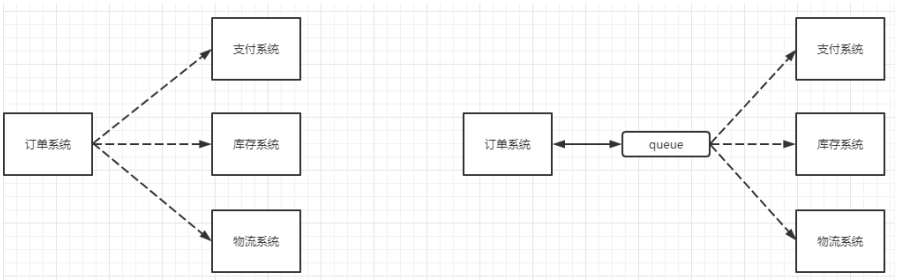

3. 异步处理

   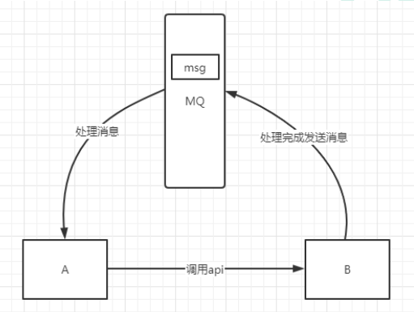

### 3. 分类

1. ActiveMQ： 优点：单机吞吐量万级，时效性 ms 级，可用性高，基于主从架构实现高可用性，消息可靠性较 低的概率丢失数据 缺点:官方社区现在对 ActiveMQ 5.x 维护越来越少，高吞吐量场景较少使用。 
2. Kafka：大数据场景常用，百万级TPS、吞吐量高
3. RocketMQ： 出自阿里巴巴， 单机吞吐量十万级,可用性非常高，分布式架构,消息可以做到 0 丢失,MQ 功能较为完善，还是分 布式的，扩展性好,支持 10 亿级别的消息堆积，不会因为堆积导致性能下降,源码是 java 我们可以自己阅 读源码，定制自己公司的 MQ 。
4.  RabbitMQ  ： 2007 年发布，是一个在AMQP(高级消息队列协议)基础上完成的，可复用的企业消息系统，是当前最 主流的消息中间件之一 。 吞吐量到万级 ，支持多语言，社区活跃度高。


## 二、 RabbitMQ

 RabbitMQ 是一个消息中间件 

 它接受并转发消息。你可以把它当做一个快递站点，当你要发送一个包 裹时，你把你的包裹放到快递站，快递员最终会把你的快递送到收件人那里，按照这种逻辑 RabbitMQ 是 一个快递站，一个快递员帮你传递快件。RabbitMQ 与快递站的主要区别在于，它不处理快件而是接收， 存储和转发消息数据。  


### 1. 核心概念

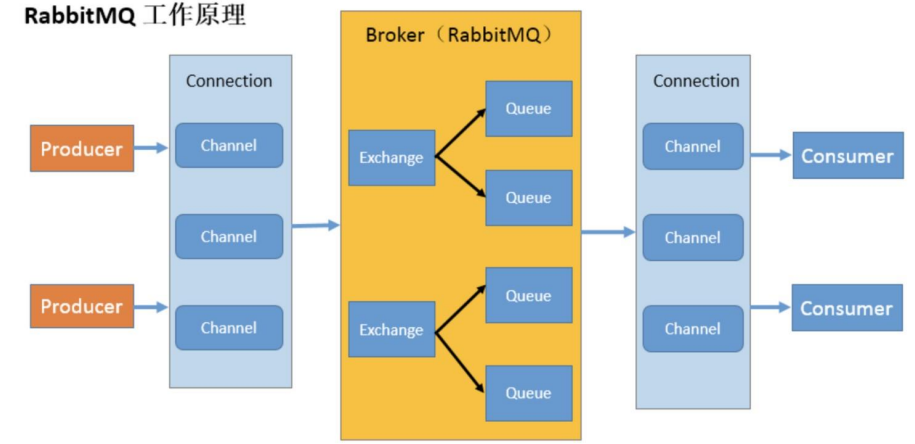

1. 生产者： 产生数据发送消息的程序 
2. 交换机： 交换机是 RabbitMQ 非常重要的一个部件，一方面它接收来自生产者的消息，另一方面它将消息 推送到队列中。交换机必须确切知道如何处理它接收到的消息，是将这些消息推送到特定队列还是推 送到多个队列，亦或者是把消息丢弃，这个得有交换机类型决定。
3. 队列： 队列是 RabbitMQ 内部使用的一种数据结构，尽管消息流经 RabbitMQ 和应用程序，但它们只能存储在队列中。队列仅受主机的内存和磁盘限制的约束，本质上是一个大的消息缓冲区。许多生产者可以将消息发送到一个队列，许多消费者可以尝试从一个队列接收数据。这就是我们使用队列的方式 。
4. 消费者： 消费与接收具有相似的含义。消费者大多时候是一个等待接收消息的程序。请注意生产者，消费者和消息中间件很多时候并不在同一机器上。同一个应用程序既可以是生产者又是可以是消费者。
5.  Broker：接收和分发消息的应用，RabbitMQ Server 就是 Message Broker。
6.  Virtual host：出于多租户和安全因素设计的，把 AMQP 的基本组件划分到一个虚拟的分组中，类似于网络中的 namespace 概念。当多个不同的用户使用同一个 RabbitMQ server 提供的服务时，可以划分出 多个 vhost，每个用户在自己的 vhost 创建 exchange／queue 等。
7.  Connection：publisher／consumer 和 broker 之间的 TCP 连接。
8.  Channel：如果每一次访问 RabbitMQ 都建立一个 Connection，在消息量大的时候建立 TCP Connection 的开销将是巨大的，效率也较低。Channel 是在 connection 内部建立的逻辑连接，如果应用程序支持多线程，通常每个 thread 创建单独的 channel 进行通讯，AMQP method 包含了 channel id 帮助客户端和 message broker 识别 channel，所以 channel 之间是完全隔离的。**Channel 作为轻量级的 Connection 极大减少了操作系统建立 TCP connection 的开销** 
9.  Exchange：message 到达 broker 的第一站，根据分发规则，匹配查询表中的 routing key，分发 消息到 queue 中去。常用的类型有：direct (point-to-point), topic (publish-subscribe) and fanout (multicast)。
10.  Queue：消息最终被送到这里等待 consumer 取 走。
11.  Binding：exchange 和 queue 之间的虚拟连接，binding 中可以包含 routing key，Binding 信息被保 存到 exchange 中的查询表中，用于 message 的分发依据 。

### 2. 工作模式

有7种工作模式：  [RabbitMQ Tutorials — RabbitMQ](https://www.rabbitmq.com/getstarted.html) 

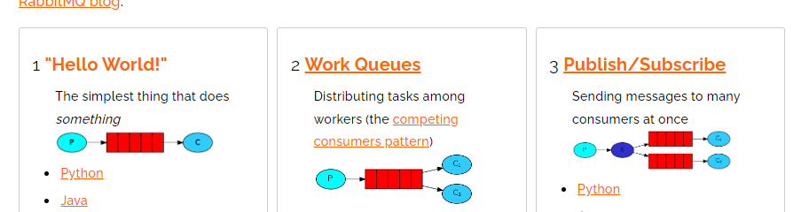

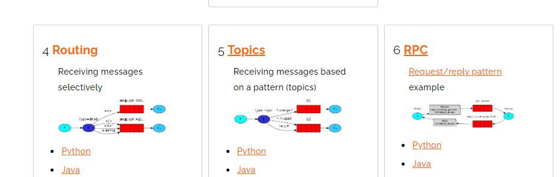


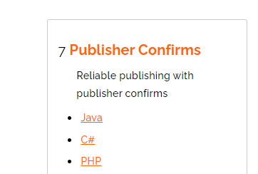

### 2. Hello World

最简单工作方式，生产者消费者模式。

```java
public class Producer {

    public final static String QUEUE_NAME = "hello";

    public static void main(String[] args) throws IOException, TimeoutException {
        Channel channel = RabbitMqUtils.getChannel();

        channel.queueDeclare(QUEUE_NAME, false, false, false, null);

        channel.basicPublish("", QUEUE_NAME, null, "hello rabbitMq".getBytes());
    }
}
```

消费者

```java
public class Consumer {

    public static void main(String[] args) throws IOException, TimeoutException {
        Channel channel = RabbitMqUtils.getChannel();

        System.out.println("等待接收消息.........");
        //推送的消息如何进行消费的接口回调
        DeliverCallback deliverCallback = (consumerTag, delivery) -> {
            String message = new String(delivery.getBody());
            System.out.println(message);
        };

        //取消消费的一个回调接口 如在消费的时候队列被删除掉了
        CancelCallback cancelCallback = (consumerTag) -> System.out.println("消息消费被中断");

        channel.basicConsume(Producer.QUEUE_NAME, deliverCallback, cancelCallback);
    }
}
```


### 3. Work Queues

 工作队列(又称任务队列)的主要思想是避免立即执行资源密集型任务，而不得不等待它完成。 相反我们安排任务在之后执行。我们把任务封装为消息并将其发送到队列。在后台运行的工作进 程将弹出任务并最终执行作业。当有多个工作线程时，这些工作线程将一起处理这些任务。

多个消费者，轮询分发消息。


### 4. 消息应答

 消费者完成一个任务可能需要一段时间，如果其中一个消费者处理一个长的任务并仅只完成 了部分突然它挂掉了，会发生什么情况。RabbitMQ 一旦向消费者传递了一条消息，便立即将该消 息标记为删除。在这种情况下，突然有个消费者挂掉了，我们将丢失正在处理的消息。以及后续 发送给该消费这的消息，因为它无法接收到。 

为了保证消息在发送过程中不丢失，rabbitmq 引入消息应答机制，消息应答就是:**消费者在接收 到消息并且处理该消息之后，告诉 rabbitmq 它已经处理了，rabbitmq 可以把该消息删除了。** 


#### 1. 自动应答

 消息发送后立即被认为已经传送成功，这种模式需要在**高吞吐量和数据传输安全性方面做权 衡,**因为这种模式如果消息在接收到之前，消费者那边出现连接或者 channel 关闭，那么消息就丢失 了,当然另一方面这种模式消费者那边可以传递过载的消息，没有对传递的消息数量进行限制，当 然这样有可能使得消费者这边由于接收太多还来不及处理的消息，导致这些消息的积压，最终使 得内存耗尽，最终这些消费者线程被操作系统杀死，所以这种模式仅适用在消费者可以高效并以 某种速率能够处理这些消息的情况下使用 

- Channel.basicAck(用于肯定确认)  RabbitMQ 已知道该消息并且成功的处理消息，可以将其丢弃了 、
- Channel.basicNack(用于否定确认)  
- Channel.basicReject(用于否定确认)  与 Channel.basicNack 相比少一个参数 不处理该消息了直接拒绝，可以将其丢弃了 


#### 2.  手动应答

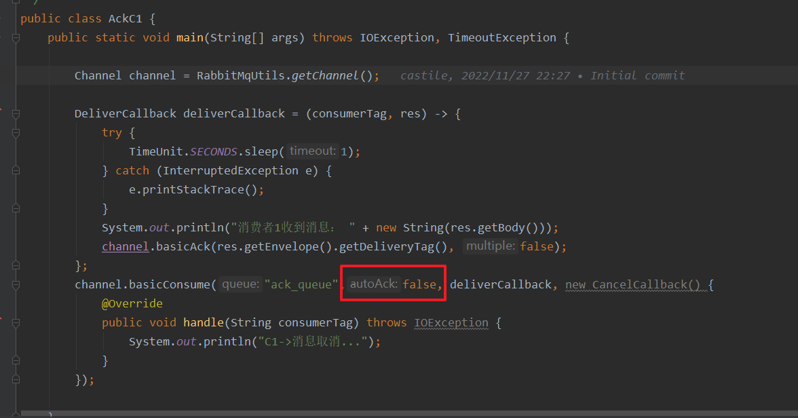


### 5. RabbitMQ持久化

队列持久化： 要队列实现持久化 需要在声明队列的时候把 durable 参数设置为持久化。 但是需要注意的就是如果之前声明的队列不是持久化的，需要把原先队列先删除，或者重新 创建一个持久化的队列，不然就会出现错误。

消息持久化： 要想让消息实现持久化需要在消息生产者修改代码MessageProperties.PERSISTENT_TEXT_PLAIN 添 加这个属性。 

 将消息标记为持久化并不能完全保证不会丢失消息。尽管它告诉 RabbitMQ 将消息保存到磁盘，但是 这里依然存在当消息刚准备存储在磁盘的时候 但是还没有存储完，消息还在缓存的一个间隔点。此时并没 有真正写入磁盘。持久性保证并不强，但是对于我们的简单任务队列而言，这已经绰绰有余了。 


### 6. 多劳多得，不公平分发

 RabbitMQ 分发消息采用的轮训分发，但是在某种场景下这种策略并不是 很好，比方说有两个消费者在处理任务，其中有个消费者 1 处理任务的速度非常快，而另外一个消费者 2 处理速度却很慢，这个时候我们还是采用轮训分发的化就会到这处理速度快的这个消费者很大一部分时间 处于空闲状态，而处理慢的那个消费者一直在干活，这种分配方式在这种情况下其实就不太好。

 为了避免这种情况，我们可以设置参数 channel.basicQos(1) .

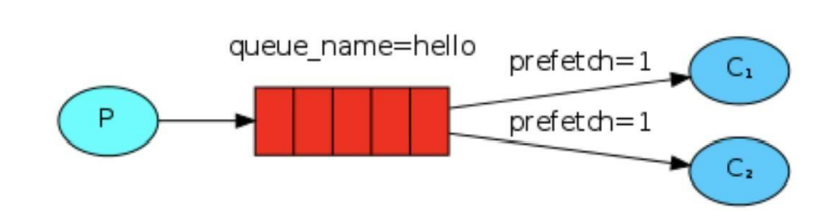

消费者代码：

```java
public class QoSConsumer {

    public static void main(String[] args) throws IOException, TimeoutException {
        Channel channel = RabbitMqUtils.getChannel();
        channel.queueDeclare("qos_queue", false, false, false, null);

        // 每次消费一条数据
        channel.basicQos(1);

        // 自动ack关闭
        channel.basicConsume("qos_queue",false, new DefaultConsumer(channel) {

            @Override
            public void handleDelivery(String consumerTag, Envelope envelope, AMQP.BasicProperties properties, byte[] body) throws IOException {

                try {
                    Thread.sleep(1000);
                } catch (InterruptedException e) {
                    e.printStackTrace();
                }
                System.out.println("receive a message: " + new String(body));

                // 手动ack
                channel.basicAck(envelope.getDeliveryTag(), false);
            }
        });

    }
}

```

生产者：

```java
public class QosProducer {

    public static void main(String[] args) throws IOException, TimeoutException {
        Channel channel = RabbitMqUtils.getChannel();
        channel.queueDeclare("qos_queue", false, false, false, null);


        for (int i = 0; i < 20; i++) {
            channel.basicPublish("", "qos_queue", null, ("message" + i).getBytes());
        }
        channel.close();
    }
}
```

 意思就是如果这个任务我还没有处理完或者我还没有应答你，你先别分配给我，我目前只能处理一个 任务，然后 rabbitmq 就会把该任务分配给没有那么忙的那个空闲消费者，当然如果所有的消费者都没有完 成手上任务，队列还在不停的添加新任务，队列有可能就会遇到队列被撑满的情况，这个时候就只能添加 新的 worker 或者改变其他存储任务的策略。 


### 8. 发布确认机制

 生产者将信道设置成 confirm 模式，一旦信道进入 confirm 模式，所有在该信道上面发布的消 息都将会被指派一个唯一的 ID(从 1 开始)，一旦消息被投递到所有匹配的队列之后，broker 就会 发送一个确认给生产者(包含消息的唯一 ID)，这就使得生产者知道消息已经正确到达目的队列了， 如果消息和队列是可持久化的，那么确认消息会在将消息写入磁盘之后发出，broker 回传给生产 者的确认消息中 delivery-tag 域包含了确认消息的序列号，此外 broker 也可以设置basic.ack 的 multiple 域，表示到这个序列号之前的所有消息都已经得到了处理。 

 confirm 模式最大的好处在于他是异步的，一旦发布一条消息，生产者应用程序就可以在等信道 返回确认的同时继续发送下一条消息，当消息最终得到确认之后，生产者应用便可以通过回调方 法来处理该确认消息，如果 RabbitMQ 因为自身内部错误导致消息丢失，就会发送一条 nack 消息， 生产者应用程序同样可以在回调方法中处理该 nack 消息 

#### 单个确认机制

```java 
package com.hlz.rabbit.mq.confirm;

import com.hlz.rabbit.mq.util.RabbitMqUtils;
import com.rabbitmq.client.Channel;

import java.io.IOException;
import java.util.concurrent.TimeoutException;

/**
 * 单个确认发布缺点： 发布速度特别的慢，因为如果没有确认发布的消息就会
 * 阻塞所有后续消息的发布
 *
 * @author Hongliang Zhu
 * @create 2022-11-28 23:02
 */
public class PubModConfirmProducer {
    public static void main(String[] args) {

        try (Channel channel = RabbitMqUtils.getChannel()) {

            // 开启发布确认
            channel.confirmSelect();
            channel.queueDeclare("queue-pub-confirm", false, false, false, null);
            long start = System.currentTimeMillis();
            for (int i = 0; i < 200; i++) {
                String message = "confirm" + i;
                channel.basicPublish("", "queue-pub-confirm", null, message.getBytes());
                boolean flag = channel.waitForConfirms();
                if (flag) {
                    System.out.println("消息：" + message + "发送成功..");
                }
            }
            long end = System.currentTimeMillis();
            System.out.println("发布200个单独确认消息,耗时" + (end - start) +
                    "ms");
        } catch (TimeoutException e) {
            e.printStackTrace();
        } catch (IOException e) {
            e.printStackTrace();
        } catch (InterruptedException e) {
            e.printStackTrace();
        }
    }
}

```

 waitForConfirmsOrDie(long)这个方法只有在消息被确认 的时候才返回，如果在指定时间范围内这个消息没有被确认那么它将抛出异常。

 缺点就是: 发布速度特别的慢，因为如果没有确认发布的消息就会 阻塞所有后续消息的发布，这种方式最多提供每秒不超过数百条发布消息的吞吐量。当然对于某 些应用程序来说这可能已经足够了。 


#### 批量确认发布

```java
package com.hlz.rabbit.mq.confirm;

import com.hlz.rabbit.mq.util.RabbitMqUtils;
import com.rabbitmq.client.Channel;

import java.io.IOException;
import java.util.concurrent.TimeoutException;

/**
 * 批量确认发布
 *
 * @author Hongliang Zhu
 * @create 2022-11-28 23:02
 */
public class PubModConfirmBatchProducer {
    public static void main(String[] args) {

        try (Channel channel = RabbitMqUtils.getChannel()) {
            // 开启发布确认
            channel.confirmSelect();
            //批量确认消息大小
            int batchSize = 100;
            //未确认消息个数
            int outstandingMessageCount = 0;
            channel.queueDeclare("queue-pub-confirm", false, false, false, null);
            long start = System.currentTimeMillis();
            for (int i = 0; i < 200; i++) {
                String message = "confirm" + i;
                channel.basicPublish("", "queue-pub-confirm", null, message.getBytes());
                outstandingMessageCount++;

                if (outstandingMessageCount == batchSize) {
                    channel.waitForConfirms();
                    outstandingMessageCount = 0;
                }
                channel.waitForConfirms();

            }
            //为了确保还有剩余没有确认消息 再次确认
            if (outstandingMessageCount > 0) {
                channel.waitForConfirms();
            }
            long end = System.currentTimeMillis();
            System.out.println("发布 200个批量确认消息,耗时" + (end - start) + "ms");

        } catch (TimeoutException e) {
            e.printStackTrace();
        } catch (IOException e) {
            e.printStackTrace();
        } catch (InterruptedException e) {
            e.printStackTrace();
        }
    }
}

```


#### 异步发布确认

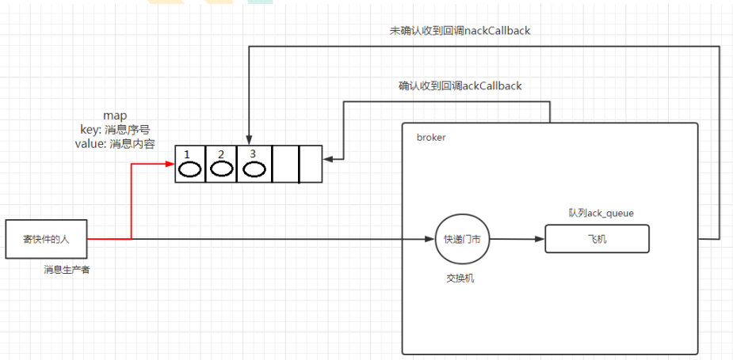

```java 
package com.hlz.rabbit.mq.confirm;

import com.hlz.rabbit.mq.util.RabbitMqUtils;
import com.rabbitmq.client.Channel;
import com.rabbitmq.client.ConfirmCallback;

import java.io.IOException;
import java.util.concurrent.ConcurrentNavigableMap;
import java.util.concurrent.ConcurrentSkipListMap;
import java.util.concurrent.TimeoutException;

/**
 * 异步确认发布
 *
 * @author Hongliang Zhu
 * @create 2022-11-28 23:02
 */
public class PubModConfirmAsyncProducer {
    public static void main(String[] args) {

        try (Channel channel = RabbitMqUtils.getChannel()) {
            // 开启发布确认
            channel.confirmSelect();
            /**
             * 线程安全有序的一个哈希表，适用于高并发的情况
             * 1.轻松的将序号与消息进行关联
             * 2.轻松批量删除条目 只要给到序列号
             * 3.支持并发访问
             */
            ConcurrentSkipListMap<Long, String> outStandingConfirm = new ConcurrentSkipListMap<>();
            /*
            确认收到消息的一个回调
            1. 消息序列号
            2. true可以确认小于等于当前序列号的消息
            false表示确认当前序列号

             */
            ConfirmCallback confirmCallback = new ConfirmCallback() {
                @Override
                public void handle(long deliveryTag, boolean multiple) throws IOException {
                    if (multiple) {
                        //返回的是小于等于当前序列号的未确认消息，是一个 map
                        ConcurrentNavigableMap<Long, String> confirmed = outStandingConfirm.headMap(deliveryTag, true);
                        // 清除该部分
                        confirmed.clear();
                    } else {
                        // 只清除当前序列号的消息
                        outStandingConfirm.remove(deliveryTag);
                    }
                }
            };

            ConfirmCallback nackCallBack = new ConfirmCallback() {
                @Override
                public void handle(long deliveryTag, boolean multiple) throws IOException {
                    String message = outStandingConfirm.get(deliveryTag);
                    System.out.println("发布的消息" + message + "未被确认， 序列号为：" + deliveryTag);
                }
            };

            // 添加异步确认的监听器
            channel.addConfirmListener(confirmCallback, nackCallBack);


            channel.queueDeclare("queue-pub-confirm", false, false, false, null);
            long start = System.currentTimeMillis();
            for (int i = 0; i < 200; i++) {
                String message = "confirm-async" + i;
                outStandingConfirm.put(channel.getNextPublishSeqNo(), message);
                channel.basicPublish("", "queue-pub-confirm", null, message.getBytes());
            }

            long end = System.currentTimeMillis();

            //异步发布确认的方式：发布 200个消息,耗时15ms ，性能最好！
            System.out.println("异步发布确认的方式：发布 200个消息,耗时" + (end - start) + "ms");

        } catch (TimeoutException e) {
            e.printStackTrace();
        } catch (IOException e) {
            e.printStackTrace();
        }

    }
}

```


### 9. 交换机

 RabbitMQ 消息传递模型的核心思想是: 生产者生产的消息从不会直接发送到队列。实际上，通常生产者甚至都不知道这些消息传递传递到了哪些队列中。 

 生产者只能将消息发送到交换机(exchange)，交换机工作的内容非常简单，一方面它接收来 自生产者的消息，另一方面将它们推入队列。交换机必须确切知道如何处理收到的消息。是应该把这些消 息放到特定队列还是说把他们到许多队列中还是说应该丢弃它们。这就的由交换机的类型来决定。 

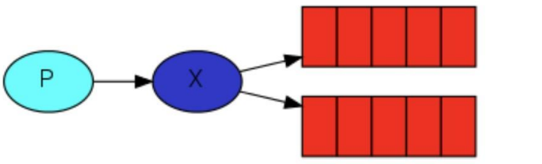

#### 1. 交换机的类型

 直接(direct), 主题(topic) ,标题(headers) , 扇出(fanout) 

#### 2. 无名交换机

 空字符串表示默认或无名称交换机：消息能路由发送到队列中其实 是由 routingKey(bindingkey)绑定 key 指定的，如果它存在的话 。

#### 3. 队列绑定bindings

 什么是 bingding 呢，binding 其实是 exchange 和 queue 之间的桥梁，它告诉我们 exchange 和那个队 列进行了绑定关系。比如说下面这张图告诉我们的就是 X 与 Q1 和 Q2 进行了绑定。

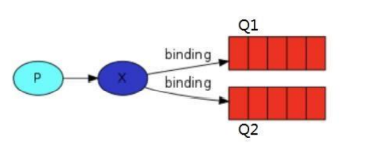

 队列只对它绑定的交换机的消息感兴趣。绑定用参数：routingKey 来表示，也可称该参数为 binding key， 创建绑定我们用代码:channel.queueBind(queueName, EXCHANGE_NAME, "routingKey");绑定之后的 意义由其交换类型决定。 

#### 4. fanout

 Fanout 这种类型非常简单。正如从名称中猜到的那样，它是将接收到的所有消息广播到它知道的 所有队列中。系统中默认有些 exchange 类型。

```java 
public static void main(String[] args) {
        try (Channel channel = RabbitMqUtils.getChannel()) {

            //  定义交换机
            channel.exchangeDeclare("test-fanout", BuiltinExchangeType.FANOUT);
            // 定义队列
            channel.queueDeclare("test-fanout-queue1", false, false, false, null);
            channel.queueDeclare("test-fanout-queue2", false, false, false, null);
            // 队列绑定交换机
            channel.queueBind("test-fanout-queue1", "test-fanout", "");
            channel.queueBind("test-fanout-queue2", "test-fanout", "");

            // 发送消息
            RabbitMqUtils.console(channel, "test-fanout", "");

        } catch (TimeoutException e) {
            e.printStackTrace();
        } catch (IOException e) {
            e.printStackTrace();
        }
    }
```


####  5. Direct exchange 

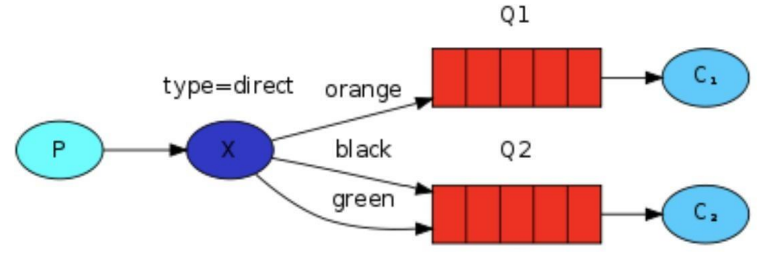

 在上面这张图中，我们可以看到 X 绑定了两个队列，绑定类型是 direct。队列Q1 绑定键为 orange， 队列 Q2 绑定键有两个:一个绑定键为 black，另一个绑定键为 green. 在这种绑定情况下，生产者发布消息到 exchange 上，绑定键为 orange 的消息会被发布到队列 Q1。绑定键为 black和green 的消息会被发布到队列 Q2，其他消息类型的消息将被丢弃。 

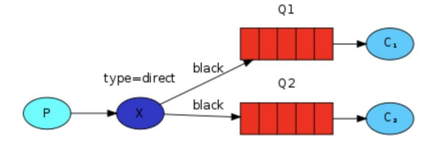

如上图，如果 exchange 的绑定类型是direct，但是它绑定的多个队列的 key 如果都相同，在这种情 况下虽然绑定类型是 direct 但是它表现的就和 fanout 有点类似了 


#### 6.  Topics 

 发送到类型是 topic 交换机的消息的 routing_key 不能随意写，必须满足一定的要求，它必须是一个单 词列表，以点号分隔开。这些单词可以是任意单词，比如说："stock.usd.nyse", "nyse.vmw", "quick.orange.rabbit".这种类型的。当然这个单词列表最多不能超过 255 个字节。

- *(星号)可以代替一个单词 

- #(井号)可以替代零个或多个单词  

```java 
package com.hlz.rabbit.mq.topic;

import com.hlz.rabbit.mq.util.RabbitMqUtils;
import com.rabbitmq.client.BuiltinExchangeType;
import com.rabbitmq.client.Channel;

import java.io.IOException;
import java.util.concurrent.TimeoutException;

/**

 *(星号)可以代替一个单词
 #(井号)可以替代零个或多个单词

 * 当一个队列绑定键是#,那么这个队列将接收所有数据，就有点像 fanout 了
 * 如果队列绑定键当中没有#和*出现，那么该队列绑定类型就是 direct 了
 * @author Hongliang Zhu
 * @create 2022-11-21 20:56
 */
public class TopicProducer {

    public static void main(String[] args) throws IOException, TimeoutException {
        Channel channel = RabbitMqUtils.getChannel();

        // 定义交换机
        channel.exchangeDeclare("my-topic", BuiltinExchangeType.TOPIC, false);

        // 定义队列
        channel.queueDeclare("test-queue1", false, false, false, null);
        channel.queueDeclare("test-queue2", false, false, false, null);
        channel.queueDeclare("test-queue3", false, false, false, null);

        // 队列绑定
        channel.queueBind("test-queue1", "my-topic", "#.order.error");
        channel.queueBind("test-queue2", "my-topic", "#.error");
        channel.queueBind("test-queue3", "my-topic", "*.info.*");

        // 发送消息
        channel.basicPublish("my-topic", "test.order.error", null, "test.order.error == >order订单日志，级别为error".getBytes());
        channel.basicPublish("my-topic", "hi.test.order.error", null, "hi.test.order.error == > order订单日志，级别为error".getBytes());
        channel.basicPublish("my-topic", "test.info.apple", null, "test.info.apple == >info日志".getBytes());
        channel.basicPublish("my-topic", "test.error", null, "test.info.apple == >info日志".getBytes());

        RabbitMqUtils.console(channel, "my-topic", "test.order.error");

    }
}

```

1. 当一个队列绑定键是#,那么这个队列将接收所有数据，就有点像 fanout 了 
2. 如果队列绑定键当中没有#和*出现，那么该队列绑定类型就是 direct 了 


### 10. 死信队列

 死信，顾名思义就是无法被消费的消息，字面意思可以这样理 解，一般来说，producer 将消息投递到 broker 或者直接到queue 里了，consumer 从 queue 取出消息 进行消费，但某些时候由于特定的原因导致 queue 中的某些消息无法被消费，这样的消息如果没有 后续的处理，就变成了死信，有死信自然就有了死信队列。 

#### 1. 应用场景

 为了保证订单业务的消息数据不丢失，需要使用到 RabbitMQ 的死信队列机制，当消息消费发生异常时，将消息投入死信队列中。还有比如说: 用户在商城下单成功并点击去支付后在指定时间未支付时自动失效。


#### 2. 死信来源

- 消息 TTL 过期 
- 队列达到最大长度(队列满了，无法再添加数据到 mq 中) 
- 消息被拒绝(basic.reject 或 basic.nack)并且 requeue=false 


#### 3. 死信实战

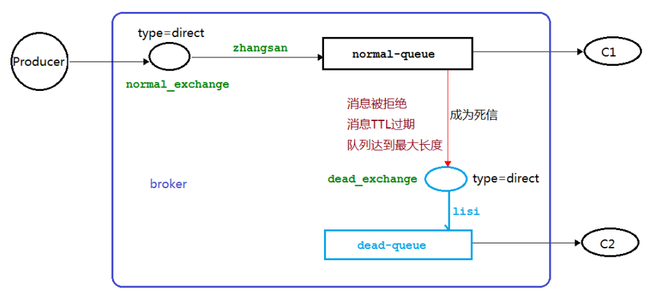

生产者：

```java
package com.hlz.rabbit.mq.dead;

import com.hlz.rabbit.mq.util.RabbitMqUtils;
import com.rabbitmq.client.AMQP;
import com.rabbitmq.client.BuiltinExchangeType;
import com.rabbitmq.client.Channel;

import java.io.IOException;
import java.util.HashMap;
import java.util.Map;
import java.util.concurrent.TimeoutException;

/**
 * 死信队列生产者
 *
 * @author Hongliang Zhu
 * @create 2022-11-21 22:15
 */
public class DeadProducer {

    public static void main(String[] args) throws IOException, TimeoutException {
        try (Channel channel = RabbitMqUtils.getChannel()) {
            channel.exchangeDeclare("normal_exchange", BuiltinExchangeType.DIRECT);

            // 死信交换机
            channel.exchangeDeclare("dead-exchange", BuiltinExchangeType.DIRECT);

            // 声明死信队列
            channel.queueDeclare("dead-queue", false, false, false, null);
            // 死信队列绑定死信交换机
            channel.queueBind("dead-queue", "dead-exchange", "lisi");

            // 正常队列绑定死信队列信息
            Map<String, Object> params = new HashMap<>();
            // 正常队列设置死信交换机
            params.put("x-dead-letter-exchange", "dead-exchange");
            //正常队列设置死信 routing-key
            params.put("x-dead-letter-routing-key", "lisi");

            // 设置队列长度限制
            params.put("x-max-length", 6);

            // 声明正常队列
            String normalQueue = "normal-queue";
            channel.queueDeclare(normalQueue, false, false, false, params);
            channel.queueBind(normalQueue, "normal_exchange", "zhangsan");

            // 设置消息的ttl时间
//            AMQP.BasicProperties basicProperties = new AMQP.BasicProperties().builder().expiration("10000").build();


            for (int i = 1; i <= 10; i++) {
                String message = "info" + i;
                channel.basicPublish("normal_exchange", "zhangsan", null, message.getBytes());
                System.out.println("生产者发送消息:" + message);
            }

        } catch (Exception e) {
            e.printStackTrace();
        }

    }
}

```

消费者

```java 
package com.hlz.rabbit.mq.dead;

import com.hlz.rabbit.mq.util.RabbitMqUtils;
import com.rabbitmq.client.*;

import java.io.IOException;
import java.util.concurrent.TimeoutException;

/**
 * 死信队列生产者
 *
 * @author Hongliang Zhu
 * @create 2022-11-21 22:15
 */
public class DeadConsumer1 {

    public static void main(String[] args) throws IOException, TimeoutException {
        try {
            Channel channel = RabbitMqUtils.getChannel();
            channel.exchangeDeclare("dead-exchange", BuiltinExchangeType.DIRECT);
            System.out.println("等待接收死信队列消息........... ");
            channel.basicConsume("dead-queue", true, new DeliverCallback() {
                @Override
                public void handle(String consumerTag, Delivery message) throws IOException {
                    String data = new String(message.getBody(), "UTF-8");
                    System.out.println(data);
                }
            }, new CancelCallback() {
                @Override
                public void handle(String consumerTag) throws IOException {

                }
            });
        } catch (Exception e) {
            e.printStackTrace();
        }

    }
}

```


### 11. 延时队列

 延时队列内部是有序的，最重要的特性就体现在它的延时属性上，延时队列中的元素是希望 在指定时间到了以后或之前取出和处理，简单来说，延时队列就是用来存放需要在指定时间被处理的 元素的队列。

#### 1. 应用场景

1. 订单在十分钟之内未支付则自动取消 
2. 新创建的店铺，如果在十天内都没有上传过商品，则自动发送消息提醒。 
3. 用户注册成功后，如果三天内没有登陆则进行短信提醒。
4. 用户发起退款，如果三天内没有得到处理则通知相关运营人员。
5. 预定会议后，需要在预定的时间点前十分钟通知各个与会人员参加会议 。


#### 2. TTL

 TTL 是什么呢？TTL 是 RabbitMQ 中一个消息或者队列的属性，表明一条消息或者该队列中的所有 消息的最大存活时间。 Time To Live。 单位是毫秒。换句话说，如果一条消息设置了 TTL 属性或者进入了设置TTL 属性的队列，那么这 条消息如果在TTL 设置的时间内没有被消费，则会成为"死信"。如果同时配置了队列的TTL 和消息的 TTL，那么较小的那个值将会被使用，有两种方式设置 TTL。  

消息设置TTL

```java 
 rabbitTemplate.convertAndSend("X", "XC", message, message1 -> {
            message1.getMessageProperties().setExpiration(ttlTime);
            return message1;
        });
```

队列设置TTL

```java
args.put("x-message-ttl", 40000);
 QueueBuilder.durable(Queue_B).withArguments(args).build();
```

 如果设置了队列的 TTL 属性，那么一旦消息过期，就会被队列丢弃(如果配置了死信队列被丢到死信队 列中)，而消息设置TTL方式，消息即使过期，也不一定会被马上丢弃，因为消息是否过期是在即将投递到消费者 之前判定的，如果当前队列有严重的消息积压情况，则已过期的消息也许还能存活较长时间；另外，还需 要注意的一点是，如果不设置 TTL，表示消息永远不会过期，如果将 TTL 设置为 0，则表示除非此时可以 直接投递该消息到消费者，否则该消息将会被丢弃。 

#### 3. 延时队列实现

https://gitee.com/hongliangzhu/mid-mq/tree/master/springboot-rabbitmq-producer/src/main/java/com/hlz/mid/mq/producer/ttl

