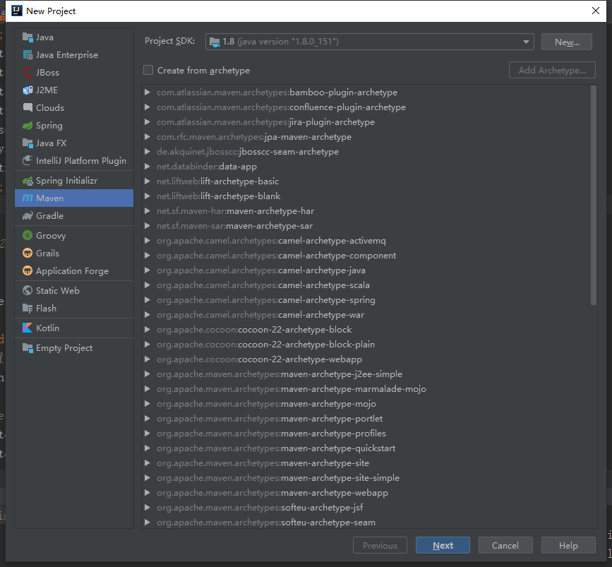
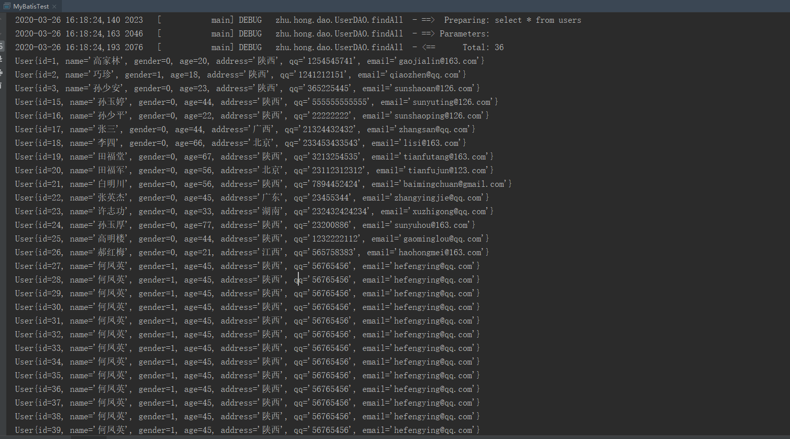

# 框架

它是我们软件开发中的一套解决方案，不同的框架解决的是不同的问题。

使用框架的**好处**：框架封装了很多的细节，使开发者可以使用极简的方式实现功能。大大提高开发效率。

# 三层架构

表现层：是用于展示数据的

业务层：是处理业务需求

持久层：是和数据库交互的

## 持久层技术解决方案

1. JDBC技术：
   		Connection
      		PreparedStatement
      		ResultSet
2. Spring的JdbcTemplate：
   		Spring中对jdbc的简单封装
3. Apache的DBUtils：
   		它和Spring的JdbcTemplate很像，也是对Jdbc的简单封装

以上这些都不是框架，JDBC是规范，Spring的JdbcTemplate和Apache的DBUtils都只是工具类。

# MyBatis

`mybatis`是一个持久层框架，用`java`编写的。它封装了`jdbc`操作的很多细节，使开发者只需要关注`sql`语句本身，而无需关注注册驱动，创建连接等繁杂过程。它使用了`ORM`思想实现了结果集的封装。

## ORM

`Object Relational Mappging` 对象关系映射

简单的说就是把数据库表和实体类及实体类的属性对应起来，让我们可以操作实体类就实现操作数据库表。

# 创建Maven工程



# 填写配置文件pom

导入jar包的坐标：`mybatis` / `mysql` / `log4j` / `junit` 等

```xml
<?xml version="1.0" encoding="UTF-8"?>
<project xmlns="http://maven.apache.org/POM/4.0.0"
         xmlns:xsi="http://www.w3.org/2001/XMLSchema-instance"
         xsi:schemaLocation="http://maven.apache.org/POM/4.0.0 http://maven.apache.org/xsd/maven-4.0.0.xsd">
    <modelVersion>4.0.0</modelVersion>

    <groupId>zhu.hong</groupId>
    <artifactId>maven_mybatis</artifactId>
    <version>1.0-SNAPSHOT</version>

    <dependencies>
        <dependency>
            <groupId>org.mybatis</groupId>
            <artifactId>mybatis</artifactId>
            <version>3.4.5</version>
        </dependency>

        <dependency>
            <groupId>mysql</groupId>
            <artifactId>mysql-connector-java</artifactId>
            <version>LATEST</version>
        </dependency>

        <dependency>
            <groupId>log4j</groupId>
            <artifactId>log4j</artifactId>
            <version>LATEST</version>
        </dependency>
        <dependency>
            <groupId>junit</groupId>
            <artifactId>junit</artifactId>
            <version>4.12</version>
        </dependency>

    </dependencies>

</project>
```

# 创建DAO接口

在对应的包下创建

```java
package zhu.hong.dao;

import zhu.hong.entity.User;

import java.util.List;

/**
 * @author Hongliang Zhu
 * @create 2020-03-26 15:45
 */
public interface UserDAO {
    /**
     * 查询所有操作
     * @return
     */
    List<User> findAll();
}

```

# 添加sqlMapConfig.xml文件

在`main`下的`resources`下创建`sqlMapConfig.xml`文件, 对数据库的连接进行配置

```xml
<?xml version="1.0" encoding="UTF-8"?>
<!DOCTYPE configuration
        PUBLIC "-//mybatis.org//DTD Config 3.0//EN"
        "http://mybatis.org/dtd/mybatis-3-config.dtd">

<!-- Mybatis 主配置文件 -->
<configuration>
<!--    配置环境  -->
    <environments default="mysql">
<!--        配置mysql环境       -->
        <environment id="mysql">
<!--            配置事物类型   -->
            <transactionManager type="JDBC"></transactionManager>
<!--            配置数据源       -->
            <dataSource type="POOLED">
                <!--            配置连接数据库的4个基本信息      -->
                <property name="driver" value="com.mysql.cj.jdbc.Driver"/>
                <property name="url" value="jdbc:mysql:///test?serverTimezone=UTC"/>
                <property name="username" value="root"/>
                <property name="password" value="123456"/>
            </dataSource>

        </environment>
    </environments>


<!--    指定映射配置文件的位置， 映射配置文件指的是每个dao独立的配置文件-->
    <mappers>
        <mapper resource="zhu/hong/dao/UserDAO.xml"></mapper>
    </mappers>

</configuration>

```

# 添加UserDAO.xml配置文件

在`resources`下面创建和`main`下的相同的目录结构, 添加`UserDAO.xml`文件。在Mybatis中它把持久层的操作接口名称和映射文件也叫做：`Mapper`，所以：`UserDao` 和 `UserMapper`是一样的


注意里面填写的配置信息：映射配置

映射配置文件的`mapper`标签的`namespace`属性的取值必须是`dao`接口的全限定类。

映射配置文件的操作配置（`select`），`id`属性的取值必须是`dao`接口的方法名

```xml
<?xml version="1.0" encoding="UTF-8"?>
<!DOCTYPE mapper
        PUBLIC "-//mybatis.org//DTD Mapper 3.0//EN"
        "http://mybatis.org/dtd/mybatis-3-mapper.dtd">

<mapper namespace="zhu.hong.dao.UserDAO">
<!--    配置查询所有      -->
    <select id="findAll" resultType="zhu.hong.entity.User">
        select * from  users
    </select>

</mapper>
```

> resultType="zhu.hong.entity.User"：
>
> 因为需要对结果集封装，所以要指定封装到哪里。

这样配置之后就无需再写DAO接口的实现类了。

# 测试

注意下面的步骤：

```java
package zhu.hong.test;
import org.apache.ibatis.io.Resources;
import org.apache.ibatis.session.SqlSession;
import org.apache.ibatis.session.SqlSessionFactory;
import org.apache.ibatis.session.SqlSessionFactoryBuilder;
import zhu.hong.dao.UserDAO;
import zhu.hong.entity.User;
import java.io.InputStream;
import java.util.List;

/**
 * @author Hongliang Zhu
 * @create 2020-03-26 16:02
 */
public class MyBatisTest {

    public static void main(String[] args) throws Exception {
        //1.  读取配置文件
        InputStream in = Resources.getResourceAsStream("SQLMapConfig.xml");

        //2. 创建SqlSessionFactory 工厂
        SqlSessionFactoryBuilder builder = new SqlSessionFactoryBuilder();
        SqlSessionFactory factory = builder.build(in);

        //3. 使用工厂生产sqlSession对象
        SqlSession sqlSession = factory.openSession();

        //4. 使用SQLSession创建DAO接口的代理对象
        UserDAO userDAO = sqlSession.getMapper(UserDAO.class);

        //5. 使用代理对象执行方法
        List<User> users = userDAO.findAll();
        for (User user: users){
            System.out.println(user);
        }
        //6. 释放资源
        sqlSession.close();
        in.close();

    }

}

```




# 使用 注解配置

使用了注解配置后，UserDAO.xml就没啥用了，可以直接删除，不删除会报错...

在DAO接口方法中使用注解声明

```java
package zhu.hong.dao;
import org.apache.ibatis.annotations.Select;
import zhu.hong.entity.User;
import java.util.List;

/**
 * @author Hongliang Zhu
 * @create 2020-03-26 15:45
 */
public interface UserDAO {
    /**
     * 查询所有操作
     * @return
     */
    @Select("select * from users")  // select注解
    List<User> findAll();
}

```

然后在sqlMapConfig.xml中修改：

```xml
<?xml version="1.0" encoding="UTF-8"?>
<!DOCTYPE configuration
        PUBLIC "-//mybatis.org//DTD Config 3.0//EN"
        "http://mybatis.org/dtd/mybatis-3-config.dtd">

<!-- Mybatis 主配置文件 -->
<configuration>
<!--    配置环境  -->
    <environments default="mysql">
<!--        配置mysql环境       -->
        <environment id="mysql">
<!--            配置事物类型   -->
            <transactionManager type="JDBC"></transactionManager>
<!--            配置数据源       -->
            <dataSource type="POOLED">
                <!--            配置连接数据库的4个基本信息      -->
                <property name="driver" value="com.mysql.cj.jdbc.Driver"/>
                <property name="url" value="jdbc:mysql:///test?serverTimezone=UTC"/>
                <property name="username" value="root"/>
                <property name="password" value="123456"/>
            </dataSource>

        </environment>
    </environments>


<!--    指定映射配置文件的位置， 映射配置文件指的是每个dao独立的配置文件-->
    <mappers>
<!--        如果是使用注解配置的话， 应该指定class文件 -->
<!--        <mapper resource="zhu/hong/dao/UserDAO.xml"></mapper>-->
        <mapper class="zhu.hong.dao.UserDAO"></mapper>
    </mappers>

</configuration>


```

在实际开发中，都是越简便越好，所以都是采用不写`dao`实现类的方式。不管使用XML还是注解配置。但是`Mybatis`它是支持写`dao`实现类的。

