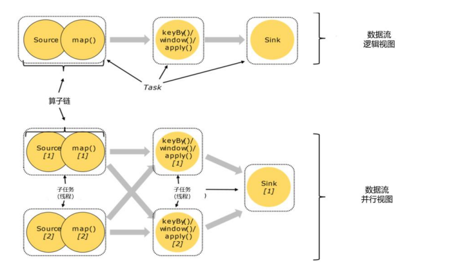

## 并行子任务和并行度

在 Flink 执行过程中，每一个算子（operator）可以包含一个或多个子任务（operator subtask）， 这些子任务在不同的线程、不同的物理机或不同的容器中完全独立地执行 

 **一个特定算子的子任务（subtask）的个数被称之为其并行度（parallelism）。** 

包含并行子任务的数据流，就是**并行数据流**，它需要多个分区（stream partition）来分配并行任 

##  算子间的数据传输 

一个数据流在算子之间传输数据的形式可以是一对一（one-to-one）的直 通 (forwarding)模式，也可以是打乱的重分区（redistributing）模式，具体是哪一种形式，取决 于算子的种类。

 （1）一对一（One-to-one，forwarding） 

数据流维护着分区以及元素的顺序。比如图中的 source 和 map 算子，source 算子读取数据之后，可以直接发送给 map 算子做处理，它们之间不需要重新分区，也不需要 调整数据的顺序。这就意味着 map 算子的子任务，看到的元素个数和顺序跟 source 算子的子 任务产生的完全一样，保证着“一对一”的关系。map、filter、flatMap 等算子都是这种 one-to-one 的对应关系 

 （2）重分区（Redistributing） 

在这种模式下，数据流的分区会发生改变。比图中的 map 和后面的 keyBy/window 算子之 间（这里的 keyBy 是数据传输算子，后面的 window、apply 方法共同构成了 window 算子）, 以及 keyBy/window 算子和 Sink 算子之间，都是这样的关系。

## 合并算子链

在 Flink 中，并行度相同的一对一（one to one）算子操作，可以直接链接在一起形成一个 “大”的任务（task），这样原来的算子就成为了真正任务里的一部分 

每个 task  会被一个线程执行。这样的技术被称为“算子链”（Operator Chain）。 

Source 和 map 之间满足了算子链的要求，所以可以直接合并 在一起，形成了一个任务；因为并行度为 2，所以合并后的任务也有两个并行子任务。这样， 这个数据流图所表示的作业最终会有 5 个任务，由 5 个线程并行执行 

 **将算子链接成 task 是非常有效的优 化：可以减少线程之间的切换和基于缓存区的数据交换，在减少时延的同时提升吞吐量。** 

