# 语义分割算法之DeepLabV3+

论文标题：  Encoder-Decoder with Atrous Separable Convolution for Semantic Image
Segmentation  

DeepLab series has come along for versions from [DeepLabv1](https://towardsdatascience.com/review-deeplabv1-deeplabv2-atrous-convolution-semantic-segmentation-b51c5fbde92d) (2015 ICLR), [DeepLabv2](https://towardsdatascience.com/review-deeplabv1-deeplabv2-atrous-convolution-semantic-segmentation-b51c5fbde92d) (2018 TPAMI), and [DeepLabv3](https://towardsdatascience.com/review-deeplabv3-atrous-convolution-semantic-segmentation-6d818bfd1d74?source=post_page---------------------------) (arXiv).

论文地址： https://arxiv.org/pdf/1802.02611.pdf 

github： https://github.com/jfzhang95/pytorch-deeplab-xception 

语义分割主要面临两个问题，第一是物体的多尺度问题，第二是DCNN的多次下采样会造成特征图分辨率变小，导致预测精度降低，边界信息丢失。DeepLab V3设计的ASPP模块较好的解决了第一个问题，而这里要介绍的DeepLabv3+则主要是为了解决第2个问题的。 我们知道从DeepLabV1系列引入空洞卷积开始，我们就一直在解决第2个问题呀，为什么现在还有问题呢？见以前的博客：[deeplabv1和deeplabv2](https://www.hongliangzhu.cn/2020/04/09/deeplabv1%E5%92%8Cdeeplabv2/)和[deeplabv3-空洞卷积(语义分割)](https://www.hongliangzhu.cn/2020/04/09/deeplabv3-%E7%A9%BA%E6%B4%9E%E5%8D%B7%E7%A7%AF-%E8%AF%AD%E4%B9%89%E5%88%86%E5%89%B2/)。对于DeepLabV3，如果Backbone为ResNet101，Stride=16将造成后面9层的特征图变大，后面9层的计算量变为原来的4倍大。而如果采用Stride=8，则后面78层的计算量都会变得很大。这就造成了DeepLabV3如果应用在大分辨率图像时非常耗时。所以为了改善这个缺点，DeepLabV3+来了。 

# Overview

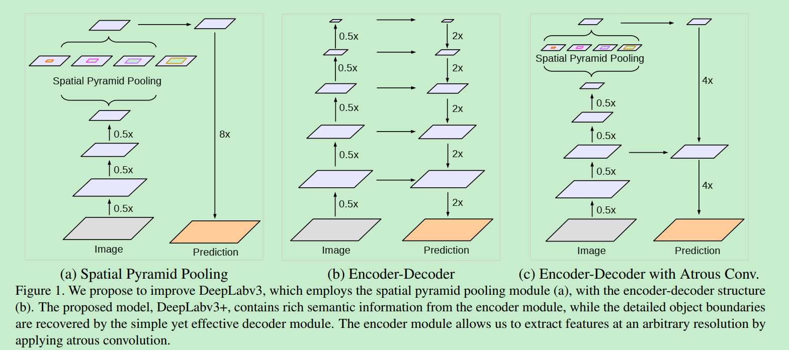

- (a):  With **Atrous Spatial Pyramid Pooling (ASPP)**, able to encode multi-scale contextual information.  ASPP 模块，可以编码多尺度特征， 其中的8x是直接双线性插值操作，不用参与训练 。

- (b)： With **Encoder-Decoder Architecture, the location/spatial information is recovered.** Encoder-Decoder Architecture has been proved to be useful in literature such as [FPN](https://towardsdatascience.com/review-fpn-feature-pyramid-network-object-detection-262fc7482610), [DSSD](https://towardsdatascience.com/review-dssd-deconvolutional-single-shot-detector-object-detection-d4821a2bbeb5), [TDM](https://medium.com/datadriveninvestor/review-tdm-top-down-modulation-object-detection-3f0efe9e0151), [SharpMask](https://towardsdatascience.com/review-sharpmask-instance-segmentation-6509f7401a61), [RED-Net](https://medium.com/datadriveninvestor/review-red-net-residual-encoder-decoder-network-denoising-super-resolution-cb6364ae161e), and [U-Net](https://towardsdatascience.com/review-u-net-biomedical-image-segmentation-d02bf06ca760) for different kinds of purposes.  编解码器结构， 可以恢复位置/空间信息。 事实证明，编码器/解码器体系结构在FPN，DSSD，TDM，SharpMask，RED-Net和U-Net等文献中可用于多种用途。 融合了低层和高层的信息。

- (c):  DeepLabv3+ makes use of (a) and (b).  本文使用的DeeplabV3+结构。采用了(a)和(b)。

-  Further, with the use of **Modified Aligned Xception**, and **Atrous Separable Convolution**, a faster and stronger network is developed.   此外，通过使用修正的对齐Xception和Atrous可分离卷积，可以开发出更快，更强大的网络。 

-  最后，DeepLabv3 +的性能优于PSPNet（在2016年ILSVRC场景解析挑战赛中排名第一）和之前的DeepLabv3。 

  

## OutLine

1. **Atrous Separable Convolution**
2. **Encoder-Decoder Architecture**
3. **Modified Aligned Xception**
4. **Ablation Study**
5. **Comparison with State-of-the-art Approaches**


# **Atrous Separable Convolution**

## Atrous Convolution

 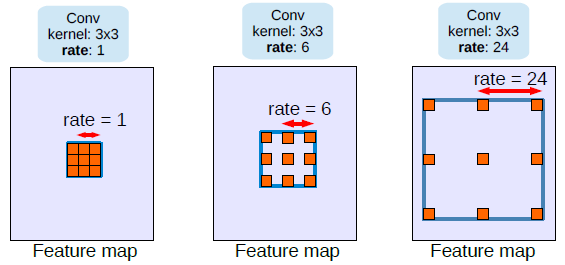 

- 对于输出y上的每个位置i和一个滤波器w, atrous卷积应用于输入特征映射x，其中atrous rate对应于我们采样输入信号时的步幅。
- 空洞卷积详见： [https://hongliangzhu.cn/2020/04/09/deeplabv3-%E7%A9%BA%E6%B4%9E%E5%8D%B7%E7%A7%AF-%E8%AF%AD%E4%B9%89%E5%88%86%E5%89%B2/#%E7%A9%BA%E6%B4%9E%E5%8D%B7%E7%A7%AF](https://hongliangzhu.cn/2020/04/09/deeplabv3-空洞卷积-语义分割/#空洞卷积) 

## **Atrous Separable Convolution**

 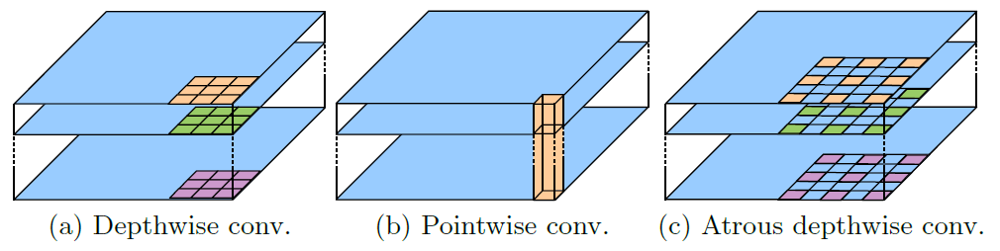

-  （a）和（b），深度可分卷积：将标准卷积分解为深度卷积，然后再进行点向卷积（即1×1卷积），大大降低了计算复杂度。
- （c）: 它在保持相似（或更好）性能的同时，大大降低了所提出模型的计算复杂度。 
-  Combining with point-wise convolution, it is **Atrous Separable Convolution.**


# Encoder-Decoder Architecture

为了解决上面提到的DeepLabV3在分辨率图像的耗时过多的问题，DeepLabV3+在DeepLabV3的基础上加入了编码器。这是Deeplabv3+的一个主要的创新点。

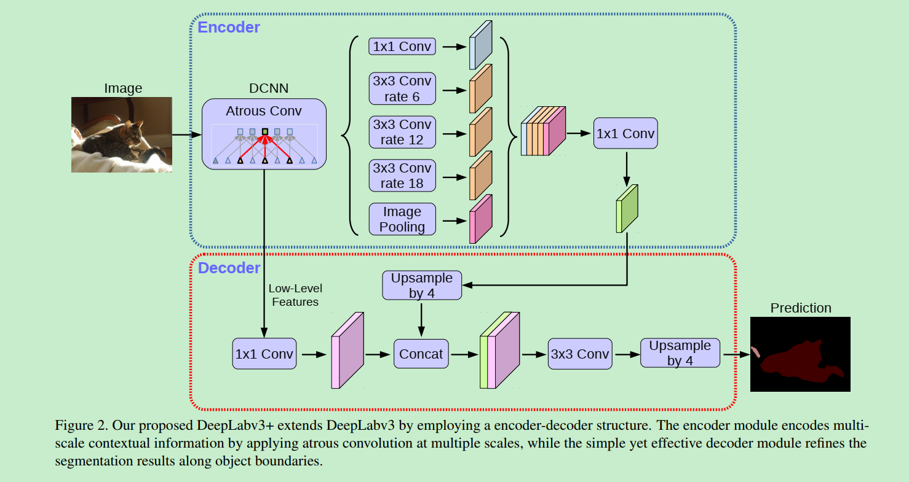

## [DeepLabv3]( [https://hongliangzhu.cn/2020/04/09/deeplabv3-%E7%A9%BA%E6%B4%9E%E5%8D%B7%E7%A7%AF-%E8%AF%AD%E4%B9%89%E5%88%86%E5%89%B2/](https://hongliangzhu.cn/2020/04/09/deeplabv3-空洞卷积-语义分割/) ) as Encoder

编码器就是一个DeeplabV3结构。 首先选一个低层级的feature用1 * 1的卷积进行通道压缩（原本为256通道，或者512通道），目的是减少低层级的比重。论文认为编码器得到的feature具有更丰富的信息，所以编码器的feature应该有更高的比重。 这样做有利于训练。 

- 对于图像分类的任务来说， 最终特征图的空间分辨率通常比输入图像分辨率小32倍，因此输出步幅= 32。 （output stride = 32）
- 对于语义分割来说，缩小32倍太小了。
- 通过移除最后一个（或者两个）块中的步幅并相应的应用空洞卷积，采用out stride=16（或者8）进行更加密集的特征提取。
- 同时，Deeplabv3增强了ASPP模块， 该模块通过以不同rate应用具有图像级别特征的atrous卷积来探测多尺度的卷积特征。 

## Proposed Decoder

对于解码器部分，直接将编码器的输出上采样4倍，使其分辨率和低层级的feature一致。举个例子，如果采用resnet `conv2` 输出的feature，则这里要x4上采样。将两种feature连接后，再进行一次3x3的卷积（细化作用），然后再次上采样就得到了像素级的预测。 

实验结果表明，这种结构在Stride=16时有很高的精度速度又很快。stride=8相对来说只获得了一点点精度的提升，但增加了很多的计算量。 

# Modified Aligned Xception

## Aligned Xception

可参考：https://towardsdatascience.com/review-dcn-deformable-convolutional-networks-2nd-runner-up-in-2017-coco-detection-object-14e488efce44

 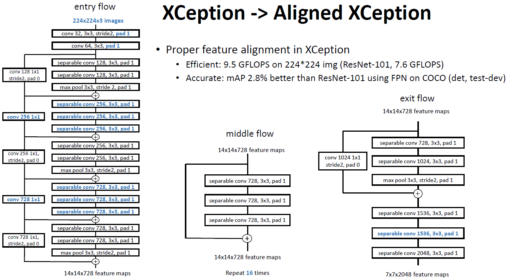

-  [Xception](https://towardsdatascience.com/review-xception-with-depthwise-separable-convolution-better-than-inception-v3-image-dc967dd42568) 是用于图像分类任务的
-  Aligned Xception 是来自可变形卷积，用于目标检测。


## Modified Aligned Xception

论文受到近期MSRA组在Xception上改进工作可变形卷积([Deformable-ConvNets](https://arxiv.org/pdf/1703.06211.pdf))启发，Deformable-ConvNets对Xception做了改进，能够进一步提升模型学习能力，新的结构如下： 

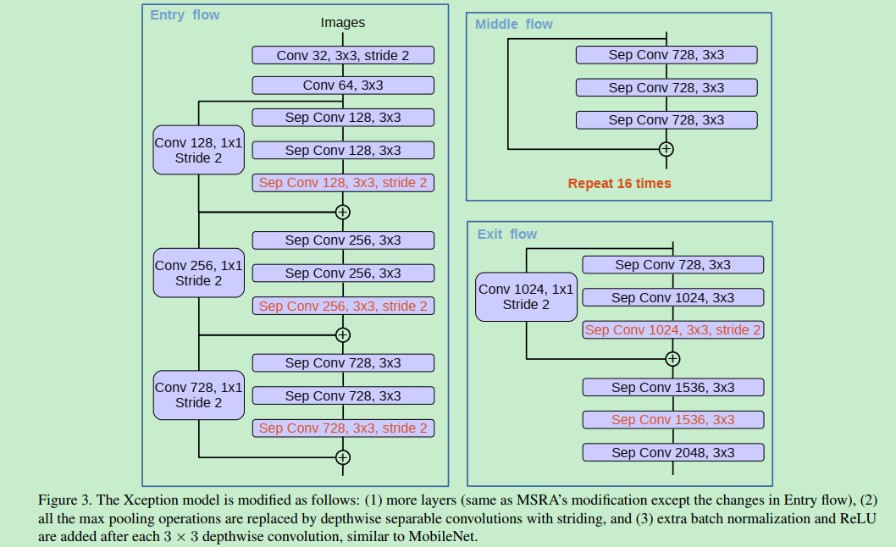

- 更深的Xception结构，不同的地方在于不修改entry flow network的结构，为了快速计算和有效的使用内存
- 所有的max pooling结构被stride=2的深度可分离卷积代替
- 每个3x3的depthwise convolution都跟BN和Relu

最后将改进后的Xception作为encodet主干网络，替换原本DeepLabv3的ResNet101。 

--------------


# Ablation Study

## Decoder Design

论文使用modified aligned Xception改进后的ResNet-101，在ImageNet-1K上做预训练，通过扩张卷积做密集的特征提取。采用DeepLabv3的训练方式(poly学习策略，crop 513x513)。注意在decoder模块同样包含BN层。 

为了评估在低级特征使用1*1卷积降维到固定维度的性能，做了如下对比实验： 

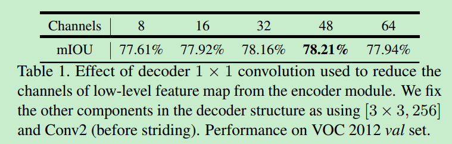

 实验中取了`conv2`尺度为[3x3, 256]的输出，降维后的通道数在32和48之间最佳，最终选择了48。 

编解码特征图融合后经过了3x3卷积，论文探索了这个卷积的不同结构对结果的影响 

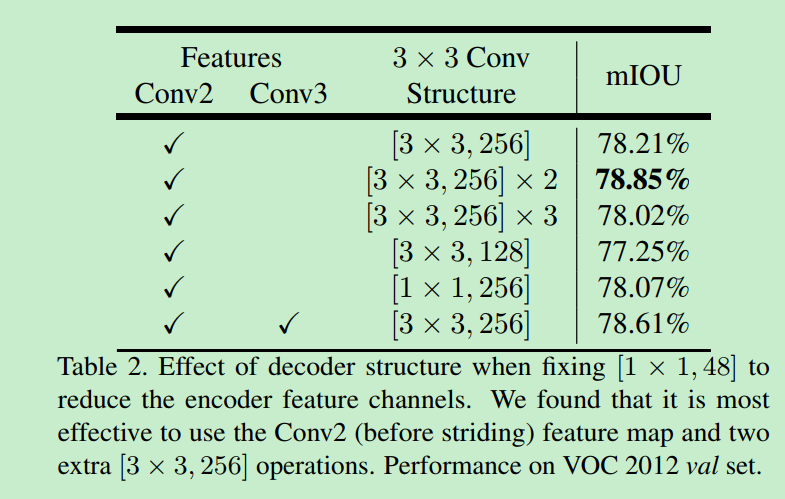

And it is most effective to use the Conv2 (before striding) feature map and two extra [3×3 conv; 256 channels] operations.

最终，选择了使用两组3x3卷积。这个表格的最后一项代表实验了如果使用`Conv2`和`Conv3`同时预测，上采样2倍后与`Conv3`结合，再上采样2倍的结果对比，这并没有提升显著的提升性能，考虑到计算资源的限制，论文最终采样简单的decoder方案，即我们看到的DeepLabV3+的网络结构图。 

## Model Variants with ResNet as Backbone

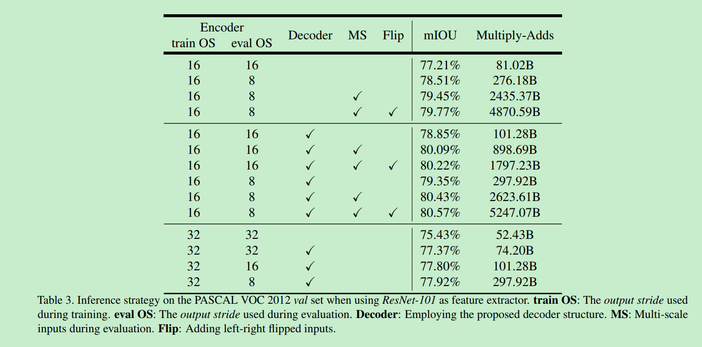

-  **Baseline** (First row block): 77.21% to 79.77% mIOU 
- **With Decoder** (Second row block): The performance is improved from 77.21% to 78.85% or 78.51% to 79.35%.
-  The performance is further improved to 80.57% when using multi-scale and left-right flipped inputs. 
-  **Coarser feature maps** (Third row block): i.e. stride = 32, the performance is not good. 

## Modified Aligned Xception as Backbone

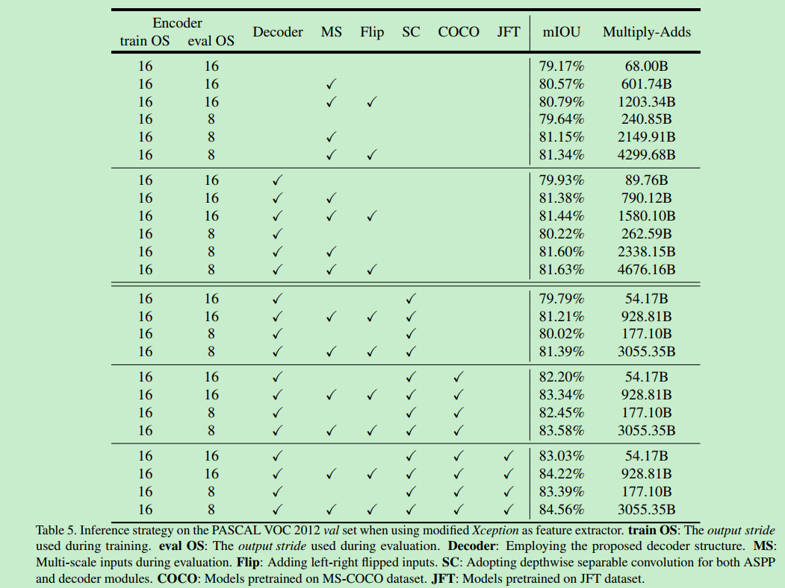

- **Baseline** (First row block): 79.17% to 81.34% mIOU.
- **With Decoder** (Second row block): 79.93% to 81.63% mIOU.
- **Using Depthwise Separable Convolution** (Third row block): Multiply-Adds is significantly reduced by 33% to 41%, while similar mIOU performance is obtained.
- **Pretraining on COCO** (Fourth row block): Extra 2% improvement.
- **Pretraining on JFT** (Fifth row block): Extra 0.8% to 1% improvement.

 这里可以看到使用深度分离卷积可以显著降低计算消耗。 

##  Visualization

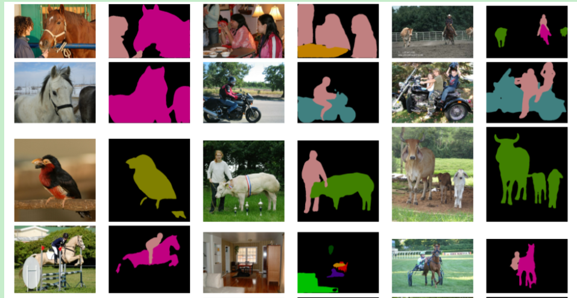

---------

# **Comparison with State-of-the-art Approaches**

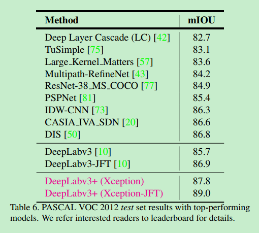

 DeepLabv3+ outperforms many SOTA approaches .


论文提出的DeepLabv3+是encoder-decoder架构，其中encoder架构采用Deeplabv3，decoder采用一个简单却有效的模块用于恢复目标边界细节。并可使用空洞卷积在指定计算资源下控制feature的分辨率。论文探索了Xception和深度分离卷积在模型上的使用，进一步提高模型的速度和性能。模型在VOC2012上获得了SOAT。Google出品，必出精品，这网络真的牛。 


# 源码分析

github：https://github.com/jfzhang95/pytorch-deeplab-xception.git

```python
"""
 	Dilated ResNet with multi-grid + improved ASPP + decoder
"""
class DeepLab(nn.Module):
    def __init__(self, backbone='resnet', output_stride=16, num_classes=21,
                 sync_bn=True, freeze_bn=False):
        super(DeepLab, self).__init__()
        if backbone == 'drn':
            output_stride = 8

        if sync_bn == True:
            BatchNorm = SynchronizedBatchNorm2d
        else:
            BatchNorm = nn.BatchNorm2d
		# 基网络
        self.backbone = build_backbone(backbone, output_stride, BatchNorm)
        # ASPP模块
        self.aspp = build_aspp(backbone, output_stride, BatchNorm)
        # 编解码器
        self.decoder = build_decoder(num_classes, backbone, BatchNorm)

        self.freeze_bn = freeze_bn

    def forward(self, input):
        # backbone 输出低级特征和编码特征
        x, low_level_feat = self.backbone(input)
        x = self.aspp(x)
        x = self.decoder(x, low_level_feat)
        # 上采样
        x = F.interpolate(x, size=input.size()[2:], mode='bilinear', align_corners=True)

        return x

"""
 构建backbone
"""
from modeling.backbone import resnet, xception, drn, mobilenet

def build_backbone(backbone, output_stride, BatchNorm):
    if backbone == 'resnet':
        return resnet.ResNet101(output_stride, BatchNorm)
    elif backbone == 'xception':
        return xception.AlignedXception(output_stride, BatchNorm)
    elif backbone == 'drn':
        return drn.drn_d_54(BatchNorm)
    elif backbone == 'mobilenet':
        return mobilenet.MobileNetV2(output_stride, BatchNorm)
    else:
        raise NotImplementedError

```

ASPP：

```python
import math
import torch
import torch.nn as nn
import torch.nn.functional as F
from modeling.sync_batchnorm.batchnorm import SynchronizedBatchNorm2d

class _ASPPModule(nn.Module):
    def __init__(self, inplanes, planes, kernel_size, padding, dilation, BatchNorm):
        super(_ASPPModule, self).__init__()
        self.atrous_conv = nn.Conv2d(inplanes, planes, kernel_size=kernel_size,  stride=1, padding=padding, dilation=dilation, bias=False)
        self.bn = BatchNorm(planes)
        self.relu = nn.ReLU()

        self._init_weight()

    def forward(self, x):
        x = self.atrous_conv(x) # 空洞卷积
        x = self.bn(x) # 加入bn层

        return self.relu(x)

    def _init_weight(self):
        for m in self.modules():
            if isinstance(m, nn.Conv2d):
                torch.nn.init.kaiming_normal_(m.weight)
            elif isinstance(m, SynchronizedBatchNorm2d):
                m.weight.data.fill_(1)
                m.bias.data.zero_()
            elif isinstance(m, nn.BatchNorm2d):
                m.weight.data.fill_(1)
                m.bias.data.zero_()

class ASPP(nn.Module):
    def __init__(self, backbone, output_stride, BatchNorm):
        super(ASPP, self).__init__()
        if backbone == 'drn':
            inplanes = 512
        elif backbone == 'mobilenet':
            inplanes = 320
        else:
            inplanes = 2048
        if output_stride == 16:
            dilations = [1, 6, 12, 18]
        elif output_stride == 8:
            dilations = [1, 12, 24, 36]
        else:
            raise NotImplementedError

        self.aspp1 = _ASPPModule(inplanes, 256, 1, padding=0, dilation=dilations[0], BatchNorm=BatchNorm)
        self.aspp2 = _ASPPModule(inplanes, 256, 3, padding=dilations[1], dilation=dilations[1], BatchNorm=BatchNorm)
        self.aspp3 = _ASPPModule(inplanes, 256, 3, padding=dilations[2], dilation=dilations[2], BatchNorm=BatchNorm)
        self.aspp4 = _ASPPModule(inplanes, 256, 3, padding=dilations[3], dilation=dilations[3], BatchNorm=BatchNorm)
		
        self.global_avg_pool = nn.Sequential(nn.AdaptiveAvgPool2d((1, 1)),
                                             nn.Conv2d(inplanes, 256, 1, stride=1, bias=False),  BatchNorm(256),  nn.ReLU())
        self.conv1 = nn.Conv2d(1280, 256, 1, bias=False)
        self.bn1 = BatchNorm(256)
        self.relu = nn.ReLU()
        self.dropout = nn.Dropout(0.5)
        self._init_weight()

    def forward(self, x):
        x1 = self.aspp1(x)
        x2 = self.aspp2(x)
        x3 = self.aspp3(x)
        x4 = self.aspp4(x)
        x5 = self.global_avg_pool(x)
        x5 = F.interpolate(x5, size=x4.size()[2:], mode='bilinear', align_corners=True)
        x = torch.cat((x1, x2, x3, x4, x5), dim=1)

        x = self.conv1(x)
        x = self.bn1(x)
        x = self.relu(x)

        return self.dropout(x)

    def _init_weight(self):
        for m in self.modules():
            if isinstance(m, nn.Conv2d):
                # n = m.kernel_size[0] * m.kernel_size[1] * m.out_channels
                # m.weight.data.normal_(0, math.sqrt(2. / n))
                torch.nn.init.kaiming_normal_(m.weight)
            elif isinstance(m, SynchronizedBatchNorm2d):
                m.weight.data.fill_(1)
                m.bias.data.zero_()
            elif isinstance(m, nn.BatchNorm2d):
                m.weight.data.fill_(1)
                m.bias.data.zero_()


def build_aspp(backbone, output_stride, BatchNorm):
    return ASPP(backbone, output_stride, BatchNorm)
```

Decoder：编解码器

```python
import math
import torch
import torch.nn as nn
import torch.nn.functional as F
from modeling.sync_batchnorm.batchnorm import SynchronizedBatchNorm2d

class Decoder(nn.Module):
    def __init__(self, num_classes, backbone, BatchNorm):
        super(Decoder, self).__init__()
        if backbone == 'resnet' or backbone == 'drn':
            low_level_inplanes = 256
        elif backbone == 'xception':
            low_level_inplanes = 128
        elif backbone == 'mobilenet':
            low_level_inplanes = 24
        else:
            raise NotImplementedError
		# 低级特征融合  降维到48  1x1卷积
        self.conv1 = nn.Conv2d(low_level_inplanes, 48, 1, bias=False)
        self.bn1 = BatchNorm(48)
        self.relu = nn.ReLU()
        self.last_conv = nn.Sequential(nn.Conv2d(304, 256, kernel_size=3, stride=1, padding=1, bias=False),
                                       BatchNorm(256),
                                       nn.ReLU(),
                                       nn.Dropout(0.5),
                                       nn.Conv2d(256, 256, kernel_size=3, stride=1, padding=1, bias=False),
                                       BatchNorm(256),
                                       nn.ReLU(),
                                       nn.Dropout(0.1),
                                       nn.Conv2d(256, num_classes, kernel_size=1, stride=1))
        self._init_weight()


    def forward(self, x, low_level_feat):
        low_level_feat = self.conv1(low_level_feat)
        low_level_feat = self.bn1(low_level_feat)
        low_level_feat = self.relu(low_level_feat)

        x = F.interpolate(x, size=low_level_feat.size()[2:], mode='bilinear', align_corners=True)
        x = torch.cat((x, low_level_feat), dim=1)
        x = self.last_conv(x)

        return x

    def _init_weight(self):
        for m in self.modules():
            if isinstance(m, nn.Conv2d):
                torch.nn.init.kaiming_normal_(m.weight)
            elif isinstance(m, SynchronizedBatchNorm2d):
                m.weight.data.fill_(1)
                m.bias.data.zero_()
            elif isinstance(m, nn.BatchNorm2d):
                m.weight.data.fill_(1)
                m.bias.data.zero_()

def build_decoder(num_classes, backbone, BatchNorm):
    return Decoder(num_classes, backbone, BatchNorm)
```


# 参考

1. [Review: DeepLabv3+ — Atrous Separable Convolution (Semantic Segmentation)]( https://medium.com/@sh.tsang/review-deeplabv3-atrous-separable-convolution-semantic-segmentation-a625f6e83b90 )
2. [项目实战 DeepLabV1,V2,V3 Google三大语义分割算法源码解析]( https://mp.weixin.qq.com/s/0dS0Isj2oCo_CF7p4riSCA )
3. [语义分割算法之DeepLabV3+论文解读及代码分析]( https://www.yanxishe.com/blogDetail/15772 )