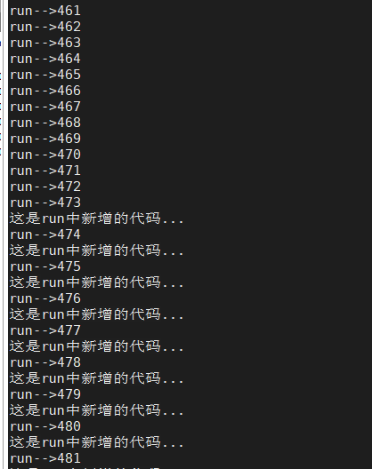

# 一、Arthas

`Arthas` 是Alibaba开源的Java诊断工具，深受开发者喜爱。

当你遇到以下类似问题而束手无策时，`Arthas`可以帮助你解决：

1. 这个类从哪个 jar 包加载的？为什么会报各种类相关的 Exception？
2. 我改的代码为什么没有执行到？难道是我没 commit？分支搞错了？
3. 遇到问题无法在线上 debug，难道只能通过加日志再重新发布吗？
4. 线上遇到某个用户的数据处理有问题，但线上同样无法 debug，线下无法重现！
5. 是否有一个全局视角来查看系统的运行状况？
6. 有什么办法可以监控到JVM的实时运行状态？
7. 怎么快速定位应用的热点，生成火焰图？
8. 怎样直接从JVM内查找某个类的实例？

`Arthas`支持JDK6+，支持Linux/Mac/Windows，采用命令行交互模式，同时提供丰富的 `Tab` 自动补全功能，进一步方便进行问题的定位和诊断。

# 二、安装

## 使用`arthas-boot`（推荐）

下载`arthas-boot.jar`，然后用`java -jar`的方式启动：

```shell
curl -O https://arthas.aliyun.com/arthas-boot.jar
java -jar arthas-boot.jar
```

打印帮助信息：

```shell
java -jar arthas-boot.jar -h
```

- 如果下载速度比较慢，可以使用aliyun的镜像：

  ```shell
  java -jar arthas-boot.jar --repo-mirror aliyun --use-http
  ```

## 使用`as.sh`

Arthas 支持在 Linux/Unix/Mac 等平台上一键安装，请复制以下内容，并粘贴到命令行中，敲 `回车` 执行即可：

```shell
curl -L https://arthas.aliyun.com/install.sh | sh
```

上述命令会下载启动脚本文件 `as.sh` 到当前目录，你可以放在任何地方或将其加入到 `$PATH` 中。

直接在shell下面执行`./as.sh`，就会进入交互界面。

也可以执行`./as.sh -h`来获取更多参数信息。

## 全量安装

最新版本，点击下载：[](https://arthas.aliyun.com/download/latest_version?mirror=aliyun)

解压后，在文件夹里有`arthas-boot.jar`，直接用`java -jar`的方式启动：

```shell
java -jar arthas-boot.jar
```

# 三、快速使用

## 1. 启动math-game

```shell
curl -O https://arthas.aliyun.com/math-game.jar
java -jar math-game.jar
```

`math-game`是一个简单的程序，每隔一秒生成一个随机数，再执行质因数分解，并打印出分解结果。

`math-game`源代码：[查看](https://github.com/alibaba/arthas/blob/master/math-game/src/main/java/demo/MathGame.java)

## 2. 启动arthas

在命令行下面执行（使用和目标进程一致的用户启动，否则可能attach失败）：

```
curl -O https://arthas.aliyun.com/arthas-boot.jar
java -jar arthas-boot.jar
```

- 执行该程序的用户需要和目标进程具有相同的权限。比如以`admin`用户来执行：`sudo su admin && java -jar arthas-boot.jar` 或 `sudo -u admin -EH java -jar arthas-boot.jar`。
- 如果attach不上目标进程，可以查看`~/logs/arthas/` 目录下的日志。
- 如果下载速度比较慢，可以使用aliyun的镜像：`java -jar arthas-boot.jar --repo-mirror aliyun --use-http`
- `java -jar arthas-boot.jar -h` 打印更多参数信息。

选择应用java进程：

```
$ $ java -jar arthas-boot.jar
* [1]: 35542
  [2]: 71560 math-game.jar
```

`math-game`进程是第2个，则输入2，再输入`回车/enter`。Arthas会attach到目标进程上，并输出日志


# 四、常用命令

1. dashboard仪表盘
2. 通过thread命令来获取到arthas-demo进程的Main Class
3. 通过jad反编译Main Class
4. watch

## 命令介绍

### 1. dashboard仪表盘

 输入[dashboard](https://arthas.aliyun.com/doc/dashboard.html)，按`回车/enter`，会展示当前进程的信息，按`ctrl+c`可以中断执行。 


1. 第一部分是显示JVM中运行的所有线程：所在的线程组，优先级，线程的状态，CPU的利用率，是否是后台进程等。
2. 第二部分显示的是JVM内存的使用情况等
3. 第三部分是操作系统的一些信息和Java版本号

- ID: Java级别的线程ID，注意这个ID不能跟jstack中的nativeID一一对应。
- NAME: 线程名
- GROUP: 线程组名
- PRIORITY: 线程优先级, 1~10之间的数字，越大表示优先级越高
- STATE: 线程的状态
- CPU%: 线程的cpu使用率。比如采样间隔1000ms，某个线程的增量cpu时间为100ms，则cpu使用率=100/1000=10%
- DELTA_TIME: 上次采样之后线程运行增量CPU时间，数据格式为`秒`
- TIME: 线程运行总CPU时间，数据格式为`分:秒`
- INTERRUPTED: 线程当前的中断位状态
- DAEMON: 是否是daemon线程

### 2. 通过thread命令来获取到arthas-demo进程的Main Class

获取到arthas-demo进程的Main Class

thread 1 会打印线程ID为1 的栈信息，通常是main函数的线程

```shell
Threads Total: 24, NEW: 0, RUNNABLE: 7, BLOCKED: 0, WAITING: 4, TIMED_WAITING: 3, TERMINATED: 0, Internal threads: 10
ID      NAME                                              GROUP                    PRIORITY         STATE            %CPU            DELTA_TIME       TIME             INTERRUPTED     DAEMON
-1      VM Periodic Task Thread                           -                        -1               -                0.13            0.000            0:0.804          false           true
22      arthas-command-execute                            system                   5                RUNNABLE         0.09            0.000            0:0.004          false           true
-1      C1 CompilerThread2                                -                        -1               -                0.06            0.000            0:0.587          false           true
2       Reference Handler                                 system                   10               WAITING          0.0             0.000            0:0.001          false           true
3       Finalizer                                         system                   8                WAITING          0.0             0.000            0:0.004          false           true
4       Signal Dispatcher                                 system                   9                RUNNABLE         0.0             0.000            0:0.000          false           true
9       Attach Listener                                   system                   9                RUNNABLE         0.0             0.000            0:0.010          false           true
11      arthas-timer                                      system                   9                WAITING          0.0             0.000            0:0.000          false           true
14      arthas-NettyHttpTelnetBootstrap-3-1               system                   5                RUNNABLE         0.0             0.000            0:0.020          false           true
15      arthas-NettyWebsocketTtyBootstrap-4-1             system                   5                RUNNABLE         0.0             0.000            0:0.001          false           true
16      arthas-NettyWebsocketTtyBootstrap-4-2             system                   5                RUNNABLE         0.0             0.000            0:0.002          false           true
17      arthas-shell-server                               system                   9                TIMED_WAITING    0.0             0.000            0:0.002          false           true
18      arthas-session-manager                            system                   9                TIMED_WAITING    0.0             0.000            0:0.001          false           true
19      arthas-UserStat                                   system                   9                WAITING          0.0             0.000            0:0.000          false           true
21      arthas-NettyHttpTelnetBootstrap-3-2               system                   5                RUNNABLE         0.0             0.000            0:0.200          false           true
1       main                                              main                     5                TIMED_WAITING    0.0             0.000            0:0.230          false           false
-1      GC task thread#1 (ParallelGC)                     -                        -1               -                0.0             0.000            0:0.030          false           true
-1      VM Thread                                         -                        -1               -                0.0             0.000            0:0.152          false           true
-1      GC task thread#2 (ParallelGC)                     -                        -1               -                0.0             0.000            0:0.031          false           true
-1      GC task thread#3 (ParallelGC)                     -                        -1               -                0.0             0.000            0:0.030          false           true
-1      GC task thread#0 (ParallelGC)                     -                        -1               -                0.0             0.000            0:0.028          false           true
-1      C2 CompilerThread0                                -                        -1               -                0.0             0.000            0:0.704          false           true
-1      Service Thread                                    -                        -1               -                0.0             0.000            0:0.000          false           true
-1      C2 CompilerThread1                                -                        -1               -                0.0             0.000            0:0.535          false           true


```

```shell
thread 1
```


### 3. 通过jad反编译Main Class

```shell
jad demo.MathGame
```


### 4. watch监视 （debug）

通过watch命令来查看`demo.MathGame#primeFactors` 函数的返回值

```shell
watch demo.MathGame primeFactors returnObj
		包名+类名      函数名		ongl表达式
```

```shell
[arthas@29058]$ watch demo.MathGame primeFactors returnObj
Press Q or Ctrl+C to abort.
Affect(class count: 1 , method count: 1) cost in 77 ms, listenerId: 1
method=demo.MathGame.primeFactors location=AtExceptionExit
ts=2021-07-17 15:22:29; [cost=0.58359ms] result=null
method=demo.MathGame.primeFactors location=AtExit
ts=2021-07-17 15:22:30; [cost=0.09676ms] result=@ArrayList[
    @Integer[2], # 第一个整数
    @Integer[7],
    @Integer[11],
    @Integer[557],
]
method=demo.MathGame.primeFactors location=AtExit
ts=2021-07-17 15:22:31; [cost=0.03972ms] result=@ArrayList[
    @Integer[2],
    @Integer[3],
    @Integer[17],
    @Integer[1151],
]
method=demo.MathGame.primeFactors location=AtExceptionExit
ts=2021-07-17 15:22:32; [cost=0.049295ms] result=null # 不能分解
method=demo.MathGame.primeFactors location=AtExit
ts=2021-07-17 15:22:33; [cost=0.763201ms] result=@ArrayList[
    @Integer[65809],
]

```


### 5. 退出arthas

如果只是退出当前的连接，可以用`quit`或者`exit`命令。Attach到目标进程上的arthas还会继续运行，端口会保持开放，下次连接时可以直接连接上。

如果想完全退出arthas，可以执行`stop`命令。


# 五、基础命令

- help——查看命令帮助信息

- [cat](https://arthas.aliyun.com/doc/cat.html)——打印文件内容，和linux里的cat命令类似

- [echo](https://arthas.aliyun.com/doc/echo.html)–打印参数，和linux里的echo命令类似

- [grep](https://arthas.aliyun.com/doc/grep.html)——匹配查找，和linux里的grep命令类似

  但是它只能用于管道命令

  语法：

  ---

  |    参数列表     |                 作用                 |
  | :-------------: | :----------------------------------: |
  |       -n        |               显示行号               |
  |       -i        |            忽略大小写查找            |
  |     -m 行数     | 最大显示行数，要与查询字符串一起使用 |
  | -e "正则表达式" |          使用正则表达式查找          |

   如：

  1. 只显示包含java字符串的行系统属性

     ```shell
     sysprop | grep java
     ```

     

  2. 只显示10行，并显示出行号

     ```shell
     sysprop | grep java -n -m10
     ```

- [base64](https://arthas.aliyun.com/doc/base64.html)——base64编码转换，和linux里的base64命令类似

- [tee](https://arthas.aliyun.com/doc/tee.html)——复制标准输入到标准输出和指定的文件，和linux里的tee命令类似

   tee指令会从标准输入设备读取数据，将其内容输出到标准输出设备，同时保存成文件。 

  ```shell
  EXAMPLES:
    sysprop | tee /path/to/logfile | grep java
    sysprop | tee -a /path/to/logfile | grep java
  ```

  -a 参数是追加到文件

- [pwd](https://arthas.aliyun.com/doc/pwd.html)——返回当前的工作目录，和linux命令类似

- cls——清空当前屏幕区域

  

- session——查看当前会话的信息

  ```shell
  Name        Value
  --------------------------------------------------
   JAVA_PID    29058
   SESSION_ID  dfad3e36-c62f-49b4-906f-494f030a5c50
  
  ```

- [reset](https://arthas.aliyun.com/doc/reset.html)——重置增强类，将被 Arthas 增强过的类全部还原，Arthas 服务端关闭时会重置所有增强过的类。

  > Arthas在 watch/trace 等命令时，实际上是修改了应用的字节码，插入增强的代码。显式执行 `reset` 命令，可以清除掉这些增强代码。 

  语法：

  1、 还原指定类：reset Test

  2、还原所有以List结尾的类：reset *List

  3、还原所有的类：reset

  

- version——输出当前目标 Java 进程所加载的 Arthas 版本号

  ```shell
  [arthas@29058]$ version
  3.5.2
  ```

- history——打印命令历史

- quit——退出当前 Arthas 客户端，其他 Arthas 客户端不受影响

- stop——关闭 Arthas 服务端，所有 Arthas 客户端全部退出

- [keymap](https://arthas.aliyun.com/doc/keymap.html)——Arthas快捷键列表及自定义快捷键

  | 快捷键        | 快捷键说明       | 命令名称             | 命令说明                         |
  | ------------- | ---------------- | -------------------- | -------------------------------- |
  | `"\C-a"`      | ctrl + a         | beginning-of-line    | 跳到行首                         |
  | `"\C-e"`      | ctrl + e         | end-of-line          | 跳到行尾                         |
  | `"\C-f"`      | ctrl + f         | forward-word         | 向前移动一个单词                 |
  | `"\C-b"`      | ctrl + b         | backward-word        | 向后移动一个单词                 |
  | `"\e[D"`      | 键盘左方向键     | backward-char        | 光标向前移动一个字符             |
  | `"\e[C"`      | 键盘右方向键     | forward-char         | 光标向后移动一个字符             |
  | `"\e[B"`      | 键盘下方向键     | next-history         | 下翻显示下一个命令               |
  | `"\e[A"`      | 键盘上方向键     | previous-history     | 上翻显示上一个命令               |
  | `"\C-h"`      | ctrl + h         | backward-delete-char | 向后删除一个字符                 |
  | `"\C-?"`      | ctrl + shift + / | backward-delete-char | 向后删除一个字符                 |
  | `"\C-u"`      | ctrl + u         | undo                 | 撤销上一个命令，相当于清空当前行 |
  | `"\C-d"`      | ctrl + d         | delete-char          | 删除当前光标所在字符             |
  | `"\C-k"`      | ctrl + k         | kill-line            | 删除当前光标到行尾的所有字符     |
  | `"\C-i"`      | ctrl + i         | complete             | 自动补全，相当于敲`TAB`          |
  | `"\C-j"`      | ctrl + j         | accept-line          | 结束当前行，相当于敲回车         |
  | `"\C-m"`      | ctrl + m         | accept-line          | 结束当前行，相当于敲回车         |
  | `"\C-w"`      |                  | backward-delete-word |                                  |
  | `"\C-x\e[3~"` |                  | backward-kill-line   |                                  |
  | `"\e\C-?"`    |                  | backward-kill-word   |                                  |

  - 任何时候 `tab` 键，会根据当前的输入给出提示
  - 命令后敲 `-` 或 `--` ，然后按 `tab` 键，可以展示出此命令具体的选项

  中文版：供参考

  


# 六、JVM相关命令

## 目标

1. dashboard 仪表板
2. thread 线程相关
3. jvm虚拟机相关
4. sysprop 系统属性相关
5. sysenv 查看jvm环境信息

## 1. dashboard


### 数据说明

- ID: Java级别的线程ID，注意这个ID不能跟jstack中的nativeID一一对应。
- NAME: 线程名
- GROUP: 线程组名
- PRIORITY: 线程优先级, 1~10之间的数字，越大表示优先级越高
- STATE: 线程的状态
- CPU%: 线程的cpu使用率。比如采样间隔1000ms，某个线程的增量cpu时间为100ms，则cpu使用率=100/1000=10%
- DELTA_TIME: 上次采样之后线程运行增量CPU时间，数据格式为`秒`
- TIME: 线程运行总CPU时间，数据格式为`分:秒`
- INTERRUPTED: 线程当前的中断位状态
- DAEMON: 是否是daemon线程

### JVM内部线程

Java 8之后支持获取JVM内部线程CPU时间，这些线程只有名称和CPU时间，没有ID及状态等信息（显示ID为-1）。 通过内部线程可以观测到JVM活动，如GC、JIT编译等占用CPU情况，方便了解JVM整体运行状况。

- 当JVM 堆(heap)/元数据(metaspace)空间不足或OOM时，可以看到GC线程的CPU占用率明显高于其他的线程。
- 当执行`trace/watch/tt/redefine`等命令后，可以看到JIT线程活动变得更频繁。因为JVM热更新class字节码时清除了此class相关的JIT编译结果，需要重新编译。

JVM内部线程包括下面几种：

- JIT编译线程: 如 `C1 CompilerThread0`, `C2 CompilerThread0`
- GC线程: 如`GC Thread0`, `G1 Young RemSet Sampling`
- 其它内部线程: 如`VM Periodic Task Thread`, `VM Thread`, `Service Thread`

### JIT即时编译

 JIT是just in time的缩写，也就是即时编译。通过JIT技术，能够做到Java程序执行速度的加速。

注： JIT即时编译： https://blog.csdn.net/qq_34902684/article/details/85538895

## 2. thread

查看当前JVM的线程堆栈信息（ 查看当前线程信息，查看线程的堆栈 ）

参数说明：

| 参数名称 |                           参数说明                           |
| :------: | :----------------------------------------------------------: |
|    id    |                            线程id                            |
|   [n:]   |                指定最忙的前N个线程并打印堆栈                 |
|   [b]    |                  找出当前阻塞其他线程的线程                  |
|   [i ]   | 指定cpu占比统计的采样间隔，单位为毫秒指定cpu使用率统计的采样间隔，，默认值为200 |
| [--all]  |                      显示所有匹配的线程                      |

### cpu使用率是如何统计出来的？

这里的cpu使用率与linux 命令`top -H -p ` 的线程`%CPU`类似，一段采样间隔时间内，当前JVM里各个线程的增量cpu时间与采样间隔时间的比例。

> 工作原理说明：

- 首先第一次采样，获取所有线程的CPU时间(调用的是`java.lang.management.ThreadMXBean#getThreadCpuTime()`及`sun.management.HotspotThreadMBean.getInternalThreadCpuTimes()`接口)
- 然后睡眠等待一个间隔时间（默认为200ms，可以通过`-i`指定间隔时间）
- 再次第二次采样，获取所有线程的CPU时间，对比两次采样数据，计算出每个线程的增量CPU时间
- 线程CPU使用率 = 线程增量CPU时间 / 采样间隔时间 * 100%

> 注意： 这个统计也会产生一定的开销（JDK这个接口本身开销比较大），因此会看到as的线程占用一定的百分比，为了降低统计自身的开销带来的影响，可以把采样间隔拉长一些，比如5000毫秒。
>
> 另外一种查看Java进程的线程cpu使用率方法：可以使用[show-busy-java-threads](https://github.com/oldratlee/useful-scripts/blob/master/docs/java.md#-show-busy-java-threads)这个脚本

### 举例

如： 显示当前最忙的前3个线程并打印堆栈信息：

 ```shell
thread -n 3
 ```


- 没有线程ID，包含`[Internal]`表示为JVM内部线程，参考`dashboard`命令的介绍。
- `cpuUsage`为采样间隔时间内线程的CPU使用率，与`dashboard`命令的数据一致。
- `deltaTime`为采样间隔时间内线程的增量CPU时间，小于1ms时被取整显示为0ms。
- `time` 线程运行总CPU时间。

### 当没有参数时，显示第一页线程信息

默认按照CPU增量时间降序排列，只显示第一页数据，避免滚屏。

### thread --all, 显示所有匹配的线程

显示所有匹配线程信息，有时需要获取全部JVM的线程数据进行分析。

### thread id， 显示指定线程的运行堆栈

查看线程ID 1的栈：

```shell
thread 1
```

### thread -i, 指定采样时间间隔

- `thread -i 1000` : 统计最近1000ms内的线程CPU时间。

  

- `thread -n 3 -i 1000` : 列出1000ms内最忙的3个线程栈

  

### thread –state ，查看指定状态的线程

```shell
thread --state WAITING 
```


### thread -b, 找出当前阻塞其他线程的线程

有时候我们发现应用卡住了， 通常是由于某个线程拿住了某个锁， 并且其他线程都在等待这把锁造成的。 为了排查这类问题， arthas提供了`thread -b`， 一键找出那个罪魁祸首。

> **注意， 目前只支持找出synchronized关键字阻塞住的线程， 如果是`java.util.concurrent.Lock`， 目前还不支持。** 

写一个死锁程序：

```java
package com.hongliang;
import java.util.concurrent.TimeUnit;
/**
 * @author Hongliang Zhu
 * @create 2021-07-17 17:48
 */
public class Main {
    public static void main(String[] args) {
        DinnerLockThread thread = new DinnerLockThread();
        new Thread(thread, "Jack").start();
        new Thread(thread, "Rose").start();
    }
}

class DinnerLockThread implements Runnable{

    String lock1 = "第一根筷子";
    String lock2 = "第二根筷子";

    public void run() {
        if ("Jack".equals(Thread.currentThread().getName())){
            synchronized (lock1){
                System.out.println("Jack 拿到了"+lock1);
                synchronized (lock2){
                    System.out.println("Jack 拿到了"+lock2);
                    try {
                        TimeUnit.SECONDS.sleep(1);
                    } catch (InterruptedException e) {
                        e.printStackTrace();
                    }
                }
            }
        }else {
            synchronized (lock2){
                System.out.println("Rose 拿到了"+lock2);

                synchronized (lock1){
                    System.out.println("Rose 拿到了"+lock1);
                    try {
                        TimeUnit.SECONDS.sleep(1);
                    } catch (InterruptedException e) {
                        e.printStackTrace();
                    }
                }
            }
        }

    }
}

```

运行：

```shell
[root@castile arthas]# java -cp demo-arthas-deadlock-1.0-SNAPSHOT.jar com.hongliang.Main
Jack 拿到了第一根筷子
Rose 拿到了第二根筷子
... 出现死锁了...
```


可以看到上面的Jack和Rose的线程已经Blocked

接下来使用arthas来诊断具体那个线程造成的死锁：


## 3.  jvm 查看当前JVM信息

 查看当前JVM信息 

```makefile
 RUNTIME
----------------------------------------------------------------------------------------------------------------------------------------------------------------------------------------------------------------
 MACHINE-NAME                                               31604@castile.com
 JVM-START-TIME                                             2021-07-17 17:59:24
 MANAGEMENT-SPEC-VERSION                                    1.2
 SPEC-NAME                                                  Java Virtual Machine Specification
 SPEC-VENDOR                                                Oracle Corporation
 SPEC-VERSION                                               1.8
 VM-NAME                                                    Java HotSpot(TM) 64-Bit Server VM
 VM-VENDOR                                                  Oracle Corporation
 VM-VERSION                                                 25.251-b08
 INPUT-ARGUMENTS                                            []
 CLASS-PATH                                                 demo-arthas-deadlock-1.0-SNAPSHOT.jar
 BOOT-CLASS-PATH                                            /usr/jdk/jdk1.8.0_251/jre/lib/resources.jar:/usr/jdk/jdk1.8.0_251/jre/lib/rt.jar:/usr/jdk/jdk1.8.0_251/jre/lib/sunrsasign.jar:/usr/jdk/jdk1.8.0_251
                                                            /jre/lib/jsse.jar:/usr/jdk/jdk1.8.0_251/jre/lib/jce.jar:/usr/jdk/jdk1.8.0_251/jre/lib/charsets.jar:/usr/jdk/jdk1.8.0_251/jre/lib/jfr.jar:/usr/jdk/j
                                                            dk1.8.0_251/jre/classes
 LIBRARY-PATH                                               /usr/java/packages/lib/amd64:/usr/lib64:/lib64:/lib:/usr/lib

----------------------------------------------------------------------------------------------------------------------------------------------------------------------------------------------------------------
 CLASS-LOADING
----------------------------------------------------------------------------------------------------------------------------------------------------------------------------------------------------------------
 LOADED-CLASS-COUNT                                         3457
 TOTAL-LOADED-CLASS-COUNT                                   3457
 UNLOADED-CLASS-COUNT                                       0
 IS-VERBOSE                                                 false

----------------------------------------------------------------------------------------------------------------------------------------------------------------------------------------------------------------
 COMPILATION
----------------------------------------------------------------------------------------------------------------------------------------------------------------------------------------------------------------
 NAME                                                       HotSpot 64-Bit Tiered Compilers
 TOTAL-COMPILE-TIME                                         804
 [time (ms)]

----------------------------------------------------------------------------------------------------------------------------------------------------------------------------------------------------------------
 GARBAGE-COLLECTORS
----------------------------------------------------------------------------------------------------------------------------------------------------------------------------------------------------------------
 PS Scavenge                                                name : PS Scavenge
 [count/time (ms)]                                          collectionCount : 6
                                                            collectionTime : 31

 PS MarkSweep                                               name : PS MarkSweep
 [count/time (ms)]                                          collectionCount : 1
                                                            collectionTime : 31


----------------------------------------------------------------------------------------------------------------------------------------------------------------------------------------------------------------
 MEMORY-MANAGERS
----------------------------------------------------------------------------------------------------------------------------------------------------------------------------------------------------------------
 CodeCacheManager                                           Code Cache

 Metaspace Manager                                          Metaspace
                                                            Compressed Class Space

 PS Scavenge                                                PS Eden Space
                                                            PS Survivor Space

 PS MarkSweep                                               PS Eden Space
                                                            PS Survivor Space
                                                            PS Old Gen


----------------------------------------------------------------------------------------------------------------------------------------------------------------------------------------------------------------
 MEMORY # 内存相关
----------------------------------------------------------------------------------------------------------------------------------------------------------------------------------------------------------------
 HEAP-MEMORY-USAGE                                          init : 31457280(30.0 MiB)
 [memory in bytes]                                          used : 23836240(22.7 MiB)
                                                            committed : 66060288(63.0 MiB)
                                                            max : 425197568(405.5 MiB)

 NO-HEAP-MEMORY-USAGE                                       init : 2555904(2.4 MiB)
 [memory in bytes]                                          used : 27348920(26.1 MiB)
                                                            committed : 28573696(27.3 MiB)
                                                            max : -1(-1 B)

 PENDING-FINALIZE-COUNT                                     0

----------------------------------------------------------------------------------------------------------------------------------------------------------------------------------------------------------------
 OPERATING-SYSTEM#系统相关
----------------------------------------------------------------------------------------------------------------------------------------------------------------------------------------------------------------
 OS                                                         Linux
 ARCH                                                       amd64
 PROCESSORS-COUNT                                           4
 LOAD-AVERAGE                                               0.0
 VERSION                                                    3.10.0-1127.el7.x86_64

----------------------------------------------------------------------------------------------------------------------------------------------------------------------------------------------------------------
 THREAD
----------------------------------------------------------------------------------------------------------------------------------------------------------------------------------------------------------------
 COUNT                                                      16
 DAEMON-COUNT                                               13
 PEAK-COUNT                                                 17
 STARTED-COUNT                                              20
 DEADLOCK-COUNT                                             2

----------------------------------------------------------------------------------------------------------------------------------------------------------------------------------------------------------------
 FILE-DESCRIPTOR # 文件描述符
----------------------------------------------------------------------------------------------------------------------------------------------------------------------------------------------------------------
 MAX-FILE-DESCRIPTOR-COUNT                                  4096
 OPEN-FILE-DESCRIPTOR-COUNT                                 103

```

### THREAD相关

- COUNT: JVM当前活跃的线程数
- DAEMON-COUNT: JVM当前活跃的守护线程数
- PEAK-COUNT: 从JVM启动开始曾经活着的最大线程数
- STARTED-COUNT: 从JVM启动开始总共启动过的线程次数
- DEADLOCK-COUNT: JVM当前死锁的线程数

### 文件描述符相关

- MAX-FILE-DESCRIPTOR-COUNT：JVM进程最大可以打开的文件描述符数
- OPEN-FILE-DESCRIPTOR-COUNT：JVM当前打开的文件描述符数

## 4. sysprop 系统属性相关

### 查看单个属性

```shell
$ sysprop java.version
java.version=1.8.0_51
```

### 修改单个属性

```shell
$ sysprop user.country
user.country=US
$ sysprop user.country CN
Successfully changed the system property.
user.country=CN
```

## 5. sysenv 查看jvm环境信息


也可以只看其中一个环境变量

```shell
[arthas@31604]$ sysenv JAVA_HOME
 KEY                                       VALUE
 JAVA_HOME                                 /usr/jdk/jdk1.8.0_251
```

```shell
[arthas@31604]$ sysenv CLASSPATH
 KEY                                       VALUE
 CLASSPATH                               .:/usr/jdk/jdk1.8.0_251/lib.tools.jar
```

## 6. vmoption查看，更新VM诊断相关的参数 

 查看，更新VM诊断相关的参数 

- vmoption   : 查看所有的option

  

- vmoption PrintGCDetails  : 查看指定的option

  ```shell
  arthas@31604]$ vmoption PrintGCDetails
   KEY              VALUE                ORIGIN             WRITEABLE
   PrintGCDetails   false                DEFAULT              true
  
  ```

- vmoption PrintGCDetails true ： 更新指定的option

  

  

## 7. getstatic查看类的静态属性

 通过getstatic命令可以方便的查看类的静态属性。使用方法为`getstatic class_name field_name` 

```shell
[arthas@34093]$ getstatic demo.MathGame random # 查看MathGame里面的random字段
field: random # 字段
@Random[
    serialVersionUID=@Long[3905348978240129619],
    seed=@AtomicLong[144884610029513],
    multiplier=@Long[25214903917],
    addend=@Long[11],
    mask=@Long[281474976710655],
    DOUBLE_UNIT=@Double[1.1102230246251565E-16],
    BadBound=@String[bound must be positive],
    BadRange=@String[bound must be greater than origin],
    BadSize=@String[size must be non-negative],
    seedUniquifier=@AtomicLong[3620162808252824828],
    nextNextGaussian=@Double[0.0],
    haveNextNextGaussian=@Boolean[false],
    serialPersistentFields=@ObjectStreamField[][isEmpty=false;size=3],
    unsafe=@Unsafe[sun.misc.Unsafe@2b0f66cd],
    seedOffset=@Long[24],
]
Affect(row-cnt:1) cost in 10 ms.

```

 推荐直接使用[ognl](https://arthas.aliyun.com/doc/ognl.html)命令，更加灵活 。

| *express*             | 执行的表达式                                                 |
| --------------------- | ------------------------------------------------------------ |
| `[c:]`                | 执行表达式的 ClassLoader 的 hashcode，默认值是SystemClassLoader |
| `[classLoaderClass:]` | 指定执行表达式的 ClassLoader 的 class name                   |
| [x]                   | 结果对象的展开层次，默认值1                                  |

调用静态函数：

```shell
$ ognl '@java.lang.System@out.println("hello")'
返回null
```

 获取静态类的静态字段： 

```shell
$ ognl '@demo.MathGame@random'
@Random[
    serialVersionUID=@Long[3905348978240129619],
    seed=@AtomicLong[125451474443703],
    multiplier=@Long[25214903917],
    addend=@Long[11],
    mask=@Long[281474976710655],
    DOUBLE_UNIT=@Double[1.1102230246251565E-16],
    BadBound=@String[bound must be positive],
    BadRange=@String[bound must be greater than origin],
    BadSize=@String[size must be non-negative],
    seedUniquifier=@AtomicLong[-3282039941672302964],
    nextNextGaussian=@Double[0.0],
    haveNextNextGaussian=@Boolean[false],
    serialPersistentFields=@ObjectStreamField[][isEmpty=false;size=3],
    unsafe=@Unsafe[sun.misc.Unsafe@28ea5898],
    seedOffset=@Long[24],
]
```

 执行多行表达式，赋值给临时变量，返回一个List： 

```shell
 ognl '#value1=@System@getProperty("java.home"), #value2=@System@getProperty("java.runtime.name"), {#value1, #value2}'
 
 @ArrayList[
    @String[/opt/java/8.0.181-zulu/jre],
    @String[OpenJDK Runtime Environment],
]
```

- OGNL特殊用法请参考：https://github.com/alibaba/arthas/issues/71
- OGNL表达式官方指南：https://commons.apache.org/proper/commons-ognl/language-guide.html


# 八、Class/ClassLoader相关命令

## 目标

1. sc：  Search-Class 。查看JVM已加载的类信息   
2. sm：  Search-Method 。 查看已加载类的方法信息 
3. jad: 把字节码反编译成源代码

## 1. sc查看JVM已加载的类信息   

 Search-Class” 的简写，这个命令能搜索出所有已经加载到 JVM 中的 Class 信息，这个命令支持的参数有 `[d]`、`[E]`、`[f]` 和 `[x:]`。 

| 参数名称              | 参数说明                                                     |
| --------------------- | ------------------------------------------------------------ |
| *class-pattern*       | 类名表达式匹配                                               |
| *method-pattern*      | 方法名表达式匹配                                             |
| [d]                   | 输出当前类的详细信息，包括这个类所加载的原始文件来源、类的声明、加载的ClassLoader等详细信息。 如果一个类被多个ClassLoader所加载，则会出现多次 |
| [E]                   | 开启正则表达式匹配，默认为通配符匹配                         |
| [f]                   | 输出当前类的成员变量信息（需要配合参数-d一起使用）           |
| [x:]                  | 指定输出静态变量时属性的遍历深度，默认为 0，即直接使用 `toString` 输出 |
| `[c:]`                | 指定class的 ClassLoader 的 hashcode                          |
| `[classLoaderClass:]` | 指定执行表达式的 ClassLoader 的 class name                   |
| `[n:]`                | 具有详细信息的匹配类的最大数量（默认为100）                  |

```shell
sc com.hongliang.DinnerLockThread -d
```


```shell
sc com.hongliang.DinnerLockThread -df
```


 sc 默认开启了子类匹配功能，也就是说所有当前类的子类也会被搜索出来，想要精确的匹配，请打开`options disable-sub-class true`开关 

## 2. sm查看已加载类的方法信息 

 “Search-Method” 的简写，这个命令能搜索出所有已经加载了 Class 信息的**方法信息**。 

 `sm` 命令只能看到由当前类所声明 (declaring) 的方法，父类则无法看到。 

| 参数名称              | 参数说明                                    |
| --------------------- | ------------------------------------------- |
| *class-pattern*       | 类名表达式匹配                              |
| *method-pattern*      | 方法名表达式匹配                            |
| [d]                   | 展示每个方法的详细信息                      |
| [E]                   | 开启正则表达式匹配，默认为通配符匹配        |
| `[c:]`                | 指定class的 ClassLoader 的 hashcode         |
| `[classLoaderClass:]` | 指定执行表达式的 ClassLoader 的 class name  |
| `[n:]`                | 具有详细信息的匹配类的最大数量（默认为100） |


## 3.  jad: 把字节码反编译成源代码

`jad` 命令将 JVM 中实际运行的 class 的 byte code 反编译成 java 代码，便于你理解业务逻辑；

- 在 Arthas Console 上，反编译出来的源码是带**语法高亮**的，阅读更方便
- 当然，反编译出来的 java 代码可能会存在语法错误，但不影响你进行阅读理解

| 参数名称              | 参数说明                                   |
| --------------------- | ------------------------------------------ |
| *class-pattern*       | 类名表达式匹配                             |
| `[c:]`                | 类所属 ClassLoader 的 hashcode             |
| `[classLoaderClass:]` | 指定执行表达式的 ClassLoader 的 class name |
| [E]                   | 开启正则表达式匹配，默认为通配符匹配       |

### 反编译`java.lang.String`


### 反编译时只显示源代码 

 默认情况下，反编译结果里会带有`ClassLoader`信息，通过`--source-only`选项，可以只打印源代码。方便和[mc](https://arthas.aliyun.com/doc/mc.html)/[retransform](https://arthas.aliyun.com/doc/retransform.html)命令结合使用。 

```shell
jad --source-only demo.MathGame 
```

### 反编译时指定ClassLoader

 当有多个 `ClassLoader` 都加载了这个类时，`jad` 命令会输出对应 `ClassLoader` 实例的 `hashcode`，然后你只需要重新执行 `jad` 命令，并使用参数 `-c ` 就可以反编译指定 ClassLoader 加载的那个类了； 

### 反编译指定的函数

```shell
jad demo.MathGame main
```


## 4. mc内存编译

 Memory Compiler/内存编译器，编译`.java`文件生成`.class`。 

可以通过`-d`命令指定输出目录：

```
mc -d /tmp/output /tmp/ClassA.java /tmp/ClassB.java
```

 编译生成`.class`文件之后，可以结合[retransform](https://arthas.aliyun.com/doc/retransform.html)命令实现热更新代码。 

 注意，mc命令有可能失败。如果编译失败可以在本地编译好`.class`文件，再上传到服务器。具体参考[retransform](https://arthas.aliyun.com/doc/retransform.html)命令说明。 

可以通过`-c`参数指定classloader：

```
mc -c 327a647b /tmp/Test.java
```

## 5. redefine

 加载外部的`.class`文件，redefine jvm已加载的类。 

### 常见问题

- redefine的class不能**修改、添加、删除**类的**field**和**method**，包括**方法参数**、**方法名称**及**返回值**
- 如果`mc`失败，可以在本地开发环境编译好class文件，上传到目标系统，使用`redefine`热加载class
- 目前`redefine` 和watch/trace/jad/tt等命令冲突，以后重新实现redefine功能会解决此问题

> 注意， redefine后的原来的类不能恢复，redefine有可能失败（比如增加了新的field），参考jdk本身的文档。
>
> `reset`命令对`redefine`的类无效。如果想重置，需要`redefine`原始的字节码。
>
> `redefine`命令和`jad`/`watch`/`trace`/`monitor`/`tt`等命令会冲突。执行完`redefine`之后，如果再执行上面提到的命令，则会把`redefine`的字节码重置。 原因是jdk本身redefine和Retransform是不同的机制，同时使用两种机制来更新字节码，只有最后修改的会生效。

### redefine的限制

- 不允许新增加field/method
- 正在跑的函数，没有退出不能生效。

### 举例热更新代码

#### 源码准备

```java
package com.hongliang;
import java.util.concurrent.TimeUnit;
/**
 * @author Hongliang Zhu
 * @create 2021-07-17 23:36
 */
public class PrintNum {

    public static void main(String[] args) throws InterruptedException {
        int i = 1;
        PrintNum p = new PrintNum();
        while (true){
            TimeUnit.SECONDS.sleep(1L);
//             System.out.println("我是在main中新增的代码");
            p.run(i);
            i++;
        }

    }

    public void run(int i)   {
//        System.out.println("在run中新增的代码");
        System.out.println("run-->"+i);
    }

}

```

其中注释的是要即将修改的代码！！！


#### jad反编译

```shell
jad --source-only com.hongliang.PrintNum > /tmp/PrintNum.java
```


#### sc查找加载PrintNum的ClassLoader

```shell
[arthas@35673]$ sc -d com.hongliang.PrintNum | grep classLoaderHash
 classLoaderHash   7852e922
```

#### mc编译

保存好`/tmp/PrintNum.java`之后，使用`mc`(Memory Compiler)命令来编译，并且通过`-c`参数指定ClassLoader的hash

```shell
[arthas@35673]$ mc -c 7852e922 /tmp/PrintNum.java -d /tmp/
Memory compiler output:
/tmp/com/hongliang/PrintNum.class
Affect(row-cnt:1) cost in 831 ms.
```

#### redefine

再使用`redefine`命令重新加载新编译好的`PrintNum.class`：

```shell
[arthas@35673]$ redefine /tmp/com/hongliang/PrintNum.class
redefine success, size: 1, classes:
com.hongliang.PrintNum
```



#### 注：使用jad等命令导致重置

```shell
jad com.hongliang.PrintNum
```


## 6. dump

将已经加载类的字节码文件保存到特定目录： logs/arthas/classdump/

| 参数名称              | 参数说明                                   |
| --------------------- | ------------------------------------------ |
| *class-pattern*       | 类名表达式匹配                             |
| `[c:]`                | 类所属 ClassLoader 的 hashcode             |
| `[classLoaderClass:]` | 指定执行表达式的 ClassLoader 的 class name |
| `[d:]`                | 设置类文件的目标目录                       |
| [E]                   | 开启正则表达式匹配，默认为通配符匹配       |

```shell
dump -d /tmp/output java.lang.String # String类的字节码文件放到指定目录中
dump demo.* # 
HASHCODE  CLASSLOADER                                    LOCATION
 3d4eac69  +-sun.misc.Launcher$AppClassLoader@3d4eac69    /Users/admin/logs/arthas/classdump/sun.misc.Launcher$AppClassLoader-3d4eac69/demo/MathGame.class
             +-sun.misc.Launcher$ExtClassLoader@66350f69
Affect(row-cnt:1) cost in 39 ms.
```


## 7. classloader

 查看classloader的继承树，urls，类加载信息 

`classloader` 命令将 JVM 中所有的classloader的信息统计出来，并可以展示**继承树**，urls等。

可以让指定的classloader去getResources，打印出所有查找到的resources的url。对于`ResourceNotFoundException`比较有用。

|       参数名称        |                  参数说明                  |
| :-------------------: | :----------------------------------------: |
|          [l]          |            按类加载实例进行统计            |
|          [t]          |        打印所有ClassLoader的继承树         |
|          [a]          |  列出所有ClassLoader加载的类，请谨慎使用   |
|        `[c:]`         |           ClassLoader的hashcode            |
| `[classLoaderClass:]` | 指定执行表达式的 ClassLoader 的 class name |
|       `[c: r:]`       |        用ClassLoader去查找resource         |
|     `[c: load:]`      |        用ClassLoader去加载指定的类         |

1. 显示所有类加载器的信息

   

2. 获取某个类加载器所在的jar包

   

3. 获取某个资源在哪个jar包中

4. 加载某个类

   

# 九、增强命令

## 目标

1. monitor 方法执行监控 
2. watch方法执行数据观测 
3. trace 输出当前方法的调用路径
4. tt 方法执行数据的时空隧道 
5. profiler 火焰图

## 1. monitor方法执行监控

对匹配 `class-pattern`／`method-pattern`的类、方法的调用进行监控。

`monitor` 命令是一个**非实时**返回命令.

> 实时返回命令是输入之后立即返回，而非实时返回的命令，则是不断的等待目标 Java 进程返回信息，直到用户输入 `Ctrl+C` 为止。

服务端是以任务的形式在后台跑任务，植入的代码随着任务的中止而不会被执行，所以任务关闭后，不会对原有性能产生太大影响，而且原则上，任何Arthas命令不会引起原有业务逻辑的改变。

### 监控的维度说明

|  监控项   |            说明            |
| :-------: | :------------------------: |
| timestamp |           时间戳           |
|   class   |           Java类           |
|  method   | 方法（构造方法、普通方法） |
|   total   |          调用次数          |
|  success  |          成功次数          |
|   fail    |          失败次数          |
|    rt     |      平均RT(平均耗时)      |
| fail-rate |           失败率           |

方法拥有一个命名参数 `[c:]`，意思是统计周期（cycle of output），拥有一个整型的参数值

|         参数名称 | 参数说明                             |
| ---------------: | :----------------------------------- |
|  *class-pattern* | 类名表达式匹配                       |
| *method-pattern* | 方法名表达式匹配                     |
|              [E] | 开启正则表达式匹配，默认为通配符匹配 |
|           `[c:]` | 统计周期，默认值为**120**秒          |

每5s监控一次，类demo.MathGame中的primeFactors方法

```shell
monitor -c 5 demo.MathGame primeFactors
```


## 2. watch 方法执行数据观测 

 让你能方便的观察到指定方法的调用情况。能观察到的范围为：`返回值`、`抛出异常`、`入参`，通过编写 OGNL 表达式进行对应变量的查看。 

### 参数说明

watch 的参数比较多，主要是因为它能在 4 个不同的场景观察对象

|      参数名称       |                  参数说明                  |
| :-----------------: | :----------------------------------------: |
|   *class-pattern*   |               类名表达式匹配               |
|  *method-pattern*   |              方法名表达式匹配              |
|      *express*      |                 观察表达式                 |
| *condition-express* |                 条件表达式                 |
|         [b]         |           在**方法调用之前**观察           |
|         [e]         |           在**方法异常之后**观察           |
|         [s]         |           在**方法返回之后**观察           |
|         [f]         | 在**方法结束之后**(正常返回和异常返回)观察 |
|         [E]         |    开启正则表达式匹配，默认为通配符匹配    |
|        [x:]         |    指定输出结果的属性遍历深度，默认为 1    |

这里重点要说明的是观察表达式，观察表达式的构成主要由 ognl 表达式组成，所以你可以这样写`"{params,returnObj}"`，只要是一个合法的 ognl 表达式，都能被正常支持。

观察的维度也比较多，主要体现在参数 `advice` 的数据结构上。`Advice` 参数最主要是封装了通知节点的所有信息。请参考[表达式核心变量](https://katacoda.com/embed/arthas/command-watch-cn/advice-class.md)中关于该节点的描述。

- 特殊用法请参考：https://github.com/alibaba/arthas/issues/71
- OGNL表达式官网：https://commons.apache.org/proper/commons-ognl/language-guide.html

**特别说明**：

- watch 命令定义了4个观察事件点，即 `-b` 方法调用前，`-e` 方法异常后，`-s` 方法返回后，`-f` 方法结束后
- 4个观察事件点 `-b`、`-e`、`-s` 默认关闭，`-f` 默认打开，当指定观察点被打开后，在相应事件点会对观察表达式进行求值并输出
- 这里要注意`方法入参`和`方法出参`的区别，有可能在中间被修改导致前后不一致，除了 `-b` 事件点 `params` 代表方法入参外，其余事件都代表方法出参
- 当使用 `-b` 时，由于观察事件点是在方法调用前，此时返回值或异常均不存在


### 举例

1. 观察demo.MathGame类中primeFactors方法**出参和返回值**，结果属性遍历深度为2

   ```shell
   watch demo.MathGame primeFactors "{params,returnObj}" -x 2
   ```

   

2. 观察方法的入参

   ```shell
   watch demo.MathGame primeFactors "{params,returnObj}" -x 2 -b
   ```

   对比前一个例子，返回值为空（事件点为方法执行前，因此获取不到返回值）

   

3. 观察当前对象中的属性，如果想查看方法运行前后当前对象中的属性，可以使用target关键字代表当前对象。

   ```shell
   watch demo.MathGame primeFactors "{params,target,returnObj}" -x 2 -b -s -n 2
   ```

   

- 参数里`-n 2`，表示只执行两次
- 这里输出结果中，第一次输出的是方法调用前的观察表达式的结果，第二次输出的是方法返回后的表达式的结果
- 结果的输出顺序和事件发生的先后顺序一致，和命令中 `-s -b` 的顺序无关

4. 调整`-x`的值，观察具体的方法参数值

   ```shell
   watch demo.MathGame primeFactors "{params,target}" -x 3
   ```

   

- `-x`表示遍历深度，可以调整来打印具体的参数和结果内容，默认值是1。

5. 条件表达式

   ```shell
   watch demo.MathGame primeFactors "{params[0],target}" "params[0]<0"
   ```

   

- 只有满足条件的调用，才会有响应。
- `watch-express` 单个值可以不加'{}'，多个值需要加'{a,b,c}'。
- `condition-express` 不能加'{}'，可以使用逗号分隔子表达式，取表达式最后一个值来判断。

 如果watch的方法存在**同名**的其它**重载方法**，可以通过下面的办法进行过滤： 

根据参数类型进行过滤

`watch demo.MathGame primeFactors '{params, params[0].class.name}' 'params[0].class.name == "java.lang.Integer"'`


根据参数个数进行过滤

`watch demo.MathGame primeFactors '{params, params.length}' 'params.length==1'`

6. 观察异常信息

   ```shell
    watch demo.MathGame primeFactors "{params[0],throwExp}" -e -x 2 
   ```

   

- `-e`表示抛出异常时才触发

- express中，表示异常信息的变量是`throwExp`

- 根据异常类型或者message进行过滤：

  ```shell
  watch demo.MathGame primeFactors '{params, throwExp}' '#msg=throwExp.toString(), #msg.contains("IllegalArgumentException")' -e -x 2
  ```

  

7. 观察当前对象中的属性

   ```shell
   watch demo.MathGame primeFactors 'target'
   ```

   如果想查看方法运行前后，当前对象中的属性，可以使用`target`关键字，代表当前对象 .

   然后使用`target.field_name`访问当前对象的某个属性 。

   ```shell
   watch demo.MathGame primeFactors 'target.illegalArgumentCount'
   ```

   

## 3. trace 方法内部调用路径追踪


方法内部调用路径，并输出方法路径上的每个节点上耗时。

 `trace` 命令能主动搜索 `class-pattern`／`method-pattern` 对应的方法调用路径，渲染和统计整个调用链路上的所有性能开销和追踪调用链路。 

### 参数说明

|      参数名称       |               参数说明               |
| :-----------------: | :----------------------------------: |
|   *class-pattern*   |            类名表达式匹配            |
|  *method-pattern*   |           方法名表达式匹配           |
| *condition-express* |              条件表达式              |
|         [E]         | 开启正则表达式匹配，默认为通配符匹配 |
|       `[n:]`        |             命令执行次数             |
|       `#cost`       |             方法执行耗时             |

观察的维度也比较多，主要体现在参数 `advice` 的数据结构上。`Advice` 参数最主要是封装了通知节点的所有信息。 

很多时候我们只想看到某个方法的rt大于某个时间之后的trace结果，现在Arthas可以按照方法执行的耗时来进行过滤了，例如`trace *StringUtils isBlank '#cost>100'`表示当执行时间超过100ms的时候，才会输出trace的结果。

> watch/stack/trace这个三个命令都支持`#cost`  

`trace` 能方便的帮助你定位和发现因 RT 高而导致的性能问题缺陷，但其每次只能跟踪一级方法的调用链路。

参考：[Trace命令的实现原理](https://github.com/alibaba/arthas/issues/597)

3.3.0 版本后，可以使用动态Trace功能，不断增加新的匹配类，参考下面的示例。

### 举例

1. trace函数

   ```shell
   trace demo.MathGame run
   ```

   

2. trace次数限制

   ```shell
   trace demo.MathGame run -n 1
   ```

3. 包含jdk的函数

   ```shell
   trace --skipJDKMethod false demo.MathGame run
   ```

   默认情况下，trace不会包含jdk里的函数调用，如果希望trace jdk里的函数，需要显式设置`--skipJDKMethod false`。

   

4. 根据调用耗时来过滤

   ```shell
   trace demo.MathGame run '#cost > 10'
   ```

    只会展示耗时大于10ms的调用路径，有助于在排查问题的时候，只关注异常情况

   

## 4. stack输出当前方法的调用路径

很多时候我们都知道一个方法被执行，但这个方法被执行的路径非常多，或者你根本就不知道这个方法是从那里被执行了，此时你需要的是 stack 命令。 

### 参数说明

|      参数名称       |               参数说明               |
| :-----------------: | :----------------------------------: |
|   *class-pattern*   |            类名表达式匹配            |
|  *method-pattern*   |           方法名表达式匹配           |
| *condition-express* |              条件表达式              |
|         [E]         | 开启正则表达式匹配，默认为通配符匹配 |
|       `[n:]`        |             执行次数限制             |

### 举例

1. 展示primeFactors的调用路径

   ```shell
   stack demo.MathGame primeFactors
   ```

   

2. 参数小于0的，执行两次

   ```shell
   stack demo.MathGame primeFactors 'params[0]<0' -n 2
   ```

   

3. 根据执行时间过滤。大于0.5ms的

   ```shell
   stack demo.MathGame primeFactors '#cost>0.5'
   ```

## 5. tt 方法执行数据的时空隧道

> 方法执行数据的时空隧道，记录下指定方法每次调用的入参和返回信息，并能对这些不同的时间下调用进行观测

`watch` 虽然很方便和灵活，但需要提前想清楚观察表达式的拼写，这对排查问题而言要求太高，因为很多时候我们并不清楚问题出自于何方，只能靠蛛丝马迹进行猜测。

这个时候如果能记录下当时方法调用的所有入参和返回值、抛出的异常会对整个问题的思考与判断非常有帮助。

于是乎，TimeTunnel 命令就诞生了。

### 举例

1.  记录下当前方法的每次调用环境现场 

   ```shell
   tt -t demo.MathGame primeFactors
   ```

   

   - 命令参数解析

     - `-t`

       tt 命令有很多个主参数，`-t` 就是其中之一。这个参数的表明希望记录下类 `*Test` 的 `print` 方法的每次执行情况。

     - `-n 3`

       当你执行一个调用量不高的方法时可能你还能有足够的时间用 `CTRL+C` 中断 tt 命令记录的过程，但如果遇到调用量非常大的方法，瞬间就能将你的 JVM 内存撑爆。

       此时你可以通过 `-n` 参数指定你需要记录的次数，当达到记录次数时 Arthas 会主动中断tt命令的记录过程，避免人工操作无法停止的情况。

   - | 表格字段  |                           字段解释                           |
     | :-------- | :----------------------------------------------------------: |
     | INDEX     | 时间片段记录编号，每一个编号代表着一次调用，后续tt还有很多命令都是基于此编号指定记录操作，非常重要。 |
     | TIMESTAMP |    方法执行的本机时间，记录了这个时间片段所发生的本机时间    |
     | COST(ms)  |                        方法执行的耗时                        |
     | IS-RET    |                 方法是否以正常返回的形式结束                 |
     | IS-EXP    |                  方法是否以抛异常的形式结束                  |
     | OBJECT    | 执行对象的`hashCode()`，注意，曾经有人误认为是对象在JVM中的内存地址，但很遗憾他不是。但他能帮助你简单的标记当前执行方法的类实体 |
     | CLASS     |                          执行的类名                          |
     | METHOD    |                         执行的方法名                         |

     - 条件表达式

       不知道大家是否有在使用过程中遇到以下困惑

       - Arthas 似乎很难区分出重载的方法

       - 我只需要观察特定参数，但是 tt 却全部都给我记录了下来

         条件表达式也是用 `OGNL` 来编写，核心的判断对象依然是 `Advice` 对象。除了 `tt` 命令之外，`watch`、`trace`、`stack` 命令也都支持条件表达式。

     - 解决方法重载

       `tt -t *Test print params.length==1`

       通过制定参数个数的形式解决不同的方法签名，如果参数个数一样，你还可以这样写

       `tt -t *Test print 'params[1] instanceof Integer'`

     - 解决指定参数

       `tt -t *Test print params[0].mobile=="13989838402"`

2. 检索调用记录

   当你用 `tt` 记录了一大片的时间片段之后，你希望能从中筛选出自己需要的时间片段，这个时候你就需要对现有记录进行检索。

   假设我们有这些记录: tt -l

   

    我需要筛选出 `primeFactors` 方法的调用信息 

   ```shell
   tt -s 'method.name=="primeFactors"'
   ```

    你需要一个 `-s` 参数。同样的，搜索表达式的核心对象依旧是 `Advice` 对象。 

3. 查看调用信息

   对于具体一个时间片的信息而言，你可以通过 `-i` 参数后边跟着对应的 `INDEX` 编号查看到他的详细信息。

   ```shell
   tt -i 1003
   ```

   

4. 重新做一次调用

   当你稍稍做了一些调整之后，你可能需要前端系统重新触发一次你的调用，此时得求爷爷告奶奶的需要前端配合联调的同学再次发起一次调用。而有些场景下，这个调用不是这么好触发的。

   `tt` 命令由于保存了当时调用的所有现场信息，所以我们可以自己主动对一个 `INDEX` 编号的时间片自主发起一次调用，从而解放你的沟通成本。此时你需要 `-p` 参数。通过 `--replay-times` 指定 调用次数，通过 `--replay-interval` 指定多次调用间隔(单位ms, 默认1000ms)

   ```shell
   tt -i 1004 -p
   ```

   

   你会发现结果虽然一样，但调用的路径发生了变化，由原来的程序发起变成了 Arthas 自己的内部线程发起的调用了。 

   - 需要强调的点

     1. **ThreadLocal 信息丢失**

        很多框架偷偷的将一些环境变量信息塞到了发起调用线程的 ThreadLocal 中，由于调用线程发生了变化，这些 ThreadLocal 线程信息无法通过 Arthas 保存，所以这些信息将会丢失。

        一些常见的 CASE 比如：鹰眼的 TraceId 等。

     2. **引用的对象**

        需要强调的是，`tt` 命令是将当前环境的对象引用保存起来，但仅仅也只能保存一个引用而已。如果方法内部对入参进行了变更，或者返回的对象经过了后续的处理，那么在 `tt` 查看的时候将无法看到当时最准确的值。这也是为什么 `watch` 命令存在的意义。


## 6. profiler

 `profiler` 命令支持生成应用热点的火焰图。本质上是通过不断的采样，然后把收集到的采样结果生成火焰图。 

 `profiler` 命令基本运行结构是 `profiler action [actionArg]` 

### 参数说明

|  参数名称   |                           参数说明                           |
| :---------: | :----------------------------------------------------------: |
|  *action*   |                         要执行的操作                         |
| *actionArg* |                          属性名模式                          |
|    [i:]     |     采样间隔（单位：ns）（默认值：10'000'000，即10 ms）      |
|    [f:]     |                     将输出转储到指定路径                     |
|    [d:]     |                        运行评测指定秒                        |
|    [e:]     | 要跟踪哪个事件（cpu, alloc, lock, cache-misses等），默认是cpu |

### 开始采样

```shell
profiler start
[arthas@46284]$ profiler start
Started [cpu] profiling
```

### 获取已采集的sample的数量

```
profiler getSamples
$ profiler getSamples
23
```

### 查看profiler状态

```
profiler status
$ profiler status
[itimer] profiling is running for 4 seconds
```

可以查看当前profiler在采样哪种`event`和采样时间。

### 停止profiler

#### 生成svg格式结果

```
profiler stop
profiler output file: /tmp/demo/arthas-output/20191125-135546.svg
OK
```

默认情况下，生成的结果保存到应用的`工作目录`下的`arthas-output`目录。可以通过 `--file`参数来指定输出结果路径。比如：

```
profiler stop --file /tmp/output.svg
$ profiler stop --file /tmp/output.svg
profiler output file: /tmp/output.svg
OK
```

#### 生成html格式结果

默认情况下，结果文件是`svg`格式，如果想生成`html`格式，可以用`--format`参数指定：

```
profiler stop --format html
$ profiler stop --format html
profiler output file: /tmp/test/arthas-output/20191125-143329.html
OK
```

或者在`--file`参数里用文件名指名格式。比如`--file /tmp/result.html` 。

```
profiler stop --file /tmp/result.html
```


#### 火焰图的含义

火焰图是基于pref结果产生的SVG图片，用来展示CPU的调用栈。

y轴表示调用栈，每一层都是一个函数。调用栈越深，火焰就越高，顶部就是正在执行的函数，下方都是它的父函数。

x轴表示抽样数，如果一个函数在x轴占据的宽度越宽，就表示它被抽到的次数越多，即执行时间长。注意，x轴不代表时间，而是所有调用栈合并后，按照字母顺序排列的。

**火焰图就是看顶层的哪个函数占据的宽度最大。只要有“平顶”(plateaus)，就表示该函数可能存在性能问题。**颜色没有特殊含义，以为火焰图表示的是CPU的繁忙程度，所以一般选择暖色调。