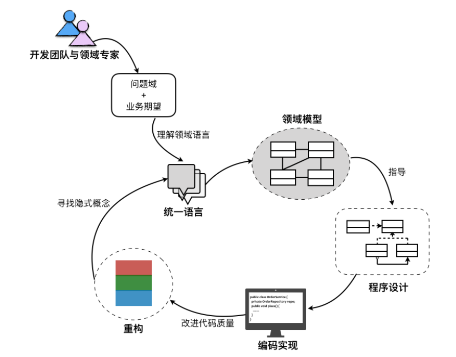

# 领域驱动设计概览

领域驱动设计是一种面向对象的建模方法。

 **将要解决的业务概念和业务规则转换为软件系统中的类型以及类型的属性与行为，通过合理运用面向对象的封装、继承和多态等设计要素**，降低或隐藏整个系统的业务复杂性，并使得系统具有更好的扩展性，应对纷繁多变的现实业务问题。 

 领域驱动设计的提出，是**设计观念的转变，蕴含了全新的设计思想、设计原则与设计过程**。 

## 领域驱动设计过程

 领域驱动设计强调**领域模型**的重要性，并通过模型驱动设计来保障领域模型与程序设计的一致。从业务需求中提炼出统一语言（Ubiquitous Language），再基于统一语言建立领域模型；这个领域模型会指导着程序设计以及编码实现；最后，又通过重构来发现隐式概念，并运用设计模式改进设计与开发质量 

 这个过程是一个覆盖**软件全生命周期**的设计闭环，每个环节的输出都可以作为下一个环节的输入，而在其中扮演重要指导作用的则是“领域模型” 。这是一个 螺旋式的迭代设计过程。

 在为问题域寻求解决方案时，需要从**宏观层次**划分不同业务关注点的**子领域**，然后再深入到子领域中从微观层次对领域进行建模。**宏观层次是战略的层面，微观层次是战术的层面**，只有将战略设计与战术设计结合起来，才是完整的领域驱动设计。 

### 战略设计阶段

 领域驱动设计的战略设计阶段是从下面两个方面来考量的 ：

- 问题域方面：针对问题域，引入**限界上下文（Bounded Context）和上下文映射（Context Map）对问题域进行合理的分解，识别出核心领域（Core Domain）与子领域（SubDomain）**，并确定领域的边界以及它们之间的关系，维持模型的完整性。

- 架构方面：通过**分层架构**来隔离关注点，尤其是将领域实现独立出来，能够更利于领域模型的单一性与稳定性；引入**六边形架构**可以清晰地表达领域与技术基础设施的边界；CQRS 模式则分离了查询场景和命令场景，针对不同场景选择使用同步或异步操作，来提高架构的低延迟性与高并发能力。

### 战术设计阶段

 整个软件系统被分解为多个限界上下文（或领域）后，就可以分而治之，对每个限界上下文进行战术设计。领域驱动设计并不牵涉到技术层面的实现细节，在战术层面，它主要应对的是领域的复杂性。领域驱动设计用以表示模型的主要要素包括：

- 值对象（Value Object）
- 实体（Entity）
- 领域服务（Domain Service）
- 领域事件（Domain Event）
- 资源库（Repository）
- 工厂（Factory）
- 聚合（Aggregate）
- 应用服务（Application Service）

 领域驱动设计围绕着领域模型进行设计，通过**分层架构（Layered Architecture）将领域独立出来。表示领域模型的对象包括：实体、值对象和领域服务**，**领域逻辑都应该封装在这些对象中**。这一严格的设计原则可以避免业务逻辑渗透到领域层之外，导致技术实现与业务逻辑的混淆。在领域驱动设计的演进中，又引入了**领域事件**来丰富领域模型。 

 **聚合**是一种边界，它可以封装一到多个**实体**与**值对象**，并维持该边界范围之内的业务完整性。在聚合中，至少包含一个实体，且只有实体才能作为**聚合根（Aggregate Root）**。注意，在领域驱动设计中，没有任何一个类是单独的聚合，因为聚合代表的是边界概念，而非领域概念。在极端情况下，一个聚合可能有且只有一个实体。 

 **工厂**和**资源库**都是对领域对象生命周期的管理。前者负责领域对象的创建，往往用于封装复杂或者可能变化的创建逻辑；后者则负责从存放资源的位置（数据库、内存或者其他 Web 资源）获取、添加、删除或者修改领域对象。领域模型中的资源库不应该暴露访问领域对象的技术实现细节。 

