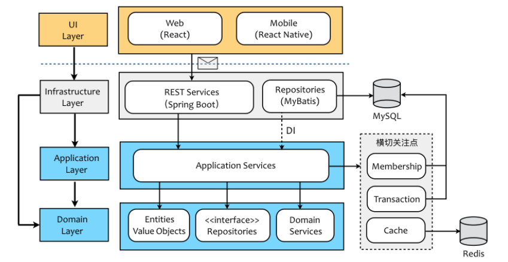
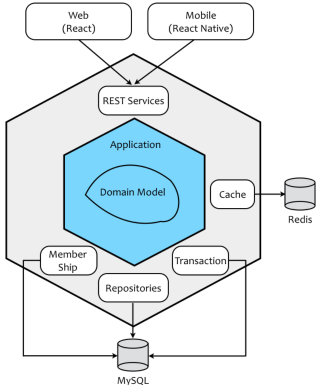
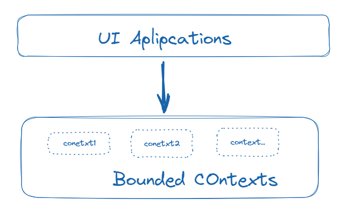
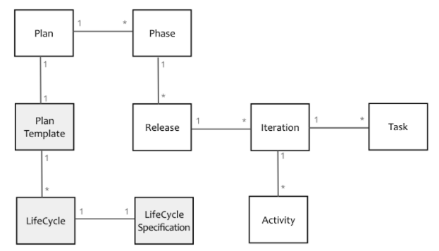

# 应对软件的复杂性

需求引起的软件复杂度包含了业务复杂度和技术复杂度：

**技术复杂度来自需求的质量属性**，诸如安全、高性能、高并发、高可用性等需求，为软件设计带来了极大的挑战，让人痛苦的是这些因素彼此之间可能又互相矛盾、互相影响。

 **业务复杂度对应了客户的业务需求**，因而这种复杂度往往会随着需求规模的增大而增加。由于需求不可能做到完全独立，一旦规模扩大到一定程度，不仅产生了功能数量的增加，还会因为功能互相之间的依赖与影响使得这种复杂度产生叠加，进而影响到整个系统的质量属性，比如系统的可维护性与可扩展性。 

 **技术复杂度与业务复杂度并非完全独立，二者混合在一起产生的化合作用更让系统的复杂度变得不可预期，难以掌控**。 

## 1、隔离业务复杂度与技术复杂度

 要避免业务逻辑的复杂度与技术实现的复杂度混淆在一起，**首要任务就是确定业务逻辑与技术实现的边界，从而隔离各自的复杂度**。

 例如，在电商的领域逻辑中，订单业务关注的业务规则包括验证订单有效性、计算订单总额、提交和审核订单的流程等；技术关注点则从实现层面保障这些业务能够正确地完成，包括确保分布式系统之间的数据一致性，确保服务之间通信的正确性等。

 业务逻辑并不关心技术是如何实现的，无论采用何种技术，只要业务需求不变，业务规则就不会发生变化。换言之，**在理想状态下，我们应该保证业务规则与技术实现是正交的**。 

 领域驱动设计通过**分层架构**与**六边形架构**来确保业务逻辑与技术实现的隔离 

## 2、分层架构的关注点分离

 分层架构遵循了“关注点分离”原则，将属于业务逻辑的关注点放到领域层（Domain Layer）中，而将支撑业务逻辑的技术实现放到基础设施层（Infrastructure Layer）中。同时，领域驱动设计又颇具创见的引入了应用层（Application Layer），应用层扮演了双重角色。一方面它作为业务逻辑的外观（Facade），暴露了能够体现业务用例的应用服务接口；另一方面它又是业务逻辑与技术实现的粘合剂，实现二者之间的协作。 

下图展现的就是一个典型的领域驱动设计分层架构，蓝色区域的内容与业务逻辑有关，灰色区域的内容与技术实现有关，二者泾渭分明，然后汇合在应用层。应用层确定了业务逻辑与技术实现的边界，通过直接依赖或者依赖注入（DI，Dependency Injection）的方式将二者结合起来： 

## 3、六边形架构的内外分离

 由 Cockburn 提出的六边形架构则以“内外分离”的方式，更加清晰地勾勒出了业务逻辑与技术实现的边界，且将业务逻辑放在了架构的核心位置。这种架构模式改变了我们观察系统架构的视角：

 体现业务逻辑的应用层与领域层处于六边形架构的**内核**，并通过内部的六边形边界与基础设施的模块隔离开。当我们在进行软件开发时，只要恪守架构上的六边形边界，则不会让技术实现的复杂度污染到业务逻辑，保证了领域的整洁。边界还隔离了变化产生的影响。如果我们在领域层或应用层抽象了技术实现的接口，再通过依赖注入将控制的方向倒转，业务内核就会变得更加的稳定，不会因为技术选型或其他决策的变化而导致领域代码的修改。 

## 4、限界上下文的分而治之

面对一个庞大的问题域，可以划分一些子系统，这些子系统内部也可以进行分层架构。不同子系统之间的抽象层次是一致的，这种概念在DDD中称之为“限界上下文（Bounded Context）”。

通过限界上下文“分而治之”的思想对问题域进行分解，有效地控制了问题域的规模，进而控制了整个系统的规模。

 限界上下文对整个系统进行了划分，在将一个大系统拆分为一个个小系统后，我们再利用分层架构与六边形架构思想对其进行逻辑分层，以确保业务逻辑与技术实现的隔离，其设计会变得更易于把控，系统的架构也会变得更加清晰。 

在一个复杂系统中，可以将识别出来的限界上下文定义为微服务，并对外公开REST服务接口。

 UI Applications 是一个薄薄的展现层，它会调用后端的 RESTful 服务，也使得服务在保证接口不变的前提下能够单独演化。每个服务都是独立的，可以单独部署，因而可以针对服务建立单独的代码库和对应的特性团队（Feature Team）。服务的重用性和可扩展性也有了更好的保障，服务与 UI 之间的集成变得更简单，整个架构会更加清晰。 

## 5、领域模型对领域知识的抽象

以一个软件项目管理流程来举例子。在一个团队中，使用的软件开发流程大致有如下几类：

瀑布式开发： 需求、分析、设计、编码、测试、验收 

RUP（ Rational Unified Process 统一软件开发过程）： 先启阶段（Inception）、细化阶段（Elaboration）、构造阶段（Construction）与交付阶段（Transition）。 每个阶段可以包含一到多个迭代，每个迭代有不同的工作，如业务建模、分析设计、配置与变更管理 

 XP（ Extreme Programming ）： 极限编程作为一种敏捷方法，迭代的增量式开发。先做预研（ Architectual Spike，又被译为架构穿刺 ），初始方案确定后就可以进入每次小版本的交付（Release Planning）。 每个小版本交付又被划分为多个周期相同的迭代。在迭代过程中，要求执行一些必须的活动，如编写用户故事、故事点估算、验收测试等。

 Scrum：确定系统待办项（Product Backlog）、指定发布计划和组件团队、Sprint迭代。 Sprint 迭代过程是一个固定时长的项目过程，在这个过程中，整个团队需要召开计划会议、每日站会（Daliy Scrum）、评审会议（Sprint Review）和回顾会议（Sprint Retrospective）。

### 领域分析

 领域建模就是要从这些纷繁复杂的领域逻辑中寻找到能够表示项目管理领域的概念，并利用面向对象建模范式或其他范式对概念进行抽象，并确定它们之间的关系。

上面说的几种开发流程在概念上会有差别，比如瀑布模式有六个节阶段，但是没有发布、迭代这些概念。RUP有阶段，有迭代，但是没有发布。Scrum又为迭代引入了Sprint概念。

除了业务概念外，他们的业务规则也会有不一样的地方。

- 首先，从项目管理系统的角度看，无论针对何种项目管理流程，我们的主题需求是不变的，就是要为这些管理流程制定软件开发计划（Plan）
-  计划可以由多个阶段（Phase）组成 
-  阶段（Phase）包含了发布（Release）
-  每个发布又包含了一到多个迭代（Iteration）
-  每个迭代可以开展多种不同的活动（Activity）
-  对于计划而言，我们还需要跟踪任务（Task） 

所以我们可以根据上述分析提炼出统一的领域模型：

 项目管理者更加方便地制定项目计划，产品经理提出了计划模板功能。当管理者选择对应的项目管理生命周期类型后，系统会自动创建满足其规则的初始计划。 在模型中，LifeCycle Specification 是一个隐含的概念，遵循领域驱动设计提出的规格（Specification）模式，封装了项目开发生命周期的约束规则。

领域模型以可视化的方式清晰地表达了业务含义， 我们可以根据这个模型来指导后面的程序设计与编码实现，当需求有变更的时候可以根据模型进行更新。同时，领域建模可以很好在团队之间传递知识， 有利于让开发人员从纷繁复杂的业务中解脱出来，从而可以在一定程度上控制业务的复杂度对我们软件交付的影响。