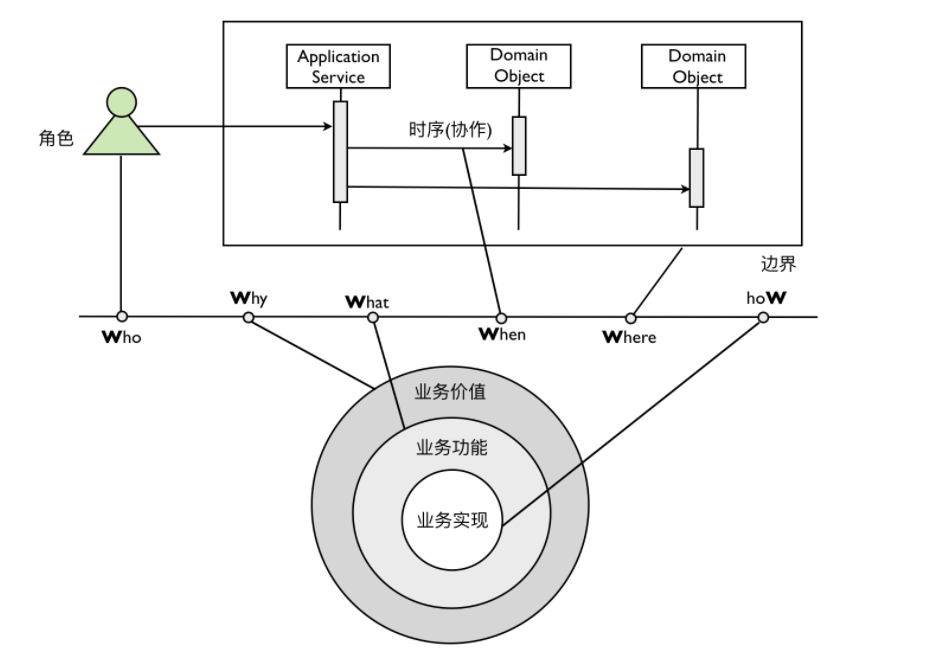

## 领域场景分析的 6W 模型

 组成场景的要素常常被称之为 **6W 模型**，即描写场景的过程必须包含 **W**ho、**W**hat、**W**hy、**W**here、**W**hen 与 ho**W** 这六个要素。

 在 6W 模型中，可以将领域功能划分为三个层次，即业务价值、业务功能和业务实现。

在分析一个需求的时候，要建立场景，识别该场景中的用户角色（Who），通过分析改用户的特征与属性 来辨别该角色在整个场景中参与的活动。这意味着我们需要明确业务功能（What），思考这一功能给该角色能够带来什么样的业务价值（Why）。在不同场景中同一个用户可能代表不同的角色，比如在订单系统中，角色就是买家；在评论系统中，角色变成了评论者。

 在利用场景进行建模时，还要充分考虑场景的边界，即 6W 模型中的 Where。例如，在“下订单”的案例中，验证商品库存量的业务实现需要调用库存提供的接口，该功能属于下订单场景的边界之外。领域驱动设计引入了**限界上下文（Bounded Context）**来解决这一问题。 

 业务场景分析的 6W 模型给出了具有指导意义的约束，要求我们提炼的领域知识必须具备模型的六个要素。 6W 模型也是对领域逻辑的一种检验，如果提炼出来的领域逻辑缺乏部分要素，就有可能忽略一些重要的领域概念、规则与约束。这种缺失会对后续的领域建模直接产生影响。

## 领域场景分析的方法

 如果将 6W 模型看做是领域分析的抽象，那么这些领域分析方法就是对 6W 模型各种不同的实现。 这些模式主要有：

- 用例（Use Case）
- 用户故事（User Story）
- 测试驱动开发（TDD）

用例尤其是用例图的抽象能力更强，更擅长于对系统整体需求进行场景分析；用户故事提供了场景分析的固定模式，善于表达具体场景的业务细节；测试驱动开发则强调对业务的分解，利用编写测试用例的形式驱动领域建模，即使不采用测试先行，让开发者转换为调用者角度去思考领域对象及行为，也是一种很好的建模思想与方法。 

在提炼领域知识的过程中，我们可以将这三种领域场景分析方法结合起来运用，在不同层次的领域场景中选择不同的场景分析方法，才不至于好高骛远，缺乏对细节的把控，也不至于一叶障目，只见树木不见森林。 