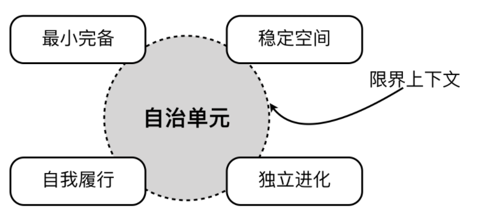
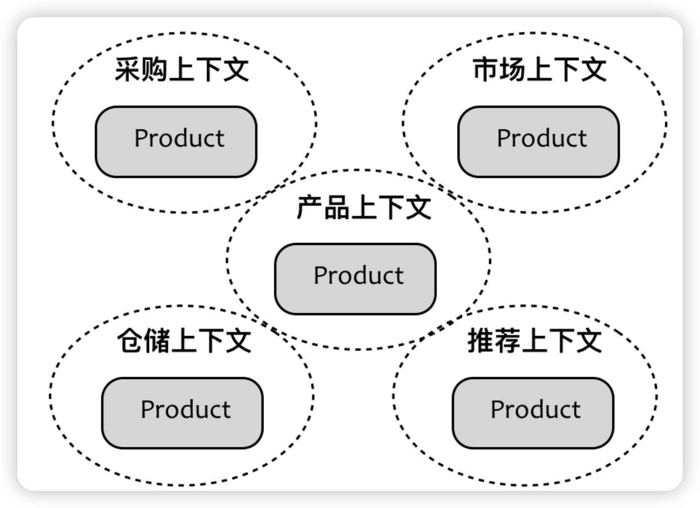
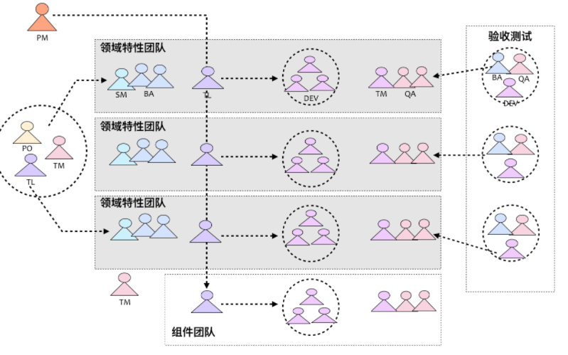

## 1、 限界上下文的含义

限界上下文(Bounded Context)， **Context** 表现了业务流程的场景片段。整个业务流程由诸多具有时序的活动组成，随着流程的进行，不同的活动需要不同的角色参与，并导致上下文因为某个活动的产生随之发生切换。因而，**上下文（Context）其实是动态的业务流程被边界（Bounded）静态切分的产物**。 

 一个复杂系统的领域驱动设计，就是以子域为中心进行领域建模，绘制出一张一张的领域模型设计，然后以此作为基础指导程序设计。这一张一张的领域模型设计，称为“**限界上下文**”（Context Bounds，CB）。  根据**业务相关性**、**耦合的强弱程度**、**分离的关注点**对这些活动进行归类，找到不同类别之间存在的边界，这就是**限界上下文**的含义。**上下文（Context）是业务目标，限界（Bounded）则是保护和隔离上下文的边界，避免业务目标的不单一而带来的混乱与概念的不一致。** 

## 2、限界上下文的价值

观察角度的不同，限界上下文划定的边界也有所不同。大体可以分为如下三个方面：

- **领域逻辑层面**：限界上下文确定了领域模型的业务边界，维护了模型的完整性与一致性，从而降低系统的业务复杂度。
- **团队合作层面**：限界上下文确定了开发团队的工作边界，建立了团队之间的合作模式，避免团队之间的沟通变得混乱，从而降低系统的管理复杂度。
- **技术实现层面**：限界上下文确定了系统架构的应用边界，保证了系统层和上下文领域层各自的一致性，建立了上下文之间的集成方式，从而降低系统的技术复杂度。

这三种边界体现了**限界上下文对不同边界的控制力**。业务边界是对领域模型的控制，工作边界是对开发协作的控制，应用边界是对技术风险的控制。引入限界上下文的目的，其实**不在于如何划分边界，而在于如何控制边界**。 

  EventStorming 创始人 Alberto Brandolini  对限界上下文的理解： bounded context are a mean of safety（限界上下文意味着安全），如何理解安全呢？

他的意思是：  being in control and no surprise。

>  Surprise leads to stress and stress leads to no learning, just hard work. （出乎意料的惊讶会导致压力，而压力就会使得团队疲于加班，缺少学习。） 

其实限界上下文并不是大多数人理解的那样，是模块、服务、组件或者子系统，而是你对领域模型、团队合作以及技术风险的**控制**。大领域的模型切割成一个一个小的领域模型是很重要的， **更小的模型为我们的软件设计和开发带来了更多的好处，它使得团队能够根据自己的设计和开发职责确定更为明确的**工作边界 。

小的模型也为项目带来了更好的可维护性：由于上下文由边界确定，因此对其的修改也不会给整个模型的其他部分造成影响。显然，通过限界上下文对领域模型进行分解，就能保证在其边界内创建的模型**内聚性更高**，在**边界隔离**下，受到变化的影响也更小，反映为团队合作的工作边界，就更容易保证团队之间的沟通与协作。 

限界上下文是“**分而治之**”架构原则的体现，我们引入它的目的其实为了控制（应对）软件的复杂度，它并非某种固定的设计单元，我们不能说它就是模块、服务或组件，而是通过它来帮助我们做出高内聚低耦合的设计。

可以把限界上下文看成是一个“自治”的单元。 所谓“自治”就是满足四个特征：最小完备、稳定空间、自我履行、独立进化。如下图所示的自治单元就是限界上下文，映射到编码实现，则**可能**是模块、组件或服务： 

 **最小完备**是实现“自治”的基本条件。自治单元的职责是完整的，不需要依赖别的单元的功能。最小完备是指不要将不必要的职责被错误地添加到该自治单元内。

**自我履行**表示自治单元自身决定需要做什么， 从拟人的角度来思考，就是这些自治单元能够对外部请求做出符合自身利益的明智判断，是否应该履行该职责，由限界上下文拥有的信息来决定。 例如，在当订单上下文履行了验证订单的职责之后，需要执行支付活动时，由于与支付相关的业务行为要操作的信息已经超出了订单上下文的范畴，就应该将该职责转移到支付上下文。自我履行其实意味着对知识的掌握，为避免风险，你要履行的职责一定是你掌握的知识范畴之内。 

**稳定空间**指的是减少外界变化对限界上下文内部的影响。  稳定空间符合**开放封闭原则（OCP）**，即对修改是封闭的，对扩展是开放的，该原则其实体现了一个单元的封闭空间与开放空间。封闭空间体现为对细节的封装与隐藏，开放空间体现为对共性特征的抽象与统一，二者共同确保了整个空间的稳定。

**独立进化**与稳定空间刚好相反，指的是减少限界上下文的变化对外界的影响。 如果借用限界上下文的上下游关系来阐释，则**稳定空间**寓意下游限界上下文，无论上游怎么变，我自岿然不动；**独立进化**寓意上游限界上下文，无论下游有多少，我凌寒独自开。实现上看，要做到独立进化，就必须保证对外公开接口的稳定性，因为这些接口往往被众多消费者使用，一旦修改，就会牵一发而动全身。一个独立进化的限界上下文，需要接口设计良好，符合标准规范，并在版本上考虑了兼容与演化。 

这四个要素是**高内聚低耦合**思想的体现。我们需要根据业务关注点和技术关注点，尽可能将强相关性的内容放到同一个限界上下文中，同时降低限界上下文之间的耦合。对于整个系统架构而言，不同的限界上下文可以采用不同的架构风格与技术决策，而在每个限界上下文内部保持自己的技术独立性与一致性。由于限界上下文边界对技术实现的隔离，不同限界上下文内部实现的多样性并不会影响整体架构的一致性。

## 3、 限界上下文分离了业务边界

引入限界上下文的目的，不在于如何划分，而在于如何控制边界。  可以说，**限界上下文是连接问题域与解决方案域的重要桥梁**。 

限界上下文用于区分领域边界，我们在理解领域模型时，是基于当前所在的上下文作为概念语境的， 这样的设计既保证了限界上下文之间的松散耦合，又能够维持限界上下文各自领域模型的一致性，此时的限界上下文成为了保障领域模型不受污染的边界屏障。 

在面向对象设计中，行之有效的“接口隔离原则”如果跨越了多个限界上下文，就变得不合理了。要降低耦合同时又能避免重复，更好的解决方案是**让每一个限界上下文拥有自己的领域模型**，该领域模型仅仅满足符合当前上下文需要的产品唯一表示。

虽然不同的限界上下文都存在相同的 Product 领域模型，但由于有了限界上下文作为边界，使得我们在理解领域模型时，是基于当前所在的上下文作为概念语境的。**这样的设计既保证了限界上下文之间的松散耦合，又能够维持限界上下文各自领域模型的一致性**，此时的限界上下文成为了保障领域模型不受污染的边界屏障。

## 4、 限界上下文明确了工作边界

 一个理想的开发团队规模最好能符合亚马逊公司提出的“Two-Pizza Teams”，即 **2PTs** 规则，该规则认为“让团队保持在两个披萨能让成员吃饱的小规模”，大体而言，就是将团队成员人数控制在 7~10 人左右。为何要保证这样的规模呢？因为小团队能够更有效保证有效的沟通。

 传统的“组件团队”强调的是专业技能与功能重用，例如，熟练掌握数据库开发技能的成员组建一个数据库团队，深谙前端框架的成员组建一个前端开发团队。这种遵循“专业的事情交给专业的人去做”原则的团队组建模式，可以更好地发挥每个人的技能特长，然而牺牲的却是团队成员业务知识的缺失，客户价值的漠视。这种团队组建模式也加大了团队之间的沟通成本，导致系统的整体功能无法持续和频繁的集成。

特性团队， 是一个**端对端的开发垂直细分领域的跨职能团队**，它将需求分析、架构设计、开发测试等多个角色糅合在一起，专注于领域逻辑，实现该领域特性的完整的端对端开发。 

特性团队专注的领域特性，是与领域驱动设计中限界上下文对应的领域是相对应的。当我们确定了限界上下文时，其实也就等同于确定了特性团队的工作边界，确定了限界上下文之间的关系，也就意味着确定了特性团队之间的合作模式；反之亦然。之所以如此，则是因为**康威定律（Conway's Law）**为我们提供了理论支持 

**康威定律**认为：“任何组织在设计一套系统（广义概念上的系统）时，所交付的设计方案在结构上都与该组织的沟通结构保持一致。” **在康威定律中起到关键杠杆作用的是沟通成本**。如果同一个限界上下文的工作交给了两个不同的团队分工完成，为了合力解决问题，就必然需要这两个团队进行密切的沟通。然而，团队间的沟通成本显然要高于团队内的沟通成本，为了降低日趋增高的成本，就需要重新划分团队。反过来，如果让同一个团队分头做两个限界上下文的工作，则会因为工作的弱相关性带来自然而然的团队隔离。 

## 5、 限界上下文封装了应用边界

在划分上下文的时候，不能只满足于业务边界的确立，还需要从**控制技术复杂度的**角度来考虑技术实现。高并发系统，功能重用，实时性，第三服务集成，遗留系统等案例从技术层面为系统划分边界，这种边界也是由限界上下文完成的，以形成对**技术实现的隔离**，**避免不同的技术方案选择互相干扰导致架构混乱**。

