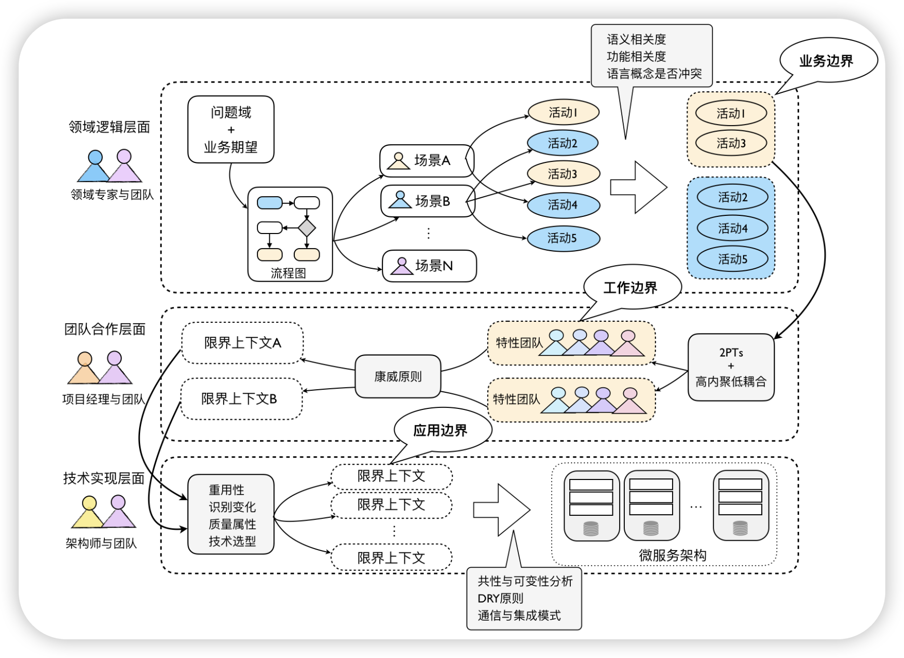
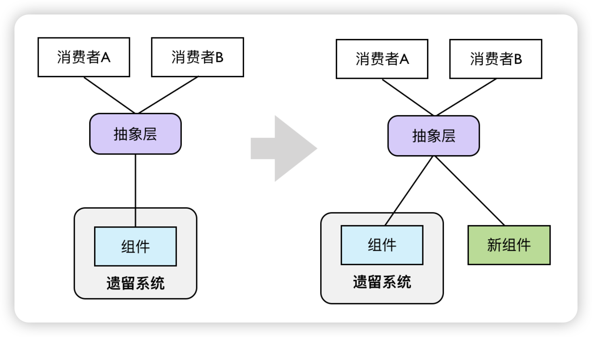

Mike说： “限界上下文是领域驱动设计中最难解释的原则，但或许也是最重要的原则，可以说，没有限界上下文，就不能做领域驱动设计。在了解聚合根（Aggregate Root）、聚合（Aggregate）、实体（Entity）等概念之前，需要先了解限界上下文。”

> 如何在DDD中识别出正确的限界上下文？ 
>
> 答： **凭经验** (正确的废话)

在《程序员的思维修炼》说道： 专家凭直觉工作，而不需要理由。 这说明了这是经验的积累，通过实践无数的项目得出的经验。

限界上下文就是“**边界**”，这与面向对象设计中的**职责分配**其实是同一道理。限界上下文的识别并不是一蹴而就的，需要演化和迭代。

> **通过从业务边界到工作边界再到应用边界这三个层次抽丝剥茧，分别以不同的视角、不同的角色协作来运用对应的设计原则，会是一个可行的识别限界上下文的过程方法**

整体过程如下：

## 1、从业务边界识别限界上下文

分析业务场景围绕着“领域”来开展：

1.  明确系统问题也业务期望
2. 和领域专家交流，梳理业务流程
3. 识别参与者/业务活动/业务价值
4. 在业务流程的基础上抽象业务场景
5. 一个业务场景由多个业务活动组成
6. 采用用例对场景进行分析，一个业务活动就是一个用例

**业务流程是一个由多个用户角色参与的动态过程，而业务场景则是这些用户角色执行业务活动的静态上下文**。从业务流程中抽象出来的业务场景可能是交叉重叠的。

例如，在针对一款文学阅读产品进行需求分析时，可以根据得到的业务流程划分不同的业务场景：

- 阅读作品
- 创作作品
- 支付
- 社交
- 消息通知
- 注册与登录

接下来，我们利用领域场景分析的用例分析方法剖析这些场景。我们往往通过参与者（Actor）来驱动对用例的识别，这些参与者恰好就是参与到场景业务活动的角色。根据用例描述出来的业务活动应该与统一语言一致，最好直接从统一语言中撷取。业务活动的描述应该精准地表达领域概念，且通过尽可能简洁的方式进行描述，通常格式为动宾形式。以阅读作品场景为例，可以包括如下业务活动：

- 查询作品
- 收藏作品
- 关注作者
- 浏览作品目录
- 阅读作品
- 标记作品内容
- 撰写读书笔记
- 评价作品
- 评价作者
- 分享选中的作品内容
- 分享作品链接
- 购买作品

一旦准确地用统一语言描述出这些业务活动，我们就可以从如下两个方面识别业务边界，进而提炼出初步的限界上下文：

- 语义相关性
- 功能相关性

### 1.1 语义相关性

**语义角度去分析业务活动的描述，倘若是相同的语义，可以作为归类的特征**。

识别语义相关性的前提是准确地使用统一语言描述业务活动。在描述时，应尽量避免使用“管理（manage）”或“维护（maintain）”等过于抽象的词语。抽象的词语容易让我们忽视隐藏的领域语言，缺少对领域的精确表达。

在进行语义相关性判断时，还需要注意业务活动之间可能存在不同的语义相关性。

### 1.2 功能相关性

**从功能角度去分析业务活动是否彼此关联和依赖，倘若存在关联和依赖，可以作为归类的特征**，这种关联性，代表了功能之间的相关性。倘若两个功能必须同时存在，又或者缺少一个功能，另一个功能是不完整的，则二者就是功能强相关的。

所谓“功能相关性”，指的就是职责的内聚性，强相关就等于高内聚。故而从这个角度看，功能相关性的判断标准恰好符合“高内聚、松耦合”的设计原则。

**两个相关的功能未必一定属于同一个限界上下文**。例如，购买作品与支付购买费用是功能相关的，且前者依赖于后者，但后者从领域知识的角度判断，却应该分配给支付上下文，我们非但不能将其紧耦合在一起，还应该竭尽所能降低二者之间的耦合度。

事实上，**功能相关性往往会与上下文之间的协作关系有关**。由于这种功能相关性恰恰对应了用例之间的包含与扩展关系，它们往往又可成为识别限界上下文边界的关键点。我在后面讲解上下文映射时还会详细阐释。

接下来就可以为业务领域进行命名了。

## 2、 从工作边界识别限界上下文

如果说为限界上下文划分业务边界，更多的是从业务相关性（内聚）判断业务的归属，那么基于团队合作划分工作边界可以**帮助我们确定限界上下文合理的工作粒度**。

工作分配的基础在于“尽可能降低沟通成本”，遵循康威定律，沟通其实就是项目模块之间的依赖，这个过程同样不是一蹴而就的。康威认为：

> 在大多数情况下，最先产生的设计都不是最完美的，主导的系统设计理念可能需要更改。因此，组织的灵活性对于有效的设计有着举足轻重的作用，必须找到可以鼓励设计经理保持他们的组织精简与灵活的方法。

特性团队正是用来解决这一问题的。换言之，当我们发现团队规模越来越大，失去了组织精简与灵活的优势，实际上就是在传递限界上下文过大的信号。项目经理对此需要有清醒认识，当团队规模违背了 2PTs 时，就该坐下来讨论一下如何细分团队的问题了。因此，按照团队合作的角度划分限界上下文，其实是一个动态的过程、演进的过程。

如果我们从团队合作层面看待限界上下文，就从技术范畴上升到了管理范畴。Jurgen Appelo 在《管理 3.0：培养和提升敏捷领导力（Management 3.0: Leading Agile Developers，Developing Agile Leaders）》这本书中提到，一个高效的团队需要满足两点要求：

- 共同的目标
- 团队的边界

书中对边界的阐释，大致包括：

- **团队成员应对团队的边界形成共识**，这就意味着团队成员需要了解自己负责的限界上下文边界，以及该限界上下文如何与外部的资源以及其他限界上下文进行通信。
- **团队的边界不能太封闭（拒绝外部输入），也不能太开放（失去内聚力），即所谓的“渗透性边界”**，这种渗透性边界恰恰与“高内聚、松耦合”的设计原则完全契合。

针对这种“渗透性边界”，团队成员需要对自己负责开发的需求“抱有成见”，在识别限界上下文时，“任劳任怨”的好员工并不是真正的好员工。一个好的员工明确地知道团队的职责边界，他应该学会勇于承担属于团队边界内的需求开发任务，也要敢于推辞职责范围之外强加于他的需求。通过团队每个人的主观能动，就可以渐渐地形成在组织结构上的“自治单元”，进而催生出架构设计上的“自治单元”。同理，“任劳任怨”的好团队也不是真正的好团队，团队对自己的边界已经达成了共识，为什么还要违背这个共识去承接不属于自己边界内的工作呢？这并非团队之间的“恶性竞争”，也不是工作上的互相推诿；**恰恰相反，这实际上是一种良好的合作，表面上维持了自己的利益，然而在一个组织下，如果每个团队都以这种方式维持自我利益，反而会形成一种“互利主义”。**

这种“你给我搔背，我也替你抓抓痒”的互利主义最终会形成团队之间的良好协作。如果团队领导者与团队成员能够充分认识到这一点，就可以从团队层面思考限界上下文。此时，限界上下文就不仅仅是架构师局限于一孔之见去完成甄别，而是每个团队成员自发组织的内在驱动力。当每个人都在思考这项工作该不该我做时，变相地就是在思考职责的分配是否合理，限界上下文的划分是否合理。

## 3、 从应用边界识别限界上下文

### 3.1 质量属性

管理的目的在于**打造高效的团队**，但最后还是要落脚到技术实现上来，不懂业务分析的架构师不是一个好的程序员，而一个不懂得提前识别系统风险的程序员更不是一个好的架构师。站在技术层面上看待限界上下文，我们需要关注的其实是质量属性（Quality Attributes）。如果把关乎质量属性的问题都视为在将来可能会发生，其实就是“风险（Risk）”。

架构是什么？Martin Fowler 认为：架构是重要的东西，是不容易改变的决策。如果我们未曾预测到系统存在的风险，不幸它又发生了，带给系统架构的改变可能是灾难性的。利用限界上下文的边界，就可以将这种风险带来的影响控制在一个极小的范围，这也是前面提及的**安全**。为什么说限界上下文是领域驱动设计中最重要的元素，答案就在这里。

###  3.2 重用和变化

无论是重用领域逻辑还是技术实现，都是在设计层面上我们必须考虑的因素，需求变化更是影响设计策略的关键因素。我在前面分析限界上下文的本质时，就提及一个限界上下文其实是一个“自治”的单元。基于自治的四个特征，我们也可以认为这个自治的单元其实就是逻辑重用和封装变化的设计单元。这时，对限界上下文边界的考虑，更多是出于技术设计因素，而非业务因素。

运用重用原则分离出来的限界上下文往往对应于子领域（Sub Domain），尤其作为支撑子领域。限界上下文对变化的应对，其实是“单一职责原则”的体现，即一个限界上下文不应该存在两个引起它变化的原因。

### 3.3 遗留系统

自治原则的唯一例外是遗留系统，因为领域驱动设计建议的通常做法是将整个遗留系统视为一个限界上下文。那么，什么是遗留系统？根据维基百科的定义，它是一种旧的方法、旧的技术、旧的计算机系统或应用程序，这个定义并不能解释遗留系统的真相。我认为，系统之所以成为遗留系统，关键在于**知识的缺乏**。文档不够全面真实，掌握系统知识的团队成员泰半离开，系统的代码可能是一个大泥团。因此，我对遗留系统的定义是“**一个还在运行和使用，但已步入软件生命衰老期的缺乏足够知识的软件系统**”。

倘若运用领域驱动设计的系统要与这样一个遗留系统打交道，应该怎么办？窃以为，粗暴地将整个遗留系统包裹在一个限界上下文中，未免太理想化和简单化了。要点还是**自治**，这时候我们应该站在遗留系统的调用者来观察它，考虑如何与遗留系统集成，然后逐步对遗留系统进行抽取与迁移，形成自治的限界上下文。

在这个过程中，我们可以借鉴技术栈迁移中常常运用的“抽象分支（Branch By Abstraction）”手法。该手法会站在消费者（Consumer）一方观察遗留系统，找到需要替换的单元（组件）；然后对该组件进行抽象，从而将消费者与遗留系统中的实现解耦。最后，提供一个完全新的组件实现，在保留抽象层接口不变的情况下替换掉遗留系统的旧组件，达到技术栈迁移的目的：

如上图所示的抽象层，其实也称之为“防腐层（Anticorruption Layer）”，通过引入这么一个间接层来隔离与遗留系统之间的耦合。这个防腐层往往是作为下游限界上下文的一部分存在。若有必要，也可以单独为其创建一个独立的限界上下文。

## 4、 设计驱动力

通过以上过程去识别限界上下文，仅仅是一种对领域问题域的静态划分，我们还缺少另外一个重要的关注点，即：限界上下文之间是如何协作的？倘若限界上下文识别不合理，协作就会变得更加困难，尤其当一个限界上下文对应一个微服务时，协作成本更会显著增加。反过来，当我们发现彼此协作存在问题时，说明限界上下文的划分出现了问题，这算是对识别限界上下文的一种验证方法。Eric Evans 将这种体现限界上下文协作方式的要素称之为“上下文映射（Context Map）”。

